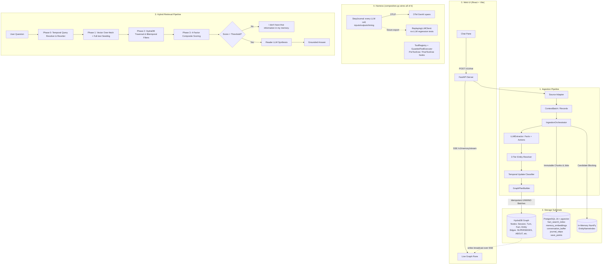

# HydraDB Long-Term Context Memory Engine

A high-performance, provenance-preserving long-term memory substrate built on top of **HydraDB OpenCypher Graph** and **PostgreSQL 16 + pgvector**, with a React chat UI that visualizes memory as it's written.

Designed for production agentic applications and rigorous contextual benchmarks (such as **LongMemEval**), the engine turns unstructured, timestamped conversations into a durable, bitemporal graph with semantic vector indexing, 3-tier entity resolution, state-change tracking, and 4-phase hybrid retrieval with low-evidence abstention.

> **Hackathon submission.** This is the top-level README. `FINAL_ARCHITECTURE.md` records the accepted system design; this file is the practical setup/run guide plus a summary of how HydraDB is used. For code-level behavior where implementation has evolved beyond that design, use the code-traced beginner guide below.

New to the codebase? Start with [`docs/BEGINNER_BUILD_FLOW.md`](docs/BEGINNER_BUILD_FLOW.md), which traces the current implementation in two halves: memory ingestion/graph generation, then retrieval/response generation.

That guide now also covers the AI-DND harness, scenario templates, durable batch recovery, structured retrieval, journal/replay/tools, pivotal build failures, and the remaining production/SOTA gaps. It is the current-code authority; several older planning documents describe pre-implementation states.

---

## 📑 Table of Contents

- [How HydraDB Is Used](#-how-hydradb-is-used)
- [Key Features](#-key-features)
- [Harness Capabilities](#-harness-capabilities)
- [System Architecture](#-system-architecture)
- [Prerequisites & Setup](#-prerequisites--setup)
  - [1. Environment Setup](#1-environment-setup)
  - [2. Configuration (.env)](#2-configuration-env)
  - [3. Start PostgreSQL + HydraDB](#3-start-postgresql--hydradb)
- [How to Use the System](#-how-to-use-the-system)
  - [1. Web UI (Chat + Live Graph)](#1-web-ui-chat--live-graph)
  - [2. FastAPI REST Server](#2-fastapi-rest-server)
  - [3. Interactive CLI Chat REPL](#3-interactive-cli-chat-repl)
  - [4. LongMemEval Benchmark Runner](#4-longmemeval-benchmark-runner)
    - [Results (LongMemEval-S, stratified 30-instance sample)](#results-longmemeval-s-stratified-30-instance-sample)
  - [5. Manual End-to-End Test Suite](#5-manual-end-to-end-test-suite)
- [Core Concepts & Mechanics](#-core-concepts--mechanics)
  - [4-Axis Bitemporal Model](#4-axis-bitemporal-model)
  - [3-Tier Entity Resolution](#3-tier-entity-resolution)
  - [4-Phase Hybrid Retrieval Pipeline](#4-phase-hybrid-retrieval-pipeline)
- [Testing & Quality Assurance](#-testing--quality-assurance)
- [Repository Map](#-repository-map)
- [Third-Party Attribution](#-third-party-attribution)
- [License](#-license)

---

## 🗄 How HydraDB Is Used

HydraDB is **not a side component** — it's the system's sole graph authority and the backbone of both ingestion and retrieval:

- **Native graph storage** for `Session`, `Turn`, `Fact`, `Entity`, and `Alias` nodes. Runtime extraction writes `HAS_TURN`, `EXTRACTED_FROM`, `ABOUT`, `STATED_BY`, `SUPERSEDES`, and `HAS_ALIAS`; direct authoring can also write `RELATES_TO` (`src/context_memory/ingestion/graph_plan_builder.py`, `direct_authoring.py`, `graph_writer.py`).
- **Transport**: JSON-over-HTTP OpenCypher queries via a custom `HydraHttpTransport` client (`src/context_memory/client/hydradb_http.py`), authenticated with a bearer token, using batched `UNWIND $rows` writes and causal-bookmark reads for read-after-write consistency. (The Neo4j Bolt driver is incompatible with HydraDB's `SlateDBGraph/0.1.0` handshake, so HTTP is used instead of Bolt.)
- **Knowledge-update tracking**: on a correction or real-world state change, a new `(Fact)-[:SUPERSEDES]->(Fact)` edge is written directly in HydraDB rather than mutating history — see `src/context_memory/ingestion/temporal_update.py` and §11 of `FINAL_ARCHITECTURE.md`.
- **Multi-hop retrieval**: Phase 2 of the retrieval pipeline (`src/context_memory/retrieval/graph_expander.py`) reads seeded facts, follows linked entities, and runs HydraDB's native `algo.MSpaths` algorithm for path signals. Current/archive and bitemporal properties on each Fact provide visibility filtering.
- **Single-timeline rollback**: a save point marks a knowledge-time cutoff; rolling back to it archives every fact created after that point and restores whatever it superseded — both are plain `MERGE ... SET` writes on existing nodes, the same mechanism ordinary corrections already use (`src/context_memory/ingestion/rollback.py`).
- **Live graph streaming**: every write the `GraphWriter` sends to HydraDB is also broadcast over Server-Sent Events (`src/api/stream.py`) and rendered in real time on the frontend's graph pane, so retrieved/written nodes and edges are visible as the conversation happens.
- **Local instance**: run as the `hydradb` service in `compose.yaml`, built from the vendored `hydradb/` engine (a Rust, SlateDB-backed graph-node — see [Third-Party Attribution](#-third-party-attribution)), reachable over HTTP on `127.0.0.1:8080`.

---

## 🌟 Key Features

- **Dual-Engine Persistence**:
  - **PostgreSQL 16 + pgvector**: Canonical store for immutable raw text chunks, sha256 hashes, versioned 384-dim embeddings (`memory_embeddings`), full-text search indexes (`fact_search_index`), conversation buffers, and transactional ingestion job state.
  - **HydraDB OpenCypher Graph**: Native graph storage and traversal engine for `Session`, `Turn`, `Fact`, `Entity`, and `Alias` nodes and the relationships described above.
- **Bitemporal Knowledge State Tracking**:
  - Distinguishes **Knowledge Time** (`observed_at`, `superseded_at`) from **World-Validity Time** (`valid_from`, `valid_to`).
  - Creates non-destructive `(new)-[:SUPERSEDES]->(old)` graph edges on corrections and real-world state changes (e.g. moving cities, changing preferences).
- **3-Tier Entity Resolution**:
  - **Tier 1 (Exact Match)**: Instant normalized surface / alias matching.
  - **Tier 2 (Semantic Blocking)**: In-memory cosine candidate retrieval via `EntityNameIndex`.
  - **Tier 3 (Bounded LLM Disambiguation)**: Strict constrained selection over shortlisted entity profiles.
- **4-Phase Hybrid Retrieval & Grounded Synthesis**:
  - **Phase 0**: Temporal query resolution (extracting epoch bounds) + multi-query rewriting & synonym expansion.
  - **Phase 1**: Vector similarity search (over-fetching top-60) + PostgreSQL `ts_rank_cd` full-text scoring.
  - **Phase 2**: HydraDB fact/entity reads plus `algo.MSpaths`, interval-overlap filtering, archive/current checks, and 24h chat-scope TTL.
  - **Phase 3**: Reciprocal Rank Fusion over semantic, keyword, structural, and query-entity ranks; exact-text deduplication; LLM reranking; strict low-evidence **Abstention Gate**; optional Reader LLM synthesis.
- **AI-DND bridge**: async turn batches with durable status/retry, structured Fact retrieval, scenario template authoring/cloning, checkpoint/participant/turn visibility, hidden metadata, and explicit fact supersession.
- **Live Web UI**: a React + Vite chat interface with a real-time, force-directed graph pane driven by Server-Sent Events — every fact/entity/edge HydraDB writes appears on the graph as it happens.
- **Role-specific Gemini client**: one internal `LLMClient` interface backs extraction, entity resolution, temporal updates, rewriting, reranking, and reading. Current implementation uses Google Vertex AI/Gemini and allows a separate model/key/budget per role.

---

## 🧰 Harness Capabilities

Beyond memory, mem1 wraps the underlying LLM with the deterministic scaffolding a production
agent needs — built as a second phase on top of the memory engine above, behavior-preserving
throughout (every capability below shipped without moving the LongMemEval score, verified by
the oracle gate and the official judge at each step).

- **Step journal** (`core/journal.py`): every LLM call — inputs, outputs, timing, an
  idempotency key — recorded to `journal_steps`, wrapped once at the composition root
  (`JournaledLLMClient`), not scattered across call sites. `correlation_scope` groups every
  step in one logical request/turn under one `correlation_id`, propagated across background
  threads and concurrent pools via `contextvars`.
- **OTel GenAI tracing** (`core/tracing.py`): spans are read straight off the journal — no
  second instrumentation path — using the real `gen_ai.*` semantic-convention attributes.
  Point `OTEL_EXPORTER_OTLP_ENDPOINT` at any OTLP backend (Jaeger, Tempo, Honeycomb, ...) and
  get a full trace per request with zero vendor SDK.
- **Single-timeline rollback** (`core/rollback` via `ingestion/rollback.py`): classic
  save/load. A save point marks a knowledge-time cutoff; `rollback_to` archives every fact
  created after it and restores whatever it superseded — the exact same `MERGE ... SET`
  write path ordinary bitemporal corrections already use, not a parallel mechanism.
- **Layer-isolated eval harness** (`core/replay.py`, `scripts/export_journal_fixture.py`):
  `ReplayingLLMClient` replays a real, previously-recorded run from a portable JSON fixture —
  no live LLM call. Database, graph, and tool side effects still require injected fakes when a
  fully isolated test needs them. Every eval run also
  records its own harness config (`Config.harness_snapshot()` — which model backs every
  role) alongside the score, so a number is never reported without knowing what config
  produced it.
- **Tool registry + guardrails** (`core/tools.py`, `core/tool_executor.py`,
  `core/tool_loop.py`): `ToolAnnotations` mirrors MCP's own schema
  (`readOnlyHint`/`destructiveHint`/`idempotentHint`/`openWorldHint`); `GuardedToolExecutor`
  runs `PreToolUse`/`PostToolUse` hooks around every call and journals it for the same audit
  trail as an LLM call; `run_tool_loop` is a bounded OpenAI-style function-calling loop.
- **Two-level tenancy**: `context_id` scopes one playthrough's own memory (unchanged);
  `scenario_id` is the coarser identity axis — which game/campaign a playthrough belongs to —
  threaded through the journal, `MemoryEngine`, and the API request models, for
  cross-playthrough audit queries.

> [!WARNING]
> Harness features are implemented, but the current working tree is not yet production-ready. Most importantly, direct-authored/cloned facts are not projected into retrieval indexes, the SSE graph stream is global and outside router authentication, journal payloads lack a production redaction/retention policy, and the Gemini environment/test migration is incomplete. See Sections 46–54 of the beginner guide.

---

## 🏛 System Architecture



---

## 🚀 Prerequisites & Setup

### Requirements
- **Python 3.12+**
- **Node.js 18+** (for the frontend)
- **Docker & Docker Compose** (for PostgreSQL + pgvector and the HydraDB graph node)
- **Google Vertex AI / Gemini** API key (for live LLM extraction, retrieval decisions, and synthesis)

### 1. Environment Setup

Clone the repository and create a Python virtual environment:

```bash
# Create and activate virtual environment
python3 -m venv .venv
source .venv/bin/activate

# Install backend dependencies in editable mode
pip install -e .

# Install frontend dependencies
cd frontend && npm install && cd ..
```

### 2. Configuration (`.env`)

Copy `src/.env.example` to `src/.env` and fill in real values:

```bash
cp src/.env.example src/.env
```

```bash
# --- LLM provider -----------------------------------------------------------
# Defaults to Vertex AI + gemini-3.8-flash — see src/context_memory/core/config.py.
LLM_MODEL=gemini-3.8-flash
LLM_API_KEY=<your-api-key>
# Key fallback order: role-specific key -> LLM_API_KEY -> GOOGLE_CLOUD_API_KEY
# -> Gemini_agentic_platform_api_key

# --- Storage / transport (pre-configured for local Docker Compose) ---------
CONTEXT_MEMORY_HYDRADB_TOKEN=context-memory-local-smoke-token-32b
# CONTEXT_MEMORY_HYDRADB_URL=http://127.0.0.1:8080
# CONTEXT_MEMORY_DATABASE_URL=postgresql://context_memory@127.0.0.1:54329/context_memory

# --- Optional API boundary --------------------------------------------------
# CONTEXT_MEMORY_API_KEY=<shared-bearer-token>
# CONTEXT_MEMORY_ALLOWED_ORIGINS=http://localhost:5173
```

> [!IMPORTANT]
> `core/config.py` deliberately does **not** call `load_dotenv()` at import time (importing a module must never silently repopulate credentials into the process). Load the file explicitly before running anything:
> ```bash
> set -a && source src/.env && set +a
> ```
> Every tunable in the system (model allocation, retrieval thresholds, LLM timeouts/limits, prompts) is env-overridable — see `src/context_memory/core/config.py` and `src/.env.example` for the full list.

> [!NOTE]
> The current working tree declares `google-genai>=1.0.0`. Refresh the environment after pulling this migration; an older virtual environment without that package cannot collect the updated tests.

### 3. Start PostgreSQL + HydraDB

```bash
docker compose up -d
```

- **PostgreSQL**: Runs on `127.0.0.1:54329` with pgvector. Migrations in `db/migrations/` run automatically on application startup.
- **HydraDB Graph Node**: Built from the vendored `hydradb/` engine, runs on HTTP `127.0.0.1:8080` (readyz probe on `9090`, Bolt on `7687` — unused, see [How HydraDB Is Used](#-how-hydradb-is-used)).

Check both are healthy:
```bash
docker compose ps
```

---

## 💻 How to Use the System

The repository provides **five primary entry points**:

```
0. Web UI (Chat + Live Graph)   --> frontend/ (Vite dev server) + src/api/server.py
1. FastAPI REST Server          --> src/api/server.py
2. Interactive CLI Chat REPL    --> src/chat/interactive_chat.py
3. LongMemEval Benchmark Runner --> src/evaluation/benchmark_runner.py
4. End-to-End Test Suite        --> scripts/manual_test_run.py
```

---

### 1. Web UI (Chat + Live Graph)

The fastest way to test the system end-to-end. Start the backend, then the frontend, in two terminals:

```bash
# Terminal 1 — backend
set -a && source src/.env && set +a
PYTHONPATH=src .venv/bin/uvicorn api.server:app --host 0.0.0.0 --port 8000 --reload

# Terminal 2 — frontend
cd frontend
npm run dev
```

Open **http://localhost:5173**. The left pane is a chat interface (`POST /v1/chat`); the right pane is a live, force-directed rendering of the HydraDB graph, updated over Server-Sent Events (`GET /v1/memory/stream`) as facts and entities are written. The UI also exposes buttons to trigger a scripted demo conversation (`POST /v1/demo/simulate`) and to reset all memory (`POST /v1/demo/clear`).

---

### 2. FastAPI REST Server

Start the production-ready REST API server on its own:

```bash
PYTHONPATH=src .venv/bin/uvicorn api.server:app --host 0.0.0.0 --port 8000 --reload
```

#### API Endpoints & cURL Examples:

#### A. Health Check (`GET /v1/health`)
Verifies live connectivity to PostgreSQL and HydraDB:
```bash
curl -X GET http://localhost:8000/v1/health
```
```json
{
  "status": "ok",
  "postgres": "up",
  "hydradb": "up"
}
```

If either dependency cannot be reached, `status` becomes `degraded` and that dependency contains a short failure label. The endpoint currently still responds with HTTP 200; callers must inspect the body.

#### B. Conversational Chat (`POST /v1/chat`)
Submits a user message, performs real-time retrieval over past memory, distills new facts asynchronously, and returns the grounded response:
```bash
curl -X POST http://localhost:8000/v1/chat \
  -H "Content-Type: application/json" \
  -d '{
    "context_id": "user:alice_01",
    "session_id": "sess_100",
    "user_message": "I just bought a vintage red Ferrari 250 GTO in Monaco!"
  }'
```
```json
{
  "reply": "I don't have that information in my memory."
}
```

The just-submitted user turn is ingested asynchronously, so this same request does not guarantee read-your-own-write memory.

#### C. Search Facts (`POST /v1/memory/search`)
Executes hybrid retrieval (vector + full-text + HydraDB graph expansion) and returns a synthesized answer:
```bash
curl -X POST http://localhost:8000/v1/memory/search \
  -H "Content-Type: application/json" \
  -d '{
    "context_id": "user:alice_01",
    "query": "What car did I buy?"
  }'
```

#### D. AI-DND Batch Ingestion (`POST /v1/memory/ingest`)
Submits turn memory asynchronously and returns a durable polling handle:
```bash
curl -X POST http://localhost:8000/v1/memory/ingest \
  -H "Content-Type: application/json" \
  -d '{
    "scenario_id": "11111111-1111-1111-1111-111111111111",
    "playthrough_id": "22222222-2222-2222-2222-222222222222",
    "turns_batch": [
      {
        "turn_number": 1,
        "text": "I adopted a golden retriever named Max.",
        "participant_id": "33333333-3333-3333-3333-333333333333",
        "occurred_at": "2026-01-15T10:00:00Z"
      }
    ],
    "recent_context_turns": []
  }'
```

Response: `{"batch_id":"ingest-..."}` with HTTP 202. Poll or retry it:

```bash
curl http://localhost:8000/v1/memory/batch/ingest-.../status
curl -X POST http://localhost:8000/v1/memory/batch/ingest-.../retry
```

#### E. Structured Memory Query (`POST /v1/memory/query`)

Returns ranked facts for AI-DND rather than reader-generated prose:

```bash
curl -X POST http://localhost:8000/v1/memory/query \
  -H "Content-Type: application/json" \
  -d '{
    "scenario_id": "11111111-1111-1111-1111-111111111111",
    "playthrough_id": "22222222-2222-2222-2222-222222222222",
    "participant_id": "33333333-3333-3333-3333-333333333333",
    "query_text": "Where is Max?",
    "checkpoint": "chapter_1",
    "game_state": {},
    "as_of_turn": 10
  }'
```

#### F. Live Graph Stream (`GET /v1/memory/stream`)
Server-Sent Events stream of every graph write and chat message, consumed by the web UI's graph pane:
```bash
curl -N http://localhost:8000/v1/memory/stream
```

Current limitation: the stream is global, not filtered by `context_id`, and is registered outside router API-key protection. Use for local demonstration only until the isolation fix in the beginner guide is implemented.

#### G. Demo Helpers (`POST /v1/demo/simulate`, `POST /v1/demo/clear`)
Trigger a scripted demo conversation, or wipe all demo memory, both used by the web UI's demo buttons.

---

### 3. Interactive CLI Chat REPL

Launch a terminal session to chat interactively with the memory engine. Every turn automatically triggers live fact extraction, entity linking, and grounded conversational memory recall.

```bash
PYTHONPATH=src .venv/bin/python src/chat/interactive_chat.py
```

#### Example REPL Session:
```text
======================================================================
  HYDRADB CONTEXT MEMORY ENGINE — INTERACTIVE REPL
======================================================================
Type your messages below. Available commands:
  /exit or /quit - Exit the chat
  /help          - Show help
  /stats         - Show current session statistics
----------------------------------------------------------------------
[You]: I adopted a golden retriever dog named Max. We currently live in Seattle.
[Assistant]: That's wonderful! Max sounds like a great companion. Seattle is a lovely city for dogs with plenty of parks.

[You]: We actually moved to Boston last week!
[Assistant]: Congratulations on the move to Boston! I've updated your location in memory.

[You]: Where do I live and what pet do I have?
[Assistant]: You currently live in Boston (having moved from Seattle), and you have a golden retriever dog named Max!
```

---

### 4. LongMemEval Benchmark Runner

Run standard contextual benchmarks from JSON datasets (e.g. `data/longmemeval_s_cleaned.json`) through the generic ingestion pipeline and generate standard `predictions.jsonl` output:

```bash
PYTHONPATH=src .venv/bin/python src/evaluation/benchmark_runner.py \
  --input data/longmemeval_s_cleaned.json \
  --output predictions.jsonl \
  --extractor llm \
  --limit 50
```

#### Arguments:
- `--input`: Path to LongMemEval JSON dataset.
- `--output`: Path for output predictions JSONL (`{"question_id": "...", "hypothesis": "..."}`).
- `--extractor`: `llm` (uses configured LLM) or `deterministic` (uses benchmark baseline).
- `--limit` / `--offset`: For batching evaluations.

#### Results (LongMemEval-S, stratified 30-instance sample)

Predictions were scored with the official grader (`xiaowu0162/LongMemEval`'s
`src/evaluation/evaluate_qa.py`, judge model `deepseek.v3.2`) against a
5-instances-per-category sample (stratified, drawn fresh from all six
LongMemEval-S question types) run against the current pipeline. All 30
sampled instances **fully completed** ingestion (verified: turn count in the
source data equals ingestion-job count equals completed-job count, exactly,
for every instance — no partial/failed jobs, no fallback-abstention
placeholder, and zero facts lost to indexing — see below) and are scored
below. Answers were produced by a retrieval pass over that fully-ingested
data; the ingestion itself is the run described under latency below.

| category | accuracy | n |
|---|---:|---:|
| single-session-user | 100.0% | 5 |
| knowledge-update | 100.0% | 5 |
| single-session-assistant | 80.0% | 5 |
| temporal-reasoning | 60.0% | 5 |
| multi-session | 40.0% | 5 |
| single-session-preference | 20.0% | 5 |
| **overall** | **66.7%** | **30** |

**Not the same sample as an earlier 40.0% number from this project** — that
run's exact instances/seed were never recorded, so this is a fresh stratified
draw under the same category balance, not a rerun of identical questions.
Read that comparison as directional; the overall figures (66.7% vs 40.0%, both
n=30) are the sturdier part of it.

#### Current pipeline: 76.7%, via controlled retrieval-only re-scoring

The 66.7% table above is the last **full re-ingest** run scored. Every fix
since then has been retrieval/reader-side, so each round was re-measured
against the *same already-ingested data and the same 30 instances*, with
query rewrites pinned (a known source of run-to-run noise, see below) — this
isolates each change's own effect rather than mixing in fresh-ingestion
variance. That chain, each step a real judged run against the official
grader, not an estimate:

| step | overall | Δ | what changed |
|---|---:|---:|---|
| full re-ingest baseline (table above) | 66.7% | — | — |
| + LLM reranker over top-60 fused candidates | 70.0% | +3.3pp | targets retrieval dilution (generic/tangential content burying the answer) |
| + day-granularity temporal future-cutoff | 73.3% | +3.3pp | same-day-later facts were wrongly treated as future; 0 regressions in this compounded run |
| + structured duration verification, near-duplicate fact guidance | **76.7%** | +3.3pp | model self-reports its date operands alongside its prose in the same call; Python corrects only on a detected mismatch — see below |

| category (current, 76.7% run) | accuracy | n |
|---|---:|---:|
| single-session-user | 100.0% | 5 |
| knowledge-update | 100.0% | 5 |
| temporal-reasoning | 80.0% | 5 |
| single-session-assistant | 80.0% | 5 |
| single-session-preference | 60.0% | 5 |
| multi-session | 40.0% | 5 |
| **overall** | **76.7%** | **30** |

**The reranker's actual effect was the opposite of what was predicted going
in** — it did not fix either of the two ranking failures it was expected to
fix (one of them turned out to be a Phase-1 recall miss, not a ranking
problem — the fact was never in the candidate pool at all), but it did
unexpectedly improve `single-session-preference` (20% → 60%). Verified by
instrumenting the actual candidate pool per case rather than inferring from
the answer text, a lesson reapplied throughout this pass (see below).

**Structured duration verification, concretely**: the model reports its
prose answer *and* the date operands it used (start/end date, unit, stated
result) in one call; Python independently recomputes the difference and
overrides the prose only on a detected mismatch. Three real bugs were found
and fixed in the mechanism itself by instrumenting live output rather than
trusting the final answer: a missing `Literal` import silently disabled the
whole path (masked by its own text fallback); unit-scaled float operands let
the model emit a garbled date fragment that overrode a *correct* answer with
a wrong one (fixed by switching to real ISO dates); and the correction was
over-eager on weeks/months/years, turning a correct "about 4 weeks" into an
exact-but-worse "4.857142857142857 weeks" (fixed by restricting correction to
`unit=days`, the only granularity where gold answers want an exact count).

**Going back to how the 66.7% baseline itself was reached, by contrast to the
raw full-reingest number above it: that was also a controlled measurement.**
The prior +10.0pp (56.7% → 66.7%) came from retrieval-side fixes scored
against the *same already-ingested data and the same 30 instances*, with
query rewrites pinned so that a known source of run-to-run noise could not
leak into the
delta: **3 instances improved, 0 regressed**. Of those three, two are
attributable to the temporal fix below; the third was independently measured
as already-correct-on-repeat and simply landed on a bad draw in the earlier
run — so the honest read is +2 genuine instances, not +3.

**What changed since that first pass, concretely (not just the score):**

- **A silent data-loss bug was found and fixed.** 4 of the 30 sampled
  instances had a batched graph write intermittently fail (`superseded_at`
  conflict when two facts in the same write batch both superseded the same
  prior fact) — the failure correctly aborted that write, but a second stage
  (embeddings + keyword-search indexing) was skipped for the same instances
  as a side effect, silently orphaning up to 537 already-extracted facts per
  instance: present in storage, invisible to every retrieval channel,
  regardless of ranking quality. Fixed at the write layer (merge conflicting
  writes instead of erroring); confirmed **zero index gaps across all 30
  instances** in the scored run above, where 4/30 had gaps before.
- **Ingestion latency**: 1.23–2.48s/turn (measured before this pass, across
  instances) → **0.86s/turn mean** on the ingestion run that produced the data
  scored above, from batching two LLM-bound stages (temporal-update
  classification and entity resolution) that were previously one call per
  fact/mention — entity-resolution call count alone dropped 68% (26,708 →
  8,607 across the 30 instances) with no measured accuracy cost from batching
  itself.
- **Two specific instances flipped from wrong to right** on the fixes above:
  a magazine-subscription count question (fixed by widening retrieval for
  count-style questions) and a graduation-ceremony count question (fixed by
  the data-loss fix — the missing fact was the correct answer's third data
  point).
- **Temporal reasoning 20% → 60%**, from two fixes to elapsed-time questions.
  First, a structural bug: the reader was never told the current date, so
  "how many days ago did I…" was *unanswerable by construction* — the model
  correctly replied that the current date wasn't in its context. Second,
  step-by-step date-arithmetic guidance added to the reader prompt for
  elapsed-time questions only, covering which operation to apply (today −
  event vs endpoint − endpoint vs summing separate periods) and resolving
  relative wording ("yesterday", "today") against the date the fact was
  stated on. Both are in the same LLM call — a *separate* reasoning pass is
  documented to reduce accuracy, so it was deliberately avoided. Scoped to
  elapsed-time questions after an unconditional version measurably regressed
  a counting question.

**What's still weak, and why** (current, 76.7% run — the "decision vs. act"
and duration-arithmetic issues described in earlier drafts of this section
are fixed, see the chain above and §26-27 of the findings doc):

- **`multi-session` (2/5)**: deriving an answer from 2+ facts (summing,
  counting, subtracting) has no structured step, so the reader either
  computes from a partial subset that survived ranking or echoes one raw
  fact without deriving. Deliberately not "fixed" with an added reasoning
  pass — a published system that tried exactly that (two-pass
  enumerate-then-count) measured accuracy *drop* 91.2%→86.0% from the extra
  LLM call. One of the two current failures on this category is a
  pre-existing, confirmed-not-caused-by-recent-changes retrieval-recall gap
  (a specific fact never reaches the candidate pool at all — verified by
  instrumenting the actual pool, not inferred from the answer) rather than a
  reader defect.
- **`single-session-preference` (3/5)**: rubric-graded. The two remaining
  wrong instances were investigated by instrumenting the actual reader
  context rather than inferring the cause from the answer text, and neither
  turned out to be the reader ignoring available facts — one has the single
  relevant fact about the user's own situation entirely absent from a
  38-fact context otherwise made up of generic product trivia (a dilution
  case the reranker didn't resolve); the other has its core preference fact
  reach the reader and get used, but the rubric names specific prior dishes
  that don't exist as extracted facts under any traceable wording in that
  instance's corpus. Both trace to upstream retrieval/extraction gaps, not a
  distinct reader-comprehension bug — see §28 of the findings doc for the
  full investigation (this was checklist item 6, closed by this conclusion
  rather than a speculative prompt change).

See `docs/fixes_and_evaluation_findings.md` for the full fix list and the
complete per-instance diagnosis behind every number above (§13 data-loss fix,
§14 entity-resolution batching, §16 count-query widening, §18 root-cause
correction on the data-loss bug's actual scope, §24-28 the reranker/duration/
near-duplicate-fact/item-6 chain summarized in the table above).

---

### 5. Manual End-to-End Test Suite

Run the complete pipeline verification script:

```bash
# Standalone mode (simulated LLM, zero credentials required):
PYTHONPATH=src .venv/bin/python scripts/manual_test_run.py

# Live mode (using the configured Gemini client):
PYTHONPATH=src .venv/bin/python scripts/manual_test_run.py --live \
  --api-key "$GOOGLE_CLOUD_API_KEY" \
  --model "gemini-3.8-flash"
```

The script verifies:
1. Multi-turn episodic chat ingestion.
2. Real-time fact extraction with action tags (`ADD`, `UPDATE`, `DELETE`) and predicate keys.
3. 3-tier entity resolution and graph linking.
4. Bitemporal `SUPERSEDES` edge creation on knowledge updates.
5. Vector and PostgreSQL full-text index synchronization.
6. 4-phase hybrid retrieval with grounded answers and strict abstention.

---

## 🧠 Core Concepts & Mechanics

### 4-Axis Bitemporal Model

To prevent memory corruption and allow historical analysis, every fact maintains four explicit integer epoch timestamps:

| Axis | Field | Definition |
|---|---|---|
| **Knowledge Time** | `observed_at` | When the system learned the assertion. |
| **Knowledge Time** | `superseded_at` | When newer evidence replaced this assertion (`9999999999` if active). |
| **World Validity** | `valid_from` | When the assertion became true in the real world (`0` for open past). |
| **World Validity** | `valid_to` | When the assertion stopped being true in the real world (`9999999999` for open future). |

When an update occurs (e.g. moving from Seattle to Boston):
1. `(Fact: Boston)-[:SUPERSEDES]->(Fact: Seattle)` edge is written to HydraDB.
2. The old Seattle fact has its `valid_to` closed at the effective move date.
3. The old Seattle fact is marked `is_current = false` but remains preserved for historical queries.

---

### 3-Tier Entity Resolution

```
Surface Mention ("Max", "Boston", "my dog")
   │
   ├──▶ Tier 1: Exact Match (Normalized Canonical / Alias) ──▶ Found? Done.
   │
   ├──▶ Tier 2: Semantic Blocking (EntityNameIndex Cosine Similarity) ──▶ Candidate Shortlist
   │
   └──▶ Tier 3: Bounded LLM Disambiguation (Select from Shortlist or Abstain)
```

---

### 4-Phase Hybrid Retrieval Pipeline

1. **Phase 0 — Query Resolution**:
   - `TemporalQueryResolver`: Identifies target time ranges (e.g., "Where did I live *last summer*?").
   - `QueryRewriter`: Decomposes multi-part questions and generates synonyms.
2. **Phase 1 — Dual-Channel Seeding**:
   - Exact cosine vector search (top-60 over-fetching) in `memory_embeddings`.
   - PostgreSQL `ts_rank_cd` full-text search in `fact_search_index`.
3. **Phase 2 — HydraDB Graph Expansion**:
   - Navigates `[:ABOUT]` entity relationships and multi-hop paths via `algo.MSpaths`.
   - Reads fact currency/archive state and structured triple fields.
   - Applies resolved interval-overlap filters and prunes expired 24h `chat`-scoped facts.
4. **Phase 3 — Composite Scoring & Synthesis** (`retrieval/fuser.py`, `retrieval/reader.py`):
   - Fuses 4 channels — semantic, keyword, structural, entity-boost — by **Reciprocal Rank
     Fusion** (rank position within each channel, not raw score value; a differently-scaled
     signal can no longer dominate the total just by reading "big" for one candidate).
   - **Abstention Gate**: if the top candidate's semantic and keyword scores are both below
     threshold and its structural score is 0, abstains rather than guessing.
   - Formats evidence blocks as `[{YYYY-MM-DD} | {speaker}]: {text}` for Reader LLM generation.

---

## 🧪 Testing & Quality Assurance

Run the automated suite across all subsystems:

```bash
# Full suite
PYTHONPATH=src .venv/bin/python -m pytest src/tests -q

# Import-layering contracts (entry points independent, internal layers one-directional)
PYTHONPATH=src .venv/bin/lint-imports

# LLM-free retrieval regression gate (Recall@K/MRR against LongMemEval ground truth)
set -a && source src/.env && set +a
PYTHONPATH=src .venv/bin/python3 scripts/eval_retrieval_oracle.py \
  --instances benchmarks/longmemeval/sample30.json
```

### Verification Matrix:
- **Contract & Domain Tests**: Deterministic ID generation, chunk immutability, memory types/scopes.
- **Ingestion Pipeline**: Orchestrator state machine (`pending_graph` $\rightarrow$ `completed`), error recovery, idempotency replay.
- **Model Adapters**: `LLMExtractor`, `LLMEntityResolutionModel`, `LLMTemporalUpdateModel`.
- **Hybrid Retrieval**: Bitemporal pruning, PostgreSQL full-text scoring, abstention cutoffs, Reciprocal Rank Fusion.
- **Harness**: step-journal idempotency/dedup, OTel span attributes, no-LLM fixture replay
  (`ReplayingLLMClient` against committed fixtures in `benchmarks/fixtures/`), rollback's
  SUPERSEDES-chain walk, tool registry/executor/loop.
- **PostgreSQL Migrations**: Forward-only schema verification (`0001` through `0014`).

Current working-tree status on 2026-09-06: default collection is blocked because this existing virtual environment has not installed the newly declared `google-genai` dependency. Excluding the two Google-importing test modules yields **423 passed, 4 failed, 22 skipped**. The failures are stale health, structured-response, and template fake expectations after recent code changes. Import-linter also finds one upward dependency from persistence to `ingestion.batch_models`. This is not a clean green baseline; exact details and fixes are in beginner guide Section 49.

---

## 🗺 Repository Map

```
.
├── compose.yaml                   # PostgreSQL 16 + pgvector + HydraDB Docker Compose definition
├── db/
│   └── migrations/                # Forward-only SQL migrations (0001 to 0014)
├── hydradb/                       # Vendored upstream HydraDB Rust graph database engine (AGPL-3.0, see Attribution)
├── frontend/                      # React + Vite web UI (chat pane + live graph pane)
│   └── src/
│       ├── App.tsx                # Top-level layout, SSE wiring, chat state
│       └── components/
│           ├── ChatPane.tsx       # Chat UI
│           └── GraphPane.tsx      # Live force-directed graph visualization
├── benchmarks/
│   ├── longmemeval/                     # Pinned LongMemEval sample + rewrite cache
│   └── fixtures/                        # Real recorded runs, replayed with zero LLM calls
├── scripts/
│   ├── eval_retrieval_oracle.py         # LLM-free Recall@K/MRR regression gate
│   ├── export_journal_fixture.py        # journal_steps -> replayable fixture file
│   ├── latency_attribution.py           # per-role LLM cost breakdown from real journal data
│   ├── profile_read_path.py             # per-stage latency profile (LLM vs mechanical)
│   ├── retrieval_only_rescore.py        # retrieval/reader-only delta scoring, no re-ingest
│   └── manual_test_run.py               # end-to-end integration test runner (offline & live)
├── src/
│   ├── api/
│   │   ├── routes.py              # FastAPI endpoint handlers & engine dependency injection
│   │   ├── server.py              # FastAPI application factory + SSE stream endpoint
│   │   └── stream.py              # Graph-write broadcaster for /v1/memory/stream
│   ├── chat/
│   │   └── interactive_chat.py    # Terminal REPL chat interface
│   ├── evaluation/
│   │   └── benchmark_runner.py    # LongMemEval benchmark runner
│   ├── context_memory/
│   │   ├── composition.py         # The one place the object graph is wired (both entry points use it)
│   │   ├── engine.py              # High-level MemoryEngine interface
│   │   ├── core/                  # Contracts, config, LLMClient, and the harness:
│   │   │   ├── journal.py         #   step journal (StepJournal, JournaledLLMClient, correlation_scope)
│   │   │   ├── replay.py          #   ReplayingLLMClient + fixture load/export
│   │   │   ├── tracing.py         #   OTel GenAI tracing, sourced from the journal
│   │   │   ├── tools.py           #   ToolRegistry, MCP-aligned ToolAnnotations
│   │   │   ├── tool_executor.py   #   GuardedToolExecutor, PreToolUse/PostToolUse hooks
│   │   │   ├── tool_loop.py       #   bounded function-calling loop
│   │   │   └── prompts.py         #   every system prompt, as plain constants
│   │   ├── ingestion/             # Orchestrator, extraction, entity_registry, temporal_update,
│   │   │   │                      # graph_plan_builder, rollback.py (save/load)
│   │   ├── retrieval/             # 4-phase pipeline as one module per stage — engine.py is the
│   │   │   │                      # thin composition point; seeder/graph_expander/fuser/reranker/
│   │   │   │                      # reader/temporal_resolver/query_rewriter/sibling_expander each own theirs
│   │   ├── persistence/           # PostgreSQL store implementations + migration runner
│   │   └── client/                # HydraDB HTTP transport client
│   └── tests/                     # Unit, contract, replay, and live-gated integration tests
│       └── test_api_server.py     # API test suite
└── FINAL_ARCHITECTURE.md          # Authoritative architectural specification
```

---

## 🙏 Third-Party Attribution

This project builds on the following third-party software, models, and datasets:

| Component | What it's used for | License |
|---|---|---|
| [HydraDB](https://github.com/hydra-db/hydradb) (vendored in `hydradb/`) | Graph storage & OpenCypher traversal engine (`algo.MSpaths`, `SUPERSEDES` chains) | AGPL-3.0 (see `hydradb/LICENSE`) — run as a standalone service via Docker, accessed only over its HTTP API; not statically linked into this project's Python/TypeScript code |
| [PostgreSQL](https://www.postgresql.org/) 16 + [pgvector](https://github.com/pgvector/pgvector) | Canonical chunk/embedding store, `tsvector`/`ts_rank_cd` full-text search, job state | PostgreSQL License / PostgreSQL License |
| [FastAPI](https://github.com/tiangolo/fastapi) & [Uvicorn](https://github.com/encode/uvicorn) | REST API server | MIT |
| [Pydantic](https://github.com/pydantic/pydantic) | Schema validation | MIT |
| [psycopg](https://github.com/psycopg/psycopg) | PostgreSQL driver | LGPL-3.0 |
| [Google Gen AI SDK](https://github.com/googleapis/python-genai) | Current Vertex AI/Gemini request, structured-output, and tool-call adapter | Apache-2.0 |
| [sentence-transformers](https://github.com/UKPLab/sentence-transformers) / `all-MiniLM-L6-v2` | 384-dim fact embeddings | Apache-2.0 |
| [NumPy](https://numpy.org/) | In-memory embedding index | BSD-3-Clause |
| [React](https://react.dev/) & [Vite](https://vitejs.dev/) | Web UI framework & dev server | MIT |
| [Google Vertex AI](https://cloud.google.com/vertex-ai) / Gemini | Hosted inference for extraction, entity resolution, temporal reasoning, retrieval decisions, and reader synthesis | Proprietary API, used per its terms of service |
| [LongMemEval](https://github.com/xiaowu0162/LongMemEval) | Long-term conversational memory benchmark dataset used for evaluation (`src/evaluation/benchmark_runner.py`) | See dataset's own license/terms |

Full Python dependency list: `pyproject.toml`. Full frontend dependency list: `frontend/package.json`.

---

## 📄 License

Apache-2.0. See [LICENSE](LICENSE) for details.

> Note: the vendored `hydradb/` engine is a separate upstream project distributed under **AGPL-3.0** (see `hydradb/LICENSE`). It is used exclusively as an out-of-process service (built into its own Docker container and queried over HTTP) and is not part of this project's own Apache-2.0-licensed source.
