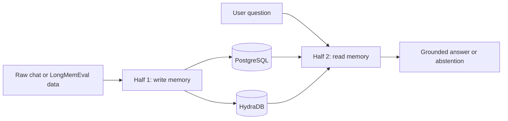
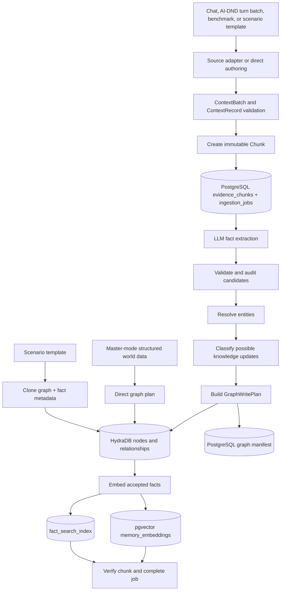
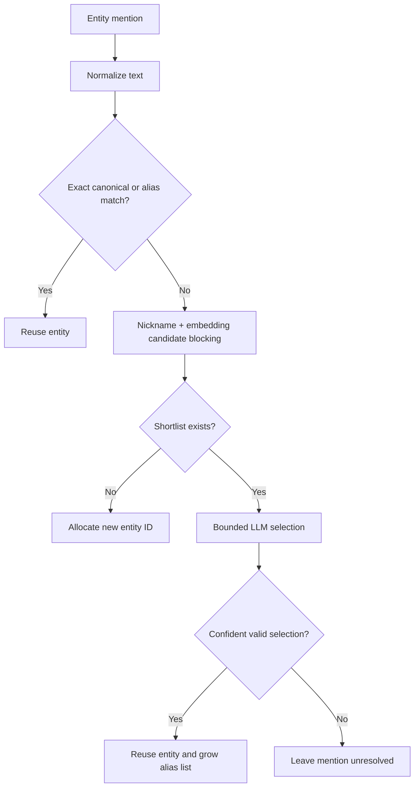
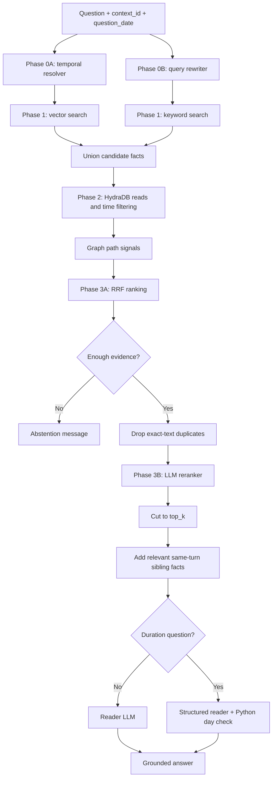
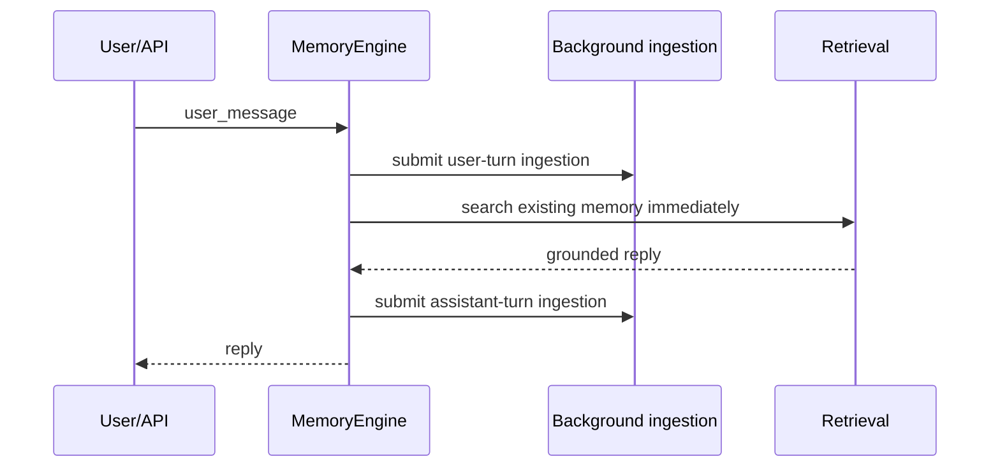
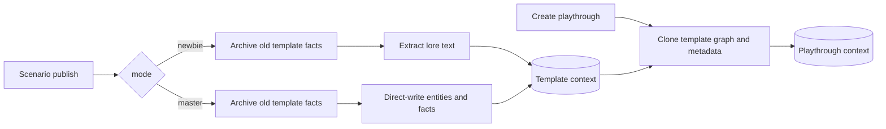
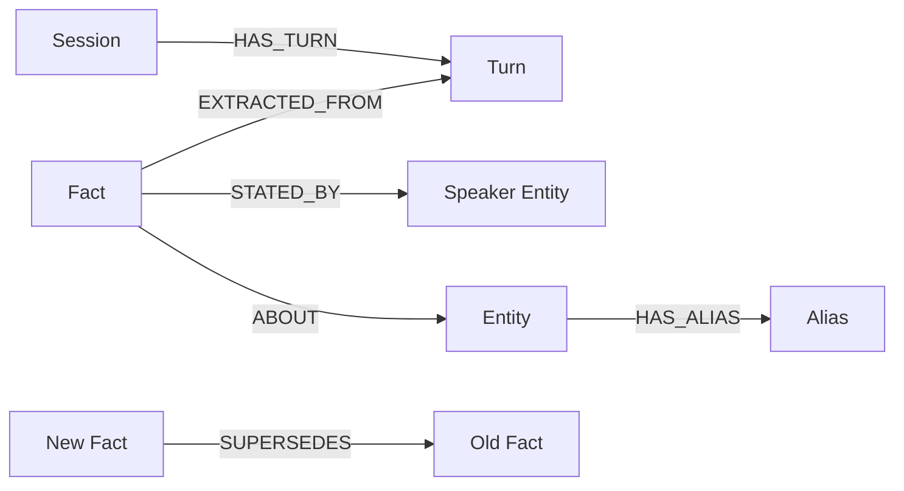

# Beginner Build Flow: From Raw Conversation to Grounded Answer

> Code-traced guide for the current `AI-DND` working tree on 2026-09-06.
>
> This document explains what the running code does. It is intentionally more concrete than the architecture documents: every phase names its input, output, storage destination, and implementation file. When an older design document and executable code differ, the **Current-code notes** in this guide describe the code.

## 1. The whole system in one sentence

The system turns conversation turns into small, searchable facts, stores those facts in PostgreSQL and HydraDB, then combines vector search, keyword search, graph context, time filtering, and an LLM to answer a later question.

The build has two halves:

1. **Data extraction, ingestion, and graph generation**: write memory.
2. **Retrieval and response generation**: read memory and answer.



## 2. First mental model: two stores, two jobs

Think of PostgreSQL as the **filing cabinet and recovery ledger**. Think of HydraDB as the **relationship map**.

| Store | What it owns | Why it is used |
|---|---|---|
| PostgreSQL + pgvector | Raw evidence, content hashes, extraction audit, job state, stable graph-ID registry, graph manifests, fact embeddings, full-text search rows, conversation buffer | Transactions, immutable evidence, replay, vector distance, keyword search |
| HydraDB | `Session`, `Turn`, `Fact`, `Entity`, and `Alias` nodes plus their relationships | Graph topology, entity connections, temporal update edges, path traversal |

One message is therefore not stored in only one place. The pipeline deliberately writes different representations to different stores.

Important consequence: PostgreSQL and HydraDB do **not** share one transaction. The code uses stable IDs, content hashes, manifests, idempotent `MERGE` writes, job states, and whole-chunk replay instead.

## 2.1 What changed in the latest code

The repository is no longer only a memory pipeline. It is becoming a **memory-backed agent harness**: a controlled runtime around an LLM that can record steps, replay model output, call guarded tools, save state, roll memory back, and serve the AI-DND contract.

The most important recent changes are:

- AI-DND can submit turn batches asynchronously, poll durable status, and retry the same batch after a process restart;
- catch-up batches deduplicate repeated turn numbers and use stable source IDs and timestamps, making re-submission idempotent;
- extraction failures now fail the job instead of silently looking like “zero facts found”;
- completion verification can independently read graph nodes, embedding/search presence, and immutable evidence back before declaring success;
- temporal ranges and the 24-hour chat TTL are now active retrieval filters;
- semantic search now compares only embeddings produced by the current model name and version;
- retrieval can return structured `subject/predicate/object` facts, then apply checkpoint, participant, and `as_of_turn` visibility;
- scenario templates support prose ingestion, exact master-mode authoring, replacement on republish, and graph cloning into a playthrough;
- hidden facts and caller-assigned external fact IDs now survive direct authoring; direct supersession closes the prior fact;
- the append-only step journal records successful, failed, repeated, and tool-calling steps; replay preserves their order and errors;
- the tool loop is now reachable through the API and exposes memory search, save-point creation, and context-checked rollback;
- API-key protection, restrictive CORS configuration, and dependency-aware health reporting replaced unsafe or misleading defaults;
- the LLM adapter is being migrated to Google Vertex AI/Gemini, with per-role clients and rate-limit retry behavior.

Several earlier “current limitations” later in the old guide are therefore now closed. This revision distinguishes those completed fixes from the remaining gaps.

## 2.2 What “harness” means here

A **pipeline** mainly transforms data: input goes through steps and produces output. A **harness** surrounds that pipeline with controls needed to run, inspect, reproduce, and safely operate it.

```text
Memory pipeline
  extraction -> graph/index writes -> retrieval -> answer

Harness around it
  configuration + correlation IDs + journal + replay
  + tools + authorization hooks + save points + rollback
  + API contracts + health/auth + evaluation snapshots
```

The memory engine remains the useful core. The harness adds leverage: one central composition module wires role-specific models, journaling, stores, graph transport, retrieval, rollback, and tools instead of every entry point assembling a slightly different system.

---

# Half 1: Data extraction, ingestion, and graph generation

## 3. Half 1 overview



There are now three write entrances:

1. **Ordinary extracted memory** — chat, benchmark, or AI-DND turn text follows the complete extraction pipeline.
2. **Newbie template authoring** — free-form lore uses the same extractor, but writes into `scenario-template::<scenario_id>`.
3. **Master template authoring** — already-structured entities and facts skip the LLM and write directly to the graph. A later clone copies that template graph into a playthrough.

The third entrance currently has an important indexing gap explained in Section 49: graph facts created or cloned there are not automatically inserted into pgvector and full-text search, even though retrieval starts from those PostgreSQL indexes.

## 4. Phase 1 — Receive and normalize source data

### Goal

Convert source-specific input into one internal contract.

### Supported source adapters

| Source | Adapter | Input shape | Output |
|---|---|---|---|
| Interactive chat | `src/context_memory/ingestion/sources/chat.py` | One message with `context_id`, `session_id`, `role`, `content`, and timestamp | One-record `ContextBatch` |
| LongMemEval | `src/context_memory/ingestion/sources/longmemeval.py` | Benchmark instance containing sessions and turns | Chronologically ordered multi-record `ContextBatch` |
| AI-DND turn batch | `src/api/routes.py` + `src/context_memory/engine.py` | `playthrough_id`, `turns_batch`, and optional catch-up turns | Multi-record `ContextBatch` submitted in the background |
| Newbie scenario lore | `src/context_memory/engine.py` | One free-form lore string | Synchronous one-record `ContextBatch` in a template context |
| Master scenario data | `src/context_memory/ingestion/direct_authoring.py` | Explicit entities and facts | Direct `GraphWritePlan`; no extraction call |

The LongMemEval adapter keeps benchmark-only fields such as `answer`, `has_answer`, and `answer_session_ids` out of runtime memory. This prevents evaluation answers from leaking into retrieval.

### Core contract

`ContextBatch` is the envelope:

```text
ContextBatch
├── ingestion_id       unique ingestion attempt
├── context_id         isolation boundary for one user's/benchmark instance's memory
├── source             source type + source external ID
├── records[]          normalized turns/documents
├── contract_version   currently "v1"
└── metadata
```

Each `ContextRecord` contains:

```text
record_id, occurred_at, content, content_type,
session_id, actor_id, actor_role, metadata
```

Validation happens in `src/context_memory/core/models.py`. Only `text/plain` is accepted in v1. Timestamps must include a UTC offset.

### AI-DND batch contract

The HTTP request does not expose the generic `ContextBatch` directly. It accepts:

```text
scenario_id
playthrough_id              becomes context_id
turns_batch[]
recent_context_turns[]      catch-up copies; duplicates removed by turn_number
```

Each turn contains `turn_number`, `text`, `participant_id`, and optional `occurred_at`. If real time is absent, the engine derives a deterministic timestamp from `turn_number`; it does not use the wall clock. Therefore submitting turn 12 again produces the same immutable record rather than a timestamp conflict.

### Example

Raw chat input:

```json
{
  "context_id": "user-42",
  "session_id": "session-7",
  "role": "user",
  "content": "I moved from Pune to Bengaluru last month.",
  "timestamp": "2026-08-24T10:00:00+05:30"
}
```

After the chat adapter, the message becomes one `ContextRecord` inside a `ContextBatch`. Every later ingestion phase consumes this generic form and no longer needs to know that the source was chat.

## 5. Phase 2 — Create immutable evidence and seed the job

### Goal

Preserve exactly what the source said before deriving facts from it.

`chunk_from_record()` in `src/context_memory/core/validation.py` creates one immutable `Chunk` per source record.

Two deterministic values matter:

- `chunk_id`: SHA-256 of `context_id + record_id`. Same logical record gets same ID.
- `content_hash`: SHA-256 of exact UTF-8 content. Changed content under same ID becomes detectable.

`PostgresChunkStore.put()` writes:

- `evidence_chunks`: canonical raw text and source metadata.
- `ingestion_jobs`: recovery state starting at `pending_graph`.

If the same `chunk_id` is replayed with identical content, it is accepted as an idempotent replay. If content differs, `ImmutableRecordConflictError` stops the pipeline.

### Why save raw evidence first?

LLM output is derived and can change across models or prompts. Raw evidence lets the system audit, re-extract, and prove where a fact came from.

## 6. Phase 3 — Extract atomic memory candidates

### Goal

Turn one large natural-language turn into small claims that can be searched independently.

Production wiring uses `LLMExtractor` in `src/context_memory/ingestion/model_adapters.py`. It asks a structured-output LLM for atomic facts. The current provider adapter in `src/context_memory/core/llm_client.py` targets Vertex AI/Gemini while preserving one internal `LLMClient` interface for every role.

Example source turn:

```text
I moved to Bengaluru and I now cycle to work.
```

Possible extraction drafts:

```text
1. "The user lives in Bengaluru."
   predicate_key = location
   entities = [Bengaluru]

2. "The user cycles to work."
   predicate_key = commute_method
   entities = [cycling, work]
```

Atomic does not mean vague. When splitting a sentence, the extractor is told to retain details that may become the answer later:

```text
Source: "My GPA was 3.86 at the University of Mumbai."

Good fact: "The user's GPA at the University of Mumbai was 3.86."
Bad fact:  "The user's GPA was 3.86."
           ^ the institution was silently lost
```

The same rule protects handles such as `@jessica_poole_jewellery`, quantities such as `20 plants`, and itemized preferences such as `thrill rides`, `food`, and `shows`.

Important candidate fields:

| Field | Meaning |
|---|---|
| `candidate_id` | Fact identity used across graph, embedding, and search records |
| `text` | Atomic fact text |
| `memory_type` | `semantic` or `procedural` for extracted facts; raw chunks are the episodic evidence |
| `scope_type` / `scope_id` | Ownership/lifetime boundary: chat, session, or user |
| `source_span` | Character offsets pointing into the original record |
| `confidence` | Extractor confidence from 0 to 1 |
| `observed_at` | When the system observed the source statement |
| `valid_from` / `valid_to` | When the claim is true in the described world, when known |
| `entities` | Mention surfaces to resolve into graph entities |
| `action` | `ADD`, `UPDATE`, or `DELETE` |
| `predicate_key` | Stable category such as `location` or `pet_name`, used for update matching |

`ExtractionService` in `src/context_memory/ingestion/extraction.py` then:

1. Verifies extractor name/version.
2. Converts untrusted drafts into domain candidates.
3. Validates spans, confidence, source timestamp, and validity ordering.
4. Separates accepted and rejected candidates.
5. Stores an append-only extraction audit in PostgreSQL.

Provider errors and unparseable structured output are not treated as a valid empty extraction. They propagate to the orchestrator, which records a retryable or terminal failure. This matters because “the model failed” and “the source contained no durable fact” are different outcomes and must never look identical.

### Current-code note: conversation buffer

`MemoryEngine.add_turn_async()` writes every live turn to `conversation_buffer`. However, the production pipeline is wired to `LLMExtractor`, which extracts from the current record only. A separate `LLMExtractionService` can assemble recent messages and candidate facts, but it is not the class wired by `api/routes.py` or `benchmark_runner.py`.

Therefore, current production extraction is normally **turn-local**, not conversation-buffer-aware.

### Current-code note: extraction batching

Normal API chat uses one extraction call per turn. Benchmark runs can use `PrefetchingExtractor`:

- several independent extraction requests may run concurrently;
- optional `EXTRACTION_BATCH_SIZE > 1` packs multiple turns into one LLM request;
- database and graph work still run through the orchestrator's controlled write path.

## 7. Phase 4 — Resolve entity mentions

### Goal

Decide whether two surface forms refer to the same real-world thing.

Without entity resolution, `Dave`, `David`, and `my colleague` could become unrelated graph nodes.

`EntityRegistry` in `src/context_memory/ingestion/resolution.py` uses this flow:



Details:

1. Normalize using Unicode NFKC, whitespace collapsing, and case folding.
2. Try exact canonical-name and exact-alias matching.
3. Build a bounded shortlist using curated nickname equivalence and `EntityNameIndex` embedding similarity.
4. Let the LLM choose only from that shortlist. It cannot invent an entity ID.
5. If no candidate exists, allocate a new non-negative integer graph ID through PostgreSQL.
6. If a shortlist exists but the model abstains, do not force an `ABOUT` edge.

Mentions in one chunk can be resolved in a batched LLM call. Registry mutations are applied serially afterward for deterministic behavior.

### Current limitation

Two different new aliases first appearing in the same batched chunk can still become separate entities because all shortlists are built before either new entity is registered. The code documents this tradeoff in `EntityRegistry.resolve_many()`.

The registry and `EntityNameIndex` are also process-local caches. A durable `rebuild_from_entities()` helper exists, but startup or lazy hydration is not wired. After restart, exact graph IDs remain stable through PostgreSQL, but fuzzy/semantic alias matching begins cold and can miss links until the process relearns entities.

## 8. Phase 5 — Detect corrections and state changes

### Goal

Keep history without pretending old and new statements are simultaneously current.

Example:

```text
Old fact: "The user lives in Pune."
New fact: "The user lives in Bengaluru."
```

For a candidate with a resolved subject and `predicate_key`, `GraphPlanBuilder` asks `HydraFactLookup` for active facts with the same:

- `context_id`;
- subject entity;
- `predicate_key`.

`TemporalUpdateClassifier` then applies deterministic gates:

- new observation must be later;
- subject must match;
- predicate must match.

It can pre-filter semantically dissimilar prior facts, then asks the LLM to classify remaining pairs as:

| Relation | Meaning | Old fact update |
|---|---|---|
| `CORRECTION` | Old statement was wrong | Close `superseded_at`; keep world-validity unchanged |
| `STATE_CHANGE` | Old statement was once true, then reality changed | Close `superseded_at` and `valid_to` |
| `NO_UPDATE` | Both facts may remain valid | No graph update |
| `UNRESOLVED` | Insufficient confidence | No graph update |

For correction/state change, the graph keeps both facts and writes:

```text
(new Fact)-[:SUPERSEDES]->(old Fact)
```

The old fact receives `is_current = false` plus temporal closing values. History is preserved rather than deleted.

### Current-code notes

- Update lookup runs for any non-`DELETE` candidate with a predicate and subject, including `ADD`; it is not restricted to `action == "UPDATE"`.
- No explicit extraction-confidence threshold gates `SUPERSEDES` in `GraphPlanBuilder`.
- A failed HydraDB prior-fact lookup degrades to “no prior facts,” so ingestion continues without a `SUPERSEDES` edge.
- Superseded PostgreSQL embeddings/search rows remain active, but HydraDB temporal properties prune them after seeding. This is correct at the final visibility stage but wastes retrieval slots and graph reads.
- Extracted candidates marked `DELETE` are excluded from update classification, but there is no implemented deletion/tombstone behavior. The candidate is still planned and indexed as a new fact. Treat `DELETE` as an incomplete contract, not a working erase operation.

## 9. Phase 6 — Build the graph plan

### Goal

Create a validated, store-independent description of graph writes before touching HydraDB.

`GraphPlanBuilder` produces one `GraphWritePlan` per chunk.

### Nodes currently emitted

| Node | Purpose | Stable logical key |
|---|---|---|
| `Session` | Groups turns | `session:<session_id>` |
| `Turn` | Represents immutable source chunk in graph | `turn:<chunk_id>` |
| `Fact` | Atomic extracted memory | `fact:<candidate_id>` |
| `Entity` | Resolved subject/object or speaker | `entity:<canonical_name>` or `speaker:<role>` |
| `Alias` | Alternate entity surface | `alias:<alias>:<entity_id>` |

### Relationships currently emitted

```text
(Session)-[:HAS_TURN]->(Turn)
(Fact)-[:EXTRACTED_FROM]->(Turn)
(Fact)-[:STATED_BY]->(speaker Entity)
(Fact)-[:ABOUT]->(Entity)
(Entity)-[:HAS_ALIAS]->(Alias)
(new Fact)-[:SUPERSEDES]->(old Fact)    when classified as an update
```

The extracted-memory plan builder does not emit `RELATES_TO` or `MERGED_INTO`. Master-mode direct authoring does emit `RELATES_TO` when a fact's object is another authored entity.

### Direct authoring and template cloning

Master mode exists because creator-authored world data is already structured ground truth. Running it through an LLM could reinterpret exact lore. The direct writer therefore:

1. writes authored `Entity` nodes;
2. writes `Fact` nodes with confidence `1.0`;
3. creates `ABOUT` for the subject and optional `RELATES_TO` for an entity object;
4. stores nested/non-scalar metadata such as `when_active`, `checkpoint`, participant visibility, and `hidden` in PostgreSQL;
5. optionally maps the caller's `external_fact_id` to mem1's graph ID;
6. resolves `superseded_fact_id`, adds `SUPERSEDES`, and closes the prior fact.

`template_clone.py` bulk-reads template `Entity` and `Fact` nodes by label, allocates new integer IDs inside the target playthrough, recreates supported Fact-to-Entity edges, and copies fact metadata. Re-running the same clone is idempotent.

Template republish first archives currently active template facts. This gives “replace this scenario version” semantics instead of accumulating removed lore forever. Entities are intentionally retained because existing playthroughs may still reference them.

### Why integer graph IDs?

HydraDB node and relationship identities must be non-negative integers. PostgreSQL's `graph_id_registry` maps a stable logical key to an integer. Replaying the same logical object returns the same integer.

### Bitemporal fact fields

Each fact carries two kinds of time:

| Time axis | Fields | Question answered |
|---|---|---|
| Knowledge time | `observed_at`, `superseded_at` | When did the memory system know this? |
| World-validity time | `valid_from`, `valid_to` | When was this true in the real world? |

Open-ended upper bounds use integer sentinel `9999999999` in HydraDB.

## 10. Phase 7 — Write graph records safely

`GraphWriter` in `src/context_memory/ingestion/graph_writer.py`:

1. Registers every node and relationship payload in PostgreSQL `graph_write_manifests`.
2. Rejects conflicting immutable payloads before graph mutation. Only `is_current`, `superseded_at`, and `valid_to` are allowed mutable fact properties.
3. Groups records by node/relationship shape.
4. Writes all node groups before relationship groups.
5. Uses `UNWIND $rows`, `MERGE`, and content-addressed idempotency keys over HTTP.
6. Splits physical calls at 900 rows, below HydraDB's observed 1024-item admission limit.

For multi-record batches, `write_many()` combines compatible buckets across plans. Each plan still gets its own manifest; only physical HTTP calls are merged.

HydraDB transport lives in `src/context_memory/client/hydradb_http.py` and calls:

```text
POST /v1/graphs/<database>/query
```

## 11. Phase 8 — Build retrieval indexes

Accepted fact text is embedded with `SentenceTransformerEmbedder`.

For every fact, the orchestrator writes:

- `memory_embeddings`: versioned pgvector row with model name, model version, vector, source chunk, and content hash;
- `fact_search_index`: raw fact text plus generated PostgreSQL `tsvector` for keyword search.

Embedding inference and database writes support batching. The same `candidate_id` connects the extraction audit, graph fact logical key, vector row, and full-text row.

## 12. Phase 9 — Verify and complete the job

Happy-path job movement:

```text
pending_graph
    -> pending_embeddings
    -> verifying
    -> completed
```

Failures become:

- `retryable_failed`: transient/unclassified error; whole chunk can replay;
- `terminal_failed`: invalid contract, immutable conflict, or graph payload conflict;
- `manual_repair`: human-controlled recovery state.

### Exact verification guarantee

Production adapters now implement optional verification interfaces. Before a chunk reaches `completed`, the orchestrator:

1. re-reads the immutable chunk and checks its content hash;
2. asks `GraphWriter.verify()` to read each planned graph node back from HydraDB;
3. checks that every accepted fact has an embedding row (the current check is not model/version-specific);
4. checks that every accepted fact has an active full-text search row.

Graph relationships are not independently read back. Fakes or custom adapters that do not implement these optional verification interfaces degrade to chunk-only checking. Therefore the stronger cross-store evidence applies to the production composition, not automatically to every injected adapter and not to every relationship effect.

---

# The handoff between the two halves

## 13. What Half 1 leaves behind for Half 2

```text
candidate_id = cand-abc123

PostgreSQL
├── extracted_memory_candidates: text, source span, time, entities
├── memory_embeddings: vector keyed by subject_id = cand-abc123
└── fact_search_index: searchable text keyed by fact_id = cand-abc123

PostgreSQL graph_id_registry
└── logical_key fact:cand-abc123 -> graph_id 912

HydraDB
└── Fact node id=912, logical_key=fact:cand-abc123
    ├── EXTRACTED_FROM -> Turn
    ├── STATED_BY -> speaker Entity
    ├── ABOUT -> resolved Entity
    └── possibly SUPERSEDES -> older Fact
```

This shared identity is the bridge. PostgreSQL finds candidate IDs; the registry translates them to HydraDB integer IDs; HydraDB adds topology and temporal state.

Runtime-extracted facts complete this bridge because ingestion writes all three representations. Direct-authored and cloned template facts currently complete only the graph/metadata side. Until those paths also write embeddings and search rows—or retrieval gains a graph-native seed channel—they are difficult or impossible to discover from a natural-language query.

---

# Half 2: Retrieval and response generation

## 14. Half 2 overview



Main implementation: `HybridRetrievalEngine` in `src/context_memory/retrieval/engine.py`. The package separates seeding, graph expansion, fusion, reranking, sibling expansion, and reading into smaller modules.

## 15. Retrieval input and isolation

`retrieve_and_answer()` receives:

- `context_id`: mandatory memory isolation boundary;
- `question`: user's question;
- `question_date`: time from which memory should be viewed;
- optional `top_k`: final ranked fact count.

`retrieve_facts()` is the AI-DND variant. It accepts `game_state`, `checkpoint`, `as_of_turn`, `participant_id`, and a template context ID, then returns structured facts rather than prose.

Count/enumeration questions such as “how many,” “list all,” or “total” use a wider configured `top_k` when the caller did not explicitly set one.

## 16. Retrieval Phase 0 — Understand time and rewrite the query

Two independent structured LLM calls run concurrently:

1. `TemporalQueryResolver` interprets expressions such as “last month” relative to `question_date` and returns optional `valid_from` / `valid_to` bounds. It pads both sides by the configured temporal buffer.
2. `QueryRewriter` generates decomposed questions and synonyms for keyword recall.

If either call fails:

- temporal resolution falls back to no explicit range;
- rewriting falls back to the original question.

Query rewrites can be cached in memory or in a JSON file because the provider may produce different rewrites across otherwise identical calls.

### Current-code note

The resolved `DateRange` is now applied as interval overlap:

```text
fact.valid_from <= requested_window_end
AND
fact.valid_to >= requested_window_start
```

With no detected temporal phrase, both ends collapse to `question_date`, preserving ordinary point-in-time retrieval. An open lower or upper bound remains open where the query meaning requires it.

## 17. Retrieval Phase 1 — Seed candidates from PostgreSQL

The engine over-fetches `max(top_k × multiplier, floor)` candidates so later ranking has room to work.

### Channel A: semantic/vector search

1. Embed the raw question.
2. Run exact pgvector cosine-distance search over active fact embeddings inside `context_id`.
3. Convert distance to a bounded similarity-like score.
4. Record each fact's semantic rank.

### Channel B: keyword/full-text search

1. Combine synonyms, decomposed queries, and the original question with OR terms.
2. Search `fact_search_index` using PostgreSQL `websearch_to_tsquery` and `ts_rank_cd`.
3. Record keyword score, text, and keyword rank.

The union of both channels becomes the candidate dictionary. A fact found by both keeps both ranks.

### Current-code note

Semantic SQL now filters by `context_id`, `subject_kind = 'fact'`, `is_active`, and the current embedder's `model_name` and `model_version`. Old and new embedding versions may coexist, but vectors from incompatible spaces are never compared.

## 18. Retrieval Phase 2 — Add graph and temporal evidence

For each seeded fact:

1. Look up `fact:<candidate_id>` in PostgreSQL `graph_id_registry` to get HydraDB integer ID.
2. Fetch fact properties and an optional linked entity from HydraDB. These per-fact read calls run concurrently.
3. Apply bitemporal filters in Python using the resolved interval or `question_date`:
   - the fact-validity interval must overlap the requested interval;
   - `observed_at` must not be after the **end of the question's calendar day**;
   - `question_date <= superseded_at`.
4. Remove seeded facts that fail those checks or cannot be validated through the graph read.
5. Collect linked entity keys.
6. Run bounded HydraDB `algo.MSpaths` over `ABOUT` relationships.
7. Derive graph signals: hop count, path count, and entity frequency.

Graph expansion currently enriches and filters the seeded fact set. It does not add arbitrary newly discovered facts to the candidate dictionary.

### Why `observed_at` uses day granularity

`observed_at` records when a statement was said, not necessarily when the event happened.

```text
Question time:  2026-08-10 08:02
Statement time: 2026-08-10 16:55
Statement:      "I attended a workshop last Saturday."
```

An exact timestamp comparison would call this statement “future” and discard it, even though the event being recalled happened the previous Saturday. The code therefore allows any `observed_at` on the same calendar day and rejects only later calendar days. It does **not** loosen `valid_from`, `valid_to`, or `superseded_at`; those still use exact timestamps because they represent intentional world-validity or knowledge-state boundaries.

### Current-code note: chat TTL now works

Retrieval now reads `f.scope_type AS memory_scope`, matching the property ingestion writes. Chat-scoped facts older than the configured 24-hour TTL are filtered out. This closes the earlier `memory_scope`/`scope_type` mismatch.

## 19. Retrieval Phase 3A — Fuse candidate rankings with RRF

Each candidate has up to four signals:

| Signal | Source | Meaning |
|---|---|---|
| Semantic | pgvector | Question and fact mean similar things |
| Keyword | PostgreSQL full-text search | Question and fact share exact terms |
| Structural | HydraDB path data | Fact has useful graph connectivity/proximity |
| Entity boost | Query terms + HydraDB entity data | Fact links to an entity actually mentioned by the query |

The newest code uses **Reciprocal Rank Fusion (RRF)** rather than adding raw scores with incompatible scales.

For each available channel rank `r`:

```text
RRF contribution = 1 / (configured_rrf_k + r)
```

The composite score is the sum of the fact's available channel contributions. A zero/missing channel contributes nothing.

Structural and entity “ranks” are created by sorting facts by those computed scores. Entity boost is gated: the linked entity's canonical tokens must appear in the question or rewrites.

## 20. Abstention gate

Before asking the reader LLM to answer, the engine checks whether the best candidate has weak evidence.

It abstains when all are true:

- no candidate exists, or best semantic score is below threshold;
- best keyword score is below the same threshold;
- best structural score is zero.

Result: configured message such as `I don't have that information in my memory.`

This gate operates only on retrieved evidence. It does not inspect benchmark gold answers or answerability labels.

## 21. Retrieval Phase 3B — Deduplicate, rerank, and select the reader window

Passing the RRF order directly to the reader caused two forms of crowding:

1. Different fact IDs containing the exact same text consumed multiple scarce reader slots.
2. Generic topic-adjacent facts sometimes ranked above the one specific fact that answered the question.

The current order is:

```text
RRF-ranked candidates
  -> abstention check
  -> case-insensitive exact-text deduplication
  -> LLM rerank of at most the first 60 candidates
  -> top_k cutoff (normally 20; count questions can widen to 40)
```

The reranker receives numbered candidate facts and returns relevant indexes in preferred order. It is **selection used as ordering**, not a second answer-generation step:

- selected facts move to the front in the model's order;
- unselected facts remain behind them in their original RRF order;
- invalid indexes are ignored;
- an exception or empty selection preserves the original RRF order;
- no fact is deleted by reranking itself.

Reranking is enabled by default with `RETRIEVAL_RERANK_ENABLED=1`. The shared composition root now passes `Config.get_rerank_client()` explicitly, so the reranker can use its own model, key, reasoning effort, timeout, and token budget without inheriting the reader's role accidentally.

## 22. Expand evidence with same-turn sibling facts

Atomic extraction intentionally splits one source turn into several facts. A question may need two of those siblings together.

After choosing top-ranked facts, `_sibling_facts()` finds other active fact embeddings with the same `source_chunk_id`. It uses a SCAR-style score:

```text
sibling relevance to query
    - continuity penalty for distance from anchor fact
```

Only siblings clearing a threshold relative to their anchor are added, up to a configured limit. Their dates come from `extracted_memory_candidates`.

This date join matters. Earlier sibling expansion supplied undated text, so the reader could see correct evidence but order events incorrectly. Siblings now appear with their own statement dates.

## 23. Reader LLM response generation

Top facts are formatted as:

```text
[2026-07-10 | user]: The user moved to Bengaluru.
```

Accepted siblings appear under a separate “related facts from the same conversation turns” section.

This assembled evidence enters the configured reader system prompt. The reader LLM produces the final natural-language answer through `text_completion()`.

The prompt also contains a concrete rule for near-duplicate events:

```text
March 15: "The user is considering upgrading the pedals."  <- intention
March 19: "The user upgraded the pedals today."             <- completion
```

A question asking when the user decided/did the upgrade should use March 19. Similar wording is not enough: “considering” is not proof that the action happened.

### Special path for duration questions

Questions such as “how many days ago,” “how long since,” or “between X and Y” take a guarded path:

1. Insert `question_date` into the reader context as today's date. This is done only for duration questions because adding it globally caused a count-question regression.
2. Append instructions to identify dated events and choose one operation: `ago_since`, `between`, or `sum`.
3. Ask the same reader call for both prose and structured fields: operation, ISO start/end dates, unit, and stated result.
4. Python checks the model's day difference when the operation and operands are safely verifiable.
5. If the model's stated day count disagrees, return the corrected day count.
6. If structured output fails, fall back to the normal text reader.

Automatic correction is deliberately restricted to **days**. Months and years have variable lengths, and weeks are often intentionally rounded in natural answers; blindly replacing those with a raw fraction made correct answers worse during testing.

The reader is a synthesizer, not the memory store. If a fact never survived seeding, graph/time filtering, ranking, or sibling expansion, the reader normally cannot recover it.

---

# End-to-end runtime flows

## 24. `/v1/memory/ingest`

```text
HTTP request
  -> map playthrough_id to context_id
  -> combine turns_batch + recent_context_turns
  -> remove duplicate turn_number values
  -> MemoryEngine.submit_batch()
  -> persist exact batch payload + chunk membership in PostgreSQL
  -> submit background orchestrator work
  -> return HTTP 202 with batch_id
```

The caller polls `GET /v1/memory/batch/{batch_id}/status`. Status is computed from durable per-chunk jobs and can be recovered by another replica or after restart. `POST /v1/memory/batch/{batch_id}/retry` reconstructs the original batch and replays it. Completed chunks become no-ops; only failed/incomplete work is redone.

This is a deeper interface than a simple background thread: the task handle and input survive process loss. The worker execution itself still uses an in-process thread pool, so a killed worker requires a caller/operator to issue the retry; automatic queue leasing is not implemented.

## 25. `/v1/memory/search`

```text
HTTP request
  -> MemoryEngine.search_memories()
  -> HybridRetrievalEngine.retrieve_and_answer()
  -> answer or abstention
```

No new message is ingested. Despite the route name, this endpoint returns synthesized prose under `{"answer": ...}`, not raw facts.

## 25.1 `/v1/memory/query`

This is AI-DND's structured read path:

```text
request playthrough_id
  -> context_id isolation
  -> shared retrieval phases 0-3
  -> checkpoint visibility
  -> participant visibility
  -> as_of_turn visibility
  -> structured Fact[] response
```

Each result contains `fact_id`, `subject`, `predicate`, `object`, validity bounds, confidence, `hidden`, and `when_active`.

Important ownership boundary:

- mem1 evaluates time, checkpoint, participant, and turn visibility;
- mem1 returns `hidden` as metadata and does not hide it;
- mem1 returns `when_active` and does not evaluate it;
- AI-DND evaluates `when_active` using its richer game-state grammar and applies its own revealed-secret override.

That split is deliberate. It avoids maintaining two incompatible conditional-expression engines. It also means an incorrect or missing caller-side filter can expose a fact mem1 returned faithfully.

## 26. `/v1/chat`



Important race: user-turn ingestion is asynchronous, so retrieval for the same `/v1/chat` call can run before that turn's facts are available. This design favors response latency and eventual memory over read-your-own-write behavior.

## 27. LongMemEval benchmark flow

For each benchmark instance:

1. Parse `question_date`.
2. Adapt all historical sessions into one isolated `ContextBatch`.
3. Optionally prefetch extraction calls concurrently or in opt-in multi-turn batches.
4. Run ingestion synchronously and wait for its batch result.
5. Retrieve the answer using the instance question and date.
6. Append `{"question_id", "hypothesis"}` to output JSONL.
7. Append instance and per-stage timing metrics to a metrics JSONL file.

Unlike interactive chat, benchmark retrieval waits for synchronous historical ingestion.

## 27.1 Scenario-template flow



Two template-ingest routes reach the same operation:

- `POST /v1/memory/template/ingest` — scenario ID in the body;
- `POST /v1/memory/scenario/{scenario_id}/template` — scenario ID in the path.

`POST /v1/memory/playthrough/{playthrough_id}/init` clones the template. The path and body playthrough IDs must match.

## 27.2 Agent-harness flow

`POST /v1/memory/agent` activates the tool-calling harness:

```text
user prompt
  -> Gemini tool-capable response
  -> requested tool call
  -> registry lookup
  -> PreToolUse authorization hook
  -> actual tool execution
  -> append journal row
  -> tool result returned to model
  -> repeat, maximum 4 iterations
  -> plain-text reply or explicit exhaustion error
```

Available tools:

| Tool | Effect | Guard |
|---|---|---|
| `search_memory` | Searches only the current playthrough | `context_id` is closed over; model cannot choose it |
| `create_save_point` | Records a rollback cutoff | Same closed-over context |
| `rollback_to_save_point` | Archives post-cutoff facts and restores superseded facts | Pre-hook confirms the save point belongs to this playthrough |

The bounded loop prevents endless tool calling. Unknown, denied, or malformed tool requests are returned to the model as tool errors so it can recover. A real exception raised inside a tool handler still escapes the loop and fails the request.

## 27.3 Journal, tracing, and replay

When step journaling is enabled, `composition.py` wraps each role-specific LLM client once. Every structured call, text call, and tool-capable chat call records:

```text
correlation_id, context/session/scenario identity,
role, model, request, response, success/error,
elapsed time, request fingerprint, created_at
```

The journal is append-only: repeated calls with the same fingerprint keep separate event rows. Concurrent access is locked because retrieval makes two LLM calls in parallel on one PostgreSQL connection.

OpenTelemetry spans are emitted from the same journal boundary. Replay exports one correlation ID to JSON and replaces the live LLM with `ReplayingLLMClient`. Recorded calls are consumed oldest-first; recorded failures are re-raised as failures, and tool-call responses can be reconstructed without calling the provider.

Replay guarantees “no live LLM call” for covered steps. It does not automatically virtualize every database, graph, or tool side effect; tests must still inject appropriate fakes for those boundaries.

## 27.4 Current HTTP route map

| Route | Beginner purpose |
|---|---|
| `GET /health`, `GET /v1/health` | Check PostgreSQL and HydraDB; body says `ok` or `degraded` |
| `POST /v1/chat` | Async-ingest user turn, retrieve an answer, async-ingest assistant turn |
| `POST /v1/memory/search` | Retrieve and synthesize prose without ingesting a new turn |
| `POST /v1/memory/query` | Return structured AI-DND facts with visibility checks |
| `POST /v1/memory/ingest` | Submit an asynchronous AI-DND turn batch |
| `GET /v1/memory/batch/{id}/status` | Poll durable aggregate status |
| `POST /v1/memory/batch/{id}/retry` | Replay the stored batch idempotently |
| `POST /v1/memory/template/ingest` | Publish newbie/master scenario memory, ID in body |
| `POST /v1/memory/scenario/{id}/template` | Same publish operation, ID in path |
| `POST /v1/memory/playthrough/{id}/init` | Clone a scenario template graph into a playthrough |
| `GET /v1/memory/entity/{name}?context_id=...` | Read one Entity by canonical name inside a context |
| `POST /v1/memory/{context_id}/save-point` | Create a rollback cutoff |
| `POST /v1/memory/rollback/{save_id}` | Restore memory to that cutoff |
| `POST /v1/memory/agent` | Run the bounded memory/save/rollback tool loop |
| `GET /v1/memory/stream` | Local-demo graph SSE; currently global and not tenant-safe |

---

# How the files fit together

## 28. Code map

| Concern | Main file(s) |
|---|---|
| Generic input contract and candidate models | `src/context_memory/core/models.py` |
| Hashes, chunk construction, candidate validation | `src/context_memory/core/validation.py` |
| Job state rules | `src/context_memory/core/enums.py` |
| Graph node/edge/plan validation | `src/context_memory/core/graph.py` |
| Central runtime/model/retrieval tuning | `src/context_memory/core/config.py` |
| Provider-neutral structured/text LLM calls | `src/context_memory/core/llm_client.py` |
| Integer/UUID helper utilities | `src/context_memory/core/id_generator.py` |
| Chat and LongMemEval adapters | `src/context_memory/ingestion/sources/` |
| Extraction validation/audit service | `src/context_memory/ingestion/extraction.py` |
| Production extractor and bounded decision models | `src/context_memory/ingestion/model_adapters.py` |
| Entity resolution and semantic name cache | `src/context_memory/ingestion/entity_registry.py`, `entity_name_index.py` |
| Temporal update classification | `src/context_memory/ingestion/temporal_update.py` |
| Prior active-fact lookup | `src/context_memory/ingestion/fact_lookup.py` |
| Full ingestion state machine | `src/context_memory/ingestion/orchestrator.py` |
| AI-DND batch shapes | `src/context_memory/ingestion/batch_models.py` |
| Master-mode direct authoring | `src/context_memory/ingestion/direct_authoring.py` |
| Scenario-template cloning | `src/context_memory/cloning/template_clone.py` |
| Graph construction | `src/context_memory/ingestion/graph_plan_builder.py` |
| Batched/idempotent HydraDB writes | `src/context_memory/ingestion/graph_writer.py` |
| PostgreSQL adapters | `src/context_memory/persistence/postgres.py` |
| In-process entity-name embedding index | `src/context_memory/ingestion/entity_name_index.py` |
| SQL schemas | `db/migrations/` |
| HydraDB HTTP client | `src/context_memory/client/hydradb_http.py` |
| Retrieval coordinator | `src/context_memory/retrieval/engine.py` |
| Retrieval stages | `src/context_memory/retrieval/seeder.py`, `graph_expander.py`, `fuser.py`, `reranker.py`, `sibling_expander.py`, `reader.py` |
| Chat-level orchestration | `src/context_memory/engine.py` |
| Shared production composition root | `src/context_memory/composition.py` |
| Step journal and deterministic LLM replay | `src/context_memory/core/journal.py`, `replay.py` |
| Tool registry, guards, and bounded loop | `src/context_memory/core/tools.py`, `tool_executor.py`, `tool_loop.py`, `agent_tools.py` |
| Save points and rollback | `src/context_memory/ingestion/rollback.py` |
| Dependency wiring and HTTP endpoints | `src/api/routes.py` |
| FastAPI/SSE server | `src/api/server.py`, `src/api/stream.py` |
| Benchmark pipeline | `src/evaluation/benchmark_runner.py` |
| Stage metrics | `src/context_memory/core/logging.py` |
| Default test suite | `src/tests/` |

The latest consolidation matters for beginners: `src/context_memory/` is now the one package tree to follow. Old parallel `src/core/` and `src/db/` copies were removed. Imports now use paths such as `context_memory.persistence.embedding_index`, preventing duplicate module names from confusing test discovery.

## 29. PostgreSQL table map

| Table | Written during | Read during |
|---|---|---|
| `evidence_chunks` | Ingestion | Verification, audit |
| `ingestion_jobs` | Ingestion | Replay/state handling |
| `ingestion_batches` | AI-DND batch submission | Cross-restart status/retry reconstruction |
| `ingestion_batch_chunks` | AI-DND batch submission | Map a batch to chunk jobs and turn numbers |
| `extraction_attempts` | Extraction | Audit |
| `extracted_memory_candidates` | Extraction | Audit, sibling dates |
| `rejected_extraction_candidates` | Extraction | Audit/debugging |
| `graph_id_registry` | Graph planning | Retrieval ID translation |
| `graph_write_manifests` | Before HydraDB write | Replay/conflict prevention |
| `memory_embeddings` | Index building | Semantic seeding, sibling expansion, hydration |
| `fact_search_index` | Index building | Keyword seeding, fact-text fallback, sibling expansion |
| `conversation_buffer` | Live chat intake | Stored conversation history; not used by current production extractor wiring |
| `pre_authored_fact_metadata` | Master authoring and clone | Checkpoint, `when_active`, participant visibility, hidden flag |
| `scenario_template_checkpoints` | Master template publish | Checkpoint-order visibility |
| `external_fact_ids` | Master authoring | Translate caller fact IDs for later supersession |
| `save_points` | Save operation | Rollback cutoff lookup |
| `journal_steps` | Every wrapped LLM/tool step | Audit, traces, fixture export, replay diagnosis |

## 30. HydraDB graph map



---

# Pivotal problems encountered while building the system

This section is a curated build history, not an exhaustive bug log. It keeps the problems that changed the architecture, debugging method, or evaluation result. The detailed investigation remains in [`fixes_and_evaluation_findings.md`](fixes_and_evaluation_findings.md).

## 31. The debugging rule that changed the work

A wrong final answer can originate at several different points:

```text
source turn
  -> extracted fact
  -> graph + indexes
  -> retrieval candidate pool
  -> reader top_k window
  -> final prose
```

Early guesses often blamed “the LLM” or “ranking.” The productive method became: trace the needed fact through every boundary and stop at the first place it disappears or changes.

| Where the fact first fails | Actual class of problem |
|---|---|
| Not in `extracted_memory_candidates` | Extraction loss |
| Extracted but absent from graph/indexes | Ingestion or cross-store write failure |
| Indexed but absent from seed candidates | Vector/keyword recall failure |
| Seeded but below `top_k` | Ranking dilution or window-size failure |
| Present in the reader prompt but answer is wrong | Reader reasoning/disambiguation failure |

This distinction prevented fixes from being applied to the wrong layer. For example, adding more reader instructions cannot recover a fact that never entered the reader prompt.

## 32. Extraction preserved the main claim but lost the decisive qualifier

**Symptom.** The system remembered a GPA but dropped its institution, remembered a designer but dropped her Instagram handle, or collapsed several requested theme-park preferences into one generic recommendation fact.

**Root cause.** “Split compound statements into atomic facts” encouraged compression. The model preserved the main clause while treating identifiers, quantities, institutions, and list members as optional detail. Those details were often exactly what a later question asked for.

**Fix.** Both single-turn and batched extraction prompts now contain an explicit preservation rule plus concrete examples. Salient common-noun topics such as `commute`, `rent`, and `audiobooks` are also requested as entities; asking only for “named entities” previously left many useful facts disconnected from the graph.

**Important limitation.** Preserving all information does not guarantee it remains in one fact. The degree and GPA may become two atomic sibling facts. Retrieval still needs same-turn sibling expansion to reunite them for the reader.

**Lesson.** Atomicity should remove unrelated clauses, not remove answer-bearing qualifiers. Always inspect extracted records, not only the original message and final answer.

## 33. `Dave` and `David` exposed an entity-resolution path that rarely ran

**Symptom.** Obvious aliases became separate entity nodes. The project had a bounded LLM disambiguator, but it did not help.

**Root cause.** The LLM was allowed to choose only from a safe shortlist. Without a semantic name index, that shortlist was populated mainly by exact canonical/alias matches. `Dave` did not exactly match `David`, so the shortlist was empty and the LLM was never called. A fully implemented component was effectively bypassed by its upstream wiring.

**Fix.** `EntityNameIndex` now provides embedding-based candidates alongside curated nickname matching. The LLM still cannot invent IDs; it chooses only among candidates already restricted to the same `context_id`. Registry lookups were also moved toward indexed context access instead of scanning every entity across all prior benchmark instances.

**Cost discovered after the fix.** Once the disambiguator actually ran, ingestion became slower because many more LLM decisions were real. Mention resolution was then batched, while registry mutations remained serial and deterministic.

**Lesson.** Unit-testing a component is insufficient. Verify that real inputs reach it, especially when an empty shortlist, feature flag, or callback can silently skip the entire path.

## 34. Batched graph updates created a cross-store data-loss chain

**Symptom.** Two new facts in one flush could both supersede the same old fact. Each proposed a different `superseded_at` or `valid_to`, so HydraDB rejected the whole bucket. Extraction had already been stored, but the failed group then skipped embedding and keyword indexing. Hundreds of extracted facts could exist in PostgreSQL audit tables while remaining invisible to every retrieval channel.

**Root cause.** The graph batch contained multiple updates for the same vertex, and the writer treated their temporal values as an immutable-payload conflict. The orchestrator correctly failed the group, but this exposed the practical blast radius of the non-transactional two-store pipeline.

**Fix.** `GraphWriter._dedupe_nodes()` merges repeated writes to the same graph ID. For `superseded_at` and `valid_to`, it keeps the earliest value because the old fact stopped being current at the first superseding event. Genuine non-temporal immutable conflicts remain protected by the PostgreSQL manifest layer.

**Related boundary found while increasing batches.** HydraDB rejects a physical `UNWIND` write above 1024 rows. A test batch produced 1236 fact rows and failed all 100 chunks. The writer now splits buckets at 900 rows, preserving margin below the server limit and assigning each sub-batch its own idempotency key.

**Lesson.** A batch improves throughput but increases failure radius. Batch size cannot be based only on average facts per turn; enforce the downstream service's hard row limit inside the writer.

## 35. Performance work pivoted from “more concurrency” to “measure the real boundary”

**Initial diagnosis.** The embedding-and-index stage looked expensive, and hundreds of individual PostgreSQL calls suggested an N+1 write bottleneck.

**What measurement showed.** Real multi-row writes were still worthwhile, but the first stage measurement also included the sentence-transformer model's one-time lazy load. A cold probe made embedding look far more expensive than steady-state production, where one embedder is reused for the process lifetime. After warming the model outside the timed window, the supposed recurring bottleneck largely disappeared.

**Second attempted direction.** Parallel HydraDB bucket writes looked promising because many HTTP calls were sequential.

**Why it was rejected.** All writes currently use one HydraDB `cell_id`. The server protects that cell with one writer lane, so client threads still serialize behind the same mutex. Parallel calls added complexity without a meaningful warm-run improvement.

**What did help.** Fewer, larger operations:

- PostgreSQL `put_batch()` calls instead of per-fact inserts;
- `GraphWriter.write_many()` to merge compatible shapes across chunks;
- grouping benchmark ingestion writes while preserving each chunk's manifest and state;
- keeping live one-turn API ingestion on the simple one-record path.

**Lesson.** Time subcomponents independently, separate cold-start from steady-state cost, and understand server-side serialization before adding client concurrency.

## 36. Temporal correctness required separating statement time from event time

Three related failures looked like one “date problem” but occurred at different layers.

### 36.1 Same-day facts were incorrectly pruned as future

A question timestamped in the morning could not see a statement timestamped later that same day, even when the statement described an earlier event. Exact timestamp comparison on `observed_at` removed up to 74% of one instance's fact store. The fix uses end-of-calendar-day for `observed_at` only; explicit validity and supersession fields retain exact timestamp checks.

### 36.2 Sibling facts reached the reader without dates

Same-turn expansion recovered related evidence, but initially formatted siblings as bare text. Roughly 30% of one captured reader context was therefore undated, making event ordering unreliable. `_sibling_facts()` now joins dates from the extraction audit table.

### 36.3 The reader chose correct facts but performed inconsistent arithmetic

Plain instructions sometimes produced correct dates in prose and the wrong number. The current duration path asks the same call to return its operation and ISO date operands, then lets Python verify exact day arithmetic. Live testing of the first version found important mechanism bugs—missing type imports, malformed numeric date encodings, substituted endpoints, and over-correction of rounded weeks—so the final verifier uses ISO dates, trusts the real `question_date` for `ago_since`, avoids suspicious `between` corrections, and auto-corrects only days.

**Lesson.** “Temporal” is not one field or one fix. Separate statement time, world-validity time, event-date interpretation, ordering, and arithmetic.

## 37. Retrieval dilution needed measured reranking, not another raw score boost

**Symptom.** The answer-bearing fact existed and was seeded, but generic facts about the same topic filled the reader window. In one commute case, the gold fact had the strongest semantic match but ranked below unrelated entity-linked facts because every linked entity received a large raw boost.

**First structural fix.** Gate entity boost on entities actually mentioned by the question and replace addition of incompatible raw scores with RRF rank fusion.

**Remaining problem.** RRF still favors broad topic overlap in some cases. Count questions also lose valid items when a fixed 20-fact window is too narrow.

**Experiments and decision.** A user-affinity RRF channel was tried and reverted after regressing a working case. Exact-text deduplication was kept. Count/enumeration questions now widen the window to 40 when the caller has not set `top_k`. A candidate-selection LLM reranker was tested repeatedly before being enabled by default. The controlled 30-instance sequence recorded in the findings moved from 66.7% without reranking, to 70.0% with reranking alone, to 73.3% when compounded with the same-day fix, and to 76.7% after duration and near-duplicate reader fixes. These are small-sample project measurements, not general benchmark claims.

**Safety property.** The reranker can reorder but not discard the candidate pool; failure returns the RRF order. This limits the damage of adding another model call.

**Lesson.** Do not assume a plausible ranking feature helps. Compare exact candidate windows before/after, repeat model-based measurements, record regressions, and revert a change that worsens known cases.

## 38. A wrong answer can still be a reader problem, but only after evidence is proven present

**Symptom.** A bike question had both correct events as the top two reader facts, yet the answer used an earlier “considering an upgrade” statement instead of the later completed upgrade.

**Root cause.** This was not retrieval. The question's phrase “decided to upgrade” was lexically closer to “considering upgrading” than to “upgraded today,” so the reader selected the intention despite having the completion evidence.

**Fix.** An abstract instruction did not reliably change behavior. A concrete intention-versus-completion example did, so that worked example now lives in the reader prompt. The rule is narrowly scoped so it does not merge separate active items during count questions.

**Lesson.** Inspect the exact reader prompt. If correct evidence is absent, fix retrieval; if it is present and misinterpreted, then a reader rule or structured output is justified.

## 39. Repository structure briefly made a healthy suite look empty

**Symptom.** Running default `pytest` collected zero useful tests because duplicate test module basenames and stray parallel package trees collided during discovery.

**Root cause.** Some files lived under the real `src/context_memory/` package while older copies remained under top-level `src/core/` and `src/db/`. Tests were similarly split.

**Fix.** Live modules moved under `src/context_memory/core/` and `src/context_memory/persistence/`; tests moved under `src/tests/`; stale duplicate config, LLM-client, and test files were deleted; imports were updated. Default collection now targets the actual package rather than a hand-selected subset.

**Lesson.** Test count is part of the result. A green command that collects zero tests provides no evidence. Keep one import tree and verify both collection and execution after file moves.

## 40. Catch-up ingestion was asynchronous but not truly recoverable

**Symptom.** `/v1/memory/ingest` returned a `batch_id`, but batch status lived only in one process's `_batches` dictionary. Restarting the process or polling another replica lost the handle. Re-sent turns could also conflict because source identity and fallback timestamps changed between submissions.

**Fix.** Migrations `0011` and the `PostgresBatchStore` persist the submitted `ContextBatch` plus its chunk/turn membership. Source identity is the stable playthrough, fallback time is deterministically derived from `turn_number`, and overlapping catch-up arrays are deduplicated. Status falls back to PostgreSQL; retry reconstructs the original batch.

**Lesson.** Returning a job ID does not make work durable. The job description, membership, state, and replay identity must all survive the worker that accepted it.

## 41. “No facts” was hiding provider failure

**Symptom.** A model outage, rate limit, empty completion, or malformed response could look like a successful turn containing zero memories. Downstream code then had no way to distinguish “nothing useful was said” from “extraction never worked.”

**Fix.** Provider failure now raises into the ingestion state machine. The job becomes retryable/terminal instead of completed-empty. The new Gemini client separately retries rate-limit failures and structured-output parse failures under bounded budgets.

**Lesson.** Absence of data is a domain result; inability to compute data is an operational error. Never encode both as an empty list.

## 42. Cross-store completion needed read-back evidence

**Symptom.** A graph/vector/search write that returned without raising was treated as success. That proved only that the client call finished, not that every intended row/node was readable.

**Fix.** Verifiable store interfaces now let production adapters read back planned graph nodes, embedding/search-row presence, and the immutable chunk before marking `completed`. Failure-state transition errors also emit a loud reconciliation log instead of disappearing. Relationship read-back and model/version-specific embedding verification remain open hardening work.

**Lesson.** In a two-store system, completion is a claim about several independent effects. Verify those effects at the seam where the claim is made.

## 43. The first journal/replay design collapsed real events

**Symptom.** `idempotency_key` was treated as a unique event ID. Two legitimate calls with the same request fingerprint caused later rows to disappear. Replay also discarded failures, collapsed duplicate calls, and could not reconstruct tool-calling responses.

**Fix.** `step_id` is now the event identity; the fingerprint is only indexed. The journal is append-only. Fixture export includes failures, replay consumes repeated steps oldest-first, and `chat_with_tools` responses are reconstructable. A lock protects the shared journal connection during concurrent Phase-0 calls.

**Lesson.** “Same request shape” and “same occurrence” are different concepts. Reproducibility needs both a fingerprint for matching and an event ID/order for history.

## 44. Harness primitives existed but no runtime used them

**Symptom.** Tool registry, hooks, executor, and loop had tests, but production never constructed them. Rollback existed only for Python callers, and a save ID from another playthrough could be dangerous if exposed as an agent tool without an ownership check.

**Fix.** `MemoryEngine.agent_turn()` and `/v1/memory/agent` now wire a real bounded loop. Tools close over the active `context_id`. The rollback pre-hook resolves the save point and denies cross-playthrough use. Separate save-point and rollback HTTP routes expose manual control too.

**Lesson.** A tested library primitive is not a product capability until a real entry point composes it. Authorization belongs at the tool-execution boundary, not in a prompt asking the model to behave.

## 45. API defaults were unsafe or misleading

**Symptom.** Credentialed CORS accepted any browser origin, API routes had no authentication option, and health returned “ok” even when PostgreSQL or HydraDB was down.

**Fix.** Browser origins are deny-by-default and explicitly configured. A bearer API key can protect the whole router. Health performs real dependency checks and reports `degraded` when either store is unavailable.

**Lesson.** Operational truth is part of correctness. A green health response that cannot detect dead dependencies is worse than no health check because automation trusts it.

---

# Current gaps and the path toward a state-of-the-art harness

“State of the art” here should not mean adding more models or more framework layers. It means closing the seams where data can become invisible, leak across tenants, become unrecoverable, or produce a result that cannot be reproduced.

Priority meanings:

- **P0** — correctness/security blocker; fix before calling the AI-DND integration production-ready.
- **P1** — reliability or scale limitation; fix before multi-replica or sustained production load.
- **P2** — hardening/efficiency improvement; useful after the critical boundaries are sound.

## 46. P0 — Authored and cloned facts are not connected to retrieval seeding

### What the intended flow is

Every retrievable fact needs both sides of the bridge:

```text
PostgreSQL seed rows                    HydraDB graph row
memory_embeddings + fact_search_index  Fact + edges + temporal state
               \                       /
                same logical fact identity
```

### What currently happens

Ordinary extracted facts write both sides. `direct_authoring.write_fact()` writes the HydraDB fact and optional PostgreSQL metadata/external-ID rows, but it never writes `memory_embeddings` or `fact_search_index`. `template_clone.clone()` copies graph nodes, edges, and metadata, but not retrieval indexes.

`CandidateSeeder` begins only from `memory_embeddings` and `fact_search_index`; graph expansion can enrich only facts already seeded. Therefore a perfectly authored clue may exist in HydraDB yet never enter a natural-language query's candidate set.

### Beginner analogy

The book exists on the library shelf, but neither the title catalogue nor search computer knows it exists. Searching cannot find the shelf location because the catalogue lookup is the first step.

### How to fix it

Create one reusable **FactProjectionWriter** interface owning the complete searchable projection:

1. accept `context_id`, retrieval fact ID, HydraDB `graph_id`/`logical_key`, text/triple, source metadata, and active state;
2. store the explicit graph identity in the PostgreSQL retrieval projection—do not assume every logical key has runtime extraction's `fact:<candidate_id>` shape;
3. generate the embedding with the configured versioned embedder;
4. upsert `memory_embeddings` and `fact_search_index` together;
5. let `CandidateSeeder` carry explicit graph identity into `GraphExpander` instead of reconstructing it from a string convention;
6. call the writer from ordinary ingestion, direct authoring, and template cloning;
7. verify both rows before reporting authoring/clone success;
8. add an end-to-end test: author template -> clone -> `/v1/memory/query` returns the fact.

Alternative: add a graph-native seed channel. That avoids index copying but makes every query scan/search HydraDB, whose current role is topology rather than text/vector search. The shared projection writer better matches the existing architecture.

### What improves afterward

- authored lore becomes actually searchable;
- cloned playthroughs start with usable scenario memory;
- structured and extracted facts follow one retrieval path;
- checkpoint, participant, hidden, and supersession features become observable through the real API, not only unit tests.

## 47. P0 — Tenant isolation is incomplete at the API and streaming boundaries

### What currently works

Memory queries are scoped by `context_id`, and agent tools close over one context. Optional bearer-token auth covers routes included through the main router.

### What remains unsafe

`/v1/memory/stream` is registered directly on the FastAPI app, outside the authenticated router. `GraphStreamer` has one global subscriber set and broadcasts every graph plan to every connected client without a `context_id` filter. Any listener can receive nodes and properties from unrelated playthroughs.

A single shared API key also authenticates the caller but does not authorize which scenario/playthrough that caller may access. Endpoints accept caller-selected context identifiers.

### How to fix it

1. Introduce an authenticated principal: user/service identity plus allowed scenario/playthrough IDs.
2. Authorize every request against the requested `context_id`; do not treat possession of an ID as permission.
3. Move SSE under the same auth dependency.
4. Require a context subscription and maintain queues per authorized context.
5. Include `context_id` in each event envelope, but filter before enqueueing—not only in the browser.
6. Add negative tests: token A cannot query, stream, fetch entity details, or roll back token B's playthrough.

### What improves afterward

The system moves from “data is separated if callers behave” to enforced multi-tenant isolation. This is required before real player secrets or private clues enter the service.

## 48. P0 — Journaling needs a privacy and retention boundary

### What currently happens

`journal_steps` stores full prompts, full model responses, tool arguments/results, context IDs, session IDs, and scenario IDs. This is excellent for debugging and replay, but it creates a second durable copy of potentially sensitive conversation and game data.

### Why this matters

Observability data often receives broader internal access and longer retention than primary data. A secure main store can still leak through logs or exported fixtures.

### How to fix it

1. Classify fields: safe metadata, sensitive content, secrets, and credentials.
2. Redact known secret keys and tool arguments before persistence.
3. Make payload capture configurable per environment; production can default to hashes/metadata and opt into sampled encrypted payloads.
4. Encrypt sensitive journal columns or the storage volume with managed keys.
5. Add retention/TTL deletion and access auditing.
6. Sanitize fixture export and require explicit approval for production-derived fixtures.
7. Add tests proving API keys, authorization headers, and configured secret fields never reach journal rows.

### What improves afterward

Replay remains useful without turning the audit system into an uncontrolled shadow database.

## 49. P0 — Dependencies, tests, and the architecture contract are not yet a clean build

### Current evidence from 2026-09-06

The default `pytest -q` command stops during collection because two updated tests import `google.genai` and the current virtual environment lacks it. During this documentation pass, the working tree was concurrently updated to declare `google-genai>=1.0.0` in `pyproject.toml` and `requirements.txt`; the environment still needs to be synchronized before the full suite can collect.

After explicitly ignoring those two modules, the remaining run produced **423 passed, 4 failed, and 22 skipped**. The four failures are current-code/test-contract drift:

- health test still expects the obsolete unconditional `{"status": "ok"}` response, while the updated endpoint correctly reports both unavailable local dependencies as `degraded`;
- structured-query test does not yet expect new `hidden` and `when_active` response fields;
- two template-route tests use a fake engine missing the newly required `begin_template_republish()` method.

The import-linter also reports one real architecture violation: `context_memory.persistence.postgres` imports `context_memory.ingestion.batch_models`. The documented dependency direction says persistence is below ingestion and must not depend upward on it. Durable batch tracking placed its request/domain types on the wrong side of that seam.

### How to fix it

1. Pin/lock the newly declared `google-genai` dependency and refresh the environment.
2. Update API contract tests for the new fields.
3. Update template fakes to implement republish behavior, then assert it is called.
4. Make the health test inject dependency checks or mock them; do not require live services in a unit test.
5. Move the batch persistence DTO/port shape into `core` (or a persistence-owned neutral record) so ingestion depends on it, not vice versa.
6. Run the full suite, import-linter, migrations, and focused live integration tests in CI.

### What improves afterward

A clean checkout becomes reproducible. CI can distinguish code regressions from environment drift, the architecture boundary becomes enforceable again, and the documented provider/API contract matches what users actually install and receive.

## 50. P1 — Batch metadata is durable, but execution is still process-local

### What currently happens

The submitted payload and status survive restart, but work runs in `ThreadPoolExecutor`. If the process dies mid-run, no durable worker automatically claims the unfinished batch. Recovery depends on an external caller noticing and invoking retry.

### How to fix it

1. Add durable work states such as `queued`, `leased`, `running`, and `next_attempt_at`.
2. Use a real queue or a PostgreSQL `FOR UPDATE SKIP LOCKED` worker table.
3. Give leases expirations and heartbeats so another worker can reclaim abandoned work.
4. Add bounded exponential backoff, attempt count, dead-letter/manual-repair state, and operator-visible reconciliation.
5. Make status derive from the durable state only; keep memory caches as optional acceleration.
6. Test process death after each external write and prove eventual completion without duplicate logical facts.

### What improves afterward

Async ingestion becomes self-healing across deploys and replicas, not merely manually replayable.

## 51. P1 — Entity resolution forgets semantic identity after restart

### What currently happens

Graph IDs are durable, but `EntityRegistry._profiles` and `EntityNameIndex` live only in process memory. `rebuild_from_entities()` exists but is not invoked. A cold replica can miss “Dave” -> “David” even though the entity already exists in HydraDB.

### How to fix it

Use lazy, per-context hydration:

1. on the first resolution request for a context, bulk-read existing Entity nodes and aliases;
2. rebuild profiles/name embeddings once under a per-context lock;
3. cache a hydrated/version marker;
4. invalidate or update the cache after entity writes/merges;
5. bound memory with LRU/TTL eviction;
6. test warm process, restart, then alias resolution against the same durable graph.

### What improves afterward

Entity quality stops depending on which replica handled earlier turns. Horizontal scaling becomes deterministic.

## 52. P1 — Currency is enforced late, leaving stale search candidates active

### What currently happens

Superseded facts remain active in `memory_embeddings` and `fact_search_index`. Retrieval seeds them, pays graph-read cost, then removes them using HydraDB temporal state. `DELETE` extraction actions also lack true tombstone semantics.

### How to fix it

1. Define one explicit fact lifecycle: active, superseded, archived, deleted.
2. When graph currency changes, update PostgreSQL projections through an outbox/reconciliation step.
3. Make the cross-store update idempotent and replayable.
4. Add a periodic reconciler comparing HydraDB fact state against PostgreSQL `is_active`.
5. Specify `DELETE`: tombstone the fact, preserve provenance, deactivate indexes, and define historical-query behavior.

### What improves afterward

Seed pools contain less stale noise, graph N+1 work shrinks, deletion becomes predictable, and the two stores converge even after partial failure.

## 53. P1 — Graph validation uses one HydraDB read per seeded fact

### What currently happens

Retrieval may seed 60–80 facts. `GraphExpander` maps IDs in one PostgreSQL query, then performs an independent HydraDB read for each fact. Calls run concurrently, reducing wall time, but total request volume remains O(number of seeds).

### How to fix it

Because this HydraDB build rejected attempted `UNWIND` bulk reads, use a deliberate projection instead of pretending the transport supports a query it does not:

1. copy retrieval-critical scalar fields—graph ID, current/archive state, temporal bounds, subject/predicate/object, primary entity key, turn number—into a PostgreSQL read model;
2. update it through the same outbox/reconciliation mechanism as index currency;
3. use HydraDB only for path/traversal signals that PostgreSQL cannot provide;
4. benchmark p50/p95 latency and Hydra request count before/after;
5. retain a graph-read verification mode for audits.

### What improves afterward

Most queries need a few store calls instead of dozens, reducing latency variance and pressure on HydraDB while preserving it as graph authority.

## 54. P2 — Harness contracts need tighter validation and replay fingerprints

Current smaller but important gaps:

- tool input schemas are advertised to the model but not validated before the Python handler runs;
- a real tool-handler exception escapes and aborts the whole agent turn rather than becoming a recoverable tool error;
- replay fingerprints omit effective parameters such as temperature, token limit, timeout, and retry configuration;
- replay replaces LLM calls, not database/graph/tool side effects, so “full deterministic replay” requires explicit fakes;
- world-data models are loose dictionaries, so malformed nested input is detected late through key access rather than precise Pydantic errors;
- template cloning maintains a hand-written property projection; a newly added graph property can be silently omitted unless the clone list is updated;
- completion verification checks graph nodes but not relationships, and embedding presence without requiring the current model/version.

Recommended fixes:

1. validate tool arguments against JSON Schema before hooks/handlers;
2. classify handler errors into recoverable tool results versus request-fatal infrastructure failures;
3. version the replay-fixture format and include all behavior-affecting request parameters in a new fingerprint version;
4. define replay levels clearly: LLM-only, store-fake integration, and full recorded simulation;
5. replace nested `world_data: dict` parsing with discriminated Pydantic models for newbie/master mode;
6. centralize cloneable Fact/Entity property definitions or add a contract test comparing writer fields with clone projections;
7. verify relationship IDs/endpoints and the expected embedding model/version before completing a chunk.

Afterward, malformed model output fails at a narrow boundary, replay misses become explainable, and schema evolution is less likely to create silent data loss.

# Beginner checkpoints

## 55. Follow one fact through the system

Use this trace when reading code:

```text
"I live in Bengaluru"
  -> ContextRecord.content
  -> evidence_chunks.raw_text
  -> ExtractionDraft
  -> ExtractedMemoryCandidate(candidate_id="cand-X")
  -> extracted_memory_candidates
  -> Fact logical_key="fact:cand-X"
  -> graph_id_registry gives integer ID
  -> HydraDB Fact + ABOUT/EXTRACTED_FROM/STATED_BY edges
  -> memory_embeddings.subject_id="cand-X"
  -> fact_search_index.fact_id="cand-X"
  -> vector/keyword retrieval returns "cand-X"
  -> graph_id_registry translates it to HydraDB ID
  -> bitemporal/graph checks
  -> RRF ranking
  -> exact-text deduplication
  -> LLM reranking (or unchanged RRF fallback)
  -> top_k reader-window selection
  -> optional dated same-turn sibling expansion
  -> reader context
  -> optional structured duration verification
  -> final answer
```

If that chain breaks at any point, later phases cannot reconstruct the missing link.

## 56. Suggested reading order

1. `core/models.py`: learn nouns and fields.
2. `ingestion/sources/chat.py`: see raw input become the contract.
3. `core/validation.py`: see record become immutable chunk.
4. `ingestion/orchestrator.py`: see ingestion order and failure handling.
5. `ingestion/model_adapters.py`: see LLM extraction output.
6. `ingestion/entity_registry.py` and `temporal_update.py`: understand entity/update decisions.
7. `ingestion/graph_plan_builder.py`: see exact graph objects.
8. `ingestion/graph_writer.py`: see graph plan become Cypher.
9. `persistence/postgres.py` and migrations: understand durable evidence, indexes, batches, metadata, journal, and save points.
10. `retrieval/engine.py`, then its sibling modules: follow Phase 0 through RRF, reranking, structured facts, and reader synthesis.
11. `ingestion/direct_authoring.py` and `cloning/template_clone.py`: follow scenario publishing into a playthrough.
12. `core/journal.py`, `core/replay.py`, and `core/agent_tools.py`: understand the harness around the pipeline.
13. `composition.py`, `engine.py`, and `api/routes.py`: see how modules become one running service.
14. `evaluation/benchmark_runner.py`: see synchronous end-to-end evaluation.
15. `docs/fixes_and_evaluation_findings.md`: read the full historical evidence log after understanding the current flow.

## 57. Questions to test your understanding

1. Why does the system keep both raw chunks and extracted facts?
2. Why can HydraDB not use the string `candidate_id` directly as node identity?
3. Which identifier connects a pgvector result back to a HydraDB fact?
4. What is the difference between `observed_at` and `valid_from`?
5. Why is `SUPERSEDES` safer than deleting the old fact?
6. Why does retrieval over-fetch before RRF ranking?
7. Why does exact-text deduplication happen before `top_k` is cut?
8. Why can the reranker fail without losing the RRF candidates?
9. Why is same-calendar-day tolerance applied to `observed_at` but not `valid_from`?
10. Why does Python auto-correct duration arithmetic only in days?
11. What happens when the entity-resolution LLM abstains?
12. Why can `/v1/chat` miss the just-submitted turn during its immediate retrieval?
13. What exactly has been verified when an ingestion job reaches `completed`?
14. Why can a direct-authored fact exist in HydraDB yet remain undiscoverable?
15. Which visibility rules are mem1's responsibility, and which remain AI-DND's?
16. What survives a process restart for a batch, and what still requires retry?
17. Why is a global unfiltered graph stream a tenant-isolation problem?
18. How would you distinguish extraction loss from ranking dilution using stored records?

## 58. Small glossary

| Term | Beginner meaning |
|---|---|
| Adapter | Translator from one external input shape into the internal contract |
| Chunk | Immutable stored copy of one source record |
| Candidate | Proposed extracted fact before graph/index use |
| Provenance | Evidence showing where a fact came from |
| Embedding | Numeric representation used to compare semantic similarity |
| pgvector | PostgreSQL extension that stores and searches embeddings |
| Full-text search | Keyword-oriented search using language-aware text tokens |
| Entity resolution | Deciding whether different names refer to the same thing |
| Bitemporal | Tracking both knowledge time and real-world validity time |
| Graph plan | Validated list of nodes and edges to write |
| Idempotent | Safe to repeat without creating a different logical result |
| RRF | Rank-fusion method combining multiple ordered result lists |
| Reranker | Model that reorders already-retrieved candidates by question relevance |
| Reader window | Limited set of facts placed into the final answer model's prompt |
| SCAR | Scoring rule that keeps a same-turn sibling when query relevance outweighs its continuity penalty |
| Qualifier | Specific detail attached to a fact, such as a number, institution, identifier, or item |
| Abstention | Refusing to answer when retrieved evidence is too weak |
| Hydration | Loading durable data into optional in-memory indexes |
| Harness | Controls around the pipeline: configuration, audit, replay, tools, recovery, and API boundaries |
| Composition root | One place that constructs and connects concrete implementations |
| Projection | Search-friendly copy of authoritative data, such as a vector/search row derived from a graph fact |
| Lease | Time-limited claim that a worker owns a durable background job |
| Fail open | Keep data visible when a rule cannot be evaluated; safer for availability, riskier for secrecy |
| Fail closed | Hide/deny when a rule cannot be evaluated; safer for secrecy, riskier for availability |

## 59. Current implementation boundaries to remember

- Raw evidence is durable before derived graph/vector work.
- Cross-store completion is replay-based, not transactional.
- Production ingestion independently verifies graph nodes, embedding/search presence, and chunk reads before completion; relationships are not verified and custom adapters may provide weaker checks.
- Live chat ingestion is asynchronous; benchmark ingestion is synchronous.
- AI-DND batch status/input survive restart, but task execution still depends on a process-local thread pool and explicit retry.
- Production extraction is turn-local despite the conversation buffer table and unused context-aware extraction class.
- Graph retrieval starts from PostgreSQL-seeded facts; graph traversal currently enriches/reranks rather than broadly adding facts.
- Direct-authored and cloned facts are graph-visible but not yet projected into the two PostgreSQL seed indexes.
- Reranking has a role-specific configured client; temporal intervals and chat TTL are active.
- `when_active` and hidden/revealed-secret policy belong to AI-DND after mem1 returns the metadata.
- Checkpoint, participant, and `as_of_turn` filters fail open in some missing-data/configuration cases; decide secrecy policy explicitly.
- `SUPERSEDES` updates HydraDB state, but PostgreSQL vector/search deactivation still happens later at graph filtering rather than at the write boundary.
- Entity semantic-resolution state is process-local; rebuild support exists but automatic hydration does not.
- Journal payloads need production redaction, retention, and access controls.
- Tool schemas are descriptive until runtime validation is added.
- The graph SSE stream currently lacks authentication and per-context filtering.
- The Gemini dependency is now declared, but this environment is not synchronized and drifting contract tests still need updates.
- `docs/NEXT_STEPS.md` describes an older pre-implementation state and should not be used as current flow documentation.

These boundaries do not erase the architecture. They show exactly where the current build ends and where later fixes can begin.
