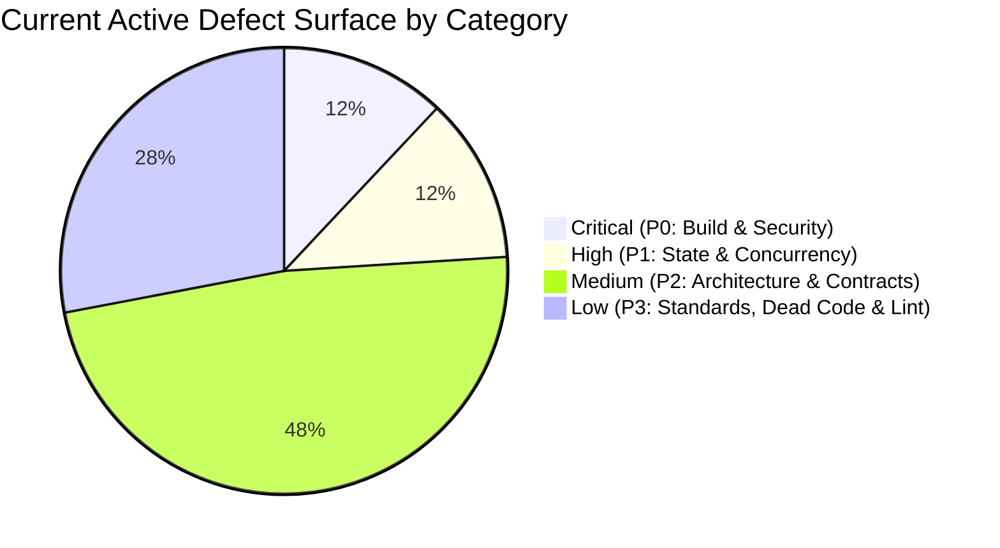
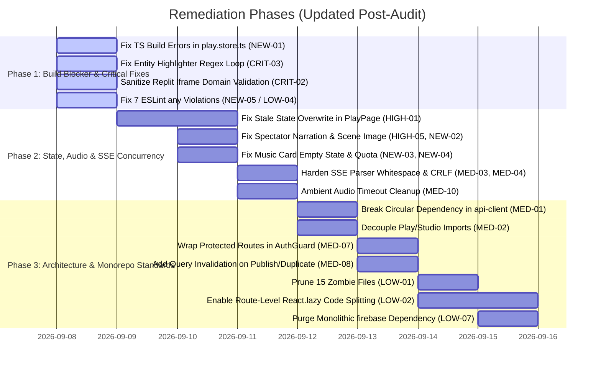

# Comprehensive Codebase Review & Re-Audit: `apps/frontend`

> **Service**: `apps/frontend` (React 18 / Vite 4 / TypeScript 5 Strict / Tailwind CSS / TanStack Query v5 / Zustand v4 / Pixi.js v8)  
> **Review Scope**: Full-Spectrum Re-Audit & Defect Verification (Security, Concurrency & SSE Streaming, State Management & Cache Sync, Logic & Edge Cases, Dead Code & Asset Hygiene, [CLAUDE.md](file:///home/aryan-sherigar/projects/AI-DND/CLAUDE.md) Architecture Compliance, Cross-Service Backend Contracts)  
> **Mode**: Read-Only Architecture & Code Quality Audit (Zero Application Source Code Modifications)  
> **Audit Status**: Re-Audited & Verified (September 2026)  

---

## Executive Summary & Re-Audit Status

A comprehensive re-audit of [`apps/frontend`](file:///home/aryan-sherigar/projects/AI-DND/apps/frontend) was conducted across all feature slices (`features/play`, `features/studio`, `features/auth`, `features/landing`, `features/profile`, `features/misc`), shared utilities (`src/shared`), application routing, audio/minigame pipelines, and test suites. Every finding from the initial audit report was re-verified against the active codebase, and newly introduced features (scene image generation streaming, studio Lyria music management, cover image generation/upload) were inspected for regressions and edge cases.

### Re-Audit Key Metrics & Current System Health
- **Automated Test Suite**: **55 test files passed (227 tests total in Vitest)** across unit tests and MSW-mocked integration tests (an increase from 50 test files / 197 tests).
- **TypeScript Strictness**: **FAILED (2 Type Errors)**. `tsc --noEmit` fails on `play.store.ts` lines 300 & 371 due to missing `action_mode` on `TurnStreamBody` parameter, currently breaking production build compilation (`npm run build`).
- **Linter Failures**: **7 ESLint errors** detected (down from 16 problems / 15 errors in initial audit), all targeting `@typescript-eslint/no-explicit-any` across `useAuth.ts`, `SetupPage.tsx`, `Step4Review.tsx`, and `PublishFlow.tsx`.
- **Dead Code & Zombie Files**: **15 completely empty (0-byte) abandoned files** remain in `src/` (4 cleared: `AppShell.tsx` and `ErrorBoundary.tsx` were populated; `LoadingSpinner.tsx` and `EmptyState.tsx` were removed).
- **Initial Audit Resolution Rate**: **6 Resolved (23%)**, **4 Partially Resolved (15%)**, **16 Still Active (62%)**.
- **New Issues Identified**: **5 New Findings** (1 Critical build-breaker, 1 High spectator stream defect, 3 Medium state/UI/lint issues).
- **Total Active Defect Surface**: **25 Active or Partially Active Issues**.

### Findings Summary Breakdown

| Severity Category | Initial Count | Resolved | Partially Resolved | Still Active | New Findings | Total Current Active |
|---|:---:|:---:|:---:|:---:|:---:|:---:|
| **Critical (P0)** | 4 | 2 | 1 | 1 | 1 | **3** |
| **High (P1)** | 5 | 3 | 1 | 1 | 1 | **3** |
| **Medium (P2)** | 10 | 1 | 0 | 9 | 3 | **12** |
| **Low / Standards (P3)** | 7 | 0 | 2 | 5 | 0 | **7** |
| **Total** | **26** | **6** | **4** | **16** | **5** | **25** |



---

## Severity 0: Critical Vulnerabilities & System Risks

### [CRIT-01] [RESOLVED] Stored & DOM XSS via Unsanitized `dangerouslySetInnerHTML` in `DistractionFreeEditor`
- **Severity**: Critical (P0)
- **Category**: Security Vulnerability
- **Location**: [`src/features/studio/components/MarkdownEditor/DistractionFreeEditor.tsx:1-3, 78-83`](file:///home/aryan-sherigar/projects/AI-DND/apps/frontend/src/features/studio/components/MarkdownEditor/DistractionFreeEditor.tsx#L1-L3)
- **Re-Audit Verification**: **RESOLVED**
- **Resolution Details**:
  `DistractionFreeEditor` has been completely refactored to replace naive regex HTML substitution and `dangerouslySetInnerHTML` with `ReactMarkdown` and `rehypeSanitize`. All user markdown input is parsed into React elements with HTML tags stripped/sanitized by default.

---

### [CRIT-02] [PARTIALLY RESOLVED / ACTIVE RISK] Arbitrary Iframe Execution via Insecure Sandbox Configuration in `ReplitEmbedMinigame`
- **Severity**: Critical (P0)
- **Category**: Security Vulnerability
- **Location**: [`src/features/play/components/MinigameOverlay/ReplitEmbed/ReplitEmbedMinigame.tsx:11, 73-80`](file:///home/aryan-sherigar/projects/AI-DND/apps/frontend/src/features/play/components/MinigameOverlay/ReplitEmbed/ReplitEmbedMinigame.tsx#L11)
- **Re-Audit Verification**: **PARTIALLY RESOLVED / ACTIVE RISK**
- **Current Code State**:
  - `allow-same-origin` was successfully removed from the iframe sandbox; `REPLIT_IFRAME_SANDBOX` now safely specifies `"allow-scripts allow-forms"`.
  - **Remaining Vulnerability**: Strict HTTPS domain validation matching authorized Replit domains (`*.replit.app`, `*.replit.dev`, `*.repl.co`) is **still not implemented**. An arbitrary creator-provided URL (e.g. `javascript:...` or an unvetted third-party origin) is passed directly to `src={replitEmbedUrl}` without validation.
- **Remediation Required**:
  Add an origin check in `ReplitEmbedMinigame.tsx` ensuring `new URL(replitEmbedUrl).hostname` ends with an allowed Replit domain before rendering the iframe.

---

### [CRIT-03] [ACTIVE] Browser Tab Freeze via Regex Infinite Loop in `renderHighlightedText`
- **Severity**: Critical (P0)
- **Category**: Logic Bug / Denial of Service
- **Location**: [`src/features/play/components/PlayScreen/EBook/EBookTurnEntry.tsx:43-56`](file:///home/aryan-sherigar/projects/AI-DND/apps/frontend/src/features/play/components/PlayScreen/EBook/EBookTurnEntry.tsx#L43-L56)
- **Re-Audit Verification**: **STILL ACTIVE**
- **Current Code State**:
  Lines 43-49 remain unchanged:
  ```typescript
  if (!entities.length) return [text];
  const sorted = [...entities].sort((a, b) => b.name.length - a.name.length);
  const regex = new RegExp(
    `\\b(${sorted.map((e) => escapeRegExp(e.name)).join("|")})\\b`,
    "gi",
  );
  ```
  If any entity has `name === ""` or whitespace-only (e.g., from an empty alias or malformed key fact), `regex.exec(text)` continually matches at index 0, `regex.lastIndex` never advances, and the `while` loop locks the browser tab indefinitely.
- **Remediation Required**:
  Pre-filter entities with `const validEntities = entities.filter(e => e.name && e.name.trim().length > 0);` before sorting and compiling the regex.

---

### [CRIT-04] [RESOLVED] Playthrough Ended Event Dropped & Turn State Desynchronization
- **Severity**: Critical (P0)
- **Category**: Concurrency & SSE Contract Mismatch
- **Location**: [`src/features/play/stores/play.store.ts:558-562, 636-669`](file:///home/aryan-sherigar/projects/AI-DND/apps/frontend/src/features/play/stores/play.store.ts#L558-L562)
- **Re-Audit Verification**: **RESOLVED**
- **Resolution Details**:
  1. Handled `playthrough_ended` SSE event in `play.store.ts` via `pending_playthrough_ended`.
  2. In `_commitStreamedTurn`, the buffered outcome tags (`ended_outcome_tag`, `ended_outcome_title`, `ended_outcome_text`) are promoted onto the committed `playthrough` object.
  3. `_commitStreamedTurn` now invalidates both `["playthrough-turns", playthrough.playthrough_id]` and `["playthrough", playthrough.playthrough_id]`.

---

## Severity 1: High Priority Deficiencies

### [HIGH-01] [ACTIVE] Stale Server State Overwriting Optimistic Turn Deltas
- **Severity**: High (P1)
- **Category**: State Management & Cache Synchronization
- **Location**: [`src/features/play/pages/PlayPage.tsx:47-67`](file:///home/aryan-sherigar/projects/AI-DND/apps/frontend/src/features/play/pages/PlayPage.tsx#L47-L67) and [`src/features/play/stores/play.store.ts:193-198`](file:///home/aryan-sherigar/projects/AI-DND/apps/frontend/src/features/play/stores/play.store.ts#L193-L198)
- **Re-Audit Verification**: **STILL ACTIVE**
- **Current Code State**:
  In `PlayPage.tsx`, the synchronization effect executes whenever either `serverPlaythrough` OR `turnsData` updates:
  ```typescript
  useEffect(() => {
    if (!serverPlaythrough) return;
    const playthroughData = mode === "master"
      ? buildMasterPlaythroughData(serverPlaythrough, turnsData, isSpectatorMode)
      : buildNewbiePlaythroughData(serverPlaythrough, turnsData, isSpectatorMode);
    setPlaythrough(playthroughData);
  }, [serverPlaythrough, turnsData, isSpectatorMode, setPlaythrough]);
  ```
  When `turnsData` finishes refetching after a turn stream commits, `serverPlaythrough` refetch may still be in-flight. `PlayPage` immediately executes `setPlaythrough` with the stale `serverPlaythrough` snapshot from the start of the turn, temporarily rolling back player health, inventory, and stats.
- **Remediation Required**:
  Ensure state delta reconciliation occurs atomically or guard `PlayPage` effect against overwriting store state with a stale server snapshot whose `turn_count` is less than the current committed local turn count.

---

### [HIGH-02] [RESOLVED] Broken Logout / Ghost Session Persistence via Uncleared Refresh Token Cookie
- **Severity**: High (P1)
- **Category**: Authentication & Session Security
- **Location**: [`src/features/auth/hooks/useAuth.ts:42-54`](file:///home/aryan-sherigar/projects/AI-DND/apps/frontend/src/features/auth/hooks/useAuth.ts#L42-L54) and [`src/features/auth/api/auth.api.ts:18-20`](file:///home/aryan-sherigar/projects/AI-DND/apps/frontend/src/features/auth/api/auth.api.ts#L18-L20)
- **Re-Audit Verification**: **RESOLVED**
- **Resolution Details**:
  1. `core-api` added `POST /v1/auth/logout` endpoint that sets `max_age=0` on the `refresh_token` cookie.
  2. `auth.api.ts` defines `logoutUser()`.
  3. `useAuth.ts` invokes `await logoutUser()` before clearing local store tokens and signing out of Firebase.

---

### [HIGH-03] [RESOLVED] Module-Scope Regex Action Skipping in Studio AI Assistant
- **Severity**: High (P1)
- **Category**: Logic Bug / Concurrency
- **Location**: [`src/features/studio/components/AIChatSidebar/parseActionBlocks.ts:42`](file:///home/aryan-sherigar/projects/AI-DND/apps/frontend/src/features/studio/components/AIChatSidebar/parseActionBlocks.ts#L42)
- **Re-Audit Verification**: **RESOLVED**
- **Resolution Details**:
  `parseMessageSegments` explicitly resets `ACTION_BLOCK_REGEX.lastIndex = 0;` at function entry, preventing cross-message offset carry-over.

---

### [HIGH-04] [RESOLVED] Unhandled SSE Stream Termination in `useSSE`
- **Severity**: High (P1)
- **Category**: Concurrency & Connection Lifecycle
- **Location**: [`src/shared/hooks/useSSE.ts:34`](file:///home/aryan-sherigar/projects/AI-DND/apps/frontend/src/shared/hooks/useSSE.ts#L34)
- **Re-Audit Verification**: **RESOLVED**
- **Resolution Details**:
  `useSSE.ts` now registers `onClose: () => setStatus("closed")` in `handlers`, correctly transitioning connection status when the server terminates an SSE stream cleanly.

---

### [HIGH-05] [PARTIALLY RESOLVED / ACTIVE] Vanishing Narration in Spectator Mode upon Turn Completion
- **Severity**: High (P1)
- **Category**: Logic Bug / UI State
- **Location**: [`src/features/play/hooks/useSpectator.ts:37-45`](file:///home/aryan-sherigar/projects/AI-DND/apps/frontend/src/features/play/hooks/useSpectator.ts#L37-L45)
- **Re-Audit Verification**: **PARTIALLY RESOLVED / ACTIVE**
- **Current Code State**:
  In `useSpectator.ts`:
  ```typescript
  } else if (eventName === "done") {
    setIsLive(false);
    if (playthroughId) {
      void queryClient.invalidateQueries({
        queryKey: ["playthrough-turns", playthroughId],
      });
    }
    setStreamingText("");
  }
  ```
  `queryClient.invalidateQueries` was introduced; however, `setStreamingText("")` is still invoked **immediately and synchronously** in the same tick. Because the query refetch takes 100-400ms over HTTP, the live narration vanishes from the spectator screen before the new turn appears in `turns`, causing an abrupt blank flash.
- **Remediation Required**:
  Retain `streamingText` until `playthrough-turns` refetch has resolved, or clear it only after the turns query cache is updated.

---

## Severity 2: Medium Priority Architectural & Operational Issues

### [MED-01] [ACTIVE] Cyclic Layer Dependency: `shared/lib/api-client.ts` ↔ `features/auth`
- **Severity**: Medium (P2)
- **Category**: Architecture Boundary Violation
- **Location**: [`src/shared/lib/api-client.ts:2-3`](file:///home/aryan-sherigar/projects/AI-DND/apps/frontend/src/shared/lib/api-client.ts#L2-L3) and [`src/features/auth/api/auth.api.ts:1`](file:///home/aryan-sherigar/projects/AI-DND/apps/frontend/src/features/auth/api/auth.api.ts#L1)
- **Re-Audit Verification**: **STILL ACTIVE**
- **Current Code State**:
  `api-client.ts` directly imports `useAuthStore` and `refreshAccessToken`, while `auth.api.ts` imports `apiClient`. Violates `CLAUDE.md:140` ("`shared/` contains no feature-specific logic").

---

### [MED-02] [ACTIVE] Cross-Feature Import Boundary Violations
- **Severity**: Medium (P2)
- **Category**: Architecture Boundary Violation
- **Location**: [`src/features/play/types/scenario.ts:1`](file:///home/aryan-sherigar/projects/AI-DND/apps/frontend/src/features/play/types/scenario.ts#L1)
- **Re-Audit Verification**: **STILL ACTIVE**
- **Current Code State**:
  `features/play` imports `SetupInputField` directly from `@/features/studio/stores/studio.store`. Violates `CLAUDE.md:139` ("features never import from sibling features").

---

### [MED-03] [ACTIVE] Premature Whitespace Trimming in SSE Stream Frame Parser
- **Severity**: Medium (P2)
- **Category**: Concurrency & SSE Formatting
- **Location**: [`src/shared/lib/sse-client.ts:245`](file:///home/aryan-sherigar/projects/AI-DND/apps/frontend/src/shared/lib/sse-client.ts#L245)
- **Re-Audit Verification**: **STILL ACTIVE**
- **Current Code State**:
  `else if (line.startsWith("data:")) dataLines.push(line.slice(5).trim());` remains active, stripping leading and trailing spaces from streamed narration tokens.

---

### [MED-04] [ACTIVE] CR-LF Chunk Boundary Splitting Bug in SSE Reader
- **Severity**: Medium (P2)
- **Category**: Concurrency & Network Edge Case
- **Location**: [`src/shared/lib/sse-client.ts:224`](file:///home/aryan-sherigar/projects/AI-DND/apps/frontend/src/shared/lib/sse-client.ts#L224)
- **Re-Audit Verification**: **STILL ACTIVE**
- **Current Code State**:
  `buffer += decoder.decode(value, { stream: true }).replace(/\r\n/g, "\n");` replaces CRLF only within the incoming slice; split `\r` and `\n` across chunk boundaries escape normalization.

---

### [MED-05] [ACTIVE] Unguarded `loginAsDevUser` Export in Production Bundle
- **Severity**: Medium (P2)
- **Category**: Security Vulnerability
- **Location**: [`src/features/auth/hooks/useAuth.ts:31-40`](file:///home/aryan-sherigar/projects/AI-DND/apps/frontend/src/features/auth/hooks/useAuth.ts#L31-L40)
- **Re-Audit Verification**: **STILL ACTIVE**
- **Current Code State**:
  `loginAsDevUser` is exported without guarding `if (!import.meta.env.DEV)`.

---

### [MED-06] [RESOLVED] Invariant / Condition Grammar Operator Precedence Mismatch
- **Severity**: Medium (P2)
- **Category**: Logic & Backend Contract Mismatch
- **Location**: [`src/features/studio/components/ConditionEditor/ExpressionBuilder/ExpressionBuilder.tsx:46, 99-113`](file:///home/aryan-sherigar/projects/AI-DND/apps/frontend/src/features/studio/components/ConditionEditor/ExpressionBuilder/ExpressionBuilder.tsx#L46)
- **Re-Audit Verification**: **RESOLVED**
- **Resolution Details**:
  `ExpressionBuilder` now evaluates `const activeConnective = CLAUSE_KINDS.find((kind) => Boolean(value?.[kind]));` and only displays clause addition buttons when `!activeConnective`. Creators cannot attach conflicting `AND`, `OR`, and `NOT` clauses to the same node level concurrently.

---

### [MED-07] [ACTIVE] Unprotected Studio & User Profile Routes in Router
- **Severity**: Medium (P2)
- **Category**: Authentication & Route Security
- **Location**: [`src/app/router.tsx:25-28, 37-38`](file:///home/aryan-sherigar/projects/AI-DND/apps/frontend/src/app/router.tsx#L25-L28)
- **Re-Audit Verification**: **STILL ACTIVE**
- **Current Code State**:
  Routes `/studio`, `/profile`, `/profile/:id`, `/studio/new`, and `/studio/:id/edit` are declared without `<AuthGuard>`.

---

### [MED-08] [ACTIVE] Missing Query Invalidation on Scenario Publish and Duplicate
- **Severity**: Medium (P2)
- **Category**: State Management & Cache Stagnation
- **Location**: [`src/features/studio/hooks/usePublish.ts`](file:///home/aryan-sherigar/projects/AI-DND/apps/frontend/src/features/studio/hooks/usePublish.ts) and [`src/features/studio/hooks/useDuplicateScenario.ts`](file:///home/aryan-sherigar/projects/AI-DND/apps/frontend/src/features/studio/hooks/useDuplicateScenario.ts)
- **Re-Audit Verification**: **STILL ACTIVE**
- **Current Code State**:
  Neither hook invalidates `["my-scenarios"]` or `["scenario", scenarioId]` upon successful mutation.

---

### [MED-09] [ACTIVE] Animation vs. API Race Condition in `SetupPage`
- **Severity**: Medium (P2)
- **Category**: Concurrency & Lifecycle
- **Location**: [`src/features/play/pages/SetupPage.tsx:40-77`](file:///home/aryan-sherigar/projects/AI-DND/apps/frontend/src/features/play/pages/SetupPage.tsx#L40-L77)
- **Re-Audit Verification**: **STILL ACTIVE**
- **Current Code State**:
  `DramaticSetupLoader` animation does not receive a cancellation trigger if `createPlaythroughMutation` fails.

---

### [MED-10] [ACTIVE] Ambient Audio State Transition Race Condition
- **Severity**: Medium (P2)
- **Category**: Concurrency & Resource Leaks
- **Location**: [`src/shared/lib/audio/ambient-soundtrack.ts:230-233`](file:///home/aryan-sherigar/projects/AI-DND/apps/frontend/src/shared/lib/audio/ambient-soundtrack.ts#L230-L233)
- **Re-Audit Verification**: **STILL ACTIVE**
- **Current Code State**:
  `fadeChannelOut` schedules an uncancelled `setTimeout` to pause the outgoing audio element. In rapid consecutive transitions, the paused channel may have already been recycled as incoming.

---

## Severity 3: Low Severity, Dead Code & Monorepo Standards

### [LOW-01] [PARTIALLY RESOLVED / ACTIVE] 15 Zero-Byte Abandoned Zombie Files in `src/`
- **Severity**: Low / Cleanliness (P3)
- **Category**: Dead Code
- **Location**:
  1. [`src/shared/hooks/usePagination.ts`](file:///home/aryan-sherigar/projects/AI-DND/apps/frontend/src/shared/hooks/usePagination.ts) (0 bytes)
  2. [`src/shared/hooks/useDebounce.ts`](file:///home/aryan-sherigar/projects/AI-DND/apps/frontend/src/shared/hooks/useDebounce.ts) (0 bytes)
  3. [`src/shared/constants/predicates.ts`](file:///home/aryan-sherigar/projects/AI-DND/apps/frontend/src/shared/constants/predicates.ts) (0 bytes)
  4. [`src/shared/types/api.types.ts`](file:///home/aryan-sherigar/projects/AI-DND/apps/frontend/src/shared/types/api.types.ts) (0 bytes)
  5. [`src/shared/types/common.types.ts`](file:///home/aryan-sherigar/projects/AI-DND/apps/frontend/src/shared/types/common.types.ts) (0 bytes)
  6. [`src/features/play/components/PlayScreen/TurnIndicator.tsx`](file:///home/aryan-sherigar/projects/AI-DND/apps/frontend/src/features/play/components/PlayScreen/TurnIndicator.tsx) (0 bytes)
  7. [`src/features/play/components/DiscoveryFeed/FeedSortBar.tsx`](file:///home/aryan-sherigar/projects/AI-DND/apps/frontend/src/features/play/components/DiscoveryFeed/FeedSortBar.tsx) (0 bytes)
  8. [`src/features/play/components/DiscoveryFeed/DiscoveryFeed.tsx`](file:///home/aryan-sherigar/projects/AI-DND/apps/frontend/src/features/play/components/DiscoveryFeed/DiscoveryFeed.tsx) (0 bytes)
  9. [`src/features/play/components/DiscoveryFeed/FeedFilters.tsx`](file:///home/aryan-sherigar/projects/AI-DND/apps/frontend/src/features/play/components/DiscoveryFeed/FeedFilters.tsx) (0 bytes)
  10. [`src/features/play/components/SetupScreen/SetupField.tsx`](file:///home/aryan-sherigar/projects/AI-DND/apps/frontend/src/features/play/components/SetupScreen/SetupField.tsx) (0 bytes)
  11. [`src/features/play/components/SetupScreen/SetupScreen.tsx`](file:///home/aryan-sherigar/projects/AI-DND/apps/frontend/src/features/play/components/SetupScreen/SetupScreen.tsx) (0 bytes)
  12. [`src/features/play/types/turn.types.ts`](file:///home/aryan-sherigar/projects/AI-DND/apps/frontend/src/features/play/types/turn.types.ts) (0 bytes)
  13. [`src/features/play/types/participant.types.ts`](file:///home/aryan-sherigar/projects/AI-DND/apps/frontend/src/features/play/types/participant.types.ts) (0 bytes)
  14. [`src/features/play/types/playthrough.types.ts`](file:///home/aryan-sherigar/projects/AI-DND/apps/frontend/src/features/play/types/playthrough.types.ts) (0 bytes)
  15. [`src/features/play/api/ratings.api.ts`](file:///home/aryan-sherigar/projects/AI-DND/apps/frontend/src/features/play/api/ratings.api.ts) (0 bytes)
- **Re-Audit Verification**: **PARTIALLY RESOLVED (15 REMAIN)**
- **Details**:
  4 files were resolved (`AppShell.tsx` and `ErrorBoundary.tsx` implemented; `LoadingSpinner.tsx` and `EmptyState.tsx` deleted). The 15 files listed above remain 0 bytes.

---

### [LOW-02] [ACTIVE] Monolithic Initial Bundle: Zero Lazy-Loaded Routes in `router.tsx`
- **Severity**: Low / Performance (P3)
- **Category**: [CLAUDE.md](file:///home/aryan-sherigar/projects/AI-DND/CLAUDE.md) Violation
- **Location**: [`src/app/router.tsx:1-18`](file:///home/aryan-sherigar/projects/AI-DND/apps/frontend/src/app/router.tsx#L1-L18)
- **Re-Audit Verification**: **STILL ACTIVE**
- **Current Code State**:
  All 17 pages are statically imported at the top of `router.tsx`.

---

### [LOW-03] [ACTIVE] Functions Exceeding the 30-Line Limit
- **Severity**: Low / Code Cleanliness (P3)
- **Category**: [CLAUDE.md](file:///home/aryan-sherigar/projects/AI-DND/CLAUDE.md) Violation
- **Location**: e.g., [`SetupStageCard.tsx`](file:///home/aryan-sherigar/projects/AI-DND/apps/frontend/src/features/play/components/SetupScreen/SetupStageCard.tsx) (442 lines), [`MoodSlotCard.tsx`](file:///home/aryan-sherigar/projects/AI-DND/apps/frontend/src/features/studio/components/MusicSlotEditor/MoodSlotCard.tsx) (224 lines).
- **Re-Audit Verification**: **STILL ACTIVE**

---

### [LOW-04] [PARTIALLY RESOLVED / ACTIVE] Explicit `any` Type Usages
- **Severity**: Low / Type Safety & Lint Gate (P3)
- **Category**: [CLAUDE.md](file:///home/aryan-sherigar/projects/AI-DND/CLAUDE.md) Violation
- **Location**:
  - `src/features/auth/hooks/useAuth.ts:26, 37`
  - `src/features/play/pages/SetupPage.tsx:48, 60`
  - `src/features/studio/components/NewbieWizard/Step4Review.tsx:81, 112`
  - `src/features/studio/components/PublishFlow/PublishFlow.tsx:53`
- **Re-Audit Verification**: **PARTIALLY RESOLVED (7 REMAIN)**
- **Details**:
  Reduced from 12 to 7 occurrences. The remaining 7 occurrences cause `npm run lint` to fail with exit code 1.

---

### [LOW-05] [ACTIVE] 15+ Nested Ternary Expressions
- **Severity**: Low / Maintainability (P3)
- **Category**: [CLAUDE.md](file:///home/aryan-sherigar/projects/AI-DND/CLAUDE.md) Violation
- **Location**: e.g., [`src/shared/components/feedback/Toast.tsx:31`](file:///home/aryan-sherigar/projects/AI-DND/apps/frontend/src/shared/components/feedback/Toast.tsx#L31)
- **Re-Audit Verification**: **STILL ACTIVE**

---

### [LOW-06] [ACTIVE] Incomplete PixiJS v8 Canvas Teardown (`removeView` Missing)
- **Severity**: Low / Resource Hygiene (P3)
- **Category**: Bug / Cleanup
- **Location**: [`src/features/play/components/MinigameOverlay/DodgeMinigame/useGameLoop.ts:358`](file:///home/aryan-sherigar/projects/AI-DND/apps/frontend/src/features/play/components/MinigameOverlay/DodgeMinigame/useGameLoop.ts#L358)
- **Re-Audit Verification**: **STILL ACTIVE**
- **Current Code State**:
  Still passes boolean options: `app.destroy(true, { children: true })`. In PixiJS v8, canvas removal requires `{ removeView: true }`.

---

### [LOW-07] [ACTIVE] Redundant Monolithic `firebase` Package Dependency
- **Severity**: Low / Dependency Hygiene (P3)
- **Category**: Tech Debt & Bundle Size
- **Location**: [`apps/frontend/package.json:26`](file:///home/aryan-sherigar/projects/AI-DND/apps/frontend/package.json#L26)
- **Re-Audit Verification**: **STILL ACTIVE**
- **Current Code State**:
  `"firebase": "^10.0.0"` remains in `dependencies`.

---

## Severity: New Findings (September 2026 Re-Audit)

### [NEW-01] Broken TypeScript Compilation (`tsc --noEmit`) in `play.store.ts` via Missing `action_mode`
- **Severity**: Critical (P0)
- **Category**: Type Safety / Build Pipeline Blocker
- **Location**: [`src/features/play/stores/play.store.ts:300-308, 370-377`](file:///home/aryan-sherigar/projects/AI-DND/apps/frontend/src/features/play/stores/play.store.ts#L300-L308)
- **Problem & Root Cause**:
  In `play.store.ts`, `TurnStreamBody` was modified to require `action_mode: ActionMode`:
  ```typescript
  interface TurnStreamBody {
    playthrough_id: string;
    participant_id: string;
    action_text: string;
    action_kind: "narrative" | "minigame_result";
    action_mode: ActionMode;
    minigame_result?: MinigameResultPayload;
  }
  ```
  However, `submitMinigameResult` (line 300) and `retryMinigameResult` (line 371) call `_startTurnStream(...)` without supplying `action_mode`:
  ```typescript
  get()._startTurnStream(
    {
      playthrough_id: playthrough.playthrough_id,
      participant_id: playthrough.participant_id,
      action_text: MINIGAME_RESULT_ACTION_TEXT,
      action_kind: "minigame_result",
      minigame_result: payload,
    },
    MINIGAME_RESULT_ACTION_TEXT,
  );
  ```
- **Impact**:
  Running `npx tsc --noEmit` fails with two `TS2345: Argument of type ... is not assignable to parameter of type 'TurnStreamBody'` compiler errors. This causes `npm run build` (`tsc && vite build`) to fail completely.
- **Remediation**:
  Make `action_mode` optional on `TurnStreamBody` (`action_mode?: ActionMode`) or provide a fallback (`action_mode: get().active_mode || "do"`) in both minigame submission calls.

---

### [NEW-02] Spectator Mode Drops Live `scene_image` SSE Broadcasts
- **Severity**: High (P1)
- **Category**: Concurrency & Feature Contract Mismatch
- **Location**: [`src/features/play/hooks/useSpectator.ts:26-48`](file:///home/aryan-sherigar/projects/AI-DND/apps/frontend/src/features/play/hooks/useSpectator.ts#L26-L48) and [`apps/turn-resolution-service/app/turn/pipeline.py:227-230`](file:///home/aryan-sherigar/projects/AI-DND/apps/turn-resolution-service/app/turn/pipeline.py#L227-L230)
- **Problem & Root Cause**:
  In TRS `pipeline.py`, when a player performs a `"see"` action generating a scene image, TRS broadcasts a `"scene_image"` SSE event to spectators:
  ```python
  if scene_image:
      if turn_request.action_mode == "see":
          await state_writer.broadcast_spectator_event(
              turn_request.playthrough_id, "scene_image", scene_image.image_url
          )
      yield response_streamer.scene_image_event(scene_image.image_url)
  ```
  In `useSpectator.ts`, the SSE `handleEvent` callback only handles `"mood"`, `"narration"`, and `"done"`. The event `"scene_image"` is completely ignored.
- **Impact**:
  Spectators watching a live playthrough never receive real-time generated scene images; images only appear if the spectator reloads the entire page after the turn commits.
- **Remediation**:
  Handle `"scene_image"` in `useSpectator.ts` by exposing a `streamingImageUrl` state and rendering it in `SpectatorView.tsx`.

---

### [NEW-03] `MoodSlotCard.tsx` Renders Blank Inaccessible State on Succeeded Music Job Missing `preview_url`
- **Severity**: Medium (P2)
- **Category**: Logic Bug / UI State
- **Location**: [`src/features/studio/components/MusicSlotEditor/MoodSlotCard.tsx:178`](file:///home/aryan-sherigar/projects/AI-DND/apps/frontend/src/features/studio/components/MusicSlotEditor/MoodSlotCard.tsx#L178)
- **Problem & Root Cause**:
  `MoodSlotCard.tsx` renders generation results conditionally:
  ```typescript
  {job.status === "succeeded" && job.preview_url && (
    <>
      <AudioPreviewPlayer src={job.preview_url} />
      <Button ... onClick={handleConfirm}>Confirm</Button>
      <Button ... onClick={handleDiscard}>Discard</Button>
    </>
  )}
  ```
  If `job.status === "succeeded"` but `job.preview_url` is undefined, null, or delayed, neither the success block, the pending block, nor the failed block renders.
- **Impact**:
  The generation card renders an empty white/blank block with no buttons. The creator cannot confirm, cannot discard, and cannot start a new generation because `pendingJobId` remains set.
- **Remediation**:
  Ensure the card provides a fallback error message or renders the `Discard` button even if `preview_url` is missing when `status === "succeeded"`.

---

### [NEW-04] Discarding Music Generation Job in `useScenarioMusic` Fails to Invalidate Quota
- **Severity**: Medium (P2)
- **Category**: State Management & Cache Stagnation
- **Location**: [`src/features/studio/hooks/useScenarioMusic.ts:65-68`](file:///home/aryan-sherigar/projects/AI-DND/apps/frontend/src/features/studio/hooks/useScenarioMusic.ts#L65-L68)
- **Problem & Root Cause**:
  In `useScenarioMusic.ts`:
  ```typescript
  const discardMutation = useMutation({
    mutationFn: (jobId: string) =>
      discardMusicGenerationJob(requireScenarioId(scenarioId), jobId),
  });
  ```
  Unlike `uploadMutation` and `setDefaultMutation`, `discardMutation` omits `onSuccess: invalidate`.
- **Impact**:
  When a creator discards a generation job, `scenario-music-quota` query is not refreshed. If the creator had reached their quota limit, the "Generation quota reached" banner remains visible until a hard browser refresh.
- **Remediation**:
  Add `onSuccess: invalidate` to `discardMutation`.

---

### [NEW-05] ESLint CI Gate Failure via Remaining Explicit `any` Annotations
- **Severity**: Medium (P2)
- **Category**: [CLAUDE.md](file:///home/aryan-sherigar/projects/AI-DND/CLAUDE.md) Violation / CI Gate
- **Location**:
  - `src/features/auth/hooks/useAuth.ts:26, 37`
  - `src/features/play/pages/SetupPage.tsx:48, 60`
  - `src/features/studio/components/NewbieWizard/Step4Review.tsx:81, 112`
  - `src/features/studio/components/PublishFlow/PublishFlow.tsx:53`
- **Problem & Root Cause**:
  Seven explicit `any` types remain in catch blocks (`catch (err: any)`) and type assertions (`(scenario as any).id`).
- **Impact**:
  Running `npm run lint` fails with 7 errors (`@typescript-eslint/no-explicit-any`), violating `CLAUDE.md:64` ("zero warnings").
- **Remediation**:
  Replace `catch (err: any)` with `catch (err: unknown)` utilizing `extractErrorMessage(err)` and narrow `scenario` with typed discrimination.

---

## Actionable Remediation Roadmap



### Phase 1: Build Blocker & Immediate Safeguards (P0)
1. **Unblock TypeScript Build (NEW-01)**: Pass `action_mode: get().active_mode || "do"` in `submitMinigameResult` and `retryMinigameResult` within `play.store.ts`, restoring clean `tsc --noEmit` and `npm run build`.
2. **Fix Regex Infinite Loop (CRIT-03)**: Ensure `entities.filter(e => e.name?.trim())` guarantees no empty strings are joined into the word-boundary regex in `EBookTurnEntry.tsx`.
3. **Harden Replit Embed (CRIT-02)**: Validate target hostnames against `*.replit.dev`, `*.replit.app`, and `*.repl.co`.
4. **Pass ESLint CI Gate (NEW-05 / LOW-04)**: Replace the 7 remaining `catch (err: any)` and `as any` instances with `unknown` and proper typing.

### Phase 2: State Synchronization & Media Concurrency (P1 & P2)
1. **Prevent Stale Overwrites in `PlayPage` (HIGH-01)**: Synchronize `serverPlaythrough` refetches with `turnsData` updates to eliminate stale inventory/health overwriting.
2. **Preserve Spectator Narration & Scene Depictions (HIGH-05 & NEW-02)**: Retain streaming narration until refetch resolves and add support for the TRS `scene_image` broadcast.
3. **Harden Music Studio Studio Flow (NEW-03 & NEW-04)**: Guard against missing `preview_url` in `MoodSlotCard.tsx` and invalidate quota on job discard in `useScenarioMusic.ts`.
4. **SSE Normalization & Audio Cleanups (MED-03, MED-04, MED-10)**: Strip only single leading space after `data:`, normalize CRLF on accumulated buffer, and cancel audio fade timeouts.

### Phase 3: Architectural Cleanup & Rule Enforcement (P2 & P3)
1. **Decouple `shared/lib/api-client.ts` (MED-01)**: Invert dependency injection for auth token retrieval.
2. **Feature Isolation (MED-02)**: Move `SetupInputField` and scenario metadata types into `shared/types/scenario.types.ts`.
3. **Route Security (MED-07)**: Wrap protected studio/profile routes in `<AuthGuard>`.
4. **Cache Freshness (MED-08)**: Invalidate `["my-scenarios"]` on publish and duplicate.
5. **Prune 15 Zombie Files (LOW-01)**: Delete all 0-byte abandoned files from `src/`.
6. **Code Splitting & Bundle Hygiene (LOW-02 & LOW-07)**: Implement `React.lazy` across `router.tsx` and remove redundant `"firebase"` dependency.
