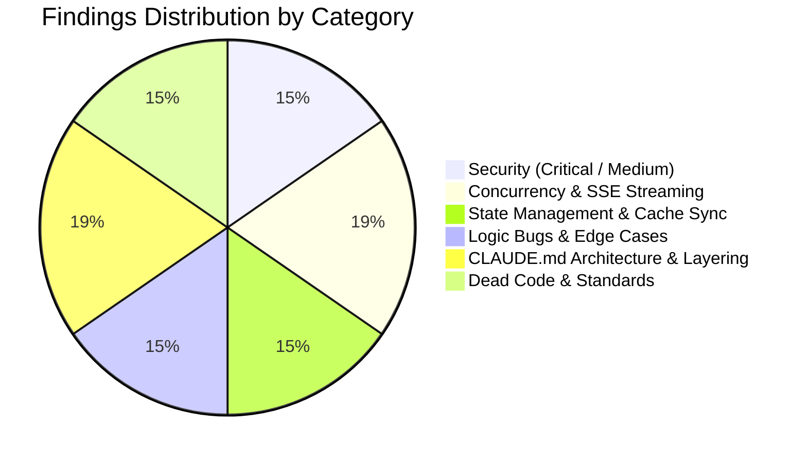
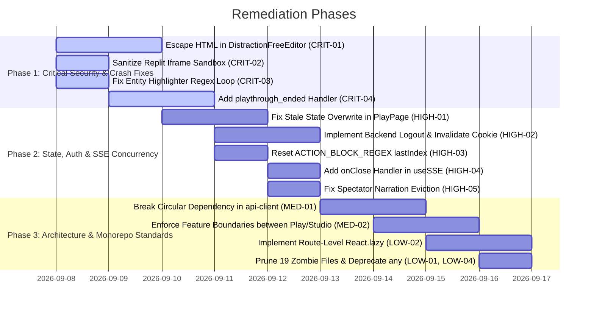

# Comprehensive Codebase Review: `apps/frontend`

> **Service**: `apps/frontend` (React 18 / Vite 4 / TypeScript 5 Strict / Tailwind CSS / TanStack Query v5 / Zustand v4 / Pixi.js v8)  
> **Review Scope**: Full-Spectrum Audit (Security, Concurrency & SSE Race Conditions, State Management & Cache Sync, Logic & Edge Cases, Dead Code & Asset Hygiene, [CLAUDE.md](file:///home/aryan-sherigar/projects/AI-DND/CLAUDE.md) Architecture Compliance, Cross-Service Backend Contracts)  
> **Mode**: Read-Only Architecture & Code Quality Audit (Zero Application Source Code Modifications)  
> **Date**: September 2026  

---

## Executive Summary

An exhaustive review of the [`apps/frontend`](file:///home/aryan-sherigar/projects/AI-DND/apps/frontend) client application was conducted across all feature slices (`features/play`, `features/studio`, `features/auth`, `features/landing`, `features/profile`), shared utilities (`src/shared`), application routing, and test suites. The frontend was also cross-verified against backend endpoint schemas and SSE streaming contracts in [`apps/core-api`](file:///home/aryan-sherigar/projects/AI-DND/apps/core-api) and [`apps/turn-resolution-service`](file:///home/aryan-sherigar/projects/AI-DND/apps/turn-resolution-service).

### Key Metrics & Audit Outcomes
- **Automated Test Suite**: 50 test files passed (197 tests total in Vitest) across units and MSW-mocked integration tests.
- **TypeScript Strictness**: `tsc --noEmit` compiles cleanly with 0 type errors.
- **Linter Failures**: 16 ESLint problems detected (15 errors, 1 warning) targeting explicit `any` usages and missing React hook dependencies.
- **Dead Code & Zombie Files**: **19 completely empty (0-byte) abandoned files** exist in `src/`, including empty components (`LoadingSpinner.tsx`, `ErrorBoundary.tsx`, `DiscoveryFeed.tsx`) and empty hooks (`usePagination.ts`, `useDebounce.ts`).
- **CLAUDE.md Compliance**: 50 functions exceed the 30-line threshold; 15+ nested ternaries detected; 12 explicit `any` annotations found; 0 routes utilize lazy-loading or `<Suspense>`; circular dependency between `shared/lib/api-client.ts` and `features/auth/api/auth.api.ts`; feature isolation violated by `features/play` importing `features/studio`.

### Findings Breakdown by Severity

| Severity | Count | Primary Impact Areas |
|---|:---:|---|
| **Critical (P0)** | 4 | Stored/DOM XSS via `dangerouslySetInnerHTML`, Insecure Iframe Sandbox Escape in Replit Minigames, Unbounded Regex Infinite Loop in Entity Highlighter, Dropped `playthrough_ended` SSE Event & State Desync |
| **High (P1)** | 5 | Stale Server State Overwriting Optimistic Turn Deltas, Broken Logout / Ghost Session Persistence via Uncleared Refresh Cookie, Module-Scope Regex Action Skipping in Studio AI, Unhandled SSE Termination in `useSSE`, Vanishing Spectator Narration on Turn Completion |
| **Medium (P2)** | 10 | Circular Layer Dependency (`shared` ↔ `features/auth`), Feature Boundary Violation (`play` importing `studio`), Aggressive SSE Token Whitespace Trimming, SSE CRLF Chunk Splitting Delimiter Bug, Unguarded `loginAsDevUser` Export, Invariant/Condition Grammar Operator Precedence Mismatch, Completely Unprotected Studio/Profile Routes, Missing Query Invalidation on Publish/Duplicate, Animation vs. API Race Condition in `SetupPage`, Ambient Audio State Transition Race Condition |
| **Low / Standards (P3)** | 7 | 19 0-Byte Zombie Files, Monolithic Initial Bundle (Zero `React.lazy` routes), 50 Functions > 30 Lines, 12 Explicit `any` Annotations, 15+ Nested Ternaries, Missing PixiJS v8 Canvas Teardown (`removeView`), Redundant Monolithic `firebase` Dependency |
| **Total Findings** | **26** | |



---

## Severity 0: Critical Vulnerabilities & System Risks

### [CRIT-01] Stored & DOM XSS via Unsanitized `dangerouslySetInnerHTML` in `DistractionFreeEditor`
- **Severity**: Critical (P0)
- **Category**: Security Vulnerability
- **Location**: [`src/features/studio/components/MarkdownEditor/DistractionFreeEditor.tsx:10-64`](file:///home/aryan-sherigar/projects/AI-DND/apps/frontend/src/features/studio/components/MarkdownEditor/DistractionFreeEditor.tsx#L10-L64)
- **Problem & Root Cause**:
  `DistractionFreeEditor` provides Markdown authoring and preview for scenario lore, opening prompts, main conflicts, and narrator instructions across the entire Studio workflow ([`Step2Lore.tsx`](file:///home/aryan-sherigar/projects/AI-DND/apps/frontend/src/features/studio/components/NewbieWizard/Step2Lore.tsx), [`Step3Narrator.tsx`](file:///home/aryan-sherigar/projects/AI-DND/apps/frontend/src/features/studio/components/NewbieWizard/Step3Narrator.tsx), [`OpeningSceneEditor.tsx`](file:///home/aryan-sherigar/projects/AI-DND/apps/frontend/src/features/studio/components/OpeningSceneEditor/OpeningSceneEditor.tsx), [`RulesEditor.tsx`](file:///home/aryan-sherigar/projects/AI-DND/apps/frontend/src/features/studio/components/RulesEditor/RulesEditor.tsx)).
  Its internal `renderMarkdown` function performs naive regex replacements for bold and italics (`**text**` and `*text*`) and immediately passes the output into `dangerouslySetInnerHTML`:
  ```typescript
  return (
    <p
      key={index}
      className="text-zinc-300 leading-relaxed mb-1"
      dangerouslySetInnerHTML={{ __html: parsedLine }}
    />
  );
  ```
  The function performs **zero HTML escaping or sanitization** (e.g. via DOMPurify).
- **Failure Scenario / Impact**:
  Any scenario authoring field can contain arbitrary HTML/XSS payloads such as `` or malicious `<script>` tags. When a scenario is previewed, edited, or duplicated by another user or creator, the malicious JavaScript executes within the victim's session context, compromising Firebase access tokens, user profile data, and session integrity.
- **Remediation**:
  Escape raw HTML entities before transforming markdown syntax, or use a secure markdown renderer (such as `react-markdown` with `rehype-sanitize`) without `dangerouslySetInnerHTML`.
  ```typescript
  // Remediation in DistractionFreeEditor.tsx
  function escapeHtml(str: string): string {
    return str
      .replace(/&/g, "&amp;")
      .replace(/</g, "&lt;")
      .replace(/>/g, "&gt;")
      .replace(/"/g, "&quot;")
      .replace(/'/g, "&#039;");
  }

  const renderMarkdown = (text: string) => {
    if (!text) return null;
    const lines = text.split("\n");
    return lines.map((line, index) => {
      const safeLine = escapeHtml(line)
        .replace(/\*\*(.*?)\*\*/g, "<strong>$1</strong>")
        .replace(/\*(.*?)\*/g, "<em>$1</em>");
      // Now safe to inject or render via React fragments
      ...
    });
  };
  ```

---

### [CRIT-02] Arbitrary Iframe Execution via Insecure Sandbox Configuration in `ReplitEmbedMinigame`
- **Severity**: Critical (P0)
- **Category**: Security Vulnerability
- **Location**: [`src/features/play/components/MinigameOverlay/ReplitEmbed/ReplitEmbedMinigame.tsx:6, 68`](file:///home/aryan-sherigar/projects/AI-DND/apps/frontend/src/features/play/components/MinigameOverlay/ReplitEmbed/ReplitEmbedMinigame.tsx#L6)
- **Problem & Root Cause**:
  `ReplitEmbedMinigame` embeds creator-supplied Replit minigame URLs into an `<iframe>`:
  ```typescript
  const REPLIT_IFRAME_SANDBOX = "allow-scripts allow-same-origin allow-forms";
  ...
  <iframe
    key={attempt}
    ref={iframeRef}
    src={replitEmbedUrl}
    sandbox={REPLIT_IFRAME_SANDBOX}
    className="w-full h-full border-0"
    title="Minigame challenge"
  />
  ```
  Per W3C HTML5 specifications and MDN security guidelines, **pairing `allow-scripts` with `allow-same-origin` allows the embedded document to remove its own `sandbox` attribute and escape the sandbox entirely**. Furthermore, the frontend performs no domain validation verifying that `replitEmbedUrl` actually points to an authorized Replit subdomain (`*.replit.dev`, `*.replit.app`, `*.repl.co`).
- **Failure Scenario / Impact**:
  If a creator points `replit_embed_url` to a malicious site or an endpoint sharing the frontend origin (or a proxy route), the framed code can execute unsandboxed scripts with full access to `window.parent.localStorage`, hijack the user's session tokens, or spoof game resolution postMessages.
- **Remediation**:
  1. Remove `allow-same-origin` from the sandbox attribute (`allow-scripts allow-forms` is sufficient for game interaction while isolating origin storage).
  2. Enforce strict HTTPS URL validation matching allowed Replit domains before rendering the iframe.
  ```typescript
  // Remediation in ReplitEmbedMinigame.tsx
  const REPLIT_IFRAME_SANDBOX = "allow-scripts allow-forms";
  const ALLOWED_REPLIT_DOMAINS = [".replit.app", ".replit.dev", ".repl.co"];

  function isAuthorizedReplitUrl(url: string): boolean {
    try {
      const parsed = new URL(url);
      return parsed.protocol === "https:" && 
        ALLOWED_REPLIT_DOMAINS.some(d => parsed.hostname.endsWith(d));
    } catch {
      return false;
    }
  }
  ```

---

### [CRIT-03] Browser Tab Freeze via Regex Infinite Loop in `renderHighlightedText`
- **Severity**: Critical (P0)
- **Category**: Logic Bug / Denial of Service
- **Location**: [`src/features/play/components/PlayScreen/EBook/EBookTurnEntry.tsx:45-56`](file:///home/aryan-sherigar/projects/AI-DND/apps/frontend/src/features/play/components/PlayScreen/EBook/EBookTurnEntry.tsx#L45-L56) and [`src/features/play/components/PlayScreen/EBook/useEntityHighlighter.ts:18-20, 46-49`](file:///home/aryan-sherigar/projects/AI-DND/apps/frontend/src/features/play/components/PlayScreen/EBook/useEntityHighlighter.ts#L18-L20)
- **Problem & Root Cause**:
  `EBookTurnEntry` dynamically builds a regular expression to highlight known entities in narrative paragraphs:
  ```typescript
  const sorted = [...entities].sort((a, b) => b.name.length - a.name.length);
  const regex = new RegExp(
    `\\b(${sorted.map((e) => escapeRegExp(e.name)).join("|")})\\b`,
    "gi",
  );
  while ((match = regex.exec(text)) !== null) {
    ...
    lastIndex = regex.lastIndex;
  }
  ```
  In `useEntityHighlighter.ts`, entities are built from `storyCards`, `keyFacts`, and `masterEntities`. If an entity has an empty alias `""`, a blank story card name, or a fact starting with `:`, `e.name` resolves to `""`.
  When `escapeRegExp("")` is joined by `|`, the regex contains `\\b(|...)\\b`. An empty string match matches at index 0 without consuming any characters.
- **Failure Scenario / Impact**:
  Because `regex.exec(text)` continually matches an empty string at index 0, `regex.lastIndex` never advances. The `while` loop runs infinitely, locking the JavaScript main thread and permanently freezing the player's browser tab upon opening any chapter with an unnamed entity.
- **Remediation**:
  Filter out entities with empty or whitespace-only names before sorting and constructing the regular expression. If no valid entities remain, return the raw text immediately.
  ```typescript
  // Remediation in EBookTurnEntry.tsx
  const validEntities = entities.filter((e) => e.name && e.name.trim().length > 0);
  if (!validEntities.length) return [text];

  const sorted = [...validEntities].sort((a, b) => b.name.length - a.name.length);
  const pattern = sorted.map((e) => escapeRegExp(e.name.trim())).join("|");
  const regex = new RegExp(`\\b(${pattern})\\b`, "gi");
  ```

---

### [CRIT-04] Playthrough Ended Event Dropped & Turn State Desynchronization
- **Severity**: Critical (P0)
- **Category**: Concurrency & SSE Contract Mismatch
- **Location**: [`src/features/play/stores/play.store.ts:299-325, 397-399`](file:///home/aryan-sherigar/projects/AI-DND/apps/frontend/src/features/play/stores/play.store.ts#L299-L325) and [`apps/turn-resolution-service/app/turn/pipeline.py:235`](file:///home/aryan-sherigar/projects/AI-DND/apps/turn-resolution-service/app/turn/pipeline.py#L235)
- **Problem & Root Cause**:
  In `turn-resolution-service`, when an end condition evaluates to true (victory or defeat), `pipeline.py` emits a `playthrough_ended` SSE event carrying the outcome:
  ```python
  yield response_streamer.playthrough_ended_event(outcome_tag, outcome_title, outcome_text)
  ```
  In [`play.store.ts`](file:///home/aryan-sherigar/projects/AI-DND/apps/frontend/src/features/play/stores/play.store.ts), the SSE event handler explicitly switches on `mood`, `narration`, `turn_summary`, `minigame`, `done`, and `degraded`.
  **The event `playthrough_ended` is completely omitted from the switch statement.**
  Furthermore, when `done` arrives, `_commitStreamedTurn` only invalidates:
  ```typescript
  void queryClient.invalidateQueries({
    queryKey: ["playthrough-turns", playthrough.playthrough_id],
  });
  ```
  It **never invalidates** `["playthrough", playthrough.playthrough_id]`.
- **Failure Scenario / Impact**:
  When a player reaches the climax of a campaign and wins or dies, the `playthrough_ended` payload is silently ignored. Because `["playthrough", id]` is not invalidated, the local playthrough state remains in `status: "in_progress"`. The victory/game-over screen never appears, and the player can continue typing and submitting invalid turns against an already-terminated game session.
- **Remediation**:
  1. Add a `pending_playthrough_ended` field to `PlayStoreState` and handle `playthrough_ended` in the SSE handler.
  2. On `_commitStreamedTurn`, commit the ending outcome and invalidate both `["playthrough-turns", id]` AND `["playthrough", id]`.
  ```typescript
  // Remediation in play.store.ts
  } else if (eventName === "playthrough_ended") {
    const payload = JSON.parse(data);
    set({ pending_game_over: payload });
  }
  ...
  // In _commitStreamedTurn:
  void queryClient.invalidateQueries({
    queryKey: ["playthrough", playthrough.playthrough_id],
  });
  void queryClient.invalidateQueries({
    queryKey: ["playthrough-turns", playthrough.playthrough_id],
  });
  ```

---

## Severity 1: High Priority Deficiencies

### [HIGH-01] Stale Server State Overwriting Optimistic Turn Deltas
- **Severity**: High (P1)
- **Category**: State Management & Cache Synchronization
- **Location**: [`src/features/play/pages/PlayPage.tsx:47-67`](file:///home/aryan-sherigar/projects/AI-DND/apps/frontend/src/features/play/pages/PlayPage.tsx#L47-L67) and [`src/features/play/stores/play.store.ts:139-155`](file:///home/aryan-sherigar/projects/AI-DND/apps/frontend/src/features/play/stores/play.store.ts#L139-L155)
- **Problem & Root Cause**:
  `PlayPage` establishes an effect that calls `setPlaythrough(playthroughData)` whenever `serverPlaythrough` or `turnsData` changes.
  When a turn finishes streaming, `play.store.ts` locally appends the turn and updates state in `_commitStreamedTurn`, then invalidates `["playthrough-turns", id]`.
  When `usePlaythroughTurns` refetches, `turnsData` updates. This triggers `PlayPage`'s effect:
  ```typescript
  useEffect(() => {
    if (!serverPlaythrough) return;
    const playthroughData = mode === "master"
      ? buildMasterPlaythroughData(serverPlaythrough, turnsData, isSpectatorMode)
      : buildNewbiePlaythroughData(serverPlaythrough, turnsData, isSpectatorMode);
    setPlaythrough(playthroughData);
  }, [serverPlaythrough, turnsData, isSpectatorMode, setPlaythrough]);
  ```
  Because `serverPlaythrough` was never re-fetched, `buildMasterPlaythroughData` receives the **stale `serverPlaythrough` snapshot from turn 0**.
- **Failure Scenario / Impact**:
  `setPlaythrough` completely overwrites the store's `playthrough` object with the stale server snapshot, reverting player health, inventory changes, and active conditions back to their pre-turn values.
- **Remediation**:
  Invalidate `["playthrough", id]` alongside turns, and merge turn state updates atomically rather than doing a destructive wholesale overwrite of the local store.

---

### [HIGH-02] Broken Logout / Ghost Session Persistence via Uncleared Refresh Token Cookie
- **Severity**: High (P1)
- **Category**: Authentication & Session Security
- **Location**: [`src/features/auth/hooks/useAuth.ts:42-47`](file:///home/aryan-sherigar/projects/AI-DND/apps/frontend/src/features/auth/hooks/useAuth.ts#L42-L47) and [`src/features/auth/providers/AuthProvider.tsx:12-25`](file:///home/aryan-sherigar/projects/AI-DND/apps/frontend/src/features/auth/providers/AuthProvider.tsx#L12-L25)
- **Problem & Root Cause**:
  Core API stores session refresh tokens in an `HttpOnly` cookie (`path=/v1/auth/refresh`).
  When a user logs out in `useAuth.ts`:
  ```typescript
  const logout = async () => {
    if (auth.currentUser) {
      await auth.signOut();
    }
    storeLogout();
  };
  ```
  `storeLogout()` merely clears the Zustand in-memory state. Because `refresh_token` is `HttpOnly`, client-side JS cannot delete it. The frontend never issues a POST request to invalidate or expire the cookie.
  When the user reloads the page or opens a new tab, `AuthProvider.tsx` mounts:
  ```typescript
  useEffect(() => {
    const initAuth = async () => {
      try {
        const { access_token, user } = await refreshAccessToken();
        setAuth(access_token, user);
      } ...
    };
    initAuth();
  }, ...);
  ```
  The browser automatically includes the uncleared `refresh_token` cookie, which the backend accepts, issuing a new access token and logging the user back in.
- **Failure Scenario / Impact**:
  Users on shared or public computers who click "Log Out" are never actually logged out; anyone reopening the browser tab is immediately authenticated into their account.
- **Remediation**:
  Add an explicit `/v1/auth/logout` endpoint in Core API that sets `max_age=0` on `refresh_token`, and call this endpoint from `useAuth.logout` before clearing local state.

---

### [HIGH-03] Module-Scope Regex Action Skipping in Studio AI Assistant
- **Severity**: High (P1)
- **Category**: Logic Bug / Concurrency
- **Location**: [`src/features/studio/components/AIChatSidebar/parseActionBlocks.ts:15-16, 36-60`](file:///home/aryan-sherigar/projects/AI-DND/apps/frontend/src/features/studio/components/AIChatSidebar/parseActionBlocks.ts#L15-L16)
- **Problem & Root Cause**:
  `ACTION_BLOCK_REGEX` is declared at module scope with the `/g` flag:
  ```typescript
  const ACTION_BLOCK_REGEX =
    /```action:([a-z_]+)(?:[ \t]+(\{[^}\n]*\}))?\s*\n([\s\S]*?)```/gi;
  ```
  In JavaScript, `RegExp.prototype.exec` maintains stateful `lastIndex` on `/g` regex instances across consecutive invocations. When `parseMessageSegments(content)` is invoked across multiple chat messages or during streaming token updates, `ACTION_BLOCK_REGEX.lastIndex` is not reset to 0.
- **Failure Scenario / Impact**:
  Action blocks at the beginning of subsequent messages are completely skipped because `exec` searches from the offset where the prior message finished. Creators miss critical AI action proposals (cards, prompts, rules) in the Studio sidebar.
- **Remediation**:
  Reset `ACTION_BLOCK_REGEX.lastIndex = 0;` at the entry of `parseMessageSegments`, or instantiate the regex locally inside the function.
  ```typescript
  export const parseMessageSegments = (content: string): MessageSegment[] => {
    ACTION_BLOCK_REGEX.lastIndex = 0;
    const segments: MessageSegment[] = [];
    ...
  ```

---

### [HIGH-04] Unhandled SSE Stream Termination in `useSSE` (Silent Connection Hang)
- **Severity**: High (P1)
- **Category**: Concurrency & Connection Lifecycle
- **Location**: [`src/shared/hooks/useSSE.ts:30-34`](file:///home/aryan-sherigar/projects/AI-DND/apps/frontend/src/shared/hooks/useSSE.ts#L30-L34) and [`src/shared/lib/sse-client.ts:18-25, 126`](file:///home/aryan-sherigar/projects/AI-DND/apps/frontend/src/shared/lib/sse-client.ts#L18-L25)
- **Problem & Root Cause**:
  `sse-client.ts` specifically invokes `handlers.onClose?.()` when the HTTP stream ends normally without throwing a fetch error.
  However, `useSSE.ts` only registers `onEvent`, `onOpen`, and `onError`:
  ```typescript
  const handlers: SSEHandlers = {
    onEvent: (name, data) => onEventRef.current(name, data),
    onOpen: () => setStatus("open"),
    onError: () => setStatus("closed"),
  };
  ```
  It completely omits `onClose`.
- **Failure Scenario / Impact**:
  If the server closes the SSE connection gracefully or an intermediary terminates the stream, `useSSE` status remains `"open"` forever. Consumers like `useNotifications` and `useSpectator` never detect the drop, and the UI never attempts reconnection or displays a disconnected indicator.
- **Remediation**:
  Implement `onClose: () => setStatus("closed")` in `useSSE.ts`.

---

### [HIGH-05] Vanishing Narration in Spectator Mode upon Turn Completion
- **Severity**: High (P1)
- **Category**: Logic Bug / UI State
- **Location**: [`src/features/play/hooks/useSpectator.ts:28-31`](file:///home/aryan-sherigar/projects/AI-DND/apps/frontend/src/features/play/hooks/useSpectator.ts#L28-L31)
- **Problem & Root Cause**:
  In `useSpectator`:
  ```typescript
  } else if (eventName === "done") {
    setIsLive(false);
    setStreamingText("");
  }
  ```
  When `"done"` arrives, `streamingText` is immediately wiped to `""`. However, `useSpectator` does not trigger query invalidation on `["playthrough-turns", playthroughId]`.
- **Failure Scenario / Impact**:
  The live narration chunk that the spectator was reading abruptly vanishes from the screen, and because the turn history query has not refetched, the committed turn does not appear in the log. The spectator sees an empty screen until manually refreshing the browser.
- **Remediation**:
  Invalidate `["playthrough-turns", playthroughId]` before or immediately upon receiving `"done"`, or delay clearing `streamingText` until the updated turn history query has resolved.

---

## Severity 2: Medium Priority Architectural & Operational Issues

### [MED-01] Cyclic Layer Dependency: `shared/lib/api-client.ts` ↔ `features/auth`
- **Severity**: Medium (P2)
- **Category**: Architecture Boundary Violation
- **Location**: [`src/shared/lib/api-client.ts:2-3`](file:///home/aryan-sherigar/projects/AI-DND/apps/frontend/src/shared/lib/api-client.ts#L2-L3) and [`src/features/auth/api/auth.api.ts:1`](file:///home/aryan-sherigar/projects/AI-DND/apps/frontend/src/features/auth/api/auth.api.ts#L1)
- **Problem & Root Cause**:
  `CLAUDE.md:140` dictates: *"`shared/` contains no feature-specific logic."*
  `shared/lib/api-client.ts` directly imports `useAuthStore` from `@/features/auth/stores/auth.store` and `refreshAccessToken` from `@/features/auth/api/auth.api`. Simultaneously, `auth.api.ts` imports `apiClient` from `@/shared/lib/api-client`.
  This creates a tight circular dependency between `shared` and `features/auth`.
- **Remediation**:
  Invert dependency injection: allow `apiClient` to accept token-getter and refresh callbacks registered at application initialization (e.g. in `main.tsx` or `AuthProvider.tsx`), keeping `shared/lib/api-client.ts` completely agnostic of `features/auth`.

---

### [MED-02] Cross-Feature Import Boundary Violations (`features/play` importing `features/studio`)
- **Severity**: Medium (P2)
- **Category**: Architecture Boundary Violation
- **Location**: [`src/features/play/types/scenario.ts:1`](file:///home/aryan-sherigar/projects/AI-DND/apps/frontend/src/features/play/types/scenario.ts#L1) and [`src/features/play/components/ScenarioFocus/ScenarioSetupPreview.tsx:2`](file:///home/aryan-sherigar/projects/AI-DND/apps/frontend/src/features/play/components/ScenarioFocus/ScenarioSetupPreview.tsx#L2)
- **Problem & Root Cause**:
  `CLAUDE.md:139` states: *"`features/` never import from each other. `studio/` never imports from `play/` and vice versa. Cross-feature shared code goes into `shared/` first."*
  `features/play` directly imports `SetupInputField` from `@/features/studio/stores/studio.store`. Furthermore, `features/profile` imports components, API methods, and types from `@/features/play` and `@/features/auth`.
- **Remediation**:
  Extract `SetupInputField`, `Scenario`, and common genre/scenario types into `src/shared/types/scenario.types.ts` and update imports.

---

### [MED-03] Premature Whitespace Trimming in SSE Stream Frame Parser
- **Severity**: Medium (P2)
- **Category**: Concurrency & SSE Formatting
- **Location**: [`src/shared/lib/sse-client.ts:166`](file:///home/aryan-sherigar/projects/AI-DND/apps/frontend/src/shared/lib/sse-client.ts#L166)
- **Problem & Root Cause**:
  In `parseSSEFrame`:
  ```typescript
  else if (line.startsWith("data:")) dataLines.push(line.slice(5).trim());
  ```
  Per the W3C SSE standard, only a single leading space after `data:` is stripped (`data: hello` → `"hello"`). Calling `.trim()` strips all leading and trailing whitespace.
- **Failure Scenario / Impact**:
  When Gemini streams tokens like `" "` (space between words) or code/markdown indentation, `.trim()` strips them, causing concatenated words (`"Hello"` + `" "` + `"world"` becomes `"Helloworld"`) or corrupting preformatted ASCII/markdown tables.
- **Remediation**:
  Replace `.trim()` with standard single-leading-space stripping:
  ```typescript
  else if (line.startsWith("data:")) {
    const rawData = line.slice(5);
    dataLines.push(rawData.startsWith(" ") ? rawData.slice(1) : rawData);
  }
  ```

---

### [MED-04] CR-LF Chunk Boundary Splitting Bug in SSE Reader
- **Severity**: Medium (P2)
- **Category**: Concurrency & Network Edge Case
- **Location**: [`src/shared/lib/sse-client.ts:145`](file:///home/aryan-sherigar/projects/AI-DND/apps/frontend/src/shared/lib/sse-client.ts#L145)
- **Problem & Root Cause**:
  ```typescript
  buffer += decoder.decode(value, { stream: true }).replace(/\r\n/g, "\n");
  ```
  If a network chunk boundary splits between `\r` and `\n`, `replace(/\r\n/g, "\n")` fails to match. The trailing `\r` remains in `buffer`. When the next chunk prepends `\n`, the string contains an unnormalized `\r\n` that prevents `buffer.split("\n\n")` from recognizing frame boundaries.
- **Remediation**:
  Perform `replace(/\r\n/g, "\n")` on the entire accumulated buffer before splitting frames, or normalize CRLF within `consumeSSEFrames`.

---

### [MED-05] Unguarded `loginAsDevUser` Export in Production Bundle
- **Severity**: Medium (P2)
- **Category**: Security Vulnerability
- **Location**: [`src/features/auth/hooks/useAuth.ts:31-40, 55`](file:///home/aryan-sherigar/projects/AI-DND/apps/frontend/src/features/auth/hooks/useAuth.ts#L31-L40)
- **Problem & Root Cause**:
  `loginAsDevUser` is exported from `useAuth` unconditionally without checking `import.meta.env.DEV`.
- **Failure Scenario / Impact**:
  In a production build or staging deployment, any user or script in the browser console can call `loginAsDevUser()`, attempting to authenticate using the hardcoded `"mock-dev-token"`.
- **Remediation**:
  Guard `loginAsDevUser` with `import.meta.env.DEV`, or omit it entirely in production bundles:
  ```typescript
  const loginAsDevUser = async () => {
    if (!import.meta.env.DEV) {
      throw new Error("Dev login is only available in development mode.");
    }
    ...
  ```

---

### [MED-06] Invariant / Condition Grammar Operator Precedence Mismatch
- **Severity**: Medium (P2)
- **Category**: Logic & Backend Contract Mismatch
- **Location**: [`src/features/studio/components/ConditionEditor/ExpressionBuilder/ExpressionBuilder.tsx:97-109`](file:///home/aryan-sherigar/projects/AI-DND/apps/frontend/src/features/studio/components/ConditionEditor/ExpressionBuilder/ExpressionBuilder.tsx#L97-L109) and [`apps/turn-resolution-service/app/turn/expression_evaluator.py:11-12, 45-54`](file:///home/aryan-sherigar/projects/AI-DND/apps/turn-resolution-service/app/turn/expression_evaluator.py#L11-L12)
- **Problem & Root Cause**:
  `ExpressionBuilder` allows creators to attach `AND`, `OR`, and `NOT` clauses to the exact same node concurrently.
  However, TRS expression grammar specifies:
  *"A node's own (field, op, value) leaf combines with at most one of AND/OR/NOT per level — this is a simple chained grammar, not a general boolean parser."*
- **Failure Scenario / Impact**:
  TRS evaluates connectives in dictionary key order (`AND` first, then `OR`), ignoring standard boolean algebraic precedence. Creators configuring complex conditional logic in the Studio see conditions evaluate unexpectedly in gameplay.
- **Remediation**:
  Restrict `ExpressionBuilder` to allow at most one connective (`AND` or `OR`) per expression level, or enforce explicit nested groupings.

---

### [MED-07] Unprotected Studio & User Profile Routes in Router
- **Severity**: Medium (P2)
- **Category**: Authentication & Route Security
- **Location**: [`src/app/router.tsx:53-72`](file:///home/aryan-sherigar/projects/AI-DND/apps/frontend/src/app/router.tsx#L53-L72) and [`src/features/auth/components/AuthGuard/AuthGuard.tsx`](file:///home/aryan-sherigar/projects/AI-DND/apps/frontend/src/features/auth/components/AuthGuard/AuthGuard.tsx)
- **Problem & Root Cause**:
  Routes `/studio`, `/studio/new`, `/studio/:id/edit`, and `/profile` are defined without wrapping in `<AuthGuard>`. `AuthGuard.tsx` was created but has 0 references in the entire application.
- **Failure Scenario / Impact**:
  Unauthenticated visitors can navigate directly to authoring or profile pages, triggering cascading 401 errors from backend endpoints.
- **Remediation**:
  Wrap all protected routes in `<AuthGuard>` within `router.tsx`.

---

### [MED-08] Missing Query Invalidation on Scenario Publish and Duplicate
- **Severity**: Medium (P2)
- **Category**: State Management & Cache Stagnation
- **Location**: [`src/features/studio/hooks/usePublish.ts:15-22`](file:///home/aryan-sherigar/projects/AI-DND/apps/frontend/src/features/studio/hooks/usePublish.ts#L15-L22) and [`src/features/studio/hooks/useDuplicateScenario.ts:5-18`](file:///home/aryan-sherigar/projects/AI-DND/apps/frontend/src/features/studio/hooks/useDuplicateScenario.ts#L5-L18)
- **Problem & Root Cause**:
  Neither `usePublish` nor `useDuplicateScenario` invalidates the primary queries `["scenario", scenarioId]` or `["my-scenarios"]` upon success.
- **Failure Scenario / Impact**:
  After publishing or duplicating a scenario, returning to the Studio scenario list shows stale data (unlisted or unpublished statuses) until the user performs a hard refresh.
- **Remediation**:
  Add `queryClient.invalidateQueries({ queryKey: ["my-scenarios"] })` and `queryClient.invalidateQueries({ queryKey: ["scenario", scenarioId] })` to mutation `onSuccess` handlers.

---

### [MED-09] Animation vs. API Race Condition in `SetupPage`
- **Severity**: Medium (P2)
- **Category**: Concurrency & Lifecycle
- **Location**: [`src/features/play/pages/SetupPage.tsx:49-76`](file:///home/aryan-sherigar/projects/AI-DND/apps/frontend/src/features/play/pages/SetupPage.tsx#L49-L76)
- **Problem & Root Cause**:
  `SetupPage` coordinates `DramaticSetupLoader` and `createPlaythroughMutation` through mutable refs (`playthroughIdRef`, `loaderFinishedRef`). If the API call fails or rejects while the animation is in-flight, `isLoadingOverlay` is set to false without cancelling the animation. If the user navigates away, the asynchronous callback attempts to update state on an unmounted component.
- **Remediation**:
  Cancel the animation on mutation error and track component mount state.

---

### [MED-10] Ambient Audio State Transition Race Condition
- **Severity**: Medium (P2)
- **Category**: Concurrency & Resource Leaks
- **Location**: [`src/shared/lib/audio/ambient-soundtrack.ts:196-198, 206-212`](file:///home/aryan-sherigar/projects/AI-DND/apps/frontend/src/shared/lib/audio/ambient-soundtrack.ts#L196-L198)
- **Problem & Root Cause**:
  `fadeChannelOut` relies on an uncancelled `setTimeout` to pause the outgoing audio element after 4 seconds. If `transitionTo` is called rapidly in succession (e.g. combat triggered right after tension), the audio element's `.src` is reassigned while `.play()` is pending, generating uncaught `AbortError` promise rejections.
- **Remediation**:
  Store active transition timeouts and cancel them on subsequent transitions; await or catch the `.play()` promise before re-assigning `.src`.

---

## Severity 3: Low Severity, Dead Code & Monorepo Standards

### [LOW-01] 19 Zero-Byte Abandoned Zombie Files in `src/`
- **Severity**: Low / Cleanliness (P3)
- **Category**: Dead Code
- **Location**:
  1. [`src/shared/hooks/usePagination.ts`](file:///home/aryan-sherigar/projects/AI-DND/apps/frontend/src/shared/hooks/usePagination.ts) (0 bytes)
  2. [`src/shared/hooks/useDebounce.ts`](file:///home/aryan-sherigar/projects/AI-DND/apps/frontend/src/shared/hooks/useDebounce.ts) (0 bytes)
  3. [`src/shared/constants/predicates.ts`](file:///home/aryan-sherigar/projects/AI-DND/apps/frontend/src/shared/constants/predicates.ts) (0 bytes)
  4. [`src/shared/components/layout/AppShell.tsx`](file:///home/aryan-sherigar/projects/AI-DND/apps/frontend/src/shared/components/layout/AppShell.tsx) (0 bytes)
  5. [`src/shared/components/feedback/LoadingSpinner.tsx`](file:///home/aryan-sherigar/projects/AI-DND/apps/frontend/src/shared/components/feedback/LoadingSpinner.tsx) (0 bytes)
  6. [`src/shared/components/feedback/EmptyState.tsx`](file:///home/aryan-sherigar/projects/AI-DND/apps/frontend/src/shared/components/feedback/EmptyState.tsx) (0 bytes)
  7. [`src/shared/components/feedback/ErrorBoundary.tsx`](file:///home/aryan-sherigar/projects/AI-DND/apps/frontend/src/shared/components/feedback/ErrorBoundary.tsx) (0 bytes)
  8. [`src/shared/types/api.types.ts`](file:///home/aryan-sherigar/projects/AI-DND/apps/frontend/src/shared/types/api.types.ts) (0 bytes)
  9. [`src/shared/types/common.types.ts`](file:///home/aryan-sherigar/projects/AI-DND/apps/frontend/src/shared/types/common.types.ts) (0 bytes)
  10. [`src/features/play/components/PlayScreen/TurnIndicator.tsx`](file:///home/aryan-sherigar/projects/AI-DND/apps/frontend/src/features/play/components/PlayScreen/TurnIndicator.tsx) (0 bytes)
  11. [`src/features/play/components/DiscoveryFeed/FeedSortBar.tsx`](file:///home/aryan-sherigar/projects/AI-DND/apps/frontend/src/features/play/components/DiscoveryFeed/FeedSortBar.tsx) (0 bytes)
  12. [`src/features/play/components/DiscoveryFeed/DiscoveryFeed.tsx`](file:///home/aryan-sherigar/projects/AI-DND/apps/frontend/src/features/play/components/DiscoveryFeed/DiscoveryFeed.tsx) (0 bytes)
  13. [`src/features/play/components/DiscoveryFeed/FeedFilters.tsx`](file:///home/aryan-sherigar/projects/AI-DND/apps/frontend/src/features/play/components/DiscoveryFeed/FeedFilters.tsx) (0 bytes)
  14. [`src/features/play/components/SetupScreen/SetupField.tsx`](file:///home/aryan-sherigar/projects/AI-DND/apps/frontend/src/features/play/components/SetupScreen/SetupField.tsx) (0 bytes)
  15. [`src/features/play/components/SetupScreen/SetupScreen.tsx`](file:///home/aryan-sherigar/projects/AI-DND/apps/frontend/src/features/play/components/SetupScreen/SetupScreen.tsx) (0 bytes)
  16. [`src/features/play/types/turn.types.ts`](file:///home/aryan-sherigar/projects/AI-DND/apps/frontend/src/features/play/types/turn.types.ts) (0 bytes)
  17. [`src/features/play/types/participant.types.ts`](file:///home/aryan-sherigar/projects/AI-DND/apps/frontend/src/features/play/types/participant.types.ts) (0 bytes)
  18. [`src/features/play/types/playthrough.types.ts`](file:///home/aryan-sherigar/projects/AI-DND/apps/frontend/src/features/play/types/playthrough.types.ts) (0 bytes)
  19. [`src/features/play/api/ratings.api.ts`](file:///home/aryan-sherigar/projects/AI-DND/apps/frontend/src/features/play/api/ratings.api.ts) (0 bytes)
- **Problem & Root Cause**:
  Similar to the 5 zombie files discovered in `core-api`, 19 zero-byte files exist in `src/`. If imported, they fail silently or break bundling.
- **Remediation**:
  Delete all 19 empty zombie files from the repository.

---

### [LOW-02] Monolithic Initial Bundle: Zero Lazy-Loaded Routes in `router.tsx`
- **Severity**: Low / Performance (P3)
- **Category**: [CLAUDE.md](file:///home/aryan-sherigar/projects/AI-DND/CLAUDE.md) Violation
- **Location**: [`src/app/router.tsx:1-15`](file:///home/aryan-sherigar/projects/AI-DND/apps/frontend/src/app/router.tsx#L1-L15)
- **Problem & Root Cause**:
  `CLAUDE.md:197` mandates: *"Lazy load heavy routes. Use React.lazy + Suspense for Studio and Play pages — they should not be in the initial bundle."*
  `router.tsx` statically imports every single page, bundling Pixi.js, the game loop, and the full Studio editor into the initial application download.
- **Remediation**:
  Convert all page components to `React.lazy(() => import(...))` with a top-level `<Suspense>` fallback.

---

### [LOW-03] 50 Functions Exceeding the 30-Line Limit
- **Severity**: Low / Code Cleanliness (P3)
- **Category**: [CLAUDE.md](file:///home/aryan-sherigar/projects/AI-DND/CLAUDE.md) Violation
- **Location**: e.g., [`LivingBookHero.tsx`](file:///home/aryan-sherigar/projects/AI-DND/apps/frontend/src/features/landing/components/LivingBookHero.tsx) (293 lines), [`SetupStageCard.tsx`](file:///home/aryan-sherigar/projects/AI-DND/apps/frontend/src/features/play/components/SetupScreen/SetupStageCard.tsx) (356 lines), [`useGameLoop.ts`](file:///home/aryan-sherigar/projects/AI-DND/apps/frontend/src/features/play/components/MinigameOverlay/DodgeMinigame/useGameLoop.ts) (setup function: 139 lines).
- **Problem & Root Cause**:
  Violates `CLAUDE.md:37`: *"Functions under 30 lines. If a function is longer, it is doing more than one thing. Split it."*
- **Remediation**:
  Decompose large component render functions and lifecycle hooks into focused sub-components and helper utilities.

---

### [LOW-04] 12 Explicit `any` Type Usages
- **Severity**: Low / Type Safety (P3)
- **Category**: [CLAUDE.md](file:///home/aryan-sherigar/projects/AI-DND/apps/frontend/src/CLAUDE.md) Violation
- **Location**:
  - `src/features/auth/hooks/useAuth.ts:26, 37`
  - `src/features/studio/components/NewbieWizard/Step4Review.tsx:81, 112`
  - `src/features/studio/components/PublishFlow/PublishFlow.tsx:53`
  - `src/features/play/components/SetupScreen/SetupStageCard.tsx:13, 17, 30, 35, 82`
  - `src/features/play/pages/SetupPage.tsx:48, 60`
- **Problem & Root Cause**:
  Violates `CLAUDE.md:115`: *"No any. Use unknown and narrow with type guards, or define a proper interface."*
- **Remediation**:
  Replace `catch (err: any)` with `catch (err: unknown)` utilizing `extractErrorMessage(err)`, and define typed interfaces for setup schema fields.

---

### [LOW-05] 15+ Nested Ternary Expressions
- **Severity**: Low / Maintainability (P3)
- **Category**: [CLAUDE.md](file:///home/aryan-sherigar/projects/AI-DND/CLAUDE.md) Violation
- **Location**: e.g., [`src/shared/components/feedback/Toast.tsx:31`](file:///home/aryan-sherigar/projects/AI-DND/apps/frontend/src/shared/components/feedback/Toast.tsx#L31)
  ```typescript
  <span>{type === "error" ? "⚠️" : type === "success" ? "✓" : "ℹ"}</span>
  ```
- **Problem & Root Cause**:
  Violates `CLAUDE.md:39`: *"No nested ternaries. One ternary per expression maximum. Use if/else for anything more complex."*
- **Remediation**:
  Extract a lookup map or helper function:
  ```typescript
  const TOAST_ICONS: Record<string, string> = { error: "⚠️", success: "✓", info: "ℹ" };
  <span>{TOAST_ICONS[type] ?? "ℹ"}</span>
  ```

---

### [LOW-06] Incomplete PixiJS v8 Canvas Teardown (`removeView` Missing)
- **Severity**: Low / Resource Hygiene (P3)
- **Category**: Bug / Cleanup
- **Location**: [`src/features/play/components/MinigameOverlay/DodgeMinigame/useGameLoop.ts:270`](file:///home/aryan-sherigar/projects/AI-DND/apps/frontend/src/features/play/components/MinigameOverlay/DodgeMinigame/useGameLoop.ts#L270)
- **Problem & Root Cause**:
  In PixiJS v8, `app.destroy(true, { children: true })` does not detach the canvas from the DOM container unless `{ removeView: true }` is supplied in the destroy options.
- **Remediation**:
  Call `app.destroy({ removeView: true }, { children: true });` or explicitly invoke `app.canvas.remove()`.

---

### [LOW-07] Redundant Monolithic `firebase` Package Dependency
- **Severity**: Low / Dependency Hygiene (P3)
- **Category**: Tech Debt & Bundle Size
- **Location**: [`apps/frontend/package.json:17, 18, 21`](file:///home/aryan-sherigar/projects/AI-DND/apps/frontend/package.json#L17-L21)
- **Problem & Root Cause**:
  `package.json` installs `@firebase/app`, `@firebase/auth`, AND monolithic `firebase`. Monolithic `firebase` pulls in unused dependencies (Firestore, Functions, Storage, Analytics) while `tsconfig.json` path-aliases redirect imports back to `@firebase/*`.
- **Remediation**:
  Remove `"firebase": "^10.0.0"` from `package.json` dependencies and rely strictly on `@firebase/app` and `@firebase/auth`.

---

## Actionable Remediation Roadmap



### Phase 1: Immediate Critical Safeguards (P0)
1. **Sanitize `DistractionFreeEditor`**: Replace raw HTML injection with HTML entity escaping or `react-markdown` with `rehype-sanitize` to remediate stored XSS.
2. **Harden Replit Embed**: Drop `allow-same-origin` from iframe sandbox and validate target hostnames against `*.replit.dev`, `*.replit.app`, and `*.repl.co`.
3. **Fix Regex Infinite Loop**: Ensure `entities.filter(e => e.name?.trim())` guarantees no empty strings are joined into the word-boundary regex in `EBookTurnEntry.tsx`.
4. **Wire `playthrough_ended`**: Listen for `playthrough_ended` in `play.store.ts`, invalidate `["playthrough", id]`, and trigger campaign victory/defeat overlays.

### Phase 2: State Synchronization & Session Integrity (P1)
1. **Prevent Stale Overwrites in `PlayPage`**: Synchronize `serverPlaythrough` refetches with `turnsData` updates to eliminate stale inventory/health overwriting.
2. **Proper Cookie Invalidation on Logout**: Add a backend logout route to clear the `HttpOnly` refresh cookie, and call it from `useAuth.logout()`.
3. **Studio AI Regex Isolation**: Set `ACTION_BLOCK_REGEX.lastIndex = 0` inside `parseMessageSegments`.
4. **Complete SSE Lifecycle**: Handle `onClose` in `useSSE.ts` to transition connections to `"closed"`.
5. **Preserve Spectator Narration**: Keep spectator stream text visible until the updated turn history query has resolved.

### Phase 3: Architectural Cleanup & Rule Enforcement (P2 & P3)
1. **Decouple `shared/lib/api-client.ts`**: Inject auth store access rather than directly importing `@/features/auth`.
2. **Clean Feature Boundaries**: Move `SetupInputField` and scenario metadata types from `studio` into `shared/types/scenario.types.ts`.
3. **Enable Route-Level Code Splitting**: Convert `router.tsx` to use `React.lazy` + `<Suspense>` for `PlayPage`, `StudioPage`, and `SpectatorPage`.
4. **Purge 19 Zombie Files**: Remove all 0-byte abandoned files from `src/` to prevent confusion and dead imports.
5. **Resolve ESLint Violations**: Replace 12 instances of explicit `any` with typed interfaces and `unknown`.
