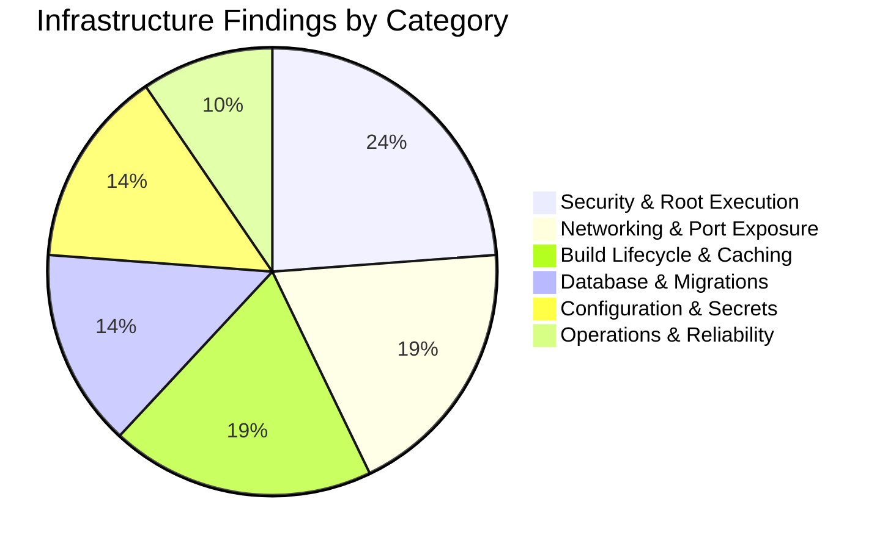
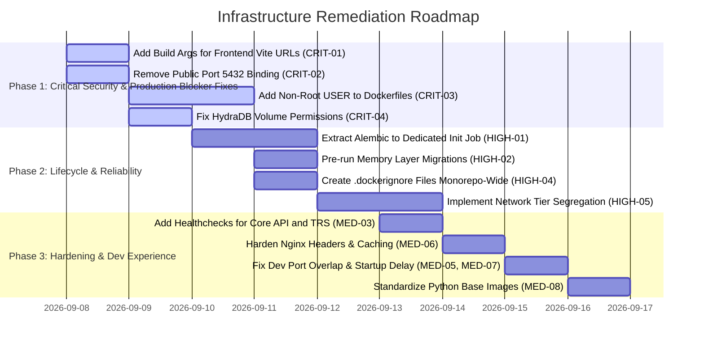

# Comprehensive Infrastructure & Docker Review: `AI-DND` Monorepo

> **Scope**: Full Infrastructure & Containerization Stack ([`docker-compose.yml`](file:///home/aryan-sherigar/projects/AI-DND/docker-compose.yml), [`docker-compose.dev.yml`](file:///home/aryan-sherigar/projects/AI-DND/docker-compose.dev.yml), [`apps/core-api/Dockerfile`](file:///home/aryan-sherigar/projects/AI-DND/apps/core-api/Dockerfile), [`apps/turn-resolution-service/Dockerfile`](file:///home/aryan-sherigar/projects/AI-DND/apps/turn-resolution-service/Dockerfile), [`apps/frontend/Dockerfile`](file:///home/aryan-sherigar/projects/AI-DND/apps/frontend/Dockerfile), [`apps/frontend/nginx.conf`](file:///home/aryan-sherigar/projects/AI-DND/apps/frontend/nginx.conf), [`apps/memory-layer/Dockerfile`](file:///home/aryan-sherigar/projects/AI-DND/apps/memory-layer/Dockerfile), [`apps/memory-layer/hydradb/Dockerfile`](file:///home/aryan-sherigar/projects/AI-DND/apps/memory-layer/hydradb/Dockerfile), `.env.example`, and container networking)  
> **Benchmark Standards**: CIS Docker Benchmark v1.6.0, OWASP Container Security Top 10, 12-Factor App Methodology  
> **Mode**: Read-Only Architecture & Security Audit (Zero Configuration / Code Changes)  
> **Date**: September 2026  

---

## Executive Summary

An exhaustive review of the containerization and infrastructure definitions across the `AI-DND` monorepo was conducted. The audit covered all 7 services (`postgres`, `core-api`, `turn-resolution-service`, `postgres-memory`, `hydradb`, `memory-layer`, `frontend`) orchestrated by Docker Compose, all 5 Dockerfiles, web server configurations, local development overrides, and environment variable templates.

### Key Metrics & Audit Outcomes
- **Docker Compose Configuration Check**: `docker compose config` and `docker compose -f docker-compose.yml -f docker-compose.dev.yml config` parse with zero syntax errors.
- **Root User Execution**: **4 out of 5 Dockerfiles** (`core-api`, `trs`, `frontend`, `memory-layer`) execute as UID 0 (`root`), violating CIS Docker Benchmark §4.1.
- **Build Context & Layer Caching**: **Zero `.dockerignore` files** exist anywhere in the repository, resulting in `.git`, `.venv`, local `node_modules`, and temporary environment files leaking into image builds.
- **Network Security & Exposure**: Zero network tier segregation; all containers (including raw PostgreSQL databases) share a single flat bridge network (`aidnd-net`), and the primary PostgreSQL database exposes port `5432` to the public host interface by default.
- **Frontend Environment Variables**: Production frontend image builds freeze `http://localhost:8000` into static JS bundles at build time due to missing Vite build arguments.

### Findings Breakdown by Severity

| Severity | Count | Primary Impact Areas |
|---|:---:|---|
| **Critical (P0)** | 4 | Build-time localhost API bake-in on Frontend, Public Host Port Exposure of Database, Universal Root User Execution in Containers, HydraDB Volume Permission Denied Crash Loop |
| **High (P1)** | 5 | Multi-Replica Migration Race Condition at Startup, Lazy DDL Migrations on First HTTP Request, Secret Leak via Plaintext Command Line Echo, Total Absence of `.dockerignore` Files, Flat Single Network Lacking Tier Segregation |
| **Medium (P2)** | 8 | Missing CPU & Memory Resource Limits, Insecure Fallback Secret Defaults in Compose, Missing Application Healthchecks for Core API & TRS, PID 1 Signal Handling & Zombie Process Gap, Dev Environment Port Overlap, Insecure Nginx Default Configuration, Dev Node Modules Volume Desync, Monorepo Python Runtime Inconsistency (3.11 vs 3.12) |
| **Low / Standards (P3)** | 4 | Missing Read-Only Root Filesystems, Missing Linux Capabilities Dropping (`cap_drop`), Floating Base Image Tags, Absence of Automated Dockerfile Linting (Hadolint) |
| **Total Findings** | **21** | |



---

## Severity 0: Critical Vulnerabilities & System Risks

### [CRIT-01] Frontend Build-Time Environment Variable Freezing (`VITE_*` Localhost Bake-in)
- **Severity**: Critical (P0)
- **Category**: Build Lifecycle & Network Architecture
- **Location**: [`apps/frontend/Dockerfile:10-13`](file:///home/aryan-sherigar/projects/AI-DND/apps/frontend/Dockerfile#L10-L13) and [`docker-compose.yml:154-166`](file:///home/aryan-sherigar/projects/AI-DND/docker-compose.yml#L154-L166)
- **Problem & Root Cause**:
  Vite evaluates `import.meta.env.VITE_*` statically at **build time** during `npm run build`, embedding the values directly into the compiled JavaScript chunks in `dist/`.
  In `apps/frontend/Dockerfile`:
  ```dockerfile
  FROM node:20-alpine AS builder
  WORKDIR /app
  COPY package.json package-lock.json ./
  RUN npm ci
  COPY . .
  RUN npm run build
  ```
  The builder stage receives **zero `ARG` declarations and sets no environment variables**.
  Consequently, [`api-client.ts:20`](file:///home/aryan-sherigar/projects/AI-DND/apps/frontend/src/shared/lib/api-client.ts#L20) and [`play.store.ts:27`](file:///home/aryan-sherigar/projects/AI-DND/apps/frontend/src/features/play/stores/play.store.ts#L27) fall back to their hardcoded development defaults:
  `http://localhost:8000` and `http://localhost:8001`.
- **Failure Scenario / Impact**:
  When the production image is deployed to a server, domain, or cloud cluster, any client connecting from a remote browser attempts to send API requests and open SSE connections to `http://localhost:8000` and `http://localhost:8001` on their own local machine. The application fails completely for all external users.
- **Remediation**:
  Define Dockerfile `ARG`s for all `VITE_*` variables in the builder stage, and pass them via `build.args` in `docker-compose.yml`.
  ```dockerfile
  # Remediation in apps/frontend/Dockerfile
  FROM node:20-alpine AS builder
  WORKDIR /app
  ARG VITE_API_URL
  ARG VITE_TRS_URL
  ARG VITE_FIREBASE_API_KEY
  ARG VITE_FIREBASE_AUTH_DOMAIN
  ARG VITE_FIREBASE_PROJECT_ID
  ENV VITE_API_URL=$VITE_API_URL \
      VITE_TRS_URL=$VITE_TRS_URL \
      VITE_FIREBASE_API_KEY=$VITE_FIREBASE_API_KEY \
      VITE_FIREBASE_AUTH_DOMAIN=$VITE_FIREBASE_AUTH_DOMAIN \
      VITE_FIREBASE_PROJECT_ID=$VITE_FIREBASE_PROJECT_ID
  ...
  RUN npm run build
  ```

---

### [CRIT-02] Public Host Port Exposure of PostgreSQL & Internal Database Services
- **Severity**: Critical (P0)
- **Category**: Security & Network Architecture
- **Location**: [`docker-compose.yml:12-13, 144-145`](file:///home/aryan-sherigar/projects/AI-DND/docker-compose.yml#L12-L13)
- **Problem & Root Cause**:
  In [`docker-compose.yml`](file:///home/aryan-sherigar/projects/AI-DND/docker-compose.yml), the base production service definition for `postgres` publishes port 5432 to the host:
  ```yaml
  postgres:
    image: postgres:16-alpine
    ports:
      - "${POSTGRES_PORT:-5432}:5432"
  ```
  And `memory-layer` publishes port 8002:
  ```yaml
  memory-layer:
    ports:
      - "${MEMORY_LAYER_PORT:-8002}:8002"
  ```
  On Linux servers running Docker, Docker automatically configures `iptables` forwarding rules that **bypass local host firewalls (such as UFW)**.
- **Failure Scenario / Impact**:
  Unless a cloud provider hardware security group specifically blocks incoming traffic, PostgreSQL port 5432 is exposed to the entire public internet. Coupled with default credentials (`postgres:postgres`), an attacker can connect remotely, exfiltrate player records, and drop production databases.
- **Remediation**:
  Bind internal services to `127.0.0.1` or remove `ports` from the production `docker-compose.yml` entirely, exposing ports only within `docker-compose.dev.yml` for local inspection.
  ```yaml
  # Remediation in docker-compose.yml
  postgres:
    image: postgres:16-alpine
    # Expose only to internal docker network in production:
    expose:
      - "5432"
    # Or if host access is required, bind strictly to loopback:
    ports:
      - "127.0.0.1:${POSTGRES_PORT:-5432}:5432"
  ```

---

### [CRIT-03] Universal Root User Execution Across Production Containers
- **Severity**: Critical (P0)
- **Category**: Container Security (CIS Docker Benchmark §4.1)
- **Location**:
  - [`apps/core-api/Dockerfile`](file:///home/aryan-sherigar/projects/AI-DND/apps/core-api/Dockerfile)
  - [`apps/turn-resolution-service/Dockerfile`](file:///home/aryan-sherigar/projects/AI-DND/apps/turn-resolution-service/Dockerfile)
  - [`apps/frontend/Dockerfile:15-22`](file:///home/aryan-sherigar/projects/AI-DND/apps/frontend/Dockerfile#L15-L22)
  - [`apps/memory-layer/Dockerfile`](file:///home/aryan-sherigar/projects/AI-DND/apps/memory-layer/Dockerfile)
- **Problem & Root Cause**:
  4 out of 5 Dockerfiles fail to specify a non-root `USER` directive. All processes (`uvicorn`, `alembic`, `nginx`) execute as `root` (UID 0).
- **Failure Scenario / Impact**:
  If an attacker exploits an application-level vulnerability (such as SSRF in Replit verification, file upload flaws in GCS endpoints, or an unpatched Python dependency vulnerability), they execute commands as UID 0 within the container. This eliminates the first line of defense against kernel privilege escalation and container breakout attacks.
- **Remediation**:
  Create an unprivileged system group and user in each Dockerfile and switch to it before the entrypoint. For Nginx, use `nginxinc/nginx-unprivileged:alpine`.
  ```dockerfile
  # Remediation for Python Dockerfiles
  RUN groupadd -g 10001 appgroup && \
      useradd -u 10001 -g appgroup -s /sbin/nologin -M appuser && \
      chown -R appuser:appgroup /app
  USER 10001:10001
  ```

---

### [CRIT-04] HydraDB Named Volume Permission Denied Crash Loop
- **Severity**: Critical (P0)
- **Category**: Permissions & Volume Architecture
- **Location**: [`docker-compose.yml:94-126`](file:///home/aryan-sherigar/projects/AI-DND/docker-compose.yml#L94-L126) and [`apps/memory-layer/hydradb/Dockerfile:95`](file:///home/aryan-sherigar/projects/AI-DND/apps/memory-layer/hydradb/Dockerfile#L95)
- **Problem & Root Cause**:
  `hydradb/Dockerfile` enforces unprivileged execution via `USER 10001:10001`.
  In [`docker-compose.yml`](file:///home/aryan-sherigar/projects/AI-DND/docker-compose.yml):
  ```yaml
  hydradb:
    entrypoint: ["sh", "-c", "mkdir -p /tmp/graph /var/cache/slatedb && echo '${HYDRADB_API_KEY:-context-memory-local-smoke-token-32b}' > /tmp/graph/auth-token && exec graph-node"]
    volumes:
      - hydradb_store:/tmp/graph
      - hydradb_cache:/var/cache/slatedb
  ```
  Named volumes initialized by Docker are owned by `root:root` (UID 0) by default. When the container boots, the unprivileged user `10001` attempts to run `mkdir -p` and `echo > /tmp/graph/auth-token`.
- **Failure Scenario / Impact**:
  The shell script exits immediately with `mkdir: can't create directory '/tmp/graph': Permission denied` or `sh: can't create /tmp/graph/auth-token: Permission denied`. The container enters a continuous crash loop (`Restarting (1)`), causing `memory-layer` (which depends on HydraDB being healthy) to never boot.
- **Remediation**:
  Ensure volume directories are pre-created with correct ownership, or initialize directory permissions via an init container / entrypoint wrapper before dropping privileges.

---

## Severity 1: High Priority Deficiencies

### [HIGH-01] Multi-Replica Migration Race Condition at Startup
- **Severity**: High (P1)
- **Category**: Database Integrity & Container Lifecycle
- **Location**: [`apps/core-api/Dockerfile:18`](file:///home/aryan-sherigar/projects/AI-DND/apps/core-api/Dockerfile#L18) and [`docker-compose.dev.yml:5`](file:///home/aryan-sherigar/projects/AI-DND/docker-compose.dev.yml#L5)
- **Problem & Root Cause**:
  The Dockerfile `CMD` executes `alembic upgrade head && uvicorn app.main:app ...`.
  In production environments where multiple replicas of `core-api` are launched for high availability, all instances boot concurrently and attempt to acquire migration locks and apply DDL statements at the same time.
- **Failure Scenario / Impact**:
  Concurrent migration executions cause lock contention errors (`deadlock detected`, `relation already exists`), leaving Alembic's version tracking table in a corrupt or mismatched state and aborting web worker startup.
- **Remediation**:
  Decouple database migrations from the web server image command. Run migrations as a one-off init container or dedicated deployment job:
  ```yaml
  # In docker-compose.yml
  migration-runner:
    build: ./apps/core-api
    command: ["alembic", "upgrade", "head"]
    depends_on:
      postgres:
        condition: service_healthy
    networks:
      - aidnd-backend-net
    restart: "no"
  ```

---

### [HIGH-02] Lazy DDL Migrations on First HTTP Request in Memory Layer
- **Severity**: High (P1)
- **Category**: Database Lifecycle & Latency
- **Location**: [`apps/memory-layer/Dockerfile:18-21`](file:///home/aryan-sherigar/projects/AI-DND/apps/memory-layer/Dockerfile#L18-L21) and [`apps/memory-layer/src/context_memory/composition.py`](file:///home/aryan-sherigar/projects/AI-DND/apps/memory-layer/src/context_memory/composition.py)
- **Problem & Root Cause**:
  The memory layer Dockerfile comments acknowledge:
  *`# Postgres migrations (db/migrations) run lazily on first request, inside composition.py`*.
  Running database schema migrations lazily inside the critical path of an incoming HTTP request is a severe operational risk.
- **Failure Scenario / Impact**:
  The first request after a deployment experiences massive latency spikes or 504 Gateway Timeouts while table structures and pgvector indexes are built. If multiple requests arrive simultaneously on startup, concurrent DDL execution can cause PostgreSQL transaction deadlocks.
- **Remediation**:
  Execute database migrations during startup in the service entrypoint or via a pre-start script before `uvicorn` begins accepting HTTP traffic.

---

### [HIGH-03] Secret Exposure via Plaintext Command Line Echo in Compose Entrypoint
- **Severity**: High (P1)
- **Category**: Secrets Management
- **Location**: [`docker-compose.yml:101`](file:///home/aryan-sherigar/projects/AI-DND/docker-compose.yml#L101)
- **Problem & Root Cause**:
  ```yaml
  entrypoint: ["sh", "-c", "mkdir -p /tmp/graph /var/cache/slatedb && echo '${HYDRADB_API_KEY:-context-memory-local-smoke-token-32b}' > /tmp/graph/auth-token && exec graph-node"]
  ```
  Passing API keys and tokens inside shell command strings exposes the value in `/proc/<pid>/cmdline`, process monitoring tools (`ps`, `top`), and Docker inspection metadata (`docker inspect`).
- **Remediation**:
  Pass the auth token via a Docker secret, a secure environment variable read directly by the application binary, or mount the token file using a Docker volume secret.

---

### [HIGH-04] Total Absence of `.dockerignore` Files Monorepo-Wide
- **Severity**: High (P1)
- **Category**: Build Context Hygiene & Image Bloat
- **Location**: Monorepo root and all `apps/*` directories
- **Problem & Root Cause**:
  Zero `.dockerignore` files exist in the repository.
  When building images (`docker build ./apps/core-api`, `docker build ./apps/frontend`), Docker copies the entire contents of the directory into the build context.
- **Failure Scenario / Impact**:
  Local `.venv`, virtual environments, `node_modules` (often containing hundreds of MBs of platform-specific C++ binaries), `.git`, `__pycache__`, and local `.env` secret files are transferred to the Docker daemon. This drastically slows build times, breaks layer caching, and risks baking host secrets and invalid host binaries into container images.
- **Remediation**:
  Create targeted `.dockerignore` files in root and each app directory:
  ```
  .git
  .venv
  __pycache__
  *.pyc
  .pytest_cache
  node_modules
  dist
  .env
  .env.*
  !.env.example
  ```

---

### [HIGH-05] Flat Single Network Lacking Tier Segregation (`aidnd-net`) — [REMEDIATED]
- **Severity**: High (P1)
- **Category**: Network Architecture & Defense-in-Depth
- **Status**: Remediated (Segregated into `frontend-net` and `backend-net`)
- **Location**: [`docker-compose.yml`](file:///home/aryan-sherigar/projects/AI-DND/docker-compose.yml)
- **Problem & Root Cause**:
  Every service across all tiers resides on a single bridge network (`aidnd-net`). The public-facing `frontend` container shares the same network segment as the private PostgreSQL database instances (`aidnd-postgres` and `aidnd-postgres-memory`).
- **Failure Scenario / Impact**:
  If the frontend Nginx or Vite container is compromised, the attacker has unrestricted network access to PostgreSQL port 5432, HydraDB internal ports (7687, 8443, 9090), and internal REST APIs with zero perimeter defense.
- **Remediation**:
  Dual-network segregation implemented:
  1. `frontend-net`: connects `frontend`, `core-api`, and `turn-resolution-service`.
  2. `backend-net`: connects `core-api`, `turn-resolution-service`, `memory-layer`, `hydradb`, `migration-runner`, `memory-layer-migration-runner`, and PostgreSQL databases. `frontend` has zero route to `backend-net`.

---

## Severity 2: Medium Priority Architectural & Operational Issues

### [MED-01] Missing CPU & Memory Resource Limits (DOS Risk)
- **Severity**: Medium (P2)
- **Category**: Resource Management & Denial of Service
- **Location**: [`docker-compose.yml`](file:///home/aryan-sherigar/projects/AI-DND/docker-compose.yml) (all 7 services)
- **Problem & Root Cause**:
  None of the containers specify `mem_limit`, `cpus`, or `deploy.resources.limits`.
- **Failure Scenario / Impact**:
  A memory leak in Pixi/Node or an intensive embedding generation in `memory-layer` can consume 100% of host RAM, triggering Linux OOM killer to terminate host system daemons.
- **Remediation**:
  Configure memory and CPU limits on each service in `docker-compose.yml`:
  ```yaml
  deploy:
    resources:
      limits:
        cpus: '1.5'
        memory: 1024M
  ```

---

### [MED-02] Insecure Fallback Secret Defaults in Compose Definitions
- **Severity**: Medium (P2)
- **Category**: Configuration & Secrets Hygiene
- **Location**: [`docker-compose.yml:32, 43, 60, 67, 138`](file:///home/aryan-sherigar/projects/AI-DND/docker-compose.yml#L32)
- **Problem & Root Cause**:
  Variables use insecure fallback defaults:
  `SECRET_KEY: ${SECRET_KEY:-dev-secret-key-change-in-production}`
  `POSTGRES_PASSWORD: ${POSTGRES_PASSWORD:-postgres}`
  `MEMORY_SERVICE_API_KEY: ${MEMORY_SERVICE_API_KEY:-dev-memory-layer-key-change-in-production}`
- **Failure Scenario / Impact**:
  If a production operator forgets to set `SECRET_KEY` in their production `.env`, the cluster boots silently with well-known cryptographic secrets.
- **Remediation**:
  In production Compose files, enforce mandatory environment variables using `${VAR:?error message}` syntax so Docker Compose refuses to start if secrets are missing.

---

### [MED-03] Missing Application Healthchecks for Core API & TRS
- **Severity**: Medium (P2)
- **Category**: Reliability & Service Orchestration
- **Location**: [`docker-compose.yml:24-75`](file:///home/aryan-sherigar/projects/AI-DND/docker-compose.yml#L24-L75)
- **Problem & Root Cause**:
  Neither `core-api` nor `turn-resolution-service` defines a healthcheck in their Dockerfiles or `docker-compose.yml`.
  `frontend`'s `depends_on` relies on `condition: service_started`.
- **Failure Scenario / Impact**:
  `frontend` begins routing traffic to `core-api` before database connections are verified and migrations have finished, returning 502/503 errors during cold boots.
- **Remediation**:
  Add healthchecks querying `/health`:
  ```yaml
  healthcheck:
    test: ["CMD-SHELL", "curl -f http://localhost:8000/health || exit 1"]
    interval: 10s
    timeout: 5s
    retries: 3
    start_period: 15s
  ```

---

### [MED-04] PID 1 Signal Handling & Zombie Process Gap (`sh -c` vs. Tini)
- **Severity**: Medium (P2)
- **Category**: Container Runtime & Lifecycle
- **Location**: [`apps/core-api/Dockerfile:18`](file:///home/aryan-sherigar/projects/AI-DND/apps/core-api/Dockerfile#L18)
- **Problem & Root Cause**:
  `CMD ["sh", "-c", "alembic upgrade head && uvicorn app.main:app ..."]` runs `/bin/sh` as PID 1. Shells do not pass OS signals (`SIGTERM`, `SIGINT`) to child processes by default.
- **Failure Scenario / Impact**:
  Executing `docker stop` or rolling updates in container orchestrators causes the container to ignore graceful shutdown signals, hanging for 10 seconds until abruptly killed via `SIGKILL`. Active user turns and SSE streams are abruptly terminated.
- **Remediation**:
  Use an entrypoint script with `exec` or utilize `tini` / `dumb-init` to forward signals:
  ```dockerfile
  ENTRYPOINT ["/usr/bin/tini", "--"]
  CMD ["uvicorn", "app.main:app", "--host", "0.0.0.0", "--port", "8000"]
  ```

---

### [MED-05] Dev Environment Port Overlap (Publishing Both 80 and 5173)
- **Severity**: Medium (P2)
- **Category**: Development Configuration
- **Location**: [`docker-compose.yml:161`](file:///home/aryan-sherigar/projects/AI-DND/docker-compose.yml#L161) and [`docker-compose.dev.yml:28-29`](file:///home/aryan-sherigar/projects/AI-DND/docker-compose.dev.yml#L28-L29)
- **Problem & Root Cause**:
  When launching the development environment with `docker compose -f docker-compose.yml -f docker-compose.dev.yml up`, Compose merges the ports lists, publishing both `80:80` AND `5173:5173`.
- **Failure Scenario / Impact**:
  Developers running local web servers or Nginx on port 80 encounter port binding conflicts (`bind: address already in use`), preventing dev stack startup.
- **Remediation**:
  In `docker-compose.dev.yml`, use `ports: !reset ["${FRONTEND_PORT:-5173}:5173"]` to clear the base port mapping.

---

### [MED-06] Insecure Nginx Default Configuration in Frontend Container
- **Severity**: Medium (P2)
- **Category**: Web Server Hardening
- **Location**: [`apps/frontend/nginx.conf`](file:///home/aryan-sherigar/projects/AI-DND/apps/frontend/nginx.conf)
- **Problem & Root Cause**:
  `nginx.conf` contains only bare `try_files` SPA routing. It lacks standard security headers (`X-Content-Type-Options`, `X-Frame-Options`, `Content-Security-Policy`), lacks static caching headers (`Cache-Control`) for `/assets/`, and lacks gzip/brotli compression.
- **Remediation**:
  Add security headers and immutable caching rules to `nginx.conf`:
  ```nginx
  add_header X-Content-Type-Options "nosniff" always;
  add_header X-Frame-Options "SAMEORIGIN" always;
  add_header Referrer-Policy "strict-origin-when-cross-origin" always;

  location ~* \.(?:css|js|woff2?|png|webp|jpg)$ {
      expires 1y;
      add_header Cache-Control "public, immutable";
  }
  ```

---

### [MED-07] Docker Compose Dev Node Modules Volume Desync
- **Severity**: Medium (P2)
- **Category**: Local Development Workflow
- **Location**: [`docker-compose.dev.yml:25-27, 40`](file:///home/aryan-sherigar/projects/AI-DND/docker-compose.dev.yml#L25-L27)
- **Problem & Root Cause**:
  `docker-compose.dev.yml` mounts an anonymous volume `/app/node_modules` alongside `./apps/frontend:/app`, and runs `npm install && npm run dev ...` on every boot.
- **Failure Scenario / Impact**:
  Running `npm install` inside the container on every single `docker compose up` causes 30-60 second startup delays. If dependencies change on the host, the anonymous Docker volume retains obsolete packages unless manually purged with `docker compose down -v`.
- **Remediation**:
  Build `node_modules` into the dev image or run `npm install` conditionally based on package lock checksums.

---

### [MED-08] Inconsistent Python Runtimes Across Monorepo (3.11 vs 3.12)
- **Severity**: Medium (P2)
- **Category**: Monorepo Architecture
- **Location**: [`apps/core-api/Dockerfile:1`](file:///home/aryan-sherigar/projects/AI-DND/apps/core-api/Dockerfile#L1) (3.11) vs [`apps/memory-layer/Dockerfile:1`](file:///home/aryan-sherigar/projects/AI-DND/apps/memory-layer/Dockerfile#L1) (3.12)
- **Problem & Root Cause**:
  `core-api` and `turn-resolution-service` use `python:3.11-slim`, while `memory-layer` uses `python:3.12-slim`.
- **Impact**:
  Increases base image pull times on build nodes, duplicates OS vulnerability patching overhead, and violates monorepo runtime consistency.
- **Remediation**:
  Standardize all Python services on `python:3.11-slim` (or migrate all to 3.12).

---

## Severity 3: Low Severity, Cleanliness & Best Practices

### [LOW-01] Missing Read-Only Root Filesystem Enforcements (`read_only: true`)
- **Severity**: Low / Hardening (P3)
- **Category**: Container Security
- **Location**: All services in `docker-compose.yml`
- **Problem & Root Cause**:
  Containers run with writable root filesystems.
- **Remediation**:
  Configure `read_only: true` with `tmpfs: ["/tmp"]` on stateless API containers.

---

### [LOW-02] Missing Linux Capabilities Dropping (`cap_drop: [ALL]`)
- **Severity**: Low / Hardening (P3)
- **Category**: Container Security
- **Location**: All services in `docker-compose.yml`
- **Problem & Root Cause**:
  Containers retain unnecessary kernel capabilities (`CAP_NET_RAW`, `CAP_CHOWN`, `CAP_FOWNER`).
- **Remediation**:
  Add `cap_drop: [ALL]` and grant only `CAP_NET_BIND_SERVICE` where required.

---

### [LOW-03] Floating Base Image Tags (`nginx:alpine`, `node:20-alpine`)
- **Severity**: Low / Reproducibility (P3)
- **Category**: Build Determinism
- **Location**: [`apps/frontend/Dockerfile:2, 15`](file:///home/aryan-sherigar/projects/AI-DND/apps/frontend/Dockerfile#L2)
- **Problem & Root Cause**:
  Unpinned tags pull new Alpine versions unexpectedly, leading to non-reproducible builds.
- **Remediation**:
  Pin base images with minor/patch versions or SHA256 digests (e.g. `node:20.18-alpine3.20`).

---

### [LOW-04] Absence of Automated Dockerfile Linting (Hadolint Gap)
- **Severity**: Low / Tooling (P3)
- **Category**: CI/CD Hygiene
- **Location**: Monorepo root
- **Problem & Root Cause**:
  No Dockerfile linter is integrated into pre-commit hooks or local development checks.
- **Remediation**:
  Add `hadolint` to CI/CD workflows to catch unpinned packages, missing `--no-cache-dir`, and user permission bugs automatically.

---

## Actionable Remediation Roadmap



### Phase 1: Critical Security & Production Fixes (P0)
1. **Frontend Production Build Config**: Add `ARG VITE_*` to `apps/frontend/Dockerfile` and wire `build.args` in `docker-compose.yml` so production builds connect to real API domains rather than localhost.
2. **Close Public Database Ports**: Remove `ports: ["5432:5432"]` from production `docker-compose.yml` or bind strictly to `127.0.0.1`.
3. **Drop Root Privileges**: Create dedicated unprivileged users (`appuser:10001`) in `core-api`, `trs`, and `memory-layer` Dockerfiles.
4. **HydraDB Volume Initialization**: Resolve HydraDB root volume permission errors by preparing volume mount ownership.

### Phase 2: Lifecycle, Network & Context Isolation (P1)
1. **Decouple Database Migrations**: Run Alembic migrations via a dedicated one-shot container before web workers launch.
2. **Eliminate Lazy DDL Migrations**: Execute memory layer migrations before starting `uvicorn`.
3. **Deploy `.dockerignore` Files**: Add `.dockerignore` to monorepo root and all service directories to block `.venv`, `node_modules`, and `.git` leaks.
4. **Network Segregation**: Split `aidnd-net` into `frontend-net` (public ingress) and `backend-net` (private database & internal services).

### Phase 3: Hardening & Operational Cleanliness (P2 & P3)
1. **Enforce Container Healthchecks**: Add `/health` checks for `core-api` and `turn-resolution-service`.
2. **Harden Web Server**: Add security headers and immutable asset caching to `apps/frontend/nginx.conf`.
3. **Streamline Dev Stack**: Fix port 80/5173 collisions and eliminate redundant `npm install` runs in `docker-compose.dev.yml`.
4. **Standardize Monorepo Runtimes**: Align all Python services to the same base image version.


   Comprehensive Docker & Docker Compose Audit Report 

  An in-depth analysis was conducted across all Dockerfiles, Compose specifications, networking topologies, database migrations, and build configs in the repository without making code modifications or starting containers.
  ──────
  ## Executive Summary
   Target Stack                                                    |   Ready to Run?    | Key Verdict
  -----------------------------------------------------------------|--------------------|------------------------------------------------------------------------------------------------------------------------------------------
   Development Stack (docker-compose.yml + docker-compose.dev.yml) |        YES         | Syntactically and structurally sound. Clean config validation. Ready for docker compose -f docker-compose.yml -f docker-compose.dev.yml
                                                                   |                    | up --build.
   Production / Base Stack (docker-compose.yml)                    | YES (with caveats) | Valid, but binds privileged host Port 80 directly.
   Isolated Memory Backing Stack (apps/memory-layer/compose.yaml)  |        YES         | Valid standalone compose file for pgvector + hydradb.
  All TypeScript code compiles cleanly without errors (frontend), production asset bundling succeeds (frontend), npm ci lockfiles are synchronized, and all Python services (core-api, turn-resolution-service, and memory-layer)
  import without dependency conflicts.
  ──────
  ## 1. Inventory of Inspected Files

  1. Compose Manifests:
      • docker-compose.yml (Root production / integration compose file)
      • docker-compose.dev.yml (Local hot-reloading development overrides)
      • compose.yaml (Standalone memory database fixture)
  2. Dockerfiles & Web Server Configurations:
      • Dockerfile
      • Dockerfile
      • Dockerfile
      • Dockerfile & nginx.conf
      • Dockerfile.dev
  3. Context Filtering & Environment:
      • .dockerignore, .dockerignore, .dockerignore, .dockerignore
      • .env and .env.example

  ──────
  ## 2. Detailed Findings & Prerequisites to Solve

  ### 1. Privileged Host Port 80 in Base docker-compose.yml

  • Location: docker-compose.yml:204
  • Detail:
    ports:
      - "80:8080"
  The production compose file binds directly to host port 80.
  • Potential Issue:
      • On Linux, ports < 1024 are privileged. If running rootless Docker, or if another service (such as system Apache, system Nginx, or Caddy) is running on port 80, starting docker compose up will fail with bind: permission
      denied or bind: address already in use. (Note: Checking the current host showed port 80 is currently unoccupied).
      • Unlike docker-compose.dev.yml (which uses ${FRONTEND_PORT:-5173}:5173), port 80 is hardcoded in the base file rather than parameterized.
  • Action Required: If you run the production stack (docker compose up), ensure you have appropriate rights to bind port 80 or parameterize it (e.g. ${FRONTEND_PROD_PORT:-80}:8080).
  ──────
  ### 2. Docker Compose CLI Version (Tag !override)

  • Location: docker-compose.dev.yml:41 & docker-compose.dev.yml:51
  • Detail:
  docker-compose.dev.yml utilizes the YAML merge tag !override:
    frontend:
      build: !override
        ...
      ports: !override
        - "${FRONTEND_PORT:-5173}:5173"

  • Potential Issue:
  !override was added in Docker Compose v2.20.0 (mid-2023). Any environment running an older version of docker compose or legacy Python docker-compose v1.x will crash with:
  yaml: unknown tag !override.
  • Status on Your System: Your system has Docker Compose v5.5.0 (Docker CLI v2 Compose Plugin), which parsed and validated this cleanly. Ensure any CI/CD or collaborator environments also run Compose v2.20.0+.
  ──────
  ### 3. Outbound Internet Requirement on First Boot (Hugging Face & HydraDB)

  • Location: server.py:41 & Dockerfile:17
  • Detail:
  During the startup lifespan of aidnd-memory-layer, build_memory_engine executes:
    embedder = SentenceTransformerEmbedder(model_name=config.embedding_model_name)
  This loads sentence-transformers/all-MiniLM-L6-v2, downloading weights (~90MB) into HF_HOME=/app/.cache/huggingface.
  • Potential Issue:
      • The container must have outbound internet connectivity on initial startup. If behind an offline environment or strict proxy, startup will hang or error out.
      • /app/.cache/huggingface is currently stored in the container's ephemeral root filesystem. If the container is destroyed (docker compose down or rebuilt), the weights will be redownloaded on the next start.
  • Recommendation: If you want to avoid redownloading on rebuilds, consider mounting a named volume for hf_cache:/app/.cache/huggingface.
  ──────
  ### 4. Anonymous Volume Shadowing for frontend/node_modules

  • Location: docker-compose.dev.yml:48-50
  • Detail:
    volumes:
      - ./apps/frontend:/app
      - /app/node_modules

  • Behavior to Note:
  Mounting ./apps/frontend to /app with an anonymous volume /app/node_modules prevents host node_modules from clobbering container Linux binaries.
  However, if you add or upgrade an npm dependency on the host in package.json, the existing anonymous volume inside Docker will not automatically receive the new package.
  • Action Required: Whenever packages in apps/frontend change, restart with docker compose down -v or rebuild with --build.
  ──────
  ### 5. UID / GID Defaults in Dockerfile.dev

  • Location: Dockerfile.dev:3-13 and docker-compose.dev.yml:45-46
  • Detail:
    args:
      UID: ${UID:-1000}
      GID: ${GID:-1000}

  • Behavior to Note:
  In standard Linux shells, $UID is an internal shell variable that is not exported to subprocesses, and $GID is unset. Docker Compose evaluates both to 1000.
  • Status on Your System: Checked with id on your system: uid=1000, gid=1000. This matches the defaults perfectly. (If another developer runs this whose host UID is 1001+, they must specify UID and GID in .env to prevent
  permission errors on bind-mounted directories).
  ──────
  ### 6. Vite envDir Resolution in Development Container

  • Location: vite.config.ts:8-12
  • Detail:
    const MONOREPO_ROOT = path.resolve(__dirname, "../..");
    ...
    envDir: MONOREPO_ROOT,

  • Behavior to Note:
  Inside the development container, ./apps/frontend is mounted to /app. path.resolve("/app", "../..") resolves to / (the root filesystem inside the container).
  Because the root .env file is not mounted into the dev container, Vite does not find a .env file at /.
  However, docker-compose.dev.yml explicitly injects all required VITE_* keys into environment::
    VITE_CORE_API_URL: http://localhost:8000
    VITE_TRS_URL: http://localhost:8001
    ...
  Vite correctly picks them up via process.env.
  • Note: Any changes to .env while running the dev container will require restarting the container, as Vite cannot hot-watch the host's .env file.
  ──────
  ### 7. Alembic & Memory Migrations Sequencing

  • Core API Migrations:
  docker-compose.yml cleanly runs migration-runner (alembic upgrade head) before starting core-api, using depends_on: migration-runner: condition: service_completed_successfully.
  • Memory Layer Migrations:
  memory-layer-migration-runner runs python scripts/run_migrations.py against postgres-memory before memory-layer starts.
  • Verification: Both migration suites have valid paths and models configured.
  ──────
  ## 3. Recommended Commands to Run

  When you are ready to launch, use the appropriate command:

  ### For Development (with Hot Reloading & Live Mounts):

    docker compose -f docker-compose.yml -f docker-compose.dev.yml up --build

  Services will be available at:

  • Frontend: http://localhost:5173
  • Core API: http://localhost:8000 (Docs: /docs, Health: /health)
  • Turn Resolution Service: http://localhost:8001 (Health: /health)
  • Memory Layer: http://localhost:8002
  • PostgreSQL: localhost:5432

  ### For Production / Base Simulation:

    docker compose up --build

  Services will be available at:

  • Unified Ingress (Nginx): http://localhost:80
      • Routes /api/* to core-api:8000
      • Routes /trs/* to turn-resolution-service:8001 (with unbuffered SSE streaming enabled)
      • Routes /* to built static React SPA bundle

  ──────
  ## Conclusion

  The Docker configurations are correctly structured and passed dry-run validation. No code modifications are strictly required for the development stack to run. You can proceed with running the development stack whenever
  ready.

