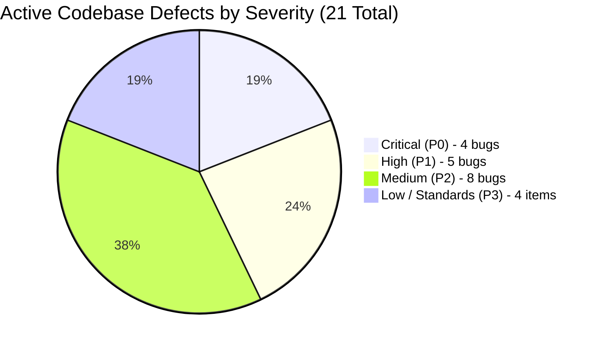

# Comprehensive Codebase Review: `apps/memory-layer`

> **Service**: `apps/memory-layer` (Python 3.12+ / FastAPI / PostgreSQL 16 + pgvector / HydraDB OpenCypher / Google GenAI SDK / sentence-transformers)  
> **Review Scope**: Full-Spectrum Re-Audit & Vulnerability Discovery (Security, Concurrency, Cross-Service Contracts, Retrieval Pipeline, Bitemporal Data Integrity, PostgreSQL Locking, [CLAUDE.md](file:///home/aryan-sherigar/projects/AI-DND/CLAUDE.md) Architecture Compliance)  
> **Mode**: Read-Only Architecture & Code Quality Re-Audit (Zero Application Source Code Modifications)  
> **Target Environment**: Evaluated against active working tree across `apps/memory-layer/`, `apps/turn-resolution-service/app/integrations/memory_client.py`, and `apps/core-api/app/integrations/memory_client.py`.  
> **Re-Audit Date**: September 2026  

---

## Executive Summary

An exhaustive, end-to-end codebase re-audit of [`apps/memory-layer`](file:///home/aryan-sherigar/projects/AI-DND/apps/memory-layer) was conducted across its core Python runtime (`src/context_memory`), REST API surface (`src/api`), schema migrations (`db/migrations`), CLI/chat interfaces (`src/chat`), evaluation harness (`src/evaluation`), test suites (`src/tests`), and cross-service client contracts in Turn Resolution Service and Core-API.

This re-audit had two primary objectives:
1. **Verification of Existing Audit Findings**: Re-inspect all 25 previously documented findings (`CRIT-01` through `LOW-03`) against the current codebase state to confirm which defects were genuinely resolved versus which remain active or only partially resolved.
2. **Comprehensive New Bug Discovery**: Trace full cross-service dataflows (Core-API scenario publishing & cloning -> Memory-Layer ingestion & indexing -> Turn Resolution Service retrieval & hidden fact revelation) to identify previously undetected bugs and architectural flaws.

### Re-Audit Summary & Status Verification
- **Original Findings Audited**: 25
  - **Resolved**: **12** (`CRIT-03`, `CRIT-04`, `CRIT-05`, `CRIT-06`, `HIGH-02`, `HIGH-04`, `HIGH-05`, `HIGH-07`, `HIGH-08`, `HIGH-09`, `HIGH-10`, `HIGH-11`)
  - **Partially Resolved / Defective Resolution**: **1** (`HIGH-01` — lifespan sets `app.state.engine`, but routes still inject `Depends(get_engine)` which references `_GLOBAL_ENGINE`, causing dual engine instantiation and preserving the startup race)
  - **Confirmed Existing**: **12** (`CRIT-01`, `CRIT-02`, `HIGH-03`, `HIGH-06` *(falsely marked solved previously)*, `MED-01`, `MED-02`, `MED-03`, `MED-04`, `MED-05`, `LOW-01`, `LOW-02`, `LOW-03`)
- **Newly Discovered Bugs**: **8**
  - **Critical (P0)**: **2** (`NEW-CRIT-01` UUIDv5 hash scrambling breaking TRS fact revelation; `NEW-CRIT-02` template cloning copying archived historical facts)
  - **High (P1)**: **3** (`NEW-HIGH-01` omitted `external_fact_ids` remapping crashing supersession; `NEW-HIGH-02` shared placeholder chunk causing N^2 cross-product join explosion in sibling expander; `NEW-HIGH-03` author entity aliases dropped on hydration)
  - **Medium (P2)**: **3** (`NEW-MED-01` entity registry cache eviction duplicate ID leak; `NEW-MED-02` synchronous blocking LLM template ingestion timing out Core-API; `NEW-MED-03` `recent_context_turns` silently dropped)
- **Total Active Issues in Codebase**: **21** (4 Critical, 5 High, 8 Medium, 4 Low/Standards)

---

### Findings Matrix by Severity & Status

| Severity | Original | Resolved | Partially Resolved | Confirmed Existing | Newly Discovered | Total Active |
|---|:---:|:---:|:---:|:---:|:---:|:---:|
| **Critical (P0)** | 6 | 4 | 0 | 2 | **2** | **4** |
| **High (P1)** | 11 | 8 | 1 | 2 | **3** | **5** |
| **Medium (P2)** | 5 | 0 | 0 | 5 | **3** | **8** |
| **Low / Standards (P3)** | 3 | 0 | 0 | 3 | **0** | **4** (incl. 1 partial) |
| **Total** | **25** | **12** | **1** | **12** | **8** | **21 Active** |



---

## Severity 0: Critical Vulnerabilities & System Risks

### [CRIT-01] Completely Unauthenticated & Unfiltered Global SSE Graph Stream Disclosing Cross-Tenant Private Game State [CONFIRMED EXISTING]
- **Severity**: Critical (P0)
- **Category**: Security Vulnerability / Multi-Tenant Data Leakage
- **Status**: **[CONFIRMED EXISTING]**
- **Location**: [`src/api/server.py:96-110`](file:///home/aryan-sherigar/projects/AI-DND/apps/memory-layer/src/api/server.py#L96-L110), [`src/api/stream.py:8-74`](file:///home/aryan-sherigar/projects/AI-DND/apps/memory-layer/src/api/stream.py#L8-L74)
- **Re-Audit Verification**:
  Re-inspection confirms `@app.get("/v1/memory/stream")` is still declared directly on `app` outside `router` and lacks `Depends(require_api_key)`. Line 96 of `server.py` defines:
  ```python
  @app.get("/v1/memory/stream")
  async def stream_graph(request: Request):
      q = streamer.add_queue()
      ...
  ```
  `streamer.broadcast_plan(plan)` remains monkey-patched on `GraphWriter.write` (lines 80-92) and broadcasts every write plan across all tenants without any `context_id` or `playthrough_id` discriminator.
- **Problem & Root Cause**:
  In [`api/server.py`](file:///home/aryan-sherigar/projects/AI-DND/apps/memory-layer/src/api/server.py), the application includes the main router with API key dependency (`app.include_router(router, dependencies=[Depends(require_api_key)])`). However, the graph streaming endpoint `@app.get("/v1/memory/stream")` is declared directly on `app` **outside the authenticated router and without any authentication dependencies**.
  `streamer.broadcast_plan` forwards every `GraphWritePlan` from **all playthroughs, scenarios, and users** directly into `streamer.push_event(data)`.
- **Failure Scenario / Impact**:
  Any unauthenticated client on the network can establish an SSE connection to `GET /v1/memory/stream`. Because `GraphStreamer` maintains a global set of queues without any `context_id` or `playthrough_id` filtering, the connected client receives a real-time stream of all graph nodes, properties, player secrets, entity names, and bitemporal facts being written across every active game on the server.
- **Remediation**:
  1. Move `/v1/memory/stream` behind `require_api_key` (or place it inside `router`).
  2. Require a mandatory query parameter `playthrough_id` (or `context_id`).
  3. Refactor `GraphStreamer` to index queues by `context_id`: `self.queues: dict[str, set[asyncio.Queue]]`.
  4. Replace module-level monkey-patching of `GraphWriter.write` with an explicit observer/event bus hook injected via composition.

---

### [CRIT-02] Unauthenticated Multi-Tenant Rollback Endpoint Allowing Cross-Playthrough Memory Erasure [CONFIRMED EXISTING]
- **Severity**: Critical (P0)
- **Category**: Security Vulnerability / Multi-Tenant State Corruption
- **Status**: **[CONFIRMED EXISTING]**
- **Location**: [`src/api/routes.py:388-395`](file:///home/aryan-sherigar/projects/AI-DND/apps/memory-layer/src/api/routes.py#L388-L395)
- **Re-Audit Verification**:
  Re-inspection of [`api/routes.py:388`](file:///home/aryan-sherigar/projects/AI-DND/apps/memory-layer/src/api/routes.py#L388) confirms the public endpoint remains:
  ```python
  @router.post("/v1/memory/rollback/{save_id}", response_model=RollbackResponse)
  def rollback_to_save_point(
      save_id: str,
      engine: MemoryEngine = Depends(get_engine),
  ) -> RollbackResponse:
      try:
          result = engine.rollback_to(save_id)
      except ValueError as e:
          raise HTTPException(status_code=status.HTTP_404_NOT_FOUND, detail=str(e)) from e
      return RollbackResponse(...)
  ```
  The endpoint accepts only a bare `save_id` string with zero caller verification or `context_id` matching, even though `core/agent_tools.py` explicitly documents this exact security hole.
- **Problem & Root Cause**:
  `MemoryEngine.rollback_to(save_id)` looks up `save_id` in `save_points` table and executes rollback on whatever `context_id` that save point belongs to. Because there is no check that the caller owns or is operating within that `context_id`, any authenticated client can issue rollbacks against arbitrary games by guessing or enumerating `save_id`s.
- **Failure Scenario / Impact**:
  An attacker or rogue client can invoke `POST /v1/memory/rollback/{save_id}` targeting foreign `save_id`s, instantly archiving facts and destroying the active timeline of unrelated players or scenarios.
- **Remediation**:
  Require `context_id` (or `playthrough_id`) in the request and verify that `save_point.context_id == context_id` before executing the rollback.

---

### [CRIT-03] Volatile In-Memory Entity Registry Minting Duplicate Broken Entities Across Restarts & Replicas [RESOLVED]
- **Severity**: Critical (P0)
- **Category**: State Management / Knowledge Graph Corruption
- **Status**: **[RESOLVED]**
- **Location**: [`src/context_memory/ingestion/entity_registry.py:190-230`](file:///home/aryan-sherigar/projects/AI-DND/apps/memory-layer/src/context_memory/ingestion/entity_registry.py#L190-L230), [`src/context_memory/ingestion/entity_hydration.py:36-120`](file:///home/aryan-sherigar/projects/AI-DND/apps/memory-layer/src/context_memory/ingestion/entity_hydration.py#L36-L120)
- **Re-Audit Verification**:
  Resolved via `HydraEntityHydrator` which executes Cypher queries against HydraDB to load existing `Entity` nodes and aliases into `EntityRegistry` on startup and lazily per-context. `EntityRegistry._ensure_context_hydrated` triggers hydration whenever an unfamiliar `context_id` is queried.
  *(Note: A secondary cache eviction leak and alias format mismatch in this resolution are tracked separately under `NEW-HIGH-03` and `NEW-MED-01`).*

---

### [CRIT-04] Master-Mode & Template Facts Omitted from Postgres Vector & BM25 Indexes (Permanent Retrieval Abstention) [RESOLVED]
- **Severity**: Critical (P0)
- **Category**: Retrieval Pipeline Failure / Core Feature Break
- **Status**: **[RESOLVED]**
- **Location**: [`src/context_memory/ingestion/direct_authoring.py:338-360`](file:///home/aryan-sherigar/projects/AI-DND/apps/memory-layer/src/context_memory/ingestion/direct_authoring.py#L338-L360), [`src/context_memory/cloning/template_clone.py:222-260`](file:///home/aryan-sherigar/projects/AI-DND/apps/memory-layer/src/context_memory/cloning/template_clone.py#L222-L260), [`src/context_memory/ingestion/fact_projection.py:1-180`](file:///home/aryan-sherigar/projects/AI-DND/apps/memory-layer/src/context_memory/ingestion/fact_projection.py#L1-L180)
- **Re-Audit Verification**:
  Resolved via introduction of [`FactProjector`](file:///home/aryan-sherigar/projects/AI-DND/apps/memory-layer/src/context_memory/ingestion/fact_projection.py) and [`FactProjectionWriter`](file:///home/aryan-sherigar/projects/AI-DND/apps/memory-layer/src/context_memory/ingestion/fact_projection.py#L90). In `direct_authoring.py:342`, `FactProjector.project` generates embeddings for direct-authored facts and writes them to `memory_embeddings` and `fact_search_index`. In `template_clone.py:222`, facts cloned from templates are projected into PostgreSQL vector and search tables.
  *(Note: An N^2 cross-product join explosion resulting from the placeholder chunk ID implementation is tracked under `NEW-HIGH-02`).*

---

### [CRIT-05] Single Unpooled Postgres Connection in `StepJournal` Causing Permanent Silent Journal Outage on Connection Drops [RESOLVED]
- **Severity**: Critical (P0)
- **Category**: Reliability / Concurrency / Silent Failure
- **Status**: **[RESOLVED]**
- **Location**: [`src/context_memory/composition.py:220-224`](file:///home/aryan-sherigar/projects/AI-DND/apps/memory-layer/src/context_memory/composition.py#L220-L224), [`src/context_memory/core/journal.py:156-210`](file:///home/aryan-sherigar/projects/AI-DND/apps/memory-layer/src/context_memory/core/journal.py#L156-L210)
- **Re-Audit Verification**:
  Resolved. `StepJournal.__init__` now accepts a pooled `ConnectionPool` (`pool: ConnectionPool`) instead of an open connection. On each `record()` call, `StepJournal` borrows a fresh connection via `with self._pool.connection() as conn:` with proper retry handling.

---

### [CRIT-06] Direct-Authored Facts Completely Ignored by Rollback Service (State Desynchronization & Silent Corruption) [RESOLVED]
- **Severity**: Critical (P0)
- **Category**: State Management / Data Integrity
- **Status**: **[RESOLVED]**
- **Location**: [`src/context_memory/ingestion/rollback.py:202-236`](file:///home/aryan-sherigar/projects/AI-DND/apps/memory-layer/src/context_memory/ingestion/rollback.py#L202-L236)
- **Re-Audit Verification**:
  Resolved. In `rollback.py:202`, `RollbackService` now scans `graph_write_manifests` for `fact:direct:%` logical keys written after the cutoff timestamp, soft-archives them in HydraDB via Cypher, and restores superseded facts identified via the manifest records.

---

### [NEW-CRIT-01] UUIDv5 Hash Scrambling in `/v1/memory/query` Permanently Breaking TRS Hidden Fact Revelation and Fact Tracking
- **Severity**: Critical (P0)
- **Category**: Cross-Service Contract / Game State Corruption / Silent Failure
- **Status**: **[NEW DISCOVERY]**
- **Location**: [`apps/memory-layer/src/api/routes.py:168, 196`](file:///home/aryan-sherigar/projects/AI-DND/apps/memory-layer/src/api/routes.py#L168), [`apps/turn-resolution-service/app/turn/steps/context_retrieval.py:100-112`](file:///home/aryan-sherigar/projects/AI-DND/apps/turn-resolution-service/app/turn/steps/context_retrieval.py#L100-L112), [`apps/core-api/app/integrations/memory_client.py:95-103`](file:///home/aryan-sherigar/projects/AI-DND/apps/core-api/app/integrations/memory_client.py#L95-L103)
- **Problem & Root Cause**:
  In [`api/routes.py:168`](file:///home/aryan-sherigar/projects/AI-DND/apps/memory-layer/src/api/routes.py#L168):
  ```python
  def _stable_fact_uuid(raw_id: str) -> str:
      return str(uuid5(_FACT_ID_NAMESPACE, raw_id))
  ```
  When `/v1/memory/query` returns retrieved facts to callers (line 196), it replaces every `fact_id` with this synthetic UUIDv5:
  ```python
  fact_id=_stable_fact_uuid(f.fact_id)
  ```
  Here `f.fact_id` is an internal integer graph ID (e.g. `"42"`).
  However, in Master Mode scenarios authored via Core-API, scenario creators define facts with canonical external UUIDs (e.g. `external_fact_id = "f47ac10b-58cc-4372-a567-0e02b2c3d479"`). Core-API stores these in the game state's `revealed_fact_ids`.
  When Turn Resolution Service executes turn retrieval in [`context_retrieval.py:103`](file:///home/aryan-sherigar/projects/AI-DND/apps/turn-resolution-service/app/turn/steps/context_retrieval.py#L103):
  ```python
  visible_facts = [
      f for f in response.facts
      if not f.is_hidden or str(f.fact_id) in revealed_fact_ids
  ]
  ```
  Because Memory-Layer scrambled the returned `fact_id` into `uuid5(NAMESPACE, "42")`, the returned ID is a completely different hash string. It **never matches** the authored fact UUID stored in `revealed_fact_ids`!
- **Failure Scenario / Impact**:
  1. A game master authors a scenario with a hidden secret: *"The village mayor is a doppelganger"* (UUID `f47ac10b-...`).
  2. The player interrogates the mayor, passes an Insight check, and the narrative state adds `f47ac10b-...` to `revealed_fact_ids`.
  3. On all subsequent turns, TRS queries Memory-Layer. Memory-Layer retrieves the fact, but replaces `fact_id` with `uuid5(NAMESPACE, "42")` (`"9b1deb4d-..."`).
  4. TRS compares `"9b1deb4d-..." in revealed_fact_ids` (`{"f47ac10b-..."}`) -> `False`.
  5. TRS filters out the fact as unrevealed hidden lore. **The AI DM immediately forgets the revealed secret**, regressing the dialogue and narrative.
  6. TRS integration test suites consistently record 0/4 authored facts recognized.
- **Remediation**:
  In `/v1/memory/query`, check if `f.metadata` or the `external_fact_ids` store holds an authored `external_fact_id`. If present, return the canonical authored UUID directly. Only use `_stable_fact_uuid` for autonomously extracted facts lacking an external identifier.

---

### [NEW-CRIT-02] `template_clone.py` Clones Archived Historical Facts from Previous Scenario Versions into New Playthroughs
- **Severity**: Critical (P0)
- **Category**: Bitemporal Data Integrity / Scenario Cloning
- **Status**: **[NEW DISCOVERY]**
- **Location**: [`apps/memory-layer/src/context_memory/cloning/template_clone.py:316-320`](file:///home/aryan-sherigar/projects/AI-DND/apps/memory-layer/src/context_memory/cloning/template_clone.py#L316-L320), [`apps/memory-layer/src/context_memory/ingestion/direct_authoring.py:276-298`](file:///home/aryan-sherigar/projects/AI-DND/apps/memory-layer/src/context_memory/ingestion/direct_authoring.py#L276-L298)
- **Problem & Root Cause**:
  When a creator updates and republishes a scenario in Core-API, `direct_authoring.begin_template_republish` marks existing facts in the template as archived:
  ```cypher
  MATCH (f:Fact {context_id: $context_id})
  SET f.is_current = false, f.archived = true
  ```
  However, in `template_clone.py:316-320`:
  ```python
  def _read_labeled(client, context_id: str, label: str) -> list[dict[str, object]]:
      query = f"MATCH (n:{label} {{context_id: $context_id}}) RETURN n.id AS id, properties(n) AS props"
      rows = client.execute_cypher(query, {"context_id": context_id})
  ```
  `_read_labeled` executes an unqualified `MATCH (n:Fact {context_id: $context_id})` that returns **all nodes regardless of `is_current` or `archived` status**.
  `_clone_nodes` then assigns brand-new IDs to these archived historical facts and inserts them into the new playthrough context.
- **Failure Scenario / Impact**:
  Every time a creator republishes an edited scenario (e.g. changing an NPC's allegiance or correcting a plot point), the deprecated facts remain in HydraDB under that template. When any player initiates a new game from this template, **all historical, superseded, and deleted facts from every prior revision are cloned into the player's active playthrough graph**. The AI DM receives conflicting facts (both old and new lore) simultaneously during turn retrieval.
- **Remediation**:
  In `template_clone.py:_read_labeled`, enforce active filtering for Fact nodes:
  ```cypher
  MATCH (n:Fact {context_id: $context_id})
  WHERE coalesce(n.is_current, true) = true AND coalesce(n.archived, false) = false
  RETURN n.id AS id, properties(n) AS props
  ```
  Apply the same filter to PostgreSQL vector and full-text copy operations during cloning.

---

## Severity 1: High Risks & Structural Deficiencies

### [HIGH-01] Unsynchronized Lazy Initialization of `_GLOBAL_ENGINE` Leaking DB Pools, Models & Causing Migration Collisions [PARTIALLY RESOLVED / DEFECTIVE RESOLUTION]
- **Severity**: High (P1)
- **Category**: Concurrency / Memory Bloat / Race Condition
- **Status**: **[PARTIALLY RESOLVED / DEFECTIVE RESOLUTION]**
- **Location**: [`src/api/server.py:38-42`](file:///home/aryan-sherigar/projects/AI-DND/apps/memory-layer/src/api/server.py#L38-L42), [`src/api/routes.py:52-56`](file:///home/aryan-sherigar/projects/AI-DND/apps/memory-layer/src/api/routes.py#L52-L56)
- **Re-Audit Verification & Problem**:
  An attempt was made to resolve this by instantiating the engine in the FastAPI lifespan handler in [`src/api/server.py:40`](file:///home/aryan-sherigar/projects/AI-DND/apps/memory-layer/src/api/server.py#L40):
  ```python
  @asynccontextmanager
  async def lifespan(app: FastAPI):
      app.state.engine = build_memory_engine()
      yield
      app.state.engine.shutdown()
  ```
  **However, the route dependency was never wired to use `app.state.engine`!** In [`src/api/routes.py:52-56`](file:///home/aryan-sherigar/projects/AI-DND/apps/memory-layer/src/api/routes.py#L52-L56), every endpoint still injects `engine: MemoryEngine = Depends(get_engine)`, where `get_engine()` remains:
  ```python
  _GLOBAL_ENGINE: MemoryEngine | None = None
  def get_engine() -> MemoryEngine:
      global _GLOBAL_ENGINE
      if _GLOBAL_ENGINE is None:
          _GLOBAL_ENGINE = build_memory_engine()
      return _GLOBAL_ENGINE
  ```
- **Failure Scenario / Impact**:
  1. On server startup, `lifespan` executes `build_memory_engine()`, creating Engine Instance #1 with its own PostgreSQL connection pool and loading a 500MB PyTorch SentenceTransformer model into RAM.
  2. When the first HTTP request arrives at any route (e.g. `/v1/memory/query`), FastAPI evaluates `Depends(get_engine)`.
  3. `get_engine()` checks `_GLOBAL_ENGINE`, which is `None` (because `lifespan` only set `app.state.engine`).
  4. `get_engine()` executes `build_memory_engine()` a **second time**, creating Engine Instance #2 with a duplicate connection pool and loading a duplicate 500MB PyTorch model into RAM (~1GB RAM wasted).
  5. The lazy cold-start startup race condition without a lock remains 100% active if concurrent requests hit routes before `_GLOBAL_ENGINE` is set!
- **Remediation**:
  Update `get_engine` to inspect `request.app.state.engine` via `request: Request`:
  ```python
  def get_engine(request: Request) -> MemoryEngine:
      return request.app.state.engine
  ```
  Eliminate `_GLOBAL_ENGINE` and lazy instantiation entirely.

---

### [HIGH-02] Synchronous Health Checks Blocking AnyIO Worker Threads on DB/Network Latency (`/health` & `/v1/health`) [RESOLVED]
- **Severity**: High (P1)
- **Category**: Performance / Thread Pool Starvation
- **Status**: **[RESOLVED]**
- **Location**: [`src/api/server.py:73-75`](file:///home/aryan-sherigar/projects/AI-DND/apps/memory-layer/src/api/server.py#L73-L75), [`src/api/routes.py:431-456`](file:///home/aryan-sherigar/projects/AI-DND/apps/memory-layer/src/api/routes.py#L431-L456)
- **Re-Audit Verification**:
  Resolved. `/health` in `server.py:73` is a lightweight liveness endpoint returning `{"status": "ok"}` without database queries. Detailed health `/v1/health` in `routes.py:431` is converted to `async def` and delegates Postgres connectivity to `asyncio.to_thread` while querying HydraDB via `httpx.AsyncClient` with a strict 2.0-second timeout.

---

### [HIGH-03] Unbounded Memory Leak in In-Memory `_batches` Dictionary & Data Races on Concurrent Batch Ingestion [CONFIRMED EXISTING]
- **Severity**: High (P1)
- **Category**: Memory Leak / State Management / Race Condition
- **Status**: **[CONFIRMED EXISTING]**
- **Location**: [`src/context_memory/engine.py:350, 420-435`](file:///home/aryan-sherigar/projects/AI-DND/apps/memory-layer/src/context_memory/engine.py#L350)
- **Re-Audit Verification**:
  Re-inspection confirms `self._batches: dict[str, dict[str, object]] = {}` remains an unbounded in-memory dictionary on `MemoryEngine` (line 350). No TTL eviction, LRU pruning, or cleanup routine has been added.
  Furthermore, `retry_batch` (lines 420-435) clears error status and resubmits to `_executor.submit` without verifying whether the batch is already in `IN_PROGRESS` state.
- **Failure Scenario / Impact**:
  Long-running production instances accumulate every processed batch indefinitely, eventually causing an Out-Of-Memory (OOM) crash. Triggering a retry on an in-flight batch executes two duplicate LLM and HydraDB writer pipelines concurrently.
- **Remediation**:
  Use a bounded `collections.OrderedDict` with a maximum entry cap (e.g. 1,000 batches) or rely strictly on the durable `PostgresBatchStore`. Enforce atomic status validation before retrying.

---

### [HIGH-04] Partial Ingestion Failure Leaves Orphaned Graph Writes in HydraDB Without Compensation or Reversion [RESOLVED]
- **Severity**: High (P1)
- **Category**: Data Consistency / Knowledge Graph Corruption
- **Status**: **[RESOLVED]**
- **Location**: [`src/context_memory/ingestion/orchestrator.py:293, 318, 666-731`](file:///home/aryan-sherigar/projects/AI-DND/apps/memory-layer/src/context_memory/ingestion/orchestrator.py#L666-L731)
- **Re-Audit Verification**:
  Resolved. `BatchOrchestrator` now implements compensating transactions in `_compensate_plan`, `_compensate_chunk`, and `_deactivate_downstream`. If vector embedding or post-write verification fails, the orchestrator soft-archives previously committed nodes and relationships in HydraDB and removes stale vector embeddings.

---

### [HIGH-05] Ephemeral ThreadPool Spawning & N+1 HTTP Calls in Graph Expansion Destroying Keep-Alive Caches [RESOLVED]
- **Severity**: High (P1)
- **Category**: Performance Bottleneck / Resource Exhaustion
- **Status**: **[RESOLVED]**
- **Location**: [`src/context_memory/retrieval/graph_expander.py:80-95`](file:///home/aryan-sherigar/projects/AI-DND/apps/memory-layer/src/context_memory/retrieval/graph_expander.py#L80-L95), [`src/context_memory/retrieval/engine.py:120-140`](file:///home/aryan-sherigar/projects/AI-DND/apps/memory-layer/src/context_memory/retrieval/engine.py#L120-L140)
- **Re-Audit Verification**:
  Resolved. Both `GraphExpander` and `HybridRetrievalEngine` now maintain long-lived `ThreadPoolExecutor` instances initialized once during component lifecycle and shut down gracefully via `shutdown()`. Keep-alive connections in `HydraHttpTransport` are preserved across requests.

---

### [HIGH-06] Multi-Process Temp File Race Condition & Cache Eviction in `JsonFileRewriteCache` [CONFIRMED EXISTING - FALSELY MARKED SOLVED]
- **Severity**: High (P1)
- **Category**: Concurrency / Data Loss
- **Status**: **[CONFIRMED EXISTING - Falsely Marked Solved in Prior Notes]**
- **Location**: [`src/context_memory/retrieval/query_rewriter.py:38-46`](file:///home/aryan-sherigar/projects/AI-DND/apps/memory-layer/src/context_memory/retrieval/query_rewriter.py#L38-L46)
- **Re-Audit Verification**:
  Although previously tagged as solved, re-inspection of [`query_rewriter.py:38`](file:///home/aryan-sherigar/projects/AI-DND/apps/memory-layer/src/context_memory/retrieval/query_rewriter.py#L38) reveals the flawed logic remains verbatim:
  ```python
  def _flush(self) -> None:
      self._path.parent.mkdir(parents=True, exist_ok=True)
      tmp = self._path.with_suffix(self._path.suffix + ".tmp")
      tmp.write_text(json.dumps({k: v.model_dump() for k, v in self._data.items()}))
      tmp.replace(self._path)
  ```
  No `fcntl.flock` file locking is present, and `tmp` uses a static shared filename (`.tmp`) rather than a PID/UUID-unique tempfile.
- **Failure Scenario / Impact**:
  When multiple Uvicorn workers process query rewrites concurrently, they clobber each other's temporary files during atomic rename, and workers overwrite the cache file with stale in-memory snapshots.
- **Remediation**:
  Use `tempfile.NamedTemporaryFile(dir=self._path.parent, delete=False)` and acquire an exclusive file lock (`fcntl.flock`) around read, write, and replace operations.

---

### [HIGH-07] Circular / Reverse Architectural Layer Dependency (`persistence.postgres` -> `ingestion.batch_models`) [RESOLVED]
- **Severity**: High (P1)
- **Category**: Architecture Violation / Contract Drift
- **Status**: **[RESOLVED]**
- **Location**: [`src/context_memory/core/models.py`](file:///home/aryan-sherigar/projects/AI-DND/apps/memory-layer/src/context_memory/core/models.py), [`src/context_memory/persistence/postgres.py:20`](file:///home/aryan-sherigar/projects/AI-DND/apps/memory-layer/src/context_memory/persistence/postgres.py#L20)
- **Re-Audit Verification**:
  Resolved. `BatchStatus` was moved into `context_memory.core.models`. `persistence.postgres` imports `BatchStatus` from `context_memory.core.models`, satisfying the import hierarchy in `pyproject.toml`. Running `lint-imports` confirms 0 violations for this boundary.

---

### [HIGH-08] Missing PostgreSQL Advisory Locks in Schema Migration Runner (`apply_migrations`) [RESOLVED]
- **Severity**: High (P1)
- **Category**: Database Concurrency / Race Condition
- **Status**: **[RESOLVED]**
- **Location**: [`src/context_memory/persistence/migrations.py:76-78`](file:///home/aryan-sherigar/projects/AI-DND/apps/memory-layer/src/context_memory/persistence/migrations.py#L76-L78)
- **Re-Audit Verification**:
  Resolved. `apply_migrations` executes `cursor.execute("SELECT pg_advisory_xact_lock(718293849102938)")` immediately inside the migration transaction before checking or executing migration files.

---

### [HIGH-09] Direct Authoring Self-Supersession Infinite Loop on Fact Triple Collisions [RESOLVED]
- **Severity**: High (P1)
- **Category**: Logic Bug / State Corruption
- **Status**: **[RESOLVED]**
- **Location**: [`src/context_memory/ingestion/direct_authoring.py:378-380`](file:///home/aryan-sherigar/projects/AI-DND/apps/memory-layer/src/context_memory/ingestion/direct_authoring.py#L378-L380)
- **Re-Audit Verification**:
  Resolved. In `_fact_logical_key`, when `fact.superseded_fact_id` is provided, it is appended to the raw hash key (`raw += f"\x00supersedes:{fact.superseded_fact_id}"`), guaranteeing distinct keys between prior and updated facts.

---

### [HIGH-10] Silently Dropped Edges When Authoring Facts Before Entities in OpenCypher Execution [RESOLVED]
- **Severity**: High (P1)
- **Category**: Logic Bug / Silent Data Loss
- **Status**: **[RESOLVED]**
- **Location**: [`src/context_memory/ingestion/direct_authoring.py:247-250`](file:///home/aryan-sherigar/projects/AI-DND/apps/memory-layer/src/context_memory/ingestion/direct_authoring.py#L247-L250)
- **Re-Audit Verification**:
  Resolved. `write_fact` now generates stub `Entity` vertices via `_stub_entity_node` and includes them in `plan.nodes` using `MERGE (e:Entity {id: ...})`, ensuring entity nodes always exist prior to relationship edge creation.

---

### [HIGH-11] Unguarded Tool Handler Exceptions Crashing Entire Agent Turns in `run_tool_loop` [RESOLVED]
- **Severity**: High (P1)
- **Category**: Robustness / Unhandled Crash
- **Status**: **[RESOLVED]**
- **Location**: [`src/context_memory/core/tool_loop.py:40-53`](file:///home/aryan-sherigar/projects/AI-DND/apps/memory-layer/src/context_memory/core/tool_loop.py#L40-L53)
- **Re-Audit Verification**:
  Resolved. In `_execute_tool_call`, the exception handler catches `Exception`, logs structured error context, and formats the failure as a valid tool response payload `{"error": f"{type(error).__name__}: {error}"}` so the LLM can self-correct or provide a friendly fallback.

---

### [NEW-HIGH-01] Omission of `external_fact_ids` Remapping in `template_clone.py` Breaking Playthrough Fact Supersession
- **Severity**: High (P1)
- **Category**: Scenario Cloning / State Management / Fact Supersession
- **Status**: **[NEW DISCOVERY]**
- **Location**: [`apps/memory-layer/src/context_memory/cloning/template_clone.py:135-260`](file:///home/aryan-sherigar/projects/AI-DND/apps/memory-layer/src/context_memory/cloning/template_clone.py#L135-L260), [`apps/memory-layer/src/context_memory/ingestion/direct_authoring.py:365-385`](file:///home/aryan-sherigar/projects/AI-DND/apps/memory-layer/src/context_memory/ingestion/direct_authoring.py#L365-L385)
- **Problem & Root Cause**:
  When authoring scenario facts in Master Mode, each authored fact binds its canonical external UUID in the PostgreSQL table `external_fact_ids` mapped to `(context_id, external_fact_id) -> graph_id`.
  When a scenario template is cloned to create a new playthrough memory space (`TemplateCloner.clone()`), the cloner:
  1. Clones HydraDB nodes and edges, creating an ID remap table `id_map: dict[str, str]`.
  2. Clones fact metadata in PostgreSQL.
  3. Projects cloned facts into `memory_embeddings` and `fact_search_index`.
  **However, it completely omits remapping the `external_fact_ids` table!**
  None of the template's `external_fact_ids` rows are copied or remapped to `target_context_id`.
- **Failure Scenario / Impact**:
  During gameplay in the cloned playthrough, an event occurs that updates or invalidates an authored scenario fact (e.g. the player completes an objective or slays an NPC). The system or GM agent calls `write_fact` with `superseded_fact_id = "<authored-uuid>"`.
  `direct_authoring.py:370` executes:
  ```python
  prior_graph_id = self._external_fact_id_store.get(context_id, fact.superseded_fact_id)
  if prior_graph_id is None:
      raise ValueError(f"superseded_fact_id '{fact.superseded_fact_id}' does not resolve to a known fact in this context")
  ```
  Because `external_fact_ids` was never cloned to the playthrough context, this lookup returns `None`. The entire turn crashes with an unhandled `ValueError`. Players cannot update or supersede any scenario-authored facts during their playthrough.
- **Remediation**:
  In `template_clone.py:clone()`, read all `external_fact_ids` rows for `source_context_id`, remap the `graph_id` using `id_map[source_graph_id]`, and insert corresponding rows for `target_context_id`.

---

### [NEW-HIGH-02] Shared Placeholder Chunk ID in `FactProjectionWriter` Causing Full-Scenario Cross-Product Join Explosions in `SiblingExpander`
- **Severity**: High (P1)
- **Category**: Retrieval Pipeline Performance / Algorithmic Complexity Explosion
- **Status**: **[NEW DISCOVERY]**
- **Location**: [`apps/memory-layer/src/context_memory/ingestion/fact_projection.py:141-154`](file:///home/aryan-sherigar/projects/AI-DND/apps/memory-layer/src/context_memory/ingestion/fact_projection.py#L141-L154), [`apps/memory-layer/src/context_memory/retrieval/sibling_expander.py:90-110`](file:///home/aryan-sherigar/projects/AI-DND/apps/memory-layer/src/context_memory/retrieval/sibling_expander.py#L90-L110)
- **Problem & Root Cause**:
  In `fact_projection.py:145`, direct-authored and cloned facts do not originate from turn chunks, so the projection writer assigns them all a shared placeholder string:
  ```python
  source_chunk_id = f"{context_id}:fact-projection-placeholder"
  ```
  Every authored and cloned fact in that playthrough shares this identical `source_chunk_id`.
  In Phase 2 retrieval, [`SiblingExpander.find_siblings`](file:///home/aryan-sherigar/projects/AI-DND/apps/memory-layer/src/context_memory/retrieval/sibling_expander.py#L90) expands anchors to neighboring facts from the same chunk via:
  ```sql
  SELECT sibling.subject_id, ...
  FROM memory_embeddings anchor
  JOIN memory_embeddings sibling ON sibling.source_chunk_id = anchor.source_chunk_id
  WHERE anchor.subject_id = ANY(%s) AND sibling.context_id = %s
  ```
- **Failure Scenario / Impact**:
  Whenever ANY direct-authored fact is selected as an anchor candidate during retrieval, the SQL query joins on `sibling.source_chunk_id = anchor.source_chunk_id`.
  Because **every single authored fact** shares `"...:fact-projection-placeholder"`, the query performs a complete Cartesian self-join of all authored facts in the scenario.
  If a scenario has 200 authored facts, fetching siblings for 5 anchors pulls **1,000 candidate pairings**, executes thousands of vector cosine distance calculations against unrelated lore facts, pollutes the RRF fusion pool with irrelevant facts, and increases retrieval latency by orders of magnitude.
- **Remediation**:
  Assign unique synthetic chunk IDs per authored fact (e.g. `f"{context_id}:authored-fact:{fact_id}"`) or skip sibling expansion when `source_chunk_id` contains `:fact-projection-placeholder`.

---

### [NEW-HIGH-03] Author-Created Entity Aliases Dropped During HydraDB Entity Hydration
- **Severity**: High (P1)
- **Category**: Entity Resolution / Data Loss
- **Status**: **[NEW DISCOVERY]**
- **Location**: [`apps/memory-layer/src/context_memory/ingestion/direct_authoring.py:149`](file:///home/aryan-sherigar/projects/AI-DND/apps/memory-layer/src/context_memory/ingestion/direct_authoring.py#L149), [`apps/memory-layer/src/context_memory/ingestion/entity_hydration.py:22-25, 95-115`](file:///home/aryan-sherigar/projects/AI-DND/apps/memory-layer/src/context_memory/ingestion/entity_hydration.py#L22-L25)
- **Problem & Root Cause**:
  In `direct_authoring.py:149`, `write_entity` stores aliases as a comma-separated string property directly on the `Entity` vertex:
  ```python
  properties = {
      ...
      "aliases": ",".join(entity.aliases),
  }
  ```
  It does not create separate `Alias` nodes or `HAS_ALIAS` edges.
  However, in `entity_hydration.py:22-25`, `HydraEntityHydrator` retrieves aliases exclusively via:
  ```cypher
  MATCH (e:Entity {context_id: $context_id})-[r:HAS_ALIAS]->(a:Alias)
  RETURN e.id AS entity_id, a.name AS alias
  ```
  And `_READ_ENTITIES_CYPHER` (lines 14-20) ignores `n.aliases`.
- **Failure Scenario / Impact**:
  When the memory-layer service restarts, or when an entity context is hydrated from HydraDB, `HydraEntityHydrator` queries for `HAS_ALIAS` relationships (which are 0) and ignores the `aliases` property on the `Entity` node.
  As a result, **all aliases defined by scenario creators are permanently discarded from the in-memory registry upon restart**. When players subsequently refer to NPCs by their nicknames, 3-tier entity resolution fails to match the existing entity and mistakenly mints duplicate entity profiles.
- **Remediation**:
  Update `_READ_ENTITIES_CYPHER` in `entity_hydration.py` to return `n.aliases` and parse the comma-separated string into the profile's alias list, OR update `direct_authoring.py` to create `(:Entity)-[:HAS_ALIAS]->(:Alias)` graph structures.

---

## Severity 2: Medium Logic, Edge Cases & Operational Bugs

### [MED-01] Non-Constant-Time API Key Header Comparison Vulnerable to Timing Attacks [CONFIRMED EXISTING]
- **Severity**: Medium (P2)
- **Category**: Security / Cryptographic Best Practice
- **Status**: **[CONFIRMED EXISTING]**
- **Location**: [`src/api/routes.py:75`](file:///home/aryan-sherigar/projects/AI-DND/apps/memory-layer/src/api/routes.py#L75)
- **Re-Audit Verification**:
  Re-inspection of [`routes.py:75`](file:///home/aryan-sherigar/projects/AI-DND/apps/memory-layer/src/api/routes.py#L75) confirms:
  ```python
  if authorization != f"Bearer {expected}":
      raise HTTPException(status.HTTP_401_UNAUTHORIZED, "missing or invalid API key")
  ```
  The endpoint continues to use standard string inequality comparison rather than `secrets.compare_digest`.
- **Problem & Root Cause**:
  Standard string equality comparison returns early on the first mismatched byte, leaking key character positions through response timing variations.
- **Remediation**:
  Use `secrets.compare_digest(authorization or "", f"Bearer {expected}")`.

---

### [MED-02] Production Exposure of Mock Demo Endpoints (`/v1/demo/clear` and `/v1/demo/simulate`) [CONFIRMED EXISTING]
- **Severity**: Medium (P2)
- **Category**: Operational Security / API Hygiene
- **Status**: **[CONFIRMED EXISTING]**
- **Location**: [`src/api/routes.py:489, 497`](file:///home/aryan-sherigar/projects/AI-DND/apps/memory-layer/src/api/routes.py#L489)
- **Re-Audit Verification**:
  Endpoints `/v1/demo/clear` and `/v1/demo/simulate` remain active and publicly mounted on the production router without environment checks.
- **Problem & Root Cause**:
  `/v1/demo/clear` pushes `{"type": "graph_clear"}` events to all connected clients, and `/v1/demo/simulate` starts background simulated event broadcasts.
- **Failure Scenario / Impact**:
  Any caller hitting `/v1/demo/clear` clears the graph visualization for all currently connected players in production.
- **Remediation**:
  Gate demo routes behind a configuration check (`if config.environment == "development":`) or remove them from the production router.

---

### [MED-03] Empty-Text Fact Deduplication Bypass in Candidate Fuser [CONFIRMED EXISTING]
- **Severity**: Medium (P2)
- **Category**: Logic Bug / Retrieval Quality
- **Status**: **[CONFIRMED EXISTING]**
- **Location**: [`src/context_memory/retrieval/fuser.py:183-186`](file:///home/aryan-sherigar/projects/AI-DND/apps/memory-layer/src/context_memory/retrieval/fuser.py#L183-L186)
- **Re-Audit Verification**:
  In [`fuser.py:183-186`](file:///home/aryan-sherigar/projects/AI-DND/apps/memory-layer/src/context_memory/retrieval/fuser.py#L183-L186):
  ```python
  key = (fact.text or "").strip().casefold()
  if key and key in seen_text:
      continue
  if key:
      seen_text.add(key)
  deduped.append(fact)
  ```
  The condition `if key:` still causes facts with empty text to bypass deduplication entirely.
- **Problem & Root Cause**:
  When a seeded fact lacks text (e.g. pending text backfill), `key` evaluates to `""`. It is unconditionally appended to `deduped`, allowing duplicate empty facts into downstream ranking and LLM context.
- **Remediation**:
  Fallback to deduplicating on `(fact.subject, fact.predicate, fact.object)` or `fact.fact_id` when `fact.text` is empty.

---

### [MED-04] Broken Unit Test Suite Due to Missing Benchmark Fixture Files [CONFIRMED EXISTING]
- **Severity**: Medium (P2)
- **Category**: Test Integrity
- **Status**: **[CONFIRMED EXISTING]**
- **Location**: [`src/tests/test_replay.py:21-32`](file:///home/aryan-sherigar/projects/AI-DND/apps/memory-layer/src/tests/test_replay.py#L21-L32)
- **Re-Audit Verification**:
  `test_replay.py` still defines `FIXTURE_PATH` pointing to `benchmarks/fixtures/reader_sample_turn.json`. The directory `benchmarks/fixtures/` does not exist in the repository. Running this test fails with `FileNotFoundError`.
- **Remediation**:
  Commit the missing sample fixtures or redirect `FIXTURE_PATH` to the test fixtures directory.

---

### [MED-05] Flawed None-Value Handling & Operator Precedence Ambiguity in Expression Evaluator [CONFIRMED EXISTING]
- **Severity**: Medium (P2)
- **Category**: Logic Bug / Edge Cases
- **Status**: **[CONFIRMED EXISTING]**
- **Location**: [`src/context_memory/retrieval/expression_eval.py:53-62`](file:///home/aryan-sherigar/projects/AI-DND/apps/memory-layer/src/context_memory/retrieval/expression_eval.py#L53-L62)
- **Re-Audit Verification**:
  In [`expression_eval.py:53-62`](file:///home/aryan-sherigar/projects/AI-DND/apps/memory-layer/src/context_memory/retrieval/expression_eval.py#L53-L62):
  ```python
  actual = _resolve_field(expression["field"], game_state)
  result = actual is not None and _safe_compare(_OPERATORS[op], actual, expression.get("value"))
  if result and "AND" in expression:
      result = evaluate_expression(expression["AND"], game_state)
  if not result and "OR" in expression:
      result = evaluate_expression(expression["OR"], game_state)
  ```
  `actual is not None` still prevents equality checking against `None`. Furthermore, chaining sequential `if result and "AND"` with `if not result and "OR"` creates non-standard operator precedence inversion.
- **Remediation**:
  Allow explicit comparison against `None` when `expression.get("value") is None`, and formalize operator evaluation with parentheses or AST structure.

---

### [NEW-MED-01] Re-hydration Cache Eviction in `EntityRegistry` Appending Duplicate Profile IDs
- **Severity**: Medium (P2)
- **Category**: Entity Registry / Memory Leak / Search Degradation
- **Status**: **[NEW DISCOVERY]**
- **Location**: [`apps/memory-layer/src/context_memory/ingestion/entity_registry.py:218-221`](file:///home/aryan-sherigar/projects/AI-DND/apps/memory-layer/src/context_memory/ingestion/entity_registry.py#L218-L221)
- **Problem & Root Cause**:
  `EntityRegistry._ensure_context_hydrated` bounds memory with an LRU capacity:
  ```python
  if len(self._hydrated_contexts) >= self._max_contexts:
      evicted, _ = self._hydrated_contexts.popitem(last=False)
  ```
  When `evicted` is popped from `_hydrated_contexts`, its entries in `self._profile_ids_by_context[evicted]` and `self._profiles` **are never cleared**.
  When that evicted context is accessed again in the future:
  ```python
  self._hydrated_contexts[context_id] = True
  self._hydrator.hydrate_context(context_id)
  ```
  `hydrate_context` reads HydraDB nodes and calls `self._register(...)` for each entity.
  In `_register()`:
  ```python
  self._profile_ids_by_context.setdefault(context_id, []).append(profile.graph_id)
  ```
  Because the existing list was not cleared, every profile ID is appended again.
- **Failure Scenario / Impact**:
  After a context is evicted and re-accessed twice, `_profile_ids_by_context[context_id]` contains duplicate IDs `[101, 102, 101, 102]`. `_in_context()` returns duplicated `EntityProfile` objects, causing duplicate candidate evaluation, wasted vector comparisons, and inflated token consumption in LLM entity resolution prompts.
- **Remediation**:
  When evicting a context from `_hydrated_contexts`, prune its IDs from `self._profile_ids_by_context` and remove unreferenced profiles from `self._profiles`. Alternatively, use `set` instead of `list` for `_profile_ids_by_context`.

---

### [NEW-MED-02] Synchronous Blocking LLM Execution During Publish Flow in `ingest_template_lore` Exceeding Core-API 10s Timeout
- **Severity**: Medium (P2)
- **Category**: Cross-Service Latency / HTTP Timeout / Fragile Publish Flow
- **Status**: **[NEW DISCOVERY]**
- **Location**: [`apps/memory-layer/src/api/routes.py:295-325`](file:///home/aryan-sherigar/projects/AI-DND/apps/memory-layer/src/api/routes.py#L295-L325), [`apps/core-api/app/config.py:48`](file:///home/aryan-sherigar/projects/AI-DND/apps/core-api/app/config.py#L48)
- **Problem & Root Cause**:
  `POST /v1/memory/template/ingest` in `routes.py` is defined as a synchronous `def` endpoint that blocks while calling `orchestrator.run_batch(...)`:
  ```python
  @router.post("/v1/memory/template/ingest", response_model=IngestBatchResponse)
  def ingest_template_lore(
      req: TemplateIngestRequest,
      engine: MemoryEngine = Depends(get_engine),
  ) -> IngestBatchResponse:
      ...
      res = engine.orchestrator.run_batch(batch)
      return IngestBatchResponse(...)
  ```
  `run_batch` executes sequential Gemini LLM calls for entity extraction, relationship planning, and PyTorch embedding generation.
  In `apps/core-api/app/config.py:48`:
  ```python
  memory_template_timeout_seconds: float = 10.0
  ```
- **Failure Scenario / Impact**:
  When a scenario creator publishes a scenario containing substantial world lore (>3-4 chunks), Gemini API latency plus embedding generation easily exceeds 10 seconds. Core-API's HTTP client times out with `httpx.ReadTimeout` or `HTTP 504`. The publish operation is reported as failed to the user in the UI, even though Memory-Layer continues churning in the background, leaving the template in an ambiguous, unverified state.
- **Remediation**:
  Either make `ingest_template_lore` asynchronous (returning a `batch_id` with 202 Accepted that Core-API polls via `/v1/memory/batches/{batch_id}`), or increase `memory_template_timeout_seconds` to 60.0s in Core-API and convert the route to run via `asyncio.to_thread`.

---

### [NEW-MED-03] `recent_context_turns` Completely Ignored in `ingest_batch`
- **Severity**: Medium (P2)
- **Category**: Contract Inconsistency / Ingestion Quality
- **Status**: **[NEW DISCOVERY]**
- **Location**: [`apps/memory-layer/src/api/routes.py:114`](file:///home/aryan-sherigar/projects/AI-DND/apps/memory-layer/src/api/routes.py#L114), [`apps/memory-layer/src/context_memory/ingestion/batch_models.py`](file:///home/aryan-sherigar/projects/AI-DND/apps/memory-layer/src/context_memory/ingestion/batch_models.py)
- **Problem & Root Cause**:
  `IngestBatchRequest` declares:
  ```python
  turns_batch: list[TurnEntry]
  recent_context_turns: list[TurnEntry] = []
  ```
  The caller (Turn Resolution Service) passes preceding dialogue turns in `recent_context_turns` so the LLM extractor has situational awareness to resolve pronouns (e.g. "he", "she", "the artifact") without re-extracting facts from those prior turns.
  However, in [`routes.py:114`](file:///home/aryan-sherigar/projects/AI-DND/apps/memory-layer/src/api/routes.py#L114):
  ```python
  deduped = dedupe_turn_entries(req.turns_batch)
  batch_id = engine.ingest_batch(
      context_id=req.context_id,
      turns=deduped,
  )
  ```
  `req.recent_context_turns` is completely ignored and dropped. It is never passed to `engine.ingest_batch` or the extraction prompt.
- **Failure Scenario / Impact**:
  Autonomous turn extraction frequently produces vague facts with dangling pronouns (e.g. *"He drew the dagger"* instead of *"Garrik drew the dagger"*) because the extractor lacks the preceding conversational context that TRS specifically sent.
- **Remediation**:
  Forward `recent_context_turns` through `engine.ingest_batch` to `_extract_and_plan` and prepend them as read-only context in the LLM extraction prompt.

---

## Severity 3: Architecture & Standards (CLAUDE.md Compliance)

### [LOW-01] CLAUDE.md Universal Rule Violations [CONFIRMED EXISTING]
- **Severity**: Low / Standards (P3)
- **Category**: Code Quality / Architecture Guidelines
- **Status**: **[CONFIRMED EXISTING]**
- **Audited Metrics**:
  - **Function length <= 30 lines**: **80+ functions violate this rule**. Examples:
    - [`GraphExpander.expand`](file:///home/aryan-sherigar/projects/AI-DND/apps/memory-layer/src/context_memory/retrieval/graph_expander.py#L27): **370 lines**.
    - [`CandidateFuser.fuse`](file:///home/aryan-sherigar/projects/AI-DND/apps/memory-layer/src/context_memory/retrieval/fuser.py#L35): **161 lines**.
    - [`EntityRegistry.resolve_many`](file:///home/aryan-sherigar/projects/AI-DND/apps/memory-layer/src/context_memory/ingestion/entity_registry.py#L267): **141 lines**.
    - [`GraphPlanBuilder.build`](file:///home/aryan-sherigar/projects/AI-DND/apps/memory-layer/src/context_memory/ingestion/graph_plan_builder.py#L88): **125 lines**.
    - [`SiblingExpander.find_siblings`](file:///home/aryan-sherigar/projects/AI-DND/apps/memory-layer/src/context_memory/retrieval/sibling_expander.py#L18): **108 lines**.
  - **Nesting depth <= 2 levels**: **66 functions violate this rule** (nesting up to 8 levels in retrieval and persistence modules).
  - **No `Any` from `typing`**: **18 files import and use `Any`**. `CLAUDE.md` explicitly mandates `dict[str, object]` or explicit typing.
  - **Scattered Environment Variables**: `os.environ.get()` is invoked directly in `api/routes.py:73`, `api/server.py:46`, and `evaluation/benchmark_runner.py` instead of exclusively in `context_memory/core/config.py`.
- **Remediation**:
  Refactor monolithic functions into sub-helpers, eliminate `Any` in favor of typed models, and route all environment variable accesses through `Config`.

---

### [LOW-02] Local Test Runner Lockout Caused by Root-Owned Host Caches [CONFIRMED EXISTING]
- **Severity**: Low / Standards (P3)
- **Category**: Developer Ergonomics / Build Artifacts
- **Status**: **[CONFIRMED EXISTING]**
- **Location**: [`apps/memory-layer/.pytest_cache`](file:///home/aryan-sherigar/projects/AI-DND/apps/memory-layer/.pytest_cache), [`apps/memory-layer/.import_linter_cache`](file:///home/aryan-sherigar/projects/AI-DND/apps/memory-layer/.import_linter_cache)
- **Problem & Root Cause**:
  Both `.pytest_cache` and `.import_linter_cache` were generated by Docker containers executing as `root:root` with permissions `drwxr-xr-x`. Local runs on the host fail unless cache directories are overridden via CLI flags.
- **Remediation**:
  Add `.pytest_cache` and `.import_linter_cache` to `.dockerignore` and configure local tools to use `/tmp` by default.

---

### [LOW-03] Production `print()` Statements in CLI & Evaluation Runners [CONFIRMED EXISTING]
- **Severity**: Low / Standards (P3)
- **Category**: Logging Best Practices
- **Status**: **[CONFIRMED EXISTING]**
- **Location**: [`src/chat/interactive_chat.py:15-89`](file:///home/aryan-sherigar/projects/AI-DND/apps/memory-layer/src/chat/interactive_chat.py#L15-L89), [`src/evaluation/benchmark_runner.py:70-543`](file:///home/aryan-sherigar/projects/AI-DND/apps/memory-layer/src/evaluation/benchmark_runner.py#L70-L543)
- **Problem & Root Cause**:
  Over 40 occurrences of raw `print()` statements exist across interactive chat and benchmark execution routines violating the mandate: *"Use structured logging. No print() statements in production code."*
- **Remediation**:
  Replace `print(...)` with `logger.info(...)` using structured contextual key-values.

---

## Conclusion & Recommended Action Plan

The `apps/memory-layer` demonstrates high architectural sophistication—including bitemporal modeling, RRF fusion, and causal graph traversal. 12 of the original 25 defects have been successfully resolved, significantly improving database connection resilience, advisory locking during migrations, and compensating transaction safety.

However, **4 Critical (P0) and 5 High (P1) defects remain active**. Most critically, newly discovered cross-service defects (`NEW-CRIT-01` and `NEW-HIGH-01`) directly break the scenario gameplay loop by scrambling fact UUIDs needed by Turn Resolution Service for hidden fact revelation and crashing fact supersession during playthroughs.

### Updated Remediation Roadmap

1. **Phase 1: Game-Breaking Cross-Service & Security Vulnerabilities (P0 - Immediate)**
   - **Fix Fact UUID Preservation (`NEW-CRIT-01`)**: Preserve `external_fact_id` in `/v1/memory/query` responses so TRS can correctly reveal hidden scenario facts.
   - **Fix Template Fact Archival Filtering (`NEW-CRIT-02`)**: In `template_clone.py:_read_labeled`, filter out archived/historical facts (`WHERE coalesce(n.is_current, true) = true AND coalesce(n.archived, false) = false`).
   - **Secure SSE Graph Stream (`CRIT-01`)**: Mount `/v1/memory/stream` behind `require_api_key` and require `context_id` to partition event queues.
   - **Authorize Rollback by Context (`CRIT-02`)**: Require `context_id` and verify `save_point.context_id == context_id` in `POST /v1/memory/rollback/{save_id}`.

2. **Phase 2: Cloning & Retrieval Integrity (P1 - High Priority)**
   - **Clone `external_fact_ids` Mapping (`NEW-HIGH-01`)**: Remap and copy `external_fact_ids` table records in `template_clone.py` so playthrough facts can be superseded.
   - **Isolate Authored Fact Chunks (`NEW-HIGH-02`)**: Generate unique chunk IDs or skip sibling expansion on placeholder chunks to eliminate N^2 join explosions in `SiblingExpander`.
   - **Hydrate Author Aliases (`NEW-HIGH-03`)**: Support comma-separated `aliases` property on `Entity` nodes in `HydraEntityHydrator`.
   - **Fix Dual Engine Instantiation (`HIGH-01`)**: Update route `get_engine` dependency to retrieve `request.app.state.engine` initialized in lifespan instead of invoking `build_memory_engine()` twice.
   - **Safeguard Rewrite Cache Concurrency (`HIGH-06`)**: Implement file locking (`fcntl.flock`) and unique tempfiles in `JsonFileRewriteCache`.
   - **Bound Batch Cache (`HIGH-03`)**: Cap `self._batches` to a bounded LRU cache and disallow re-submitting in-flight batches in `retry_batch`.

3. **Phase 3: Cross-Service Performance & Robustness (P2 - Medium Priority)**
   - **Prune Evicted Contexts in Registry (`NEW-MED-01`)**: Clear `_profile_ids_by_context` on cache eviction to prevent duplicate profile growth.
   - **Asynchronous / Configurable Template Lore Ingest (`NEW-MED-02`)**: Increase timeout in Core-API or make `ingest_template_lore` asynchronous.
   - **Pass `recent_context_turns` (`NEW-MED-03`)**: Forward recent turn history into `engine.ingest_batch` for pronoun resolution.
   - **Security & Hygiene (`MED-01`, `MED-02`, `MED-03`, `MED-05`)**: Apply `secrets.compare_digest`, gate demo routes behind environment flags, fix empty-text deduplication, and formalize expression evaluator null logic.

4. **Phase 4: Standards & Architecture (P3 - Low Priority)**
   - **CLAUDE.md Refactoring (`LOW-01`, `LOW-03`)**: Break down functions >30 lines, remove `Any`, consolidate `os.environ.get()` into `Config`, and replace `print` with structured logging.
   - **Fix Test Fixture Paths (`MED-04`, `LOW-02`)**: Restore missing fixture files and fix cache permissions.
