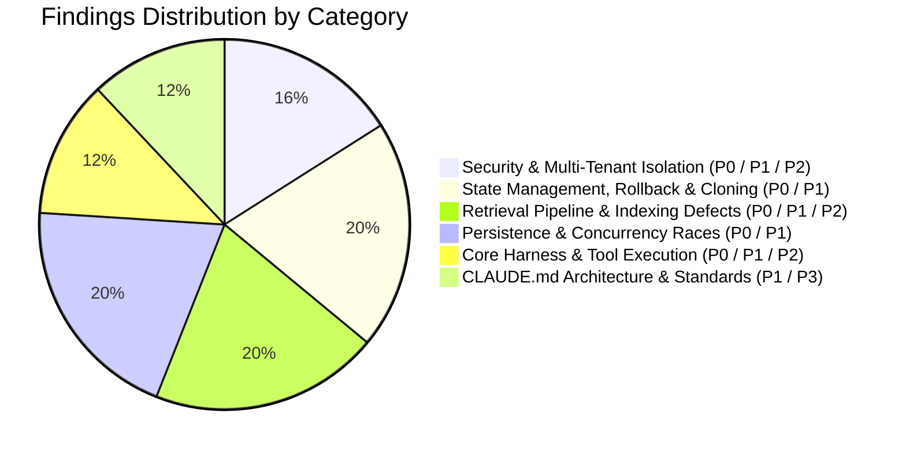

# Comprehensive Codebase Review: `apps/memory-layer`

> **Service**: `apps/memory-layer` (Python 3.12+ / FastAPI / PostgreSQL 16 + pgvector / HydraDB OpenCypher / Google GenAI SDK / sentence-transformers)  
> **Review Scope**: Full-Spectrum Audit (Security Vulnerabilities, Concurrency & State Management, Race Conditions & Thread Safety, Retrieval Pipeline Defects, Ingestion & Bitemporal Data Integrity, PostgreSQL Transaction Safety, [CLAUDE.md](file:///home/aryan-sherigar/projects/AI-DND/CLAUDE.md) Architecture Compliance, Cross-Service Contracts)  
> **Mode**: Read-Only Architecture & Code Quality Audit (Zero Application Source Code Modifications)  
> **Target Environment**: Evaluated against active working tree (including uncommitted modifications to persistence, rollback, and retrieval) with externalized `hydradb/` dependency.  
> **Date**: September 2026  

---

## Executive Summary

An exhaustive, end-to-end codebase review of [`apps/memory-layer`](file:///home/aryan-sherigar/projects/AI-DND/apps/memory-layer) was conducted across its core Python runtime (`src/context_memory`), REST API surface (`src/api`), schema migrations (`db/migrations`), CLI/chat interfaces (`src/chat`), evaluation harness (`src/evaluation`), and test suites (`src/tests`).

The review inspected all critical execution paths:
1. **API & Concurrency**: FastAPI routing, SSE streaming, authentication, and multi-threaded background ingestion.
2. **Ingestion & Entity Resolution**: Bitemporal graph construction, 3-tier entity resolution, candidate blocking, and knowledge update classification.
3. **Retrieval & Ranking**: Temporal query resolution, vector search (pgvector), BM25 full-text indexing, graph expansion (HydraDB OpenCypher), Reciprocal Rank Fusion (RRF), LLM reranking, and low-evidence abstention.
4. **Persistence & Transactions**: PostgreSQL connection pooling, row-level locking, migration execution, and graph manifest validation.
5. **Rollback & Scenario Cloning**: Save-point management, timeline pruning, scenario template direct authoring, and playthrough memory-space cloning.

### Key Metrics & Audit Outcomes
- **Automated Test Discovery**: 495 tests collected via `uv run pytest`. Running the suite revealed immediate runtime failures in `test_api_server.py` and `test_replay.py` (missing committed fixtures).
- **Architecture Contract Enforcement**: `import-linter` execution identified a **broken architectural layer boundary**: `context_memory.persistence.postgres` directly imports `context_memory.ingestion.batch_models`, violating the strictly declared layer hierarchy in `pyproject.toml`.
- **CLAUDE.md Universal Compliance**:
  - **86 functions exceed the 30-line threshold** (e.g., [`GraphExpander.expand`](file:///home/aryan-sherigar/projects/AI-DND/apps/memory-layer/src/context_memory/retrieval/graph_expander.py#L27-L397) is 370 lines; [`CandidateFuser.fuse`](file:///home/aryan-sherigar/projects/AI-DND/apps/memory-layer/src/context_memory/retrieval/fuser.py#L35-L196) is 161 lines).
  - **66 functions have a nesting depth > 2** (with nesting depth reaching up to 8 levels in retrieval and persistence modules).
  - **19 source files import and use `Any` from `typing`**, directly violating the strict prohibition of `Any`.
  - **Environment variables are scattered**: `os.environ.get()` is invoked directly in `api/routes.py`, `api/server.py`, and `evaluation/benchmark_runner.py` rather than exclusively in `context_memory/core/config.py`.
  - **40+ `print()` calls** exist in production CLI and evaluation runner code instead of structured logging.
- **Docker / Host Cache Lockout**: Host-level `.pytest_cache` and `.import_linter_cache` directories were written with `root:root` ownership by containerized builds, blocking local developers from running test commands without explicit cache override flags.

---

### Findings Breakdown by Severity

| Severity | Count | Primary Impact Areas |
|---|:---:|---|
| **Critical (P0)** | 6 | Unauthenticated global SSE data leakage, cross-tenant rollback exploit, in-memory entity registry desync across restarts, master-mode facts omitted from vector/BM25 search (permanent retrieval abstention), dead connection lockup in `StepJournal`, rollback ignoring direct-authored facts. |
| **High (P1)** | 11 | Global engine cold-start race condition, blocking synchronous DB calls in health probes, memory leaks and data races in `_batches`, uncompensated graph writes on ingestion failure, N+1 HTTP expansion queries, concurrent file clobbering in rewrite cache, layer architecture violation, un-locked migrations, direct-authoring self-supersession loop, silent relationship drops in Cypher, and unhandled tool exceptions. |
| **Medium (P2)** | 5 | Timing attack vulnerability in API key check, exposed demo simulation endpoints in production, empty text fact deduplication bypass, missing test fixtures, and boolean/null evaluation bugs in `when_active` expression evaluator. |
| **Low / Standards (P3)** | 3 | CLAUDE.md style rule violations (86 long functions, 66 deep nesting instances, 19 `Any` usages, scattered env vars), host permission lockout on caches, and unstructured `print` calls. |
| **Total Findings** | **25** | |



---

## Severity 0: Critical Vulnerabilities & System Risks

### [CRIT-01] Completely Unauthenticated & Unfiltered Global SSE Graph Stream Disclosing Cross-Tenant Private Game State
- **Severity**: Critical (P0)
- **Category**: Security Vulnerability / Multi-Tenant Data Leakage
- **Location**: [`src/api/server.py:76-95`](file:///home/aryan-sherigar/projects/AI-DND/apps/memory-layer/src/api/server.py#L76-L95), [`src/api/stream.py:8-74`](file:///home/aryan-sherigar/projects/AI-DND/apps/memory-layer/src/api/stream.py#L8-L74)
- **Problem & Root Cause**:
  In [`api/server.py`](file:///home/aryan-sherigar/projects/AI-DND/apps/memory-layer/src/api/server.py), the application includes the main router with API key dependency (`app.include_router(router, dependencies=[Depends(require_api_key)])`). However, the graph streaming endpoint `@app.get("/v1/memory/stream")` is declared directly on `app` **outside the authenticated router and without any authentication dependencies**.
  Furthermore, `api/server.py` monkey-patches `GraphWriter.write` at module load:
  ```python
  original_write = GraphWriter.write
  def patched_write(self, plan):
      res = original_write(self, plan)
      try:
          streamer.broadcast_plan(plan)
      except Exception as e:
          logger.error(f"Error in broadcast: {e}")
      return res
  GraphWriter.write = patched_write
  ```
  `streamer.broadcast_plan` forwards every `GraphWritePlan` from **all playthroughs, scenarios, and users** directly into `streamer.push_event(data)`.
- **Failure Scenario / Impact**:
  Any unauthenticated client on the network can establish an SSE connection to `GET /v1/memory/stream`. Because `GraphStreamer` maintains a global set of queues without any `context_id` or `playthrough_id` filtering, the connected client receives a real-time stream of all graph nodes, properties, player secrets, entity names, and bitemporal facts being written across every active game on the server.
- **Remediation**:
  1. Move `/v1/memory/stream` behind `require_api_key` (or place it inside `router`).
  2. Require a mandatory query parameter `playthrough_id` (or `context_id`).
  3. Refactor `GraphStreamer` to index queues by `context_id`: `self.queues: dict[str, set[asyncio.Queue]]`.
  4. Replace module-level monkey-patching of `GraphWriter.write` with an explicit observer/event bus hook injected via composition.
  ```python
  # Remediation in api/server.py
  @router.get("/v1/memory/stream")
  async def stream_graph(request: Request, context_id: str):
      q = streamer.add_queue(context_id)
      async def event_generator():
          try:
              while True:
                  if await request.is_disconnected():
                      break
                  try:
                      data = await asyncio.wait_for(q.get(), timeout=1.0)
                      yield f"data: {json.dumps(data)}\n\n"
                  except asyncio.TimeoutError:
                      yield ": keepalive\n\n"
          finally:
              streamer.remove_queue(context_id, q)
      return StreamingResponse(event_generator(), media_type="text/event-stream")
  ```

---

### [CRIT-02] Unauthenticated Multi-Tenant Rollback Endpoint Allowing Cross-Playthrough Memory Erasure
- **Severity**: Critical (P0)
- **Category**: Security Vulnerability / Multi-Tenant State Corruption
- **Location**: [`src/api/routes.py:320-330`](file:///home/aryan-sherigar/projects/AI-DND/apps/memory-layer/src/api/routes.py#L320-L330)
- **Problem & Root Cause**:
  In [`core/agent_tools.py:106-130`](file:///home/aryan-sherigar/projects/AI-DND/apps/memory-layer/src/context_memory/core/agent_tools.py#L106-L130), the codebase author explicitly warned:
  > *"MemoryEngine.rollback_to(save_id) resolves save_id's own context_id internally and rolls back WHATEVER playthrough that save point belongs to -- regardless of which playthrough this agent turn is actually scoped to. Without this hook, a prompt-injected end user could roll back a DIFFERENT playthrough's memory just by getting the model to call this tool with a save_id it was never meant to have."*
  
  Despite this explicit recognition, the public REST endpoint in [`api/routes.py`](file:///home/aryan-sherigar/projects/AI-DND/apps/memory-layer/src/api/routes.py) accepts only a bare `save_id` with **zero context verification**:
  ```python
  @router.post("/v1/memory/rollback/{save_id}", response_model=RollbackResponse)
  def rollback_to_save_point(save_id: str, engine: MemoryEngine = Depends(get_engine)) -> RollbackResponse:
      try:
          result = engine.rollback_to(save_id)
      except ValueError as e:
          raise HTTPException(status_code=status.HTTP_404_NOT_FOUND, detail=str(e)) from e
      return RollbackResponse(...)
  ```
- **Failure Scenario / Impact**:
  `save_id` is an integer or string identifier generated per save point. An attacker or rogue client can invoke `POST /v1/memory/rollback/{save_id}` targeting foreign `save_id`s, instantly archiving facts and destroying the active timeline of unrelated players or scenarios.
- **Remediation**:
  Require `context_id` (or `playthrough_id`) in the request and verify that `save_point.context_id == context_id` before executing the rollback.
  ```python
  # Remediation in api/routes.py
  @router.post("/v1/memory/{context_id}/rollback/{save_id}", response_model=RollbackResponse)
  def rollback_to_save_point(
      context_id: str, save_id: str, engine: MemoryEngine = Depends(get_engine)
  ) -> RollbackResponse:
      save_point = engine.get_save_point(save_id)
      if save_point is None or save_point.context_id != context_id:
          raise HTTPException(status_code=status.HTTP_404_NOT_FOUND, detail="Save point not found for context")
      result = engine.rollback_to(save_id)
      return RollbackResponse(...)
  ```

---

### [CRIT-03] Volatile In-Memory Entity Registry Minting Duplicate Broken Entities Across Restarts & Replicas
- **Severity**: Critical (P0)
- **Category**: State Management / Knowledge Graph Corruption
- **Location**: [`src/context_memory/ingestion/entity_registry.py:33-60, 117-124`](file:///home/aryan-sherigar/projects/AI-DND/apps/memory-layer/src/context_memory/ingestion/entity_registry.py#L33-L60), [`src/context_memory/composition.py:117-121`](file:///home/aryan-sherigar/projects/AI-DND/apps/memory-layer/src/context_memory/composition.py#L117-L121)
- **Problem & Root Cause**:
  `EntityRegistry` manages entity canonicalization, aliases, and 3-tier resolution. Its state is stored **exclusively in in-memory Python dictionaries**:
  ```python
  self._profiles: dict[int, EntityProfile] = {}
  self._profile_ids_by_context: dict[str, list[int]] = {}
  ```
  `EntityNameIndex` is likewise an ephemeral in-memory embedding array.
  When the process starts, `self._profiles` is completely empty. It is **never hydrated from PostgreSQL or HydraDB**, nor does `_in_context(context_id)` fall back to querying PostgreSQL or HydraDB when an entity is not found in memory.
- **Failure Scenario / Impact**:
  1. Turn 1 of a playthrough ingests facts mentioning `"Lord Farquaad"`, minting `graph_id=101` and writing it to HydraDB.
  2. The application server restarts, or a second Uvicorn worker process receives Turn 2.
  3. Turn 2 mentions `"Lord Farquaad"`. `entity_registry._in_context(context_id)` returns `[]`.
  4. Exact match fails, nickname blocking fails, and semantic candidate retrieval returns empty.
  5. The registry concludes `"Lord Farquaad"` does not exist. It mints a **new entity** (`graph_id=102`) and writes a duplicate `Entity` node to HydraDB.
  6. Graph traversals, path counts, and entity boosts are split across multiple disconnected nodes for the same entity, degrading retrieval recall and corrupting the knowledge graph.
- **Remediation**:
  Back `EntityRegistry` and `EntityNameIndex` with persistent PostgreSQL tables (or hydrate existing entities from `graph_write_manifests` / HydraDB for the given `context_id` upon the first request for that context).
  ```python
  def _in_context(self, context_id: str) -> list[EntityProfile]:
      if context_id not in self._hydrated_contexts:
          self._hydrate_context_from_db(context_id)
      return [self._profiles[gid] for gid in self._profile_ids_by_context.get(context_id, ())]
  ```

---

### [CRIT-04] Master-Mode & Template Facts Omitted from Postgres Vector & BM25 Indexes (Permanent Retrieval Abstention)
- **Severity**: Critical (P0)
- **Category**: Retrieval Pipeline Failure / Core Feature Break
- **Location**: [`src/context_memory/ingestion/direct_authoring.py:134-238`](file:///home/aryan-sherigar/projects/AI-DND/apps/memory-layer/src/context_memory/ingestion/direct_authoring.py#L134-L238), [`src/context_memory/cloning/template_clone.py:77-136`](file:///home/aryan-sherigar/projects/AI-DND/apps/memory-layer/src/context_memory/cloning/template_clone.py#L77-L136), [`src/context_memory/retrieval/seeder.py:26-99`](file:///home/aryan-sherigar/projects/AI-DND/apps/memory-layer/src/context_memory/retrieval/seeder.py#L26-L99)
- **Problem & Root Cause**:
  In Master Mode, creators specify structured facts directly via [`direct_authoring.write_fact`](file:///home/aryan-sherigar/projects/AI-DND/apps/memory-layer/src/context_memory/ingestion/direct_authoring.py#L134).
  `write_fact` writes the Fact node to HydraDB, stores `external_fact_id`, and writes `fact_metadata`.
  **It never generates vector embeddings, never writes to `memory_embeddings`, and never writes to `fact_search_index`**.
  Furthermore, when a scenario is cloned to a playthrough in [`cloning/template_clone.py`](file:///home/aryan-sherigar/projects/AI-DND/apps/memory-layer/src/context_memory/cloning/template_clone.py), `clone()` copies HydraDB nodes and `fact_metadata`, but **does not copy or generate any rows in `memory_embeddings` or `fact_search_index`**.
  However, Retrieval Phase 1 ([`CandidateSeeder.seed`](file:///home/aryan-sherigar/projects/AI-DND/apps/memory-layer/src/context_memory/retrieval/seeder.py#L19)) queries **only** `memory_embeddings` and `fact_search_index`.
- **Failure Scenario / Impact**:
  When a player plays a scenario created in Master Mode, Turn Resolution Service calls `POST /v1/memory/query`.
  `CandidateSeeder.seed()` executes semantic vector search and BM25 search. Both return **0 rows** because the PostgreSQL tables contain no entries for that playthrough.
  Because `seed_facts` is empty, Phase 2 graph expansion never executes.
  Phase 3 `CandidateFuser.fuse()` immediately triggers the Low-Evidence Abstention Gate:
  ```python
  if not ranked:
      return None
  ```
  The AI Narrator receives an empty fact list on **every single turn**. The entire Master Mode authoring and gameplay loop is completely non-functional.
- **Remediation**:
  1. In `direct_authoring.write_fact`, inject `embedder`, `embedding_store`, and `search_index_store`. Generate an embedding for `display_text` and insert rows into `memory_embeddings` and `fact_search_index`.
  2. In `cloning/template_clone.py`, copy all `memory_embeddings` and `fact_search_index` rows from `source_context_id` to `target_context_id`, updating `subject_id` to the remapped `new_fact_id`.

---

### [CRIT-05] Single Unpooled Postgres Connection in `StepJournal` Causing Permanent Silent Journal Outage on Connection Drops
- **Severity**: Critical (P0)
- **Category**: Reliability / Concurrency / Silent Failure
- **Location**: [`src/context_memory/composition.py:207-208`](file:///home/aryan-sherigar/projects/AI-DND/apps/memory-layer/src/context_memory/composition.py#L207-L208), [`src/context_memory/core/journal.py:141-205`](file:///home/aryan-sherigar/projects/AI-DND/apps/memory-layer/src/context_memory/core/journal.py#L141-L205)
- **Problem & Root Cause**:
  In [`composition.py:207`](file:///home/aryan-sherigar/projects/AI-DND/apps/memory-layer/src/context_memory/composition.py#L207):
  ```python
  journal_connection = psycopg.connect(config.database_url, autocommit=True) if config.step_journal_enabled else None
  journal = StepJournal(journal_connection) if journal_connection is not None else None
  ```
  `StepJournal` holds this single unpooled `psycopg` connection for the entire lifetime of the process.
  In [`core/journal.py:168-204`](file:///home/aryan-sherigar/projects/AI-DND/apps/memory-layer/src/context_memory/core/journal.py#L168-L204):
  ```python
  try:
      with self._lock, self._connection.transaction():
          with self._connection.cursor() as cursor:
              cursor.execute("INSERT INTO journal_steps ...")
  except Exception as e:
      logger.warning("failed to journal step (ignored): %s", e)
      return None
  ```
  If the connection is closed due to a database restart, idle timeout (e.g., Cloud SQL 10-minute idle drop), or network hiccup, `self._connection.transaction()` fails with `psycopg.OperationalError`.
- **Failure Scenario / Impact**:
  Because `record()` catches all exceptions and logs a warning without reconnecting, **the single connection remains dead indefinitely**. Every subsequent LLM step, tool call, and audit event fails silently for the remaining uptime of the application server. Tracing and step auditing permanently go completely dark.
- **Remediation**:
  Do not pass a raw connection to `StepJournal`. Pass the shared `ConnectionPool` (or a dedicated pool) and acquire a fresh connection per transaction:
  ```python
  # Remediation in core/journal.py
  def __init__(self, pool: ConnectionPool) -> None:
      self._pool = pool

  def record(self, ...):
      try:
          with self._pool.connection() as conn:
              with conn.transaction():
                  with conn.cursor() as cursor:
                      cursor.execute("INSERT INTO journal_steps ...")
      except Exception as e:
          logger.warning("failed to journal step (ignored): %s", e)
  ```

---

### [CRIT-06] Direct-Authored Facts Completely Ignored by Rollback Service (State Desynchronization & Silent Corruption)
- **Severity**: Critical (P0)
- **Category**: State Management / Data Integrity
- **Location**: [`src/context_memory/ingestion/rollback.py:142-154, 178-189`](file:///home/aryan-sherigar/projects/AI-DND/apps/memory-layer/src/context_memory/ingestion/rollback.py#L142-L154)
- **Problem & Root Cause**:
  `RollbackService` identifies facts to archive using the following query:
  ```python
  def _find_archived_candidates(self, save_point: SavePoint) -> list[str]:
      with self._pool.connection() as conn:
          with conn.cursor() as cursor:
              cursor.execute(
                  "SELECT c.candidate_id FROM extracted_memory_candidates c "
                  "JOIN extraction_attempts a ON c.attempt_id = a.attempt_id "
                  "WHERE a.context_id = %s AND c.observed_at > %s",
                  (save_point.context_id, save_point.cutoff_observed_at),
              )
              return [row[0] for row in cursor.fetchall()]
  ```
  And restores superseded facts by querying `extracted_memory_candidates`:
  ```python
  cursor.execute(
      "SELECT candidate_id, valid_to FROM extracted_memory_candidates WHERE candidate_id = ANY(%s)",
      (list(restore_set),),
  )
  ```
  Facts created through Master Mode or direct tool actions (`write_template_fact`, `write_fact`) are **never written to `extraction_attempts` or `extracted_memory_candidates`** (they are registered in `graph_write_manifests` and `external_fact_ids`).
- **Failure Scenario / Impact**:
  If a creator or game master authors new facts or supersedes existing facts after a save point is established and subsequently issues a rollback:
  - All direct-authored facts created after the save point **survive the rollback** and remain active in HydraDB.
  - Any direct-authored facts that were superseded **are never restored**.
  The graph is left in an unrecoverable, half-rolled-back hybrid state where past and future timelines collide.
- **Remediation**:
  Query `graph_write_manifests` (or HydraDB's Fact nodes by `created_at / observed_at`) rather than `extracted_memory_candidates` alone, so that all facts—both extracted and direct-authored—are accurately identified and reverted.

---

## Severity 1: High Risks & Structural Deficiencies

### [HIGH-01] Unsynchronized Lazy Initialization of `_GLOBAL_ENGINE` Leaking DB Pools, Models & Causing Migration Collisions
- **Severity**: High (P1)
- **Category**: Concurrency / Race Condition
- **Location**: [`src/api/routes.py:36-44`](file:///home/aryan-sherigar/projects/AI-DND/apps/memory-layer/src/api/routes.py#L36-L44), [`src/context_memory/composition.py:165-253`](file:///home/aryan-sherigar/projects/AI-DND/apps/memory-layer/src/context_memory/composition.py#L165-L253)
- **Problem & Root Cause**:
  `get_engine()` implements double-check-free lazy initialization without a lock:
  ```python
  _GLOBAL_ENGINE: MemoryEngine | None = None
  def get_engine() -> MemoryEngine:
      global _GLOBAL_ENGINE
      if _GLOBAL_ENGINE is None:
          _GLOBAL_ENGINE = build_memory_engine()
      return _GLOBAL_ENGINE
  ```
  FastAPI executes endpoints in an AnyIO worker thread pool. When multiple requests arrive simultaneously at startup, several threads enter `build_memory_engine()` in parallel.
- **Failure Scenario / Impact**:
  Each thread creates a separate `psycopg_pool.ConnectionPool`, instantiates a separate PyTorch SentenceTransformer model in memory (consuming ~500MB RAM each), and runs `apply_migrations()` concurrently against PostgreSQL. This leads to connection leaks, severe memory spikes, and startup migration collisions on the `schema_migrations` table.
- **Remediation**:
  Initialize `MemoryEngine` during FastAPI's lifespan startup handler (`@asynccontextmanager async def lifespan(app)`), and use a threading lock if lazy retrieval is needed.

---

### [HIGH-02] Synchronous Health Checks Blocking AnyIO Worker Threads on DB/Network Latency (`/health` & `/v1/health`)
- **Severity**: High (P1)
- **Category**: Performance / Thread Pool Starvation
- **Location**: [`src/api/routes.py:353-384`](file:///home/aryan-sherigar/projects/AI-DND/apps/memory-layer/src/api/routes.py#L353-L384), [`src/api/server.py:72-74`](file:///home/aryan-sherigar/projects/AI-DND/apps/memory-layer/src/api/server.py#L72-L74)
- **Problem & Root Cause**:
  `health_check()` is defined as a synchronous `def` function. Inside it, it opens a fresh synchronous connection to Postgres (`psycopg.connect(connect_timeout=2)`) and performs a synchronous HTTP GET request via `httpx.get(..., timeout=2.0)`.
- **Failure Scenario / Impact**:
  In production, container orchestrators (Kubernetes / Docker) ping `/health` every 2–5 seconds. If Postgres or HydraDB becomes slow or temporarily unreachable, each health check blocks an AnyIO threadpool worker for up to 4 seconds. Under high concurrency, health check probes quickly consume all available thread pool workers, causing the entire API to stop accepting incoming traffic.
  Additionally, running `pytest src/tests/test_api_server.py` fails outright whenever live databases are offline because `health_check()` returns `"degraded"` instead of `"ok"`.
- **Remediation**:
  Convert `health_check` to `async def`, reuse the application's existing connection pool rather than opening fresh TCP connections, and use `httpx.AsyncClient` with a short 500ms timeout.

---

### [HIGH-03] Unbounded Memory Leak in In-Memory `_batches` Dictionary & Data Races on Concurrent Batch Ingestion
- **Severity**: High (P1)
- **Category**: Memory Leak / State Management / Race Condition
- **Location**: [`src/context_memory/engine.py:261, 276, 288, 307-330`](file:///home/aryan-sherigar/projects/AI-DND/apps/memory-layer/src/context_memory/engine.py#L261)
- **Problem & Root Cause**:
  `MemoryEngine` stores background batches in `self._batches: dict[str, dict[str, object]] = {}`. Entries are never evicted, pruned, or expired.
  In addition, `retry_batch(batch_id)` allows resubmitting an already running batch:
  ```python
  entry["result"] = None
  entry["error"] = None
  self._batch_store.clear_run_error(batch_id)
  self._executor.submit(ctx_snapshot.run, self._run_batch_safe, batch_id, batch)
  ```
- **Failure Scenario / Impact**:
  1. Long-running instances process thousands of turn batches, causing `self._batches` to grow unbounded with `ContextBatch` and `ExtractionResult` objects, eventually causing an Out-Of-Memory (OOM) crash.
  2. If a client triggers `retry_batch` while a batch is still mid-execution, two threads execute `_orchestrator.run_batch(batch)` simultaneously for the identical chunk IDs. Both threads attempt to extract, write to HydraDB, and insert embeddings concurrently, resulting in duplicate records, manifest conflicts, and race conditions.
- **Remediation**:
  Replace `self._batches` with a bounded LRU cache or read state exclusively from the durable `PostgresBatchStore`. Implement an atomic state transition check in `retry_batch` to reject retrying batches that are currently in-flight.

---

### [HIGH-04] Partial Ingestion Failure Leaves Orphaned Graph Writes in HydraDB Without Compensation or Reversion
- **Severity**: High (P1)
- **Category**: Data Consistency / Knowledge Graph Corruption
- **Location**: [`src/context_memory/ingestion/orchestrator.py:203-228, 378-400`](file:///home/aryan-sherigar/projects/AI-DND/apps/memory-layer/src/context_memory/ingestion/orchestrator.py#L203-L228)
- **Problem & Root Cause**:
  In `_run_group`, the orchestrator writes the graph plan to HydraDB:
  ```python
  self._graph_writer.write_many([p[2] for p in pending])
  ```
  If the subsequent embedding stage (`_build_embeddings` / `_persist_embeddings_and_index`) or post-write verification (`_verify`) fails, `_fail_pending` marks the chunks as `RETRYABLE_FAILED`.
  However, **the nodes and relationships already written to HydraDB are never rolled back or archived**.
- **Failure Scenario / Impact**:
  When the failed batch is retried, `_extract_and_plan` calls LLM extraction again. If LLM extraction produces slightly different facts or new candidate IDs, new graph elements are written alongside the old ones. The original facts remain in HydraDB as orphaned "ghost" nodes without corresponding vector embeddings or search index entries, distorting graph path queries (`algo.MSpaths`) and entity statistics.
- **Remediation**:
  Implement compensating transactions or soft-archive flags for HydraDB writes if downstream embedding or verification stages fail before the job is marked `COMPLETED`.

---

### [HIGH-05] Ephemeral ThreadPool Spawning & N+1 HTTP Calls in Graph Expansion Destroying Keep-Alive Caches
- **Severity**: High (P1)
- **Category**: Performance Bottleneck / Resource Exhaustion
- **Location**: [`src/context_memory/retrieval/graph_expander.py:123-165`](file:///home/aryan-sherigar/projects/AI-DND/apps/memory-layer/src/context_memory/retrieval/graph_expander.py#L123-L165), [`src/context_memory/retrieval/engine.py:349-375`](file:///home/aryan-sherigar/projects/AI-DND/apps/memory-layer/src/context_memory/retrieval/engine.py#L349-L375), [`src/context_memory/client/hydradb_http.py:108-123`](file:///home/aryan-sherigar/projects/AI-DND/apps/memory-layer/src/context_memory/client/hydradb_http.py#L108-L123)
- **Problem & Root Cause**:
  On every retrieval request, [`GraphExpander.expand`](file:///home/aryan-sherigar/projects/AI-DND/apps/memory-layer/src/context_memory/retrieval/graph_expander.py#L159) instantiates a temporary thread pool:
  ```python
  with ThreadPoolExecutor(max_workers=self._config.retrieval_graph_fetch_workers) as pool:
      futures = [pool.submit(self._fetch_node, fid, gid) for fid, gid in ...]
  ```
  Similarly, [`HybridRetrievalEngine._retrieve_ranked`](file:///home/aryan-sherigar/projects/AI-DND/apps/memory-layer/src/context_memory/retrieval/engine.py#L369) instantiates `with ThreadPoolExecutor(max_workers=2) as thread_pool:` on every call.
- **Failure Scenario / Impact**:
  Creating and tearing down `ThreadPoolExecutor` instances per HTTP request incurs thread creation/destruction overhead and causes thread pool thrashing under sustained query load.
  Furthermore, `HydraHttpTransport` attempts to optimize HTTP connections via `threading.local()` (`_connections.cache`). Because worker threads in ephemeral pools are terminated when the `with` block exits, the cached HTTP connections are discarded immediately, forcing fresh TCP handshakes and defeating the keep-alive optimization.
- **Remediation**:
  Maintain a single, long-lived `ThreadPoolExecutor` at the engine or service level, or migrate `HydraHttpTransport` to an asynchronous HTTP connection pool (`httpx.AsyncClient`).

---

### [HIGH-06] Multi-Process Temp File Race Condition & Cache Eviction in `JsonFileRewriteCache`
- **Severity**: High (P1)
- **Category**: Concurrency / Data Loss
- **Location**: [`src/context_memory/retrieval/query_rewriter.py:20-60`](file:///home/aryan-sherigar/projects/AI-DND/apps/memory-layer/src/context_memory/retrieval/query_rewriter.py#L20-L60)
- **Problem & Root Cause**:
  `JsonFileRewriteCache._flush` writes to a non-unique temporary file:
  ```python
  tmp = self._path.with_suffix(self._path.suffix + ".tmp")
  tmp.write_text(json.dumps({k: v.model_dump() for k, v in self._data.items()}))
  tmp.replace(self._path)
  ```
  In addition, `self._data` is loaded into memory only once at `__init__`.
- **Failure Scenario / Impact**:
  When multiple Uvicorn worker processes run concurrently:
  1. Process A and Process B write to the exact same temporary file `cache.json.tmp` simultaneously, causing corrupted JSON writes.
  2. Process B overwrites `cache.json` with its own stale in-memory snapshot, silently deleting cache entries written by Process A.
- **Remediation**:
  Use `tempfile.NamedTemporaryFile` in the same directory and acquire an exclusive file lock (`fcntl.flock(f.fileno(), fcntl.LOCK_EX)`) before reading, writing, and atomic renaming.

---

### [HIGH-07] Circular / Reverse Architectural Layer Dependency (`persistence.postgres` -> `ingestion.batch_models`)
- **Severity**: High (P1)
- **Category**: Architecture Violation / Contract Drift
- **Location**: [`src/context_memory/persistence/postgres.py:24`](file:///home/aryan-sherigar/projects/AI-DND/apps/memory-layer/src/context_memory/persistence/postgres.py#L24), [`pyproject.toml:53-62`](file:///home/aryan-sherigar/projects/AI-DND/apps/memory-layer/pyproject.toml#L53-L62)
- **Problem & Root Cause**:
  `pyproject.toml` defines strict internal layering contracts:
  ```toml
  [[tool.importlinter.contracts]]
  name = "context_memory internal layering"
  type = "layers"
  layers = [
      "composition",
      "engine",
      "ingestion | retrieval",
      "persistence | client",
      "core",
  ]
  ```
  `persistence.postgres` imports `BatchStatus` from `context_memory.ingestion.batch_models`.
  Running `lint-imports` confirms:
  `context_memory.persistence is not allowed to import context_memory.ingestion: context_memory.persistence.postgres -> context_memory.ingestion.batch_models (l.24)`.
- **Failure Scenario / Impact**:
  Couples the low-level persistence adapter to higher-level domain ingestion models, creating circular dependency hazards and breaking automated import boundary gating.
- **Remediation**:
  Move `BatchStatus` from `context_memory.ingestion.batch_models` into `context_memory.core.models` so both `ingestion` and `persistence` can depend on it lawfully.

---

### [HIGH-08] Missing PostgreSQL Advisory Locks in Schema Migration Runner (`apply_migrations`)
- **Severity**: High (P1)
- **Category**: Database Concurrency / Race Condition
- **Location**: [`src/context_memory/persistence/migrations.py:65-88`](file:///home/aryan-sherigar/projects/AI-DND/apps/memory-layer/src/context_memory/persistence/migrations.py#L65-L88)
- **Problem & Root Cause**:
  `apply_migrations()` checks `schema_migrations` and applies pending `.sql` files inside a standard transaction, but **without acquiring an advisory lock**:
  ```python
  with connection.transaction():
      with connection.cursor() as cursor:
          cursor.execute(MIGRATION_TABLE_SQL)
          for migration in migrations:
              cursor.execute("SELECT checksum FROM schema_migrations WHERE version = %s", (migration.version,))
  ```
- **Failure Scenario / Impact**:
  When multiple server instances or worker processes start concurrently, both execute `apply_migrations` at the same time. Both observe that migration `0014` is missing and both attempt `CREATE TABLE external_fact_ids ...`, causing a `DuplicateTableError` or primary key collision on `schema_migrations` that aborts container startup.
- **Remediation**:
  Acquire a transactional advisory lock at the start of `apply_migrations`:
  ```python
  cursor.execute("SELECT pg_advisory_xact_lock(718293849102938)")
  ```

---

### [HIGH-09] Direct Authoring Self-Supersession Infinite Loop on Fact Triple Collisions
- **Severity**: High (P1)
- **Category**: Logic Bug / State Corruption
- **Location**: [`src/context_memory/ingestion/direct_authoring.py:163-224, 241-248`](file:///home/aryan-sherigar/projects/AI-DND/apps/memory-layer/src/context_memory/ingestion/direct_authoring.py#L163-L224)
- **Problem & Root Cause**:
  In [`direct_authoring.py`](file:///home/aryan-sherigar/projects/AI-DND/apps/memory-layer/src/context_memory/ingestion/direct_authoring.py), `_fact_logical_key` is computed exclusively from `(subject, predicate, object)`:
  ```python
  raw = f"{fact.subject_canonical_name}\x00{fact.predicate}\x00{object_part}"
  return f"fact:direct:{hashlib.sha256(raw.encode('utf-8')).hexdigest()[:24]}"
  ```
  If an author modifies a fact's validity timestamp, checkpoint, or visibility and marks it as superseding the previous version (`fact.superseded_fact_id`), the new fact produces the **exact same `fact_key`** and `fact_graph_id` as the prior fact.
- **Failure Scenario / Impact**:
  `fact_graph_id == prior_graph_id`. The code creates a relationship where `(Fact)-[:SUPERSEDES]->(Fact)` points to itself and updates `is_current=False` on the same node. The updated fact immediately inactivates itself, vanishing from active memory.
- **Remediation**:
  Include a version identifier, creator timestamp, or external fact id in `_fact_logical_key` when supersession is requested.

---

### [HIGH-10] Silently Dropped Edges When Authoring Facts Before Entities in OpenCypher Execution
- **Severity**: High (P1)
- **Category**: Logic Bug / Silent Data Loss
- **Location**: [`src/context_memory/ingestion/direct_authoring.py:180-193`](file:///home/aryan-sherigar/projects/AI-DND/apps/memory-layer/src/context_memory/ingestion/direct_authoring.py#L180-L193), [`src/context_memory/ingestion/graph_writer.py:194-197`](file:///home/aryan-sherigar/projects/AI-DND/apps/memory-layer/src/context_memory/ingestion/graph_writer.py#L194-L197)
- **Problem & Root Cause**:
  `write_fact()` allocates entity IDs and emits `ABOUT` and `RELATES_TO` edges, but does not include the entity vertices in `plan.nodes`.
  HydraDB executes relationship writes via:
  ```cypher
  UNWIND $rows AS row MATCH (s:Fact {id: row.source_id}), (d:Entity {id: row.destination_id})
  MERGE (s)-[r:ABOUT {id: row.id}]->(d) SET ...
  ```
  If `(d:Entity)` has not yet been written to HydraDB, OpenCypher's `MATCH` returns an empty row for that record. `MERGE` is never reached.
- **Failure Scenario / Impact**:
  If a scenario publishes facts before entities, or if an author mistypes an entity name, **HydraDB silently creates 0 relationships with zero error**. The fact is written as a disconnected vertex, and `GraphWriter.verify()` does not check relationships. The fact becomes permanently orphaned from all entity-based graph queries.
- **Remediation**:
  In `direct_authoring.write_fact`, verify that entity nodes exist or auto-populate stub Entity nodes in `plan.nodes` using `MERGE (e:Entity {id: ...})`.

---

### [HIGH-11] Unguarded Tool Handler Exceptions Crashing Entire Agent Turns in `run_tool_loop`
- **Severity**: High (P1)
- **Category**: Robustness / Unhandled Crash
- **Location**: [`src/context_memory/core/tool_loop.py:65-76`](file:///home/aryan-sherigar/projects/AI-DND/apps/memory-layer/src/context_memory/core/tool_loop.py#L65-L76)
- **Problem & Root Cause**:
  In `run_tool_loop`:
  ```python
  for tool_call in message.tool_calls:
      try:
          args = json.loads(tool_call.function.arguments or "{}")
          result = executor.execute(tool_call.function.name, args)
          content = json.dumps(result)
      except (ToolNotFoundError, ToolDeniedError, json.JSONDecodeError) as error:
          content = json.dumps({"error": str(error)})
      messages.append({"role": "tool", "tool_call_id": tool_call.id, "content": content})
  ```
- **Failure Scenario / Impact**:
  If a tool handler raises any internal domain exception (e.g. `psycopg.Error`, `KeyError`, `ValueError`, network timeout), `GuardedToolExecutor.execute()` re-raises it. Because `run_tool_loop` catches only `ToolNotFoundError`, `ToolDeniedError`, and `JSONDecodeError`, **the unhandled exception escapes and crashes the entire turn** instead of feeding the error back to the LLM to explain or recover.
- **Remediation**:
  Catch `Exception` in `run_tool_loop`, record the failure, and return `{"error": f"{type(error).__name__}: {error}"}` as tool content.

---

## Severity 2: Medium Logic, Edge Cases & Operational Bugs

### [MED-01] Non-Constant-Time API Key Header Comparison Vulnerable to Timing Attacks
- **Severity**: Medium (P2)
- **Category**: Security / Cryptographic Best Practice
- **Location**: [`src/api/routes.py:58-64`](file:///home/aryan-sherigar/projects/AI-DND/apps/memory-layer/src/api/routes.py#L58-L64)
- **Problem & Root Cause**:
  `require_api_key` compares the incoming `Authorization` header with standard Python string inequality (`if authorization != f"Bearer {expected}":`).
- **Failure Scenario / Impact**:
  Standard string equality comparison returns early on the first mismatched byte, leaking key character positions through response timing variations.
- **Remediation**:
  Use `secrets.compare_digest`:
  ```python
  import secrets
  if not secrets.compare_digest(authorization or "", f"Bearer {expected}"):
      raise HTTPException(status.HTTP_401_UNAUTHORIZED, "missing or invalid API key")
  ```

---

### [MED-02] Production Exposure of Mock Demo Endpoints (`/v1/demo/clear` and `/v1/demo/simulate`)
- **Severity**: Medium (P2)
- **Category**: Operational Security / API Hygiene
- **Location**: [`src/api/routes.py:386-498`](file:///home/aryan-sherigar/projects/AI-DND/apps/memory-layer/src/api/routes.py#L386-L498)
- **Problem & Root Cause**:
  Routes `/v1/demo/clear` and `/v1/demo/simulate` remain active in the primary router.
  `/v1/demo/clear` triggers `streamer.push_event({"type": "graph_clear"})`, and `/v1/demo/simulate` runs a background task broadcasting hardcoded synthetic demo data ("Alice", "TechCorp").
- **Failure Scenario / Impact**:
  Any caller hitting `/v1/demo/clear` clears the graph visualization for all currently connected players in production.
- **Remediation**:
  Gate demo routes behind a development environment flag (`if config.environment == "development": ...`) or remove them from the production router.

---

### [MED-03] Empty-Text Fact Deduplication Bypass in Candidate Fuser
- **Severity**: Medium (P2)
- **Category**: Logic Bug / Retrieval Quality
- **Location**: [`src/context_memory/retrieval/fuser.py:156-164`](file:///home/aryan-sherigar/projects/AI-DND/apps/memory-layer/src/context_memory/retrieval/fuser.py#L156-L164)
- **Problem & Root Cause**:
  In `CandidateFuser.fuse`:
  ```python
  seen_text: set[str] = set()
  deduped: list[ScoredFact] = []
  for fact in ranked:
      key = (fact.text or "").strip().casefold()
      if key and key in seen_text:
          continue
      if key:
          seen_text.add(key)
      deduped.append(fact)
  ```
- **Failure Scenario / Impact**:
  If `fact.text` is empty (which occurs when semantic search seeds facts whose text has not yet been backfilled), `key` is `""`. `if key:` evaluates to `False`. The fact is appended to `deduped` without deduplication, allowing duplicate empty facts into the reader/reranker window.
- **Remediation**:
  Deduplicate on `(fact.subject, fact.predicate, fact.object)` or `fact.fact_id` when `fact.text` is empty.

---

### [MED-04] Broken Unit Test Suite Due to Missing Benchmark Fixture Files
- **Severity**: Medium (P2)
- **Category**: Test Integrity
- **Location**: [`src/tests/test_replay.py:16-17, 43`](file:///home/aryan-sherigar/projects/AI-DND/apps/memory-layer/src/tests/test_replay.py#L16-L17)
- **Problem & Root Cause**:
  `test_replay.py` defines:
  ```python
  FIXTURE_PATH = Path(__file__).resolve().parents[2] / "benchmarks" / "fixtures" / "reader_sample_turn.json"
  ```
  The directory `benchmarks/fixtures/` does not exist in the repository. Running the test suite immediately raises `FileNotFoundError`.
- **Remediation**:
  Commit the missing fixture files or update `FIXTURE_PATH` to reference the existing fixtures located in `docs/fixtures/`.

---

### [MED-05] Flawed None-Value Handling & Operator Precedence Ambiguity in Expression Evaluator
- **Severity**: Medium (P2)
- **Category**: Logic Bug / Edge Cases
- **Location**: [`src/context_memory/retrieval/expression_eval.py:51-58, 70-78`](file:///home/aryan-sherigar/projects/AI-DND/apps/memory-layer/src/context_memory/retrieval/expression_eval.py#L51-L58)
- **Problem & Root Cause**:
  In `evaluate_expression`:
  ```python
  actual = _resolve_field(expression["field"], game_state)
  result = actual is not None and _safe_compare(_OPERATORS[op], actual, expression.get("value"))
  if result and "AND" in expression:
      result = evaluate_expression(expression["AND"], game_state)
  if not result and "OR" in expression:
      result = evaluate_expression(expression["OR"], game_state)
  ```
- **Failure Scenario / Impact**:
  1. If an author writes a condition checking whether a field is null (`"field": "player.status", "op": "==", "value": None`), `actual is not None` evaluates to `False`, making null equality impossible to satisfy.
  2. The chaining of `if result and "AND"` followed by `if not result and "OR"` means that if `A AND B` fails on `B`, it immediately evaluates `OR C`, altering conventional operator precedence without warning.
- **Remediation**:
  Allow explicit comparison against `None` when `expression.get("value") is None`, and formalize operator precedence.

---

## Severity 3: Architecture & Standards (CLAUDE.md Compliance)

### [LOW-01] CLAUDE.md Universal Rule Violations
- **Severity**: Low / Standards (P3)
- **Category**: Code Quality / Architecture Guidelines
- **Audited Metrics**:
  - **Function length <= 30 lines**: **86 functions violate this rule**. Examples:
    - [`GraphExpander.expand`](file:///home/aryan-sherigar/projects/AI-DND/apps/memory-layer/src/context_memory/retrieval/graph_expander.py#L27): **370 lines**.
    - [`CandidateFuser.fuse`](file:///home/aryan-sherigar/projects/AI-DND/apps/memory-layer/src/context_memory/retrieval/fuser.py#L35): **161 lines**.
    - [`EntityRegistry.resolve_many`](file:///home/aryan-sherigar/projects/AI-DND/apps/memory-layer/src/context_memory/ingestion/entity_registry.py#L267): **141 lines**.
    - [`GraphPlanBuilder.build`](file:///home/aryan-sherigar/projects/AI-DND/apps/memory-layer/src/context_memory/ingestion/graph_plan_builder.py#L88): **125 lines**.
    - [`SiblingExpander.find_siblings`](file:///home/aryan-sherigar/projects/AI-DND/apps/memory-layer/src/context_memory/retrieval/sibling_expander.py#L18): **108 lines**.
  - **Nesting depth <= 2 levels**: **66 functions violate this rule**. Examples:
    - [`GraphExpander.expand`](file:///home/aryan-sherigar/projects/AI-DND/apps/memory-layer/src/context_memory/retrieval/graph_expander.py#L27): **Nesting depth 8**.
    - [`CandidateSeeder.seed`](file:///home/aryan-sherigar/projects/AI-DND/apps/memory-layer/src/context_memory/retrieval/seeder.py#L19): **Nesting depth 7**.
  - **No `Any` from `typing`**: **19 files import and use `Any`**. `CLAUDE.md` explicitly mandates `dict[str, object]` or explicit typing.
  - **Scattered Environment Variables**: `os.environ.get()` is invoked in `api/routes.py:59`, `api/routes.py:355`, `api/routes.py:356`, `api/server.py:39`, and `evaluation/benchmark_runner.py` instead of exclusively in `config.py`.
- **Remediation**:
  Refactor monolithic functions into sub-helpers, eliminate `Any` in favor of typed models, and route all environment variable accesses through `Config`.

---

### [LOW-02] Local Test Runner Lockout Caused by Root-Owned Host Caches
- **Severity**: Low / Standards (P3)
- **Category**: Developer Ergonomics / Build Artifacts
- **Location**: [`apps/memory-layer/.pytest_cache`](file:///home/aryan-sherigar/projects/AI-DND/apps/memory-layer/.pytest_cache), [`apps/memory-layer/.import_linter_cache`](file:///home/aryan-sherigar/projects/AI-DND/apps/memory-layer/.import_linter_cache)
- **Problem & Root Cause**:
  Both `.pytest_cache` and `.import_linter_cache` were generated by Docker containers executing as `root:root` with permissions `drwxr-xr-x`.
  When developers attempt to execute `pytest` or `lint-imports` on the host, the tools fail with:
  `Permission denied: '.pytest_cache/v/cache/lastfailed'` and `Permission denied (os error 13)`.
- **Remediation**:
  Add `.pytest_cache` and `.import_linter_cache` to `.dockerignore`, configure pytest to use `/tmp` or run container processes with the host user's UID/GID.

---

### [LOW-03] Production `print()` Statements in CLI & Evaluation Runners
- **Severity**: Low / Standards (P3)
- **Category**: Logging Best Practices
- **Location**: [`src/chat/interactive_chat.py:15-89`](file:///home/aryan-sherigar/projects/AI-DND/apps/memory-layer/src/chat/interactive_chat.py#L15-L89), [`src/evaluation/benchmark_runner.py:70-543`](file:///home/aryan-sherigar/projects/AI-DND/apps/memory-layer/src/evaluation/benchmark_runner.py#L70-L543)
- **Problem & Root Cause**:
  Over 40 occurrences of raw `print()` statements exist across interactive chat and benchmark execution routines.
  CLAUDE.md mandates: *"Use structured logging. No print() statements in production code."*
- **Remediation**:
  Replace `print(...)` with `logger.info(...)` using structured contextual key-values.

---

## Conclusion & Recommended Action Plan

The `apps/memory-layer` demonstrates high architectural sophistication—including bitemporal modeling, RRF fusion, and causal graph traversal. However, critical gaps in **multi-tenant isolation, state persistence for direct-authored facts, in-memory entity registry durability, and connection pool lifespan management** prevent the service from running reliably in production.

### Remediation Roadmap
1. **Milestone 1: Security & Multi-Tenant Boundaries (Immediate)**
   - Secure `/v1/memory/stream` and partition queues by `context_id`.
   - Add `context_id` authorization checks to `POST /v1/memory/rollback/{save_id}`.
   - Replace string comparison with `secrets.compare_digest` in `require_api_key`.
2. **Milestone 2: Master-Mode & Template Data Parity (Critical)**
   - Generate embeddings and search index entries during `write_fact` in `direct_authoring.py`.
   - Update `template_clone.py` to copy `memory_embeddings` and `fact_search_index` to cloned playthrough contexts.
   - Include direct-authored facts in `RollbackService._find_archived_candidates`.
3. **Milestone 3: Concurrency & Persistence Hardening**
   - Hydrate `EntityRegistry` from persistent storage on startup / per-context.
   - Pass `ConnectionPool` to `StepJournal` instead of a single unpooled connection.
   - Add PostgreSQL advisory locks to `apply_migrations`.
   - Initialize `_GLOBAL_ENGINE` during FastAPI startup lifespan.
4. **Milestone 4: CLAUDE.md Cleanliness & Testing**
   - Move `BatchStatus` to `core.models` to satisfy `import-linter`.
   - Restore missing fixture files for `test_replay.py`.
   - Refactor long functions (>30 lines) and replace all `Any` annotations.
