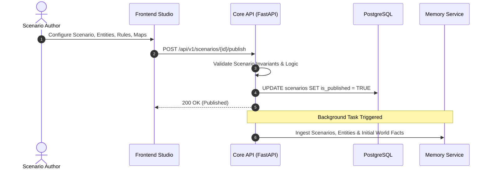
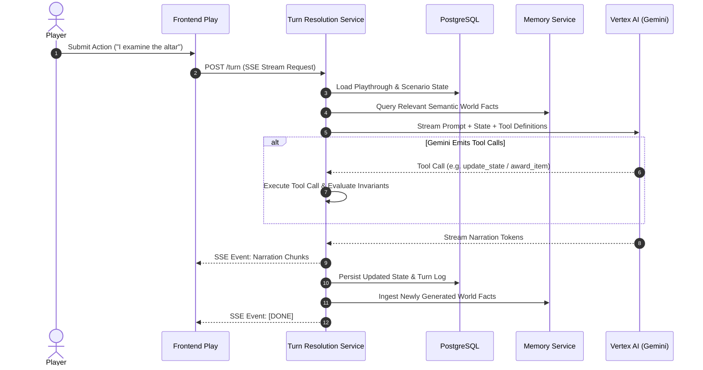

# AI-DND — System Architecture & Repository Documentation

Welcome to the architectural documentation for the **AI-DND** platform. This repository is a monorepo containing the end-to-end engine and web application for creating, publishing, and playing text-based, AI-narrated role-playing games in both **Newbie Mode** (freeform storytelling) and **Master Mode** (rule-enforced stateful mechanics with tool calling).

---

## 1. System Overview

AI-DND consists of three primary services, a persistent relational datastore, an external graph memory engine, and Google Gemini on Vertex AI.

```mermaid
flowchart TB
    subgraph Clients["Client Surfaces (Browser)"]
        Studio["Frontend: Studio Surface<br/>(Scenario Authoring)"]
        Play["Frontend: Play Surface<br/>(Playthrough & Gameplay)"]
    end

    subgraph AuthProvider["Identity Provider"]
        Firebase["Firebase Auth<br/>(JWT Issuance)"]
    end

    subgraph Monorepo["AI-DND Services"]
        CoreAPI["Core API (FastAPI)<br/><code>apps/core-api</code><br/>Stateless REST CRUD, Auth, Publish"]
        TRS["Turn Resolution Service (FastAPI)<br/><code>apps/turn-resolution-service</code><br/>Turn Pipeline, Tool-calling, SSE Stream"]
    end

    subgraph DataStore["Persistence & AI Services"]
        Postgres[("PostgreSQL / Cloud SQL<br/>Single Source of Truth")]
        MemorySvc[("Memory Layer Service<br/>Graph Fact Storage")]
        Gemini["Google Gemini (Vertex AI)<br/>AI Game Narrator"]
    end

    Studio -->|Bearer Token & REST| CoreAPI
    Play -->|Bearer Token & REST| CoreAPI
    Play -->|SSE Stream POST /turn| TRS
    Studio -->|SSE Stream POST /assistant| TRS

    Clients -.->|Auth Login / Tokens| Firebase
    CoreAPI -.->|Token Verification| Firebase
    TRS -.->|Token Verification| Firebase

    CoreAPI -->|Async SQLAlchemy| Postgres
    TRS -->|Async SQLAlchemy (Read/Write State)| Postgres

    CoreAPI -->|HTTP Entity/Fact Sync| MemorySvc
    TRS -->|HTTP Context Retrieval & Fact Persistence| MemorySvc

    TRS -->|Vertex AI Streaming SDK| Gemini
```

---

## 2. Core Product Loops & Cross-Service Flows

### A. Authoring & Publishing Loop
Creators draft scenarios, entities, rules, maps, and invariants in Studio. When published, Core API compiles and validates the scenario graph before writing to the database and queueing memory ingestion.



### B. Per-Turn Gameplay Loop
The player submits an action on the Play screen. TRS orchestrates the turn through a 12-step pipeline, communicating with the memory layer and Gemini before streaming SSE tokens back to the player.



---

## 3. Strict Architecture Invariants & Boundaries

As codified in [CLAUDE.md](file:///home/aryan-sherigar/projects/AI-DND/CLAUDE.md), the system enforces strict layer and dependency isolation:

| Boundary | Enforcement Rule | Rationale |
|---|---|---|
| **Gemini AI Calls** | Only from `apps/turn-resolution-service/app/integrations/gemini_client.py` | Prevents vendor coupling and ensures all AI interactions flow through centralized streaming and token tracking. |
| **Memory Layer Calls** | Only from `integrations/memory_client.py` within each respective service | Decouples graph fact management from domain service code. |
| **SQL & Database Queries** | Only in `repositories/` | Services and routers are strictly prohibited from emitting SQL or using direct session queries. |
| **Architecture Hierarchy** | `Router -> Service -> Repository -> Database` | No skipping layers (routers never call repositories; services never craft raw queries). |
| **TRS Scenario Mutability** | TRS is read-only on `Scenario` except incrementing `play_count` at turn 10 | Keeps scenario definitions immutable during active playthroughs. |
| **Pipeline Step Order** | Only `pipeline.py` sequences turn execution | Steps in `app/turn/steps/` are decoupled and never call each other. |
| **Frontend Feature Isolation** | Features (`studio/`, `play/`, `profile/`, `auth/`) never import each other | Cross-cutting code must be extracted into `src/shared/`. |
| **SSE Management** | Raw `EventSource` / fetch SSE stream only exists in `shared/lib/sse-client.ts` | All SSE consumption is channeled through `useSSE`. |

---

## 4. Documentation Index

The architecture documentation is divided into four dedicated subdirectories:

### 📁 [Core API Architecture](file:///home/aryan-sherigar/projects/AI-DND/docs/arch/core-api/overview.md) (`docs/arch/core-api/`)
* [Overview & Architecture](file:///home/aryan-sherigar/projects/AI-DND/docs/arch/core-api/overview.md): System design, directory map, error handling, logging, and testing strategy.
* [Routers & Endpoints](file:///home/aryan-sherigar/projects/AI-DND/docs/arch/core-api/routers.md): Comprehensive breakdown of all 15 FastAPI routers and endpoints.
* [Services & Business Logic](file:///home/aryan-sherigar/projects/AI-DND/docs/arch/core-api/services.md): Business domain operations, validations, publishing flow, and playthrough lifecycles.
* [Repositories & Data Access](file:///home/aryan-sherigar/projects/AI-DND/docs/arch/core-api/repositories.md): Async SQLAlchemy query layer, filters, and pagination.
* [Database & Migrations](file:///home/aryan-sherigar/projects/AI-DND/docs/arch/core-api/db.md): SQLAlchemy ORM models, session lifecycle, and Alembic versions 001–007.
* [Pydantic Models & Schemas](file:///home/aryan-sherigar/projects/AI-DND/docs/arch/core-api/models.md): Request, response, validation, and domain data models.
* [Middleware & Authentication](file:///home/aryan-sherigar/projects/AI-DND/docs/arch/core-api/middleware-and-auth.md): Firebase JWT validation, request context, and structured logging.
* [Integrations](file:///home/aryan-sherigar/projects/AI-DND/docs/arch/core-api/integrations.md): External clients for the Memory Layer and Google Cloud Storage.

### 📁 [Turn Resolution Service Architecture](file:///home/aryan-sherigar/projects/AI-DND/docs/arch/turn-resolution-service/overview.md) (`docs/arch/turn-resolution-service/`)
* [Overview & Turn Engine](file:///home/aryan-sherigar/projects/AI-DND/docs/arch/turn-resolution-service/overview.md): Asynchronous turn processing lifecycle, streaming paradigm, and test strategy.
* [Pipeline & Steps](file:///home/aryan-sherigar/projects/AI-DND/docs/arch/turn-resolution-service/pipeline-and-steps.md): Central `pipeline.py` orchestrator and the 12 decoupled pipeline steps.
* [Turn Logic & Evaluators](file:///home/aryan-sherigar/projects/AI-DND/docs/arch/turn-resolution-service/turn-logic.md): AST expression evaluation, mood classification, tool definitions, and turn ordering.
* [Routers & Services](file:///home/aryan-sherigar/projects/AI-DND/docs/arch/turn-resolution-service/routers-and-services.md): Turn streaming `/turn`, session management, and Authoring Assistant endpoints.
* [Session & Real-time State](file:///home/aryan-sherigar/projects/AI-DND/docs/arch/turn-resolution-service/session.md): Spectator fan-out, notification management, turn counters, and participant access control.
* [AI & Memory Integrations](file:///home/aryan-sherigar/projects/AI-DND/docs/arch/turn-resolution-service/integrations.md): Gemini Vertex AI streaming client and Memory Layer graph client.
* [Database & Repositories](file:///home/aryan-sherigar/projects/AI-DND/docs/arch/turn-resolution-service/db-and-repositories.md): Mirrored schema, models, and specialized gameplay repositories.
* [Middleware & Schemas](file:///home/aryan-sherigar/projects/AI-DND/docs/arch/turn-resolution-service/middleware-and-models.md): Auth middleware, error handlers, and game state schemas.

### 📁 [Frontend Architecture](file:///home/aryan-sherigar/projects/AI-DND/docs/arch/frontend/overview.md) (`docs/arch/frontend/`)
* [Overview & Application Shell](file:///home/aryan-sherigar/projects/AI-DND/docs/arch/frontend/overview.md): React 18 + Vite + Tailwind architecture, routing layout, and state management rules.
* [Play Surface Feature](file:///home/aryan-sherigar/projects/AI-DND/docs/arch/frontend/features-play.md): Discovery feed, playthrough setup, E-Book living reader, codex, action drawers, and spectator view.
* [Studio Surface Feature](file:///home/aryan-sherigar/projects/AI-DND/docs/arch/frontend/features-studio.md): Scenario dashboard, Newbie wizard, Master Mode schema/rules editors, and interactive map tooling.
* [Common Features](file:///home/aryan-sherigar/projects/AI-DND/docs/arch/frontend/features-common.md): Firebase authentication flow, User profile hub, and dynamic landing page.
* [Shared Layer & Audio Engine](file:///home/aryan-sherigar/projects/AI-DND/docs/arch/frontend/shared.md): Design system UI library, `useSSE` hook, API clients, and adaptive ambient soundtrack engine.

### 📁 [Infrastructure & Tooling](file:///home/aryan-sherigar/projects/AI-DND/docs/arch/infra/docker-and-compose.md) (`docs/arch/infra/`)
* [Docker & Compose](file:///home/aryan-sherigar/projects/AI-DND/docs/arch/infra/docker-and-compose.md): Multi-stage Docker builds, development and production Compose orchestrations.
* [Configuration & Environment](file:///home/aryan-sherigar/projects/AI-DND/docs/arch/infra/configuration-and-env.md): Environment variable catalog, Pydantic settings parsing, and secrets management.
* [Scripts & Utilities](file:///home/aryan-sherigar/projects/AI-DND/docs/arch/infra/scripts.md): Standalone tooling, audio generators, and operational scripts.
