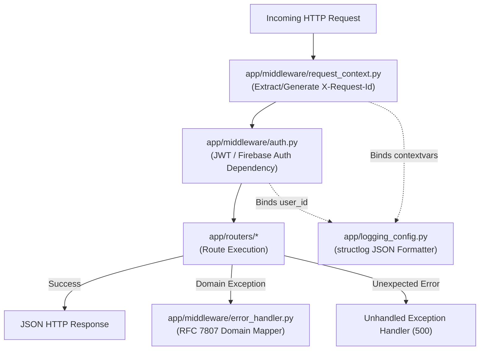

# Core API Architecture — Middleware, Authentication & Logging

This document details the cross-cutting HTTP middleware, token verification pipeline, exception mapping, and structured logging in `apps/core-api/`.

---

## 1. Overview & Execution Lifecycle

Every HTTP request entering Core API passes through a pipeline of logging, tracing, authentication, and error-handling layers before reaching route handlers.

---

## 2. File Profiles

### `apps/core-api/app/middleware/auth.py`
- **Purpose & Layer:** Authentication dependency layer extracting and verifying identity tokens.
- **Key Exports & Functions:**
  - `get_current_user(request, credentials, session) -> User`: Mandatory authentication dependency.
    - Development bypass: In `development` or `testing` environments, supports header `x-dev-user-id` to automatically seed/bind a dev user without requiring external Firebase tokens.
    - Production verification: Validates bearer token signature and expiration against `settings.secret_key` and algorithm (`HS256` or Firebase public certificates).
    - Session lookup: Resolves token subject to an active `User` record via `UserRepo`.
    - Context binding: Calls `_bind_user_context(user)` to attach `user_id` to `structlog` contextvars for the request lifetime.
  - `get_optional_current_user(...) -> User | None`: Optional auth dependency for discovery feeds and public scenario browsing.
- **Dependencies & Interactions:** Calls `UserRepo` and `app/config.py`.
- **Architecture Rules & Invariants:** Never permits anonymous access to mutating or draft-authoring endpoints.

### `apps/core-api/app/middleware/request_context.py`
- **Purpose & Layer:** Distributed tracing and correlation ID middleware.
- **Key Exports & Functions:**
  - `request_context_middleware(request, call_next)`: Extracts incoming `X-Request-Id` HTTP header (or generates a new UUID v4 if missing). Binds `request_id` into `structlog.contextvars` so all log statements emitted during the request automatically include the correlation ID. Injects `X-Request-Id` into the outgoing response headers.
- **Dependencies & Interactions:** Consumed by `main.py` via `app.middleware("http")`.

### `apps/core-api/app/middleware/error_handler.py`
- **Purpose & Layer:** Global exception interceptor mapping domain exceptions to HTTP status codes.
- **Key Exports & Functions:**
  - `setup_error_handlers(app: FastAPI)`:
    - `app_exception_handler`: Catches any exception inheriting from `BaseAppException`. Logs a warning with path context and returns `JSONResponse(status_code=exc.status_code, content={"detail": exc.message})`.
    - `unhandled_exception_handler`: Catches generic `Exception`. Logs structured error event `unhandled_exception` with stack trace and returns standard 500 response without leaking internal traceback details.
- **Dependencies & Interactions:** Integrates with `app/exceptions/base.py`.

### `apps/core-api/app/logging_config.py`
- **Purpose & Layer:** Centralized GCP Cloud-Logging-compatible structured JSON logging setup.
- **Key Exports & Functions:**
  - `configure_logging(log_level, log_format)`: Configures standard library logging and `structlog` with `JSONRenderer`, UTC timestamping, and log severity translation.
  - `REDACTED_FIELD_NAMES`: Strict denylist of sensitive field names (passwords, tokens, API keys, email, personal details, prompt bodies) that are automatically redacted before rendering.
  - `log_audit_event(event_name, **kwargs)`: Emits structured audit logs (`event_category="audit"`) for security-critical actions (scenario publish, token issue, profile deletion).
- **Dependencies & Interactions:** Configured once at application startup in `main.py`.

### `apps/core-api/app/exceptions/`
- **Purpose & Layer:** Strongly-typed domain exception taxonomy.
- **Key Files & Classes:**
  - `base.py`: Defines `BaseAppException(Exception)` with `status_code` and `message`.
  - `scenario_exceptions.py`: `ScenarioNotFoundError` (404), `ScenarioAccessDeniedError` (403), `ScenarioValidationError` (422), `ScenarioAlreadyPublishingError` (409).
  - `auth_exceptions.py`: `InvalidTokenError` (401), `UserNotFoundError` (404).
  - `condition_exceptions.py`, `end_condition_exceptions.py`, `invariant_exceptions.py`: AST and schema validation failures (422).
  - `map_exceptions.py`: `MapNotFoundError`, `MapPublishValidationError`.
  - `playthrough_exceptions.py`: `PlaythroughNotFoundError`, `PlaythroughAccessDeniedError`.
  - `upload_exceptions.py`: `InvalidFileTypeError`, `FileTooLargeError`.
