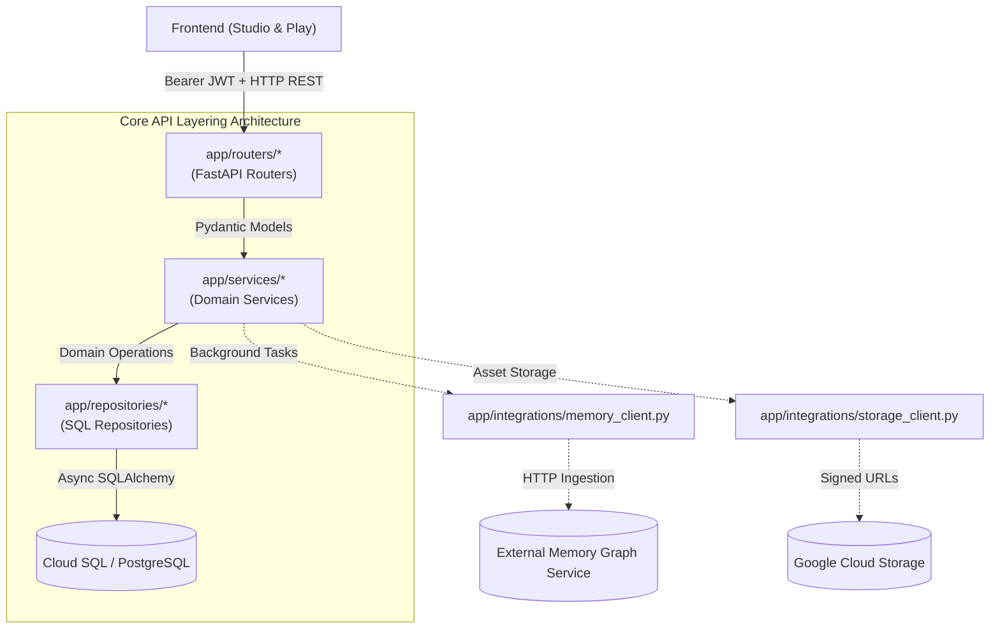

# Core API — Architecture & System Overview

This document provides the high-level architecture overview for `apps/core-api`, the stateless REST application of the AI-DND platform built with Python 3.11, FastAPI, and SQLAlchemy.

---

## 1. System Role & Boundaries

Core API serves as the administrative, authoring, and state discovery backbone. It is strictly:
- **Stateless Request/Response**: Synchronous HTTP cycles only. No WebSocket or Server-Sent Event streaming.
- **No Direct AI Calls**: Core API does not communicate with Gemini or invoke Large Language Models.
- **Single Source of Truth for Schema & Migrations**: Core API manages database initialization and migrations via Alembic.



---

## 2. Strict Architectural Invariants

Core API strictly enforces the architectural rules defined in [CLAUDE.md](file:///home/aryan-sherigar/projects/AI-DND/CLAUDE.md):
1. **Layer Order**: `Router -> Service -> Repository -> Database`.
   - Routers validate HTTP parameters and authenticate users; they invoke Services and return Pydantic schemas.
   - Services execute domain validation, business rules, and state orchestrations; they invoke Repositories.
   - Repositories are the sole location where SQL / SQLAlchemy query constructs exist.
   - Routers never touch Repositories; Services never craft raw SQL.
2. **Async I/O Everywhere**: Every database access, HTTP call, and storage interaction uses async/await (`AsyncSession`, `httpx.AsyncClient`).
3. **Pydantic v2 Boundaries**: Raw dictionaries are never passed across service or layer boundaries.
4. **Error Handling**: Domain exceptions inherit from `app/exceptions/base.py` and are mapped to standard HTTP RFC 7807 problem payloads in `app/middleware/error_handler.py`.
5. **Function Size & Complexity**: Max nesting depth <= 2; function length under 30 lines.

---

## 3. Directory & Component Layout

```
apps/core-api/
├── alembic.ini                  # Alembic CLI database migration configuration
├── Dockerfile                   # Multi-stage Python 3.11 container manifest
├── pyproject.toml               # Python project definition and ruff/pytest config
├── requirements.txt             # Production Python dependencies
├── app/
│   ├── main.py                  # FastAPI application entrypoint & middleware setup
│   ├── config.py                # Pydantic BaseSettings environment registry
│   ├── logging_config.py        # Structured JSON GCP logger & field redactor
│   ├── db/                      # Database engine, base model, and Alembic migrations
│   ├── exceptions/              # Domain-specific exception hierarchy
│   ├── integrations/            # External HTTP clients (Memory, Google Cloud Storage)
│   ├── middleware/              # Auth, RequestContext, and Global Error Handler
│   ├── models/                  # Pydantic request/response/domain models
│   ├── repositories/            # SQLAlchemy async data access repositories
│   ├── routers/                 # FastAPI routing controllers
│   └── services/                # Business logic, expression validation, publishing
└── tests/                       # Pytest test suite, fixtures, and router/service tests
```

---

## 4. Entrypoint & Lifespan (`app/main.py`)

- **Purpose & Layer:** FastAPI application bootstrap and lifecycle controller.
- **Key Exports & Symbols:**
  - `app: FastAPI`: Root FastAPI application instance.
  - `lifespan(app: FastAPI)`: Async context manager that initializes resources on startup and cleanly drains database connection pools via `close_db_connection()` on shutdown.
  - `health_check()`: GET `/health` endpoint for Docker and load balancer health checks.
- **Dependencies & Interactions:**
  - Configures CORS middleware with `settings.cors_origins`.
  - Registers `request_context_middleware` for `X-Request-Id` extraction.
  - Registers `setup_error_handlers(app)`.
  - Mounts all 14 active domain routers.
- **Architecture Rules & Invariants:** Kept minimal (< 80 lines) with zero business logic or inline route handlers.

---

## 5. Testing Architecture

- **Pytest-Asyncio Harness**: Integration tests run against a real test Postgres instance (`aidnd_test_db`). The database is not mocked.
- **Test Structure**:
  - `tests/conftest.py`: Async session fixtures, test user generation, and database isolation setup.
  - `tests/routers/`: HTTP endpoint integration tests using `httpx.AsyncClient(transport=ASGITransport(app=app))`.
  - `tests/services/`: Unit and integration testing for business rules (e.g. duplicate scenario, expression evaluation, publish validation).
  - `tests/db/`: Migration smoke tests and engine connection verification.
- **Mocking Boundaries**: External networks (Memory layer, GCS) are mocked at the network level via `respx` or `unittest.mock`.
