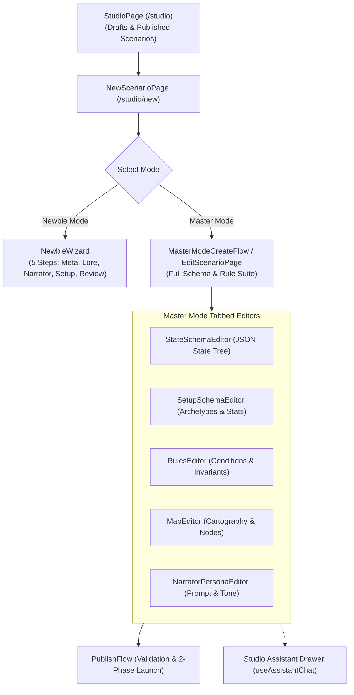

# Frontend Architecture — Studio Surface

This document details the components, hooks, editors, and state stores in `apps/frontend/src/features/studio/`, which powers the scenario authoring environment for Newbie and Master game modes.

---

## 1. Overview & Authoring Modalities

The Studio surface supports two authoring paradigms:
1. **Newbie Wizard Mode**: A 5-step guided wizard for creators authoring freeform text adventures with lore prompts, narrative tone sliders, and AI narrator instructions.
2. **Master Mode Deep Editor**: An IDE-style scenario engineering suite for structured game state schemas, entity definitions (NPCs, Items, Locations), dynamic condition triggers, win/loss end conditions, rule invariants, and interactive spatial maps.

---

## 2. Component Subsystems

### A. Newbie Mode Wizard (`src/features/studio/components/NewbieWizard/`)
- **`Step1Meta.tsx`**: Title, logline, genre tags, and cover image upload.
- **`Step2Lore.tsx`**: World lore narrative textarea with AI brainstorming prompts.
- **`Step3Narrator.tsx`**: Narrator tone sliders (serious, whimsical, grim, cinematic) and custom system instructions.
- **`StepPlayerSetup.tsx`**: Freeform player introduction prompt.
- **`Step4Review.tsx`**: Complete scenario preview and publish verification checklist.

### B. Master Mode Schema & Rules Editors
- **`StateSchemaEditor/`**: Visual JSON schema builder defining the global variables tracked during a playthrough (`flags`, `counters`, `inventory`).
- **`SetupSchemaEditor/`**: Configures character archetype presets (e.g. Rogue, Mage, Knight) and starting attribute allocations.
- **`RulesEditor/`**: Visual expression tree builder for authoring dynamic conditions and state boundary invariants (e.g. `hp <= 0` -> triggers Defeat).
- **`NarratorPersonaEditor/`**: Controls AI narrator voice, formatting rules, and checkpoint narrative overrides.
- **`OpeningSceneEditor/`**: Authoring interface for the prologue narration rendered when a new playthrough starts.

### C. Cartography Suite (`src/features/studio/components/MapEditor/`)
- **`MapEditor.tsx`**: Root map authoring container with zoom, pan, and grid snapping.
- **`MapCanvas.tsx`**: Canvas rendering map graphics with interactive draggable pins.
- **`PinEditorModal.tsx`**: Configuration modal linking a pin coordinate to a scenario entity, label, and discovery condition.
- **`ConnectionEditorModal.tsx`**: Edge configuration modal establishing paths between pins with bidirectional toggles.
- **`MapList.tsx`**: Sidebar listing all maps created for the scenario.

### D. Social, Publishing & Playtesting
- **`PublishFlow/`**: Validates scenario prerequisites (required fields, valid map edges, content tag selection in `all-ages`, `teen`, `mature`) and initiates the two-phase publish job.
- **`PlaytestButton/`**: Clones the current draft into an isolated playtest scenario so authors can test their scenario mechanics live in the Play reader without exposing drafts to public discovery.

---

## 3. Hooks & State Store

### Authoring Hooks (`src/features/studio/hooks/`)
- **`useScenario.ts` & `useMyScenarios.ts`**: React Query hooks for fetching draft details and creator scenario feeds.
- **`useEntities.ts`, `useFacts.ts`, `useConditions.ts`, `useEndConditions.ts`, `useInvariants.ts`**: Domain-specific CRUD mutation hooks synchronizing scenario sub-resources with Core API.
- **`useMaps.ts`, `useMapPins.ts`, `useMapConnections.ts`**: Spatial map mutation hooks.
- **`usePublish.ts`**: Dispatches `POST /v1/scenarios/:id/publish`.
- **`usePlaytest.ts`**: Dispatches `POST /v1/scenarios/:id/playtest` and navigates directly to the new session.
- **`useAssistantChat.ts`**: Manages the Studio AI assistant SSE stream, parsing structured action blocks (`action:title`, `action:lore`) so creators can insert suggestions with one click.

### State Store (`src/features/studio/stores/studio.store.ts`)
- **Purpose & Layer:** Zustand client UI store for Studio navigation.
- **State Tracked:**
  - `activeEditorTab: "meta" | "lore" | "state" | "rules" | "maps" | "narrator"`: Active tab in the Master Mode editor.
  - `isAssistantDrawerOpen: bool`: Visibility of the AI assistant chat drawer.
  - `selectedPinId: UUID | None`, `activeMapId: UUID | None`: Selected cartography elements.
- **Architecture Rules & Invariants:** Zero scenario draft models stored in Zustand; draft mutations are dispatched directly through React Query mutations.
