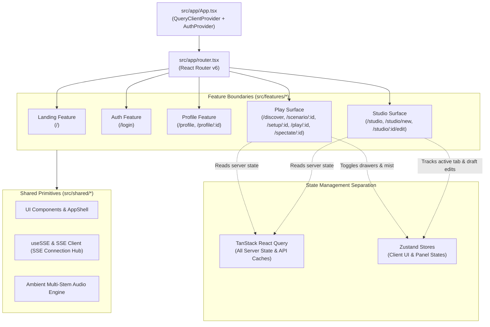

# Frontend Architecture — System & UI Overview

This document provides the high-level architecture overview for `apps/frontend`, the single-page web client of the AI-DND platform built with React 18, Vite, TypeScript, Tailwind CSS, TanStack React Query, and Zustand.

---

## 1. UI Surfaces & Application Topology

The frontend is divided into two primary consumer surfaces, supported by shared design primitives and common authentication/profile features:
1. **Studio Surface (`/studio`)**: Authoring suite for creators. Includes the Newbie Wizard, Master Mode schema editors, rule invariant builders, and spatial map editors.
2. **Play Surface (`/play`, `/discover`, `/scenario/:id`)**: Player discovery and gameplay hub. Includes the Living Book E-Reader canvas, action drawer, codex drawers, real-time SSE narration stream, and spectator view.



---

## 2. Strict Frontend Architecture Rules

In accordance with [CLAUDE.md](file:///home/aryan-sherigar/projects/AI-DND/CLAUDE.md):
1. **Feature Boundary Isolation**: Features never import from sibling features (`studio/` never imports from `play/` and vice versa). Cross-feature shared code must reside in `src/shared/`.
2. **Strict Separation of State**:
   - **React Query** for all server state (scenarios, playthroughs, reviews, profile data). No `useEffect` + `useState` fetching patterns.
   - **Zustand** for client-only UI state (active tab, panel open/closed, audio mute, SSE connection status). Never store server data in Zustand.
3. **One Component per File**: A file named `ScenarioCard.tsx` exports exactly one component `ScenarioCard`.
4. **SSE Centralization**: Raw `EventSource` and fetch-streaming logic is strictly forbidden in components. All SSE consumption must flow through `src/shared/hooks/useSSE.ts` (wrapped by `useTurnStream`, `useNotifications`, `useSpectator`).
5. **No Inline Styles**: Tailwind utility classes only.
6. **Props Colocation**: Component prop types are named `{ComponentName}Props` and colocated in `{ComponentName}.types.ts` or directly above the component.

---

## 3. Directory Layout

```
apps/frontend/src/
├── app/                         # Application root, router, global providers
│   ├── App.tsx                  # Root component, QueryClientProvider, AuthProvider
│   ├── main.tsx                 # DOM mount, index.css injection
│   └── router.tsx               # Client routes definition (createBrowserRouter)
├── features/
│   ├── auth/                    # Firebase login, AuthGuard, auth store
│   ├── landing/                 # Living Book Hero, scenario carousel
│   ├── play/                    # Discovery, Setup, PlayScreen (EBook), Spectator
│   ├── profile/                 # User profile tabs, creations, bookmarks, reviews
│   └── studio/                  # Authoring wizard, schema editors, map canvas
├── shared/                      # Shared design system, UI, hooks, audio engine, types
└── test/                        # Vitest setup, Mock Service Worker (MSW) handlers
```

---

## 4. Route Manifest (`src/app/router.tsx`)

| Path | Component | Surface / Feature | Description |
|---|---|---|---|
| `/` | `LandingPage` | Landing | Hero showcase, interactive Living Book preview, trending scenarios |
| `/login` | `LoginPage` | Auth | Firebase retro CRT login terminal |
| `/discover` | `DiscoveryPage` | Play | Scenario catalog with genre filters and search |
| `/scenario/:id` | `ScenarioFocusPage` | Play | Scenario lore banner, reviews, and setup trigger |
| `/setup/:id` | `SetupPage` | Play | Character archetype selection and attribute customization |
| `/play` / `/play/:id` | `PlayPage` | Play | Active playthrough E-Book reader, narration stream, actions |
| `/spectate/:id` | `SpectatorPage` | Play | Real-time read-only spectator view |
| `/join` | `JoinPage` | Play | Multiplayer share token resolver |
| `/studio` | `StudioPage` | Studio | Scenario dashboard and draft list |
| `/studio/new` | `NewScenarioPage` | Studio | Wizard for Newbie or Master mode scenario creation |
| `/studio/:id/edit` | `EditScenarioPage` | Studio | Master Mode scenario editor (state, rules, maps, NPCs) |
| `/profile` / `/profile/:id` | `ProfilePage` | Profile | Creator showcase, bookmarks, and campaign history |
