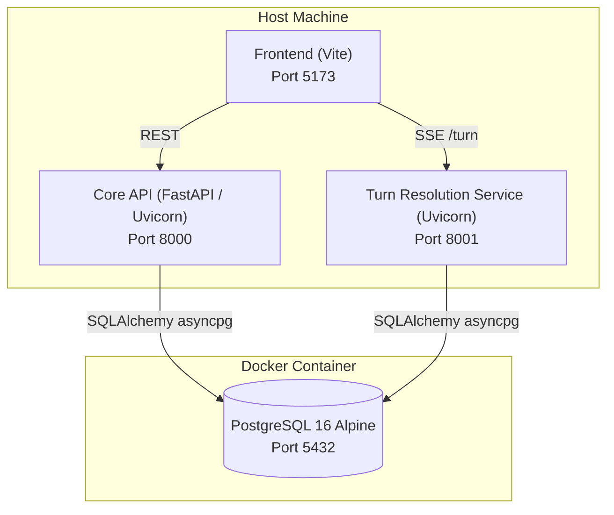

# AI-DND — Getting Started & System Startup Guide

This guide describes how to run and orchestrate the AI-DND system for local development and integration testing.

---

## 1. Architecture & Port Mapping

| Service | Environment / Runtime | Default Port | Health / Entry URL |
|---|---|---|---|
| **PostgreSQL** | Docker container (`aidnd-postgres`) | `5432` | `localhost:5432` (`aidnd_db`) |
| **Core API** | Host Python / FastAPI (`uvicorn`) | `8000` | `http://localhost:8000/health` |
| **Turn Resolution Service (TRS)** | Host Python / FastAPI (`uvicorn`) | `8001` | `http://localhost:8001/health` |
| **Frontend** | Host Node.js / Vite SPA | `5173` | `http://localhost:5173` |



---

## 2. Prerequisites

1. **Docker & Docker Compose**: Ensure Docker Engine is installed and the daemon is running.
2. **Python 3.11+** (recommended with virtual environments in `apps/core-api/.venv` and `apps/turn-resolution-service/.venv`, or root `.venv`).
3. **Node.js (v20+) & npm**.
4. **Environment File**: Ensure `.env` exists in the repository root:
   ```bash
   cp .env.example .env
   ```

---

## 3. Hybrid Startup (Docker for Postgres, Host for APIs & Frontend)

This is the standard local development workflow: fast hot-reloading on Python and Vite while isolating the database in Docker.

### Step 1: Start PostgreSQL via Docker Compose

Start the PostgreSQL service container in detached mode:

```bash
docker compose up -d postgres
```

Verify the container is healthy:

```bash
docker ps --filter "name=aidnd-postgres"
```

### Step 2: Run Database Migrations

Apply Alembic schema migrations using the Core API virtual environment:

```bash
cd apps/core-api
.venv/bin/alembic upgrade head
cd ../..
```

*(Alternatively, if your root virtual environment has alembic installed, activate it and run `alembic upgrade head` from `apps/core-api/`).*

### Step 3: Start Core API

In a dedicated terminal (or background process):

```bash
cd apps/core-api
.venv/bin/uvicorn app.main:app --reload --host 0.0.0.0 --port 8000
```

Verify health:
```bash
curl http://localhost:8000/health
# Response: {"status":"ok"}
```

### Step 4: Start Turn Resolution Service (TRS)

In a dedicated terminal (or background process):

```bash
cd apps/turn-resolution-service
.venv/bin/uvicorn app.main:app --reload --host 0.0.0.0 --port 8001
```

Verify health:
```bash
curl http://localhost:8001/health
# Response: {"status":"ok"}
```

### Step 5: Start Frontend

In a dedicated terminal:

```bash
cd apps/frontend
npm run dev -- --host 0.0.0.0 --port 5173
```

Open your browser at `http://localhost:5173`.

---

## 4. Alternative: Full Docker Compose Startup

If you prefer running all services inside Docker containers without local Python/Node dependencies:

### Development Mode (with Volume Mounts & Live Reload)

```bash
docker compose -f docker-compose.yml -f docker-compose.dev.yml up -d
```

### Production Integration Mode

```bash
docker compose up -d --build
```

---

## 5. Teardown / Stopping the System

### If Running in Hybrid Mode:
1. Stop the host terminal processes (`Ctrl+C` in Core API, TRS, and Frontend terminals).
2. Stop the PostgreSQL container:
   ```bash
   docker compose down
   ```
   *(To wipe database volumes as well: `docker compose down -v`)*

### If Running in Full Docker Compose Mode:
```bash
docker compose down
```

---

## 6. Troubleshooting & Diagnostics

- **Database Connection Issues**:
  Check if port 5432 is already bound or if Postgres is still initializing:
  ```bash
  docker logs aidnd-postgres
  ```
- **Port Conflicts**:
  Verify whether ports 5432, 8000, 8001, or 5173 are currently in use:
  ```bash
  ss -tulnp | grep -E "8000|8001|5173|5432"
  ```
- **Missing Environment Variables**:
  Review [`docs/arch/infra/configuration-and-env.md`](file:///home/aryan-sherigar/projects/AI-DND/docs/arch/infra/configuration-and-env.md) for required keys across all services.
