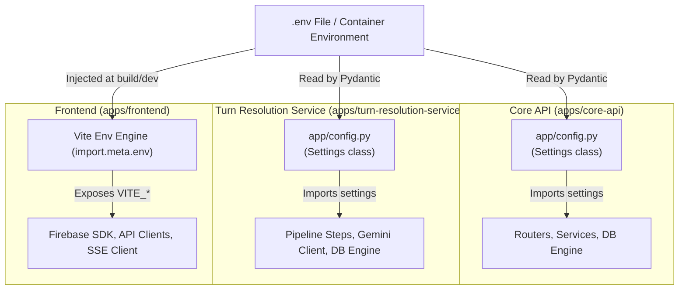

# Infrastructure Architecture — Configuration & Environment Variables

This document details the environment configuration management across the monorepo, covering the canonical `.env.example` template, Pydantic settings parsing in the backend services, client-side Vite builds, and the strict rules governing environment variables.

---

## 1. Overview & Architecture Rules

In accordance with [CLAUDE.md](file:///home/aryan-sherigar/projects/AI-DND/CLAUDE.md):
- **Single Point of Ingestion**: Environment variables are strictly read only in `config.py` within each backend service. No direct `os.environ.get()` or `os.getenv()` calls are permitted across routers, services, repositories, or pipeline steps.
- **Strict Pydantic Validation**: Both Python services use `pydantic-settings` to parse and validate configuration parameters at startup, failing fast if mandatory values are absent or malformed.
- **Client-Side Prefixing**: Frontend environment variables must begin with the `VITE_` prefix to be exposed to the client bundle by Vite.

---

## 2. Manifests & Configuration Profiles

### `.env.example`
- **Purpose & Layer:** Master configuration template documenting all required and optional environment keys for local development, docker orchestration, and production deployments.
- **Key Configuration Groups:**
  - **PostgreSQL**: `POSTGRES_USER`, `POSTGRES_PASSWORD`, `POSTGRES_DB`, `POSTGRES_PORT`.
  - **Core API**: `CORE_API_PORT`, `CORE_API_DATABASE_URL`, `SECRET_KEY`, `JWT_ALGORITHM`, `JWT_ACCESS_EXPIRE_MINUTES`, `JWT_REFRESH_EXPIRE_DAYS`, `FIREBASE_PROJECT_ID`, `FIREBASE_CREDENTIALS_PATH`, `CORS_ORIGINS`, `ENVIRONMENT`, `LOG_LEVEL`.
  - **TRS**: `TRS_PORT`, `TRS_DATABASE_URL`, `GEMINI_API_KEY`, `MEMORY_SERVICE_URL`, `LOG_LEVEL`.
  - **Frontend**: `FRONTEND_PORT`, `VITE_CORE_API_URL`, `VITE_TRS_URL`, `VITE_FIREBASE_API_KEY`, `VITE_FIREBASE_AUTH_DOMAIN`, `VITE_FIREBASE_PROJECT_ID`, `VITE_FIREBASE_STORAGE_BUCKET`, `VITE_FIREBASE_MESSAGING_SENDER_ID`, `VITE_FIREBASE_APP_ID`, `VITE_MEASUREMENT_ID`.
- **Dependencies & Interactions:** Copied to `.env` during developer onboarding or loaded by Docker Compose.
- **Architecture Rules & Invariants:** Contains only non-production default placeholders. Production secrets must be supplied via secrets managers (e.g. GCP Secret Manager or CI/CD pipelines).

### `apps/core-api/app/config.py`
- **Purpose & Layer:** Core API centralized configuration registry.
- **Key Exports & Symbols:**
  - `class Settings(BaseSettings)`: Validated application configuration model.
  - `settings: Settings`: Singleton instance exported for application-wide consumption.
- **Key Parameters:**
  - `database_url`: AsyncPG database connection string (`postgresql+asyncpg://...`).
  - `db_pool_size` / `db_max_overflow`: Connection pool sizing (defaults 5 / 10).
  - `secret_key`, `jwt_algorithm`, `jwt_access_expire_minutes`, `jwt_refresh_expire_days`: Token signing and verification parameters.
  - `firebase_project_id`, `firebase_credentials_path`: Firebase Admin SDK configuration.
  - `cors_origins`: Allowed web origins for HTTP CORS middleware.
  - `frontend_base_url`: Target URL used when generating shareable links.
  - `gcs_bucket_name`: Google Cloud Storage bucket for scenario and map asset uploads.
- **Dependencies & Interactions:** Imported by `main.py`, `db/connection.py`, `middleware/auth.py`, and `middleware/error_handler.py`.
- **Architecture Rules & Invariants:** `extra="ignore"` allows passing system environment variables without breaking schema validation.

### `apps/turn-resolution-service/app/config.py`
- **Purpose & Layer:** Turn Resolution Service centralized configuration registry.
- **Key Exports & Symbols:**
  - `class Settings(BaseSettings)`: Validated TRS configuration model.
  - `settings: Settings`: Singleton instance exported for application-wide consumption.
- **Key Parameters:**
  - `database_url`, `db_pool_size`, `db_max_overflow`: Database pooling for state reads/writes.
  - `gemini_api_key`: Google Gemini API key.
  - `gemini_model_name`: AI model identifier (defaults to `gemini-3.5-flash-lite`).
  - `gemini_temperature`, `gemini_max_output_tokens`, `gemini_top_p`: AI generation hyperparameters.
  - `gemini_timeout_seconds`, `gemini_max_retries`: Network resilience and fallback controls.
  - `turn_history_window_size`: Maximum previous turns injected into AI context window (defaults to 10).
  - `play_count_increment_turn_threshold`: Turn milestone at which scenario play counter increments (turn 10).
  - `memory_batch_turn_interval`: Turn cadence for triggering memory graph consolidation (defaults to 5).
  - `tool_call_max_round_trips`: Safeguard against infinite tool-calling loops (defaults to 5).
- **Dependencies & Interactions:** Imported by `app/integrations/gemini_client.py`, `app/turn/pipeline.py`, `app/turn/steps/`, and `app/db/connection.py`.
- **Architecture Rules & Invariants:** Encapsulates all AI tuning hyperparameters in one place; steps never hardcode generation parameters.

### Frontend Environment (`import.meta.env`)
- **Purpose & Layer:** Client-side environment variables bundled at build/runtime.
- **Key Parameters:**
  - `VITE_CORE_API_URL`: Base URL for Core API HTTP requests.
  - `VITE_TRS_URL`: Base URL for Turn Resolution Service SSE streams.
  - `VITE_FIREBASE_*`: Public credentials for initializing client Firebase Auth (`firebase.ts`).
- **Architecture Rules & Invariants:** Never include backend private keys, service account secrets, or database URLs in frontend environment variables.
