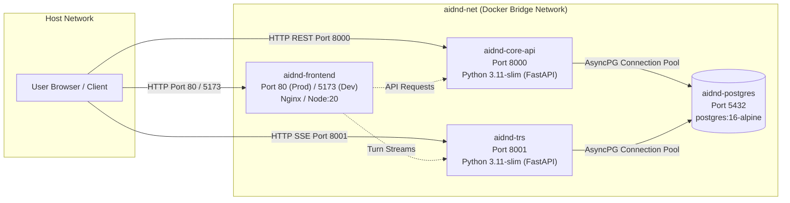

# Infrastructure Architecture — Docker & Container Orchestration

This document details the containerization and service orchestration architecture across the AI-DND monorepo, covering production and local development stacks, networking, container health checks, and individual Dockerfiles.

---

## 1. Overview & Service Topology

The AI-DND platform utilizes Docker Compose to orchestrate multi-container topologies for local development and unified production deployment.

---

## 2. Orchestration Manifests

### `docker-compose.yml`
- **Purpose & Layer:** Root production and integration orchestration specification. Defines the baseline multi-service network, environment variable wiring, container health dependencies, and persistent volume mounts.
- **Key Services Defined:**
  - `postgres`: PostgreSQL 16 Alpine database with healthcheck (`pg_isready`), persistent volume `postgres_data`, and configurable port (defaults to `5432`).
  - `core-api`: FastAPI backend container running on port `8000`. Configured with `depends_on: postgres: condition: service_healthy` to guarantee database readiness before startup.
  - `turn-resolution-service`: Stateful turn execution engine running on port `8001`. Depends on healthy Postgres.
  - `frontend`: Production Nginx container serving static SPA assets on port `80`. Depends on both `core-api` and `turn-resolution-service`.
- **Dependencies & Interactions:** Joins all services onto the shared bridge network `aidnd-net`. Reads environment defaults from root `.env` or system environment.
- **Architecture Rules & Invariants:**
  - Neither Python API service may accept traffic before Postgres health checks pass.
  - Port bindings use parameterized defaults (e.g. `${CORE_API_PORT:-8000}`) to avoid host conflicts.

### `docker-compose.dev.yml`
- **Purpose & Layer:** Developer override orchestration file intended for local iterative development (`docker compose -f docker-compose.yml -f docker-compose.dev.yml up`).
- **Key Overrides:**
  - `core-api`: Mounts host `./apps/core-api` to `/app` for live reload; startup executes `alembic upgrade head` before launching `uvicorn app.main:app --reload`.
  - `turn-resolution-service`: Mounts host `./apps/turn-resolution-service` to `/app` with `uvicorn --reload`.
  - `frontend`: Replaces production Nginx build with a live `node:20-alpine` development container. Mounts `./apps/frontend` to `/app`, runs `npm install`, and launches `npm run dev -- --host 0.0.0.0 --port 5173` with Vite HMR.
- **Dependencies & Interactions:** Injects developer-facing `VITE_*` environment variables for Firebase client authentication and service URLs directly into Vite runtime.
- **Architecture Rules & Invariants:**
  - Preserves container-isolated `/app/node_modules` volume to prevent host/container operating system binary mismatches.

---

## 3. Service Dockerfiles

### `apps/core-api/Dockerfile`
- **Purpose & Layer:** Production container build for Core API service.
- **Key Build Stages:**
  - Base: `python:3.11-slim`.
  - Environment: `PYTHONUNBUFFERED=1`, `PYTHONDONTWRITEBYTECODE=1`, `PYTHONPATH=/app`.
  - Dependency caching: Copies `requirements.txt` and executes `pip install --no-cache-dir -r requirements.txt` prior to copying application source.
  - Entrypoint: Runs `alembic upgrade head && uvicorn app.main:app --host 0.0.0.0 --port 8000` to automatically apply pending database migrations upon container deployment.
- **Dependencies & Interactions:** Packages `alembic.ini`, migration scripts, and `app/`. Exposes port `8000`.
- **Architecture Rules & Invariants:** Keeps image lightweight without dev packages or compiler toolchains.

### `apps/turn-resolution-service/Dockerfile`
- **Purpose & Layer:** Production container build for Turn Resolution Service.
- **Key Build Stages:**
  - Base: `python:3.11-slim`.
  - Environment: `PYTHONUNBUFFERED=1`, `PYTHONDONTWRITEBYTECODE=1`.
  - Dependency caching: Caches `requirements.txt` layer.
  - Entrypoint: Launches `uvicorn app.main:app --host 0.0.0.0 --port 8001`.
- **Dependencies & Interactions:** Packages `app/`. Exposes port `8001`.
- **Architecture Rules & Invariants:** Does not run Alembic migrations directly; relies on Core API as the sole migration authority to prevent schema race conditions.

### `apps/frontend/Dockerfile` & `apps/frontend/nginx.conf`
- **Purpose & Layer:** Production multi-stage build and web server configuration for the React single-page application.
- **Key Build Stages:**
  - **Stage 1 (`builder`)**: `node:20-alpine`. Copies `package.json` and `package-lock.json`, runs `npm ci`, copies source files, and builds static bundles via `npm run build`.
  - **Stage 2 (`runner`)**: `nginx:alpine`. Copies built assets from `/app/dist` to `/usr/share/nginx/html` and installs custom `nginx.conf`.
- **Key Configuration (`nginx.conf`):**
  - Listens on port `80`.
  - Handles client-side routing via `try_files $uri $uri/ /index.html;`, ensuring client routes (`/studio`, `/play/:id`) correctly render without 404 errors.
- **Architecture Rules & Invariants:** Zero Node.js runtime footprint in production; assets are served as pre-compiled static files with gzip/HTTP caching headers.
