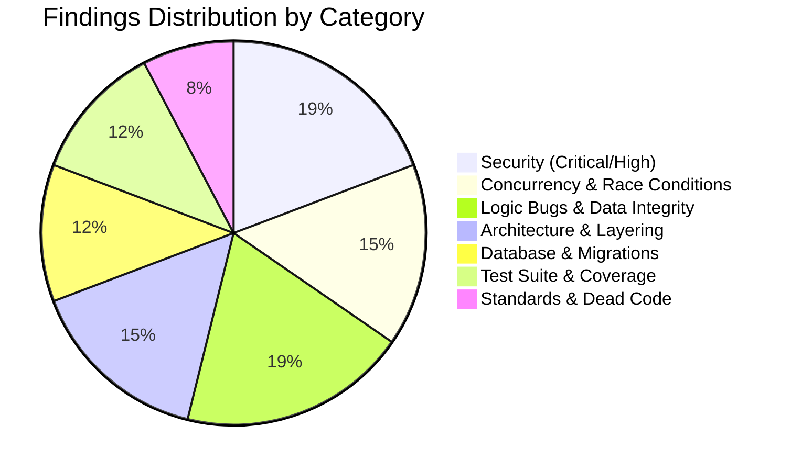
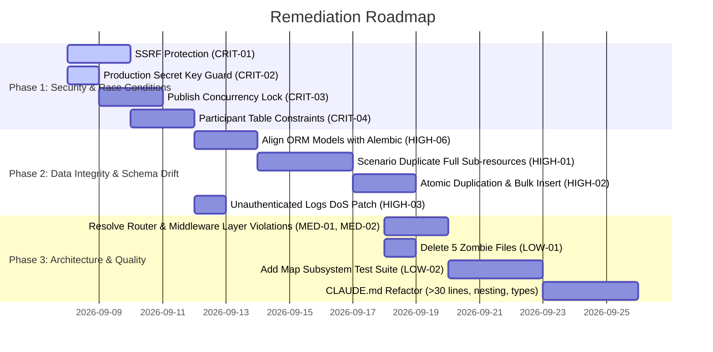

# Comprehensive Codebase Review: `apps/core-api`

> **Service**: `apps/core-api` (Python 3.10+ / FastAPI / SQLAlchemy Async / AsyncPG / Alembic)  
> **Review Scope**: Full-Spectrum Audit (Security, Concurrency & Race Conditions, State Management, Logic & Edge Cases, Database Integrity & Migrations, External Integrations, Architectural Boundaries & [CLAUDE.md](file:///home/aryan-sherigar/projects/AI-DND/CLAUDE.md) Compliance, Test Suite Quality)  
> **Mode**: Read-Only Architecture & Code Quality Audit (No Source Code Changes)  
> **Date**: September 2026  

---

## Executive Summary

An exhaustive review of the `apps/core-api` service was conducted covering all 16 routers, 19 services, 15 repositories, SQLAlchemy models, Alembic migrations, middleware, and the test suite.

### Key Metrics & Audit Outcomes
- **Total Tests Analyzed**: 208 passing tests executed against PostgreSQL (`localhost:5432`).
- **Static Analysis**: 6 `ruff` errors detected; 35 functions exceed the 30-line limit; 6 functions exceed maximum nesting depth of 2; 55 functions miss parameter or return type annotations; `typing.Any` was found in 2 modules.
- **Database Schema Drift**: **11+ production database indexes and unique constraints** created in Alembic migrations (versions 001–008) are completely missing from the SQLAlchemy ORM models.
- **Dead Code**: 5 completely empty (0-byte) abandoned files exist in `app/`.
- **Test Coverage Blind Spots**: Zero test coverage for the entire Maps subsystem (`maps.py` router and `map_service.py`), and 14 out of 15 repositories lack repository-level isolation tests.

### Findings Breakdown by Severity

| Severity | Count | Primary Impact Areas |
|---|:---:|---|
| **Critical (P0)** | 4 | Server-Side Request Forgery (SSRF), Hardcoded Default Secret Key, Concurrent Publish Race Condition, Playthrough Participant Concurrency & Missing DB Constraints |
| **High (P1)** | 6 | Map/Minigame Loss on Scenario Duplication, Non-Atomic Duplicate N+1 Writes, Unauthenticated DoS in Client Log Ingestion, GCS Upload Magic-Byte Validation Gap, Missing Refresh Token Invalidation, Massive DB Model vs. Migration Schema Drift |
| **Medium (P2)** | 8 | Router Layer Violation in Auth Refresh, Layer Violation & Transaction Mutations in Middleware, N+1 Query in Map Pin Loading, Rating Calculation Race Condition, Blind `except Exception` Usage, Leaked Global HTTP Client, Flawed Dot-Notation Operand Resolution, List Connective Validation Gaps |
| **Low / Standards (P3)** | 8 | 5 0-Byte Zombie Files, Untested Maps Subsystem, Background Session Fixture Masking Deadlocks, Missing `pythonpath` in `pyproject.toml`, 35 Long Functions (>30 lines), Deep Nesting Violations, `Any` Annotations, 5-Query Inefficient Profile Stats |
| **Total Findings** | **26** | |



---

## Severity 0: Critical Vulnerabilities & System Risks

### [CRIT-01] Unrestricted Server-Side Request Forgery (SSRF) in Replit Minigame Reachability Check
- **Severity**: Critical (P0)
- **Category**: Security Vulnerability
- **Location**: [`app/services/minigame_service.py:175-195`](file:///home/aryan-sherigar/projects/AI-DND/apps/core-api/app/services/minigame_service.py#L175-L195) and [`app/models/minigame.py:48`](file:///home/aryan-sherigar/projects/AI-DND/apps/core-api/app/models/minigame.py#L48)
- **Problem & Root Cause**:
  When authoring or updating a minigame with `minigame_type="replit_embed"`, `MinigameService._check_replit_reachable` makes an outbound HTTP GET request using an unconstrained `httpx.AsyncClient`. The input `replit_embed_url` has zero validation on URL scheme, target hostname, or IP address range.
- **Failure Scenario / Impact**:
  An authenticated creator can set `replit_embed_url` to internal VPC endpoints, container localhost ports (`http://localhost:8002` internal memory service, `http://localhost:5432` PostgreSQL, `http://localhost:8001` TRS), or the cloud provider metadata service (`http://169.254.169.254/computeMetadata/v1/`). The service executes retried HTTP GET requests with `REACHABILITY_REQUEST_TIMEOUT_SECONDS = 5.0`, allowing internal port scanning, private service enumeration, and credential exfiltration.
- **Remediation**:
  1. Enforce strict URL parsing requiring HTTPS and validating that the domain matches allowed Replit embed origins (e.g., `*.replit.dev`, `*.replit.app`, `*.repl.co`).
  2. Prohibit private, loopback, link-local, and cloud metadata IP addresses.

```python
# Remediation in app/services/minigame_service.py
import ipaddress
import socket
from urllib.parse import urlparse

ALLOWED_REPLIT_HOST_SUFFIXES = (".replit.app", ".replit.dev", ".repl.co")

def _validate_safe_replit_url(url: str) -> None:
    parsed = urlparse(url)
    if parsed.scheme != "https":
        raise MinigameValidationError("replit_embed_url must use https")
    host = parsed.hostname
    if not host or not any(host.endswith(suffix) for suffix in ALLOWED_REPLIT_HOST_SUFFIXES):
        raise MinigameValidationError("replit_embed_url must point to an authorized replit domain")
    # Resolve and verify IP is not in private/link-local/loopback ranges
    try:
        ip = ipaddress.ip_address(socket.gethostbyname(host))
        if ip.is_private or ip.is_loopback or ip.is_link_local:
            raise MinigameValidationError("replit_embed_url resolves to a restricted network range")
    except socket.gaierror as e:
        raise MinigameValidationError("Cannot resolve replit_embed_url host") from e
```

---

### [CRIT-02] Default Secret Key Hardcoded in Application Settings Without Production Guardrail
- **Severity**: Critical (P0)
- **Category**: Security Vulnerability
- **Location**: [`app/config.py:18`](file:///home/aryan-sherigar/projects/AI-DND/apps/core-api/app/config.py#L18)
- **Problem & Root Cause**:
  `secret_key: str = "default-secret-key-change-in-production"` is hardcoded as a default in `Settings`. While suitable for dev, there is no validation ensuring that `secret_key` is set to a secure, random string when `environment == "production"`.
- **Failure Scenario / Impact**:
  If a deployment configuration omits or misconfigures `SECRET_KEY`, the application boots silently in production with the well-known default secret. Anyone can sign valid JWT access and refresh tokens for any `user_id` and impersonate arbitrary users or access internal endpoints.
- **Remediation**:
  Add a model validator in `Settings` that raises a fatal error at startup if `environment == "production"` and `secret_key` equals the default or is shorter than 32 characters.

```python
# Remediation in app/config.py
from pydantic import model_validator

class Settings(BaseSettings):
    ...
    @model_validator(mode="after")
    def validate_production_secrets(self) -> "Settings":
        if self.environment == "production":
            if self.secret_key == "default-secret-key-change-in-production" or len(self.secret_key) < 32:
                raise ValueError("FATAL: Insecure SECRET_KEY configured in production environment!")
        return self
```

---

### [CRIT-03] Concurrent Publish Race Condition Leading to Duplicate Processing & Split-Brain Status
- **Severity**: Critical (P0)
- **Category**: Concurrency & State Management
- **Location**: [`app/services/publish_service.py:58-85`](file:///home/aryan-sherigar/projects/AI-DND/apps/core-api/app/services/publish_service.py#L58-L85)
- **Problem & Root Cause**:
  `start_publish` fetches `scenario = await self.scenario_repo.get_by_id(scenario_id)` without a pessimistic lock (`with_for_update`). If two publish requests are dispatched simultaneously:
  1. Both read `status == "draft"`.
  2. Both pass `if scenario.status == "publishing"`.
  3. Both execute `scenario.status = "publishing"` and `await self.scenario_repo.session.commit()`.
  4. Both trigger `BackgroundTasks.add_task(PublishService.run_publish_job, ...)`.
- **Failure Scenario / Impact**:
  Two concurrent background jobs run against the same scenario, duplicating Memory layer ingestion calls (`ingest_scenario_template`). Whichever background job finishes last overwrites the status, potentially resulting in conflicting `published_at` timestamps or masking failures.
- **Remediation**:
  Use atomic database row locking (`SELECT ... FOR UPDATE`) or an atomic conditional update query (`UPDATE scenarios SET status='publishing' WHERE scenario_id=:id AND status != 'publishing' RETURNING *`).

```python
# Remediation in app/repositories/scenario_repo.py
async def set_publishing_status_atomic(self, scenario_id: uuid.UUID, creator_id: uuid.UUID) -> Scenario | None:
    stmt = (
        select(Scenario)
        .where(Scenario.scenario_id == scenario_id, Scenario.creator_id == creator_id)
        .with_for_update()
    )
    result = await self.session.execute(stmt)
    scenario = result.scalars().first()
    if not scenario or scenario.status == "publishing":
        return None
    scenario.status = "publishing"
    scenario.publish_error = None
    await self.session.flush()
    return scenario
```

---

### [CRIT-04] Playthrough Participant Concurrency Race & Missing Database Unique Constraints
- **Severity**: Critical (P0)
- **Category**: Concurrency & State Management
- **Location**: [`app/services/playthrough_service.py:305-320`](file:///home/aryan-sherigar/projects/AI-DND/apps/core-api/app/services/playthrough_service.py#L305-L320) and [`app/db/models/participant.py:18-24`](file:///home/aryan-sherigar/projects/AI-DND/apps/core-api/app/db/models/participant.py#L18-L24)
- **Problem & Root Cause**:
  In `_join_as_participant`:
  ```python
  existing = await self.participant_repo.get_by_playthrough_and_user(playthrough.playthrough_id, user_id)
  if existing: return existing
  participants = await self.participant_repo.list_by_playthrough(playthrough.playthrough_id)
  participant = Participant(..., turn_order_position=len(participants) + 1)
  ```
  Neither the query nor the table enforces uniqueness on `(playthrough_id, user_id)` or `(playthrough_id, turn_order_position)`.
- **Failure Scenario / Impact**:
  1. A user clicking "Join" twice concurrently causes two `Participant` records for the same user.
  2. Two distinct users joining at the exact same moment both receive the same `turn_order_position` (e.g., both get position 2). In multiplayer, TRS relies on `turn_order_position` to order turns; duplicate positions corrupt multiplayer turn sequencing.
- **Remediation**:
  1. Add a `UniqueConstraint("playthrough_id", "user_id", name="uq_participants_playthrough_user")` in `Participant.__table_args__`.
  2. Add a `UniqueConstraint("playthrough_id", "turn_order_position", name="uq_participants_turn_order")`.
  3. Acquire a lock on the `Playthrough` row (`with_for_update`) during participant insertion.

---

## Severity 1: High Severity Defects & Architectural Inconsistencies

### [HIGH-01] Scenario Duplication Silently Discards Maps, Pins, Connections, Entity Types, and Minigames
- **Severity**: High (P1)
- **Category**: Logic Bug & Data Loss
- **Location**: [`app/services/scenario_service.py:356-368`](file:///home/aryan-sherigar/projects/AI-DND/apps/core-api/app/services/scenario_service.py#L356-L368)
- **Problem & Root Cause**:
  When duplicating a scenario in master mode, `duplicate_scenario` copies entities, facts, conditions, end_conditions, and invariants. However, when Migrations 006, 007, and 008 introduced `scenario_entity_types`, `scenario_maps`, `map_pins`, `map_connections`, and `scenario_minigames`, `duplicate_scenario` was never updated to clone these new sub-resources!
- **Failure Scenario / Impact**:
  When a creator duplicates a master-mode scenario or launches a playtest session (`create_playtest`), any authored maps, pins, connections, custom entity type templates, and minigames are silently omitted from the clone. The resulting copy is broken and incomplete.
- **Remediation**:
  Extend `duplicate_scenario` to copy `scenario_entity_types`, `scenario_maps` (along with remapping `map_id` and `entity_id` on pins and connections), and `scenario_minigames`.

```python
# Required additions in ScenarioService.duplicate_scenario
if source.mode == "master":
    await self._copy_entity_types(source.scenario_id, new_scenario.scenario_id)
    entity_id_map = await self._copy_entities(source.scenario_id, new_scenario.scenario_id)
    await self._copy_facts(source.scenario_id, new_scenario.scenario_id, entity_id_map)
    await self._copy_conditions(source.scenario_id, new_scenario.scenario_id)
    await self._copy_end_conditions(source.scenario_id, new_scenario.scenario_id)
    await self._copy_invariants(source.scenario_id, new_scenario.scenario_id)
    await self._copy_maps_and_pins(source.scenario_id, new_scenario.scenario_id, entity_id_map)
    await self._copy_minigames(source.scenario_id, new_scenario.scenario_id)
```

---

### [HIGH-02] Scenario Duplication Lacks Transaction Boundary & Executes N+1 Insert Queries
- **Severity**: High (P1)
- **Category**: Concurrency & Database Performance
- **Location**: [`app/services/scenario_service.py:371-450`](file:///home/aryan-sherigar/projects/AI-DND/apps/core-api/app/services/scenario_service.py#L371-L450)
- **Problem & Root Cause**:
  Each copy helper (`_copy_entities`, `_copy_facts`, `_copy_conditions`, etc.) iterates through entities and calls repository `create()` methods one by one, issuing individual SQL INSERTs (`flush()`) for each item in a loop. Furthermore, the entire operation is not wrapped in an explicit transaction block.
- **Failure Scenario / Impact**:
  1. For scenarios with 50 entities and 100 facts, copying issues hundreds of individual database roundtrips.
  2. If an error occurs halfway through (e.g. database timeout or network blip), the transaction does not roll back cleanly, leaving an orphaned, partially cloned scenario in the database.
- **Remediation**:
  Use `session.add_all()` to bulk-insert objects and execute the entire cloning pipeline within `async with session.begin_nested():` or an explicit transaction block.

---

### [HIGH-03] Unauthenticated Denial-of-Service / TypeError in Client Log Ingestion
- **Severity**: High (P1)
- **Category**: Security / Error Handling
- **Location**: [`app/services/log_ingestion_service.py:34-35`](file:///home/aryan-sherigar/projects/AI-DND/apps/core-api/app/services/log_ingestion_service.py#L34-L35)
- **Problem & Root Cause**:
  In `_log_one`:
  ```python
  log_fn = getattr(bound, entry.level)
  log_fn(entry.event, **entry.fields)
  ```
  `POST /v1/logs` is completely unauthenticated. `entry.fields` is an unvalidated `dict[str, object]`. If a client submits `fields: {"event": "foo"}` or any reserved keyword argument, `log_fn` is invoked with `log_fn("...", event="foo")`, causing Python to raise:
  `TypeError: got multiple values for keyword argument 'event'`.
- **Failure Scenario / Impact**:
  Any unauthenticated client can crash the `/v1/logs` endpoint, flooding server logs with 500 unhandled exceptions.
- **Remediation**:
  Sanitize `entry.fields` by renaming or popping conflicting keys before unpacking, or pass the dict under a dedicated `extra` or `frontend_fields` key.

```python
# Remediation in app/services/log_ingestion_service.py
def _log_one(self, entry: ClientLogEntry, user_id: uuid.UUID | None) -> None:
    bound = logger.bind(
        request_id=entry.request_id,
        user_id=str(user_id) if user_id else None,
        session_id=entry.session_id,
        event_category=EVENT_CATEGORY_OPERATIONAL,
        source="frontend",
        client_timestamp=entry.client_timestamp.isoformat(),
    )
    log_fn = getattr(bound, entry.level, bound.info)
    # Avoid keyword collisions with entry.event
    safe_fields = {k: v for k, v in entry.fields.items() if k != "event"}
    log_fn(entry.event, extra=safe_fields)
```

---

### [HIGH-04] GCS Upload Lack of File Header / Magic-Byte Validation & Bucket-Level Access Incompatibility
- **Severity**: High (P1)
- **Category**: Security / Integration Defect
- **Location**: [`app/services/upload_service.py:24-34`](file:///home/aryan-sherigar/projects/AI-DND/apps/core-api/app/services/upload_service.py#L24-L34) and [`app/integrations/storage_client.py:29-30`](file:///home/aryan-sherigar/projects/AI-DND/apps/core-api/app/integrations/storage_client.py#L29-L30)
- **Problem & Root Cause**:
  1. `UploadService._upload_with_prefix` validates `content_type` strictly using the caller-provided HTTP header `file.content_type`. It never inspects the file's first bytes (magic bytes).
  2. `_upload_blob_sync` calls `blob.make_public()`. In modern GCP projects where Uniform Bucket-Level Access (UBLA) is enabled by default, `make_public()` raises `google.api_core.exceptions.Forbidden`.
- **Failure Scenario / Impact**:
  1. An attacker can upload non-image files (e.g. HTML, SVG with embedded scripts, binaries) masked as `image/jpeg`.
  2. In production UBLA environments, all upload endpoints immediately fail with 500 `UploadFailedError`.
- **Remediation**:
  1. Validate image magic bytes using `python-magic` or header byte signatures.
  2. If UBLA is enabled, remove `blob.make_public()` and grant `roles/storage.objectViewer` to `allUsers` on the bucket, or return signed read URLs.

---

### [HIGH-05] Missing Refresh Token Invalidation on Rotation
- **Severity**: High (P1)
- **Category**: Security / Session Management
- **Location**: [`app/routers/auth.py:88-99`](file:///home/aryan-sherigar/projects/AI-DND/apps/core-api/app/routers/auth.py#L88-L99)
- **Problem & Root Cause**:
  When a refresh token is used at `POST /v1/auth/refresh`, the router issues a new access token and a new refresh token. However, it does NOT increment `user.token_version` or invalidate the previously used refresh token.
- **Failure Scenario / Impact**:
  If an attacker intercepts a refresh token, both the legitimate user and the attacker can continue refreshing tokens independently for up to 7 days. Standard refresh token rotation requires invalidating old tokens or tracking a `jti` (JWT ID) revocation list.
- **Remediation**:
  Store a unique `jti` per refresh token and invalidate upon single use, or increment `user.token_version` upon each refresh and issue the new tokens tied to the updated version.

---

### [HIGH-06] Massive Database Model vs. Alembic Migration Schema Drift
- **Severity**: High (P1)
- **Category**: Database Integrity
- **Location**: [`app/db/models/`](file:///home/aryan-sherigar/projects/AI-DND/apps/core-api/app/db/models/) and all migrations in [`app/db/migrations/versions/`](file:///home/aryan-sherigar/projects/AI-DND/apps/core-api/app/db/migrations/versions/)
- **Problem & Root Cause**:
  `alembic check` failed with 11+ missing indexes and constraint discrepancies. Specifically:
  - `idx_end_conditions_scenario_priority` on `end_conditions`
  - `idx_entities_scenario_id` on `entities`
  - `idx_facts_scenario_id` on `facts`
  - `idx_facts_subject_entity_id` on `facts`
  - `idx_map_connections_scenario_id` on `map_connections`
  - `idx_map_pins_map_id` on `map_pins`
  - `idx_map_pins_one_start_per_scenario` on `map_pins`
  - `idx_rule_invariants_scenario_id` on `rule_invariants`
  - `idx_scenario_entity_types_scenario_id` on `scenario_entity_types`
  - `idx_scenario_maps_scenario_id` on `scenario_maps`
  - `idx_scenario_minigames_scenario_id` on `scenario_minigames`
  - `ix_playthrough_shares_token` vs `ix_playthrough_shares_share_token`
- **Failure Scenario / Impact**:
  1. The integration tests run `Base.metadata.create_all`, which constructs tables without these indexes. Tests never evaluate queries against indexed production schemas.
  2. Any future run of `alembic revision --autogenerate` will automatically emit DROP operations for these 11+ indexes in production!
- **Remediation**:
  Declare all 11+ indexes in the respective SQLAlchemy ORM models' `__table_args__` so the ORM models and migrations are in complete alignment.

---

## Severity 2: Medium Severity Defects & Code Smells

### [MED-01] Router Layer Violation in Auth Refresh
- **Severity**: Medium (P2)
- **Category**: Architectural Boundary Violation
- **Location**: [`app/routers/auth.py:64-87`](file:///home/aryan-sherigar/projects/AI-DND/apps/core-api/app/routers/auth.py#L64-L87)
- **Description**:
  The `refresh_token` route directly imports `jwt` and `uuid`, decodes the token, instantiates `UserRepo(session)`, and queries the database. This directly violates the universal architecture rule in [CLAUDE.md](file:///home/aryan-sherigar/projects/AI-DND/CLAUDE.md):
  `Routers call services only. No repository calls, no SQL, no business logic in routers.`
- **Remediation**:
  Move token verification and user lookup into `AuthService.refresh_tokens(refresh_token: str) -> tuple[str, str, User]`.

---

### [MED-02] Layer Violation & Transaction Mutating State in Auth Middleware
- **Severity**: Medium (P2)
- **Category**: Architectural Boundary Violation & State Mutation
- **Location**: [`app/middleware/auth.py:32-44, 86-98`](file:///home/aryan-sherigar/projects/AI-DND/apps/core-api/app/middleware/auth.py#L32-L44)
- **Description**:
  Both `get_current_user` and `get_optional_current_user` instantiate `UserRepo(session)` directly and call `await session.commit()`. Middleware should not skip the service layer, and dependency injectors should not unilaterally commit the shared database transaction.
- **Remediation**:
  Inject `AuthService` into the dependency and handle dev user creation cleanly without committing uncompleted request transactions.

---

### [MED-03] N+1 Query in Playthrough Map Snapshot Loading
- **Severity**: Medium (P2)
- **Category**: Performance Anti-Pattern
- **Location**: [`app/services/playthrough_service.py:479-480`](file:///home/aryan-sherigar/projects/AI-DND/apps/core-api/app/services/playthrough_service.py#L479-L480)
- **Description**:
  In `_load_map_data`:
  ```python
  for scenario_map in maps:
      for pin in await self.map_repo.list_pins_by_map(scenario_map.map_id):
  ```
  Iterates over maps and issues an independent SQL query per map. Violates [CLAUDE.md](file:///home/aryan-sherigar/projects/AI-DND/CLAUDE.md): `No N+1 queries. If fetching a list of entities that each need related data, use a join or selectinload. Never query inside a loop.`
- **Remediation**:
  Fetch all pins for the scenario in a single query via `map_repo.list_pins_by_scenario(scenario_id)`.

---

### [MED-04] Subquery and Filter Race Condition on Review Ratings
- **Severity**: Medium (P2)
- **Category**: Concurrency & Data Consistency
- **Location**: [`app/repositories/scenario_repo.py:232-241`](file:///home/aryan-sherigar/projects/AI-DND/apps/core-api/app/repositories/scenario_repo.py#L232-L241)
- **Description**:
  When a review is submitted, `create_or_update_review` executes `SELECT AVG(rating)`, then fetches the scenario and sets `scen.rating_avg = round(Decimal(str(new_avg)), 2)`. Without a lock on the scenario row, concurrent reviews race and can overwrite `rating_avg` with an out-of-date average.
- **Remediation**:
  Lock the scenario row with `with_for_update()` or use a database trigger / single atomic update query:
  `UPDATE scenarios SET rating_avg = (SELECT AVG(rating) FROM scenario_reviews WHERE scenario_id=:id) WHERE scenario_id=:id`.

---

### [MED-05] Blind Exception Handling (`except Exception`) Swallowing Critical Errors
- **Severity**: Medium (P2)
- **Category**: Error Handling & Code Quality
- **Location**:
  - [`app/services/auth_service.py:49`](file:///home/aryan-sherigar/projects/AI-DND/apps/core-api/app/services/auth_service.py#L49)
  - [`app/services/publish_service.py:106`](file:///home/aryan-sherigar/projects/AI-DND/apps/core-api/app/services/publish_service.py#L106)
  - [`app/integrations/storage_client.py:41`](file:///home/aryan-sherigar/projects/AI-DND/apps/core-api/app/integrations/storage_client.py#L41)
- **Description**:
  Directly flagged by `ruff check` (`BLE001`) and [CLAUDE.md](file:///home/aryan-sherigar/projects/AI-DND/CLAUDE.md): `No bare except: (Python) or empty catch (e) {}. Every caught exception must be handled explicitly.` Catching `Exception` indiscriminately intercepts programming errors and syntax issues.
- **Remediation**:
  Catch specific transport exceptions (e.g. `firebase_admin.exceptions.FirebaseError`, `google.auth.exceptions.GoogleAuthError`, `httpx.HTTPError`).

---

### [MED-06] Global HTTP Client Lifecycle Leaked on Application Shutdown
- **Severity**: Medium (P2)
- **Category**: Resource Management
- **Location**: [`app/integrations/memory_client.py:53-73`](file:///home/aryan-sherigar/projects/AI-DND/apps/core-api/app/integrations/memory_client.py#L53-L73) & [`app/main.py:35-40`](file:///home/aryan-sherigar/projects/AI-DND/apps/core-api/app/main.py#L35-L40)
- **Description**:
  The memory client allocates a singleton `httpx.AsyncClient` in `_client`. When FastAPI shuts down, `lifespan` in `main.py` closes the database engine via `close_db_connection()`, but never calls `_client.aclose()`.
- **Remediation**:
  Add `close_memory_client()` and invoke it in `main.py:lifespan`.

---

### [MED-07] Flawed Dot-Notation Operand Resolution in Condition State Evaluator
- **Severity**: Medium (P2)
- **Category**: Logic Bug & Edge Case
- **Location**: [`app/services/condition_state.py:81-86`](file:///home/aryan-sherigar/projects/AI-DND/apps/core-api/app/services/condition_state.py#L81-L86)
- **Description**:
  In `_resolve_operand`:
  ```python
  def _resolve_operand(value: object, state: dict[str, object]) -> object:
      if isinstance(value, str) and "." in value:
          resolved = _get_field_value(state, value)
          if resolved is not None:
              return resolved
      return value
  ```
  If an expected literal value is a string containing a dot (e.g. `"Dr. John"`, `"v1.2.0"`), and the state dictionary happens to have a key matching the first word (e.g. `"Dr"`), `_resolve_operand` mistakenly resolves it as a nested field rather than comparing the string literally.
- **Remediation**:
  Distinguish literal values from state references by using explicit expression AST types (e.g. `{"field": "...", "ref": "..."}` vs `{"field": "...", "value": "..."}`).

---

### [MED-08] Expression Validation Inconsistency on List Connectives
- **Severity**: Medium (P2)
- **Category**: Logic Bug & Validation Mismatch
- **Location**: [`app/services/expression_validation.py:41-46`](file:///home/aryan-sherigar/projects/AI-DND/apps/core-api/app/services/expression_validation.py#L41-L46) & [`app/services/condition_state.py:55-64`](file:///home/aryan-sherigar/projects/AI-DND/apps/core-api/app/services/condition_state.py#L55-L64)
- **Description**:
  `validate_expression_field_references` only traverses connectives if `isinstance(nested, dict)`. If a creator submits an expression where `AND` is an array of conditions (`{"AND": [...]}`), the authoring-time validator skips checking the nested expressions, while runtime `_evaluate` evaluates array connectives as `False`.
- **Remediation**:
  Support both list and dict forms for `AND` / `OR` in `validate_expression_field_references` and `_evaluate`.

---

## Severity 3: Low Severity, Standards & Test Suite Quality

### [LOW-01] Five 0-Byte Zombie Stub Files in Production Tree
- **Severity**: Low (P3)
- **Category**: Dead Code
- **Location**:
  - [`app/models/participant.py`](file:///home/aryan-sherigar/projects/AI-DND/apps/core-api/app/models/participant.py)
  - [`app/models/rating.py`](file:///home/aryan-sherigar/projects/AI-DND/apps/core-api/app/models/rating.py)
  - [`app/services/rating_service.py`](file:///home/aryan-sherigar/projects/AI-DND/apps/core-api/app/services/rating_service.py)
  - [`app/repositories/rating_repo.py`](file:///home/aryan-sherigar/projects/AI-DND/apps/core-api/app/repositories/rating_repo.py)
  - [`app/routers/ratings.py`](file:///home/aryan-sherigar/projects/AI-DND/apps/core-api/app/routers/ratings.py)
- **Impact**: Dead code, misleading module imports.
- **Remediation**: Delete all 5 unused 0-byte stub files.

---

### [LOW-02] Test Suite Blind Spot: Complete Absence of Map Router & Service Tests
- **Severity**: Low (P3)
- **Category**: Test Suite Quality / Coverage Gap
- **Location**: [`apps/core-api/tests/`](file:///home/aryan-sherigar/projects/AI-DND/apps/core-api/tests/)
- **Description**:
  The entire Maps subsystem added in Migration 007 (`ScenarioMap`, `MapPin`, `MapConnection`, `map_service.py`, `maps.py` router) has **zero dedicated test files**.
- **Remediation**:
  Add `tests/routers/test_map_router.py` and `tests/services/test_map_service.py`.

---

### [LOW-03] Test Conftest Session Sharing Masking Background Concurrency Bugs
- **Severity**: Low (P3)
- **Category**: Test Quality Anti-Pattern
- **Location**: [`tests/conftest.py:58-64`](file:///home/aryan-sherigar/projects/AI-DND/apps/core-api/tests/conftest.py#L58-L64)
- **Description**:
  `tests/conftest.py` overrides `get_session_factory` to return the test runner's uncommitted `db_session`. This masks concurrency bugs, deadlocks, and transaction isolation bugs from tests.
- **Remediation**:
  Configure tests to run background tasks with a real, isolated session against the test DB.

---

### [LOW-04] Missing `pythonpath = ["."]` in `pyproject.toml`
- **Severity**: Low (P3)
- **Category**: Developer Experience
- **Location**: [`pyproject.toml:24-26`](file:///home/aryan-sherigar/projects/AI-DND/apps/core-api/pyproject.toml#L24-L26)
- **Description**:
  Running `pytest` without `PYTHONPATH=.` crashes with `ModuleNotFoundError: No module named 'app'`.
- **Remediation**:
  Add `pythonpath = ["."]` under `[tool.pytest.ini_options]` in `pyproject.toml`.

---

### [LOW-05] 35 Functions Violating CLAUDE.md 30-Line Limit
- **Severity**: Low (P3)
- **Category**: Repository Rule Compliance
- **Location**: Multiple files
- **Top Offenders**:
  - `_build_snapshot` ([`app/services/playthrough_service.py:377-449`](file:///home/aryan-sherigar/projects/AI-DND/apps/core-api/app/services/playthrough_service.py#L377-L449)): 73 lines
  - `create_playthrough` ([`app/services/playthrough_service.py:124-186`](file:///home/aryan-sherigar/projects/AI-DND/apps/core-api/app/services/playthrough_service.py#L124-L186)): 63 lines
  - `refresh_token` ([`app/routers/auth.py:55-107`](file:///home/aryan-sherigar/projects/AI-DND/apps/core-api/app/routers/auth.py#L55-L107)): 53 lines
  - `get_optional_current_user` ([`app/middleware/auth.py:76-126`](file:///home/aryan-sherigar/projects/AI-DND/apps/core-api/app/middleware/auth.py#L76-L126)): 51 lines
  - `get_current_user` ([`app/middleware/auth.py:24-73`](file:///home/aryan-sherigar/projects/AI-DND/apps/core-api/app/middleware/auth.py#L24-L73)): 50 lines
- **Remediation**: Split long orchestration functions into focused sub-functions.

---

### [LOW-06] 6 Functions Violating CLAUDE.md Nesting Depth <= 2 Limit
- **Severity**: Low (P3)
- **Category**: Repository Rule Compliance
- **Location**:
  - `get_current_user` ([`app/middleware/auth.py:24`](file:///home/aryan-sherigar/projects/AI-DND/apps/core-api/app/middleware/auth.py#L24)): depth 4
  - `get_optional_current_user` ([`app/middleware/auth.py:76`](file:///home/aryan-sherigar/projects/AI-DND/apps/core-api/app/middleware/auth.py#L76)): depth 4
  - `_check_replit_reachable` ([`app/services/minigame_service.py:175`](file:///home/aryan-sherigar/projects/AI-DND/apps/core-api/app/services/minigame_service.py#L175)): depth 3
  - `list_public_playthroughs` ([`app/services/scenario_service.py:216`](file:///home/aryan-sherigar/projects/AI-DND/apps/core-api/app/services/scenario_service.py#L216)): depth 3
  - `_extract_option_values` ([`app/services/playthrough_service.py:615`](file:///home/aryan-sherigar/projects/AI-DND/apps/core-api/app/services/playthrough_service.py#L615)): depth 3
  - `_load_map_data` ([`app/services/playthrough_service.py:469`](file:///home/aryan-sherigar/projects/AI-DND/apps/core-api/app/services/playthrough_service.py#L469)): depth 3
- **Remediation**: Refactor loops and nested conditions using early guard returns and extracted helper functions.

---

### [LOW-07] Universal Rule Violations: `typing.Any` & Missing Type Annotations
- **Severity**: Low (P3)
- **Category**: Repository Rule Compliance
- **Location**:
  - `app/integrations/memory_client.py:19, 81, 82` (imports and uses `Any`)
  - `app/models/memory.py:9` (imports `Any`)
  - 55 functions without return annotations (e.g. `setup_error_handlers`, exception handlers, `__init__`)
- **Remediation**: Replace `Any` with `object` / `dict[str, object]` and add return type hints `-> None` across all functions.

---

### [LOW-08] Inefficient 5-Query Aggregation in User Profile Stats
- **Severity**: Low (P3)
- **Category**: Performance Optimization
- **Location**: [`app/repositories/user_repo.py:63-105`](file:///home/aryan-sherigar/projects/AI-DND/apps/core-api/app/repositories/user_repo.py#L63-L105)
- **Description**:
  `get_user_stats` executes 5 separate SELECT COUNT/SUM queries every time a user fetches `/v1/users/me` or updates their profile.
- **Remediation**:
  Consolidate into 2 queries (one for player stats, one for creator stats) using SQL conditional aggregations (`func.count().filter(...)`).

---

## Phased Remediation Roadmap



### Phase 1: High-Risk Security Vulnerabilities & Concurrency Locks
1. **SSRF Guard**: Restrict `replit_embed_url` validation to authorized domains and block private/link-local IP addresses.
2. **Production Secret Key Check**: Add startup validation to prevent booting with the default secret key in production.
3. **Database Concurrency Protection**: Add row-level locking (`FOR UPDATE`) in scenario publishing and add database unique constraints on `Participant(playthrough_id, user_id)`.

### Phase 2: Data Integrity, Migrations & Scenario Duplication
1. **Fix Schema Drift**: Declare all 11+ missing indexes and constraints in SQLAlchemy ORM models matching migrations 001–008.
2. **Complete Scenario Duplication**: Ensure `duplicate_scenario` copies scenario maps, pins, connections, entity types, and minigames within an atomic transaction.
3. **Log Ingestion Hardening**: Sanitize client log fields to prevent keyword argument injection crashes.

### Phase 3: Architectural Boundary Alignment & Test Suite Completion
1. **Layer Rule Enforcement**: Move auth refresh logic out of `auth.py` router and into `AuthService`; remove direct repository calls and commits from auth middleware.
2. **Purge Dead Code**: Delete the 5 0-byte orphan files in `app/`.
3. **Fill Coverage Gaps**: Write comprehensive router and service test suites for the Maps subsystem and fix `pythonpath` in `pyproject.toml`.
4. **Code Quality Refactoring**: Break down the 35 functions exceeding 30 lines and reduce nesting depth to meet repository standards.
