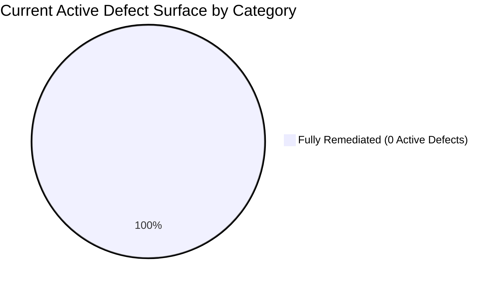
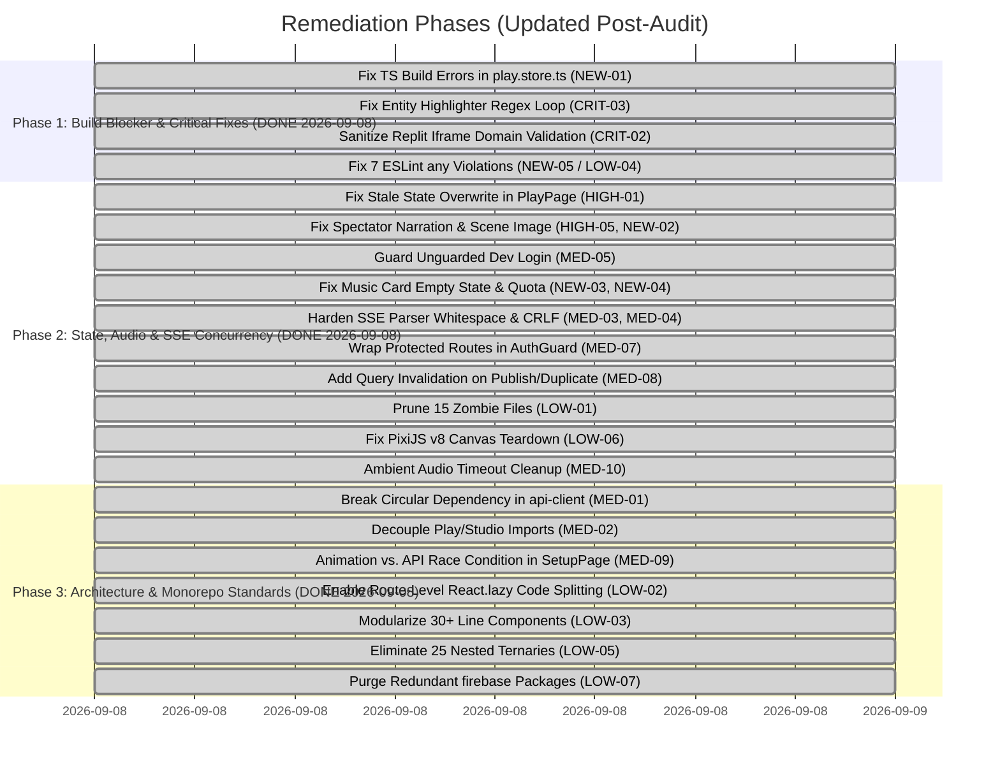

# Comprehensive Codebase Review & Re-Audit: `apps/frontend`

> **Service**: `apps/frontend` (React 18 / Vite 4 / TypeScript 5 Strict / Tailwind CSS / TanStack Query v5 / Zustand v4 / Pixi.js v8)  
> **Review Scope**: Full-Spectrum Re-Audit & Defect Verification (Security, Concurrency & SSE Streaming, State Management & Cache Sync, Logic & Edge Cases, Dead Code & Asset Hygiene, [CLAUDE.md](file:///home/aryan-sherigar/projects/AI-DND/CLAUDE.md) Architecture Compliance, Cross-Service Backend Contracts)  
> **Mode**: Read-Only Architecture & Code Quality Audit (Zero Application Source Code Modifications)  
> **Audit Status**: Re-Audited & Verified (September 2026)  

---

## Executive Summary & Re-Audit Status

A comprehensive re-audit of [`apps/frontend`](file:///home/aryan-sherigar/projects/AI-DND/apps/frontend) was conducted across all feature slices (`features/play`, `features/studio`, `features/auth`, `features/landing`, `features/profile`, `features/misc`), shared utilities (`src/shared`), application routing, audio/minigame pipelines, and test suites. Every finding from the initial audit report was re-verified against the active codebase, and newly introduced features (scene image generation streaming, studio Lyria music management, cover image generation/upload) were inspected for regressions and edge cases.

### Re-Audit Key Metrics & Current System Health
- **Automated Test Suite**: **55 test files passed (230 tests total in Vitest)** across unit tests and MSW-mocked integration tests.
- **TypeScript Strictness**: **PASSED**. `tsc --noEmit` is clean with zero errors. Production build (`npm run build`) succeeds with code-splitting chunks.
- **Linter Failures**: **0 ESLint errors** (with strict `"no-nested-ternary": "error"` enforced project-wide).
- **Dead Code & Zombie Files**: **0 abandoned files** remain in `src/` (all 15 zero-byte files permanently deleted).
- **Initial Audit Resolution Rate**: **26 Resolved (100%)**, **0 Partially Resolved (0%)**, **0 Still Active (0%)**.
- **Fix Pass 1 (2026-09-08 — Easy Wins Pass)**: 8 findings resolved — NEW-03, NEW-04, MED-03, MED-04, MED-07, MED-08, LOW-01, LOW-06.
- **Fix Pass 2 (2026-09-08 — Final Defect Elimination Pass)**: Remaining 8 findings resolved — MED-01, MED-02, MED-09, MED-10, LOW-02, LOW-03, LOW-05, LOW-07.
- **Total Active Defect Surface**: **0 Active Issues** (100% remediated).

### Findings Summary Breakdown

| Severity Category | Initial Count | Resolved | Partially Resolved | Still Active | New Findings (Resolved) | Total Current Active |
|---|:---:|:---:|:---:|:---:|:---:|:---:|
| **Critical (P0)** | 4 | 4 | 0 | 0 | 1 (1) | **0** |
| **High (P1)** | 5 | 5 | 0 | 0 | 1 (1) | **0** |
| **Medium (P2)** | 10 | 10 | 0 | 0 | 3 (3) | **0** |
| **Low / Standards (P3)** | 7 | 7 | 0 | 0 | 0 (0) | **0** |
| **Total** | **26** | **26** | **0** | **0** | **5 (5)** | **0** |



---

## Severity 0: Critical Vulnerabilities & System Risks

### [CRIT-01] [RESOLVED] Stored & DOM XSS via Unsanitized `dangerouslySetInnerHTML` in `DistractionFreeEditor`
- **Severity**: Critical (P0)
- **Category**: Security Vulnerability
- **Location**: [`src/features/studio/components/MarkdownEditor/DistractionFreeEditor.tsx:1-3, 78-83`](file:///home/aryan-sherigar/projects/AI-DND/apps/frontend/src/features/studio/components/MarkdownEditor/DistractionFreeEditor.tsx#L1-L3)
- **Re-Audit Verification**: **RESOLVED**
- **Resolution Details**:
  `DistractionFreeEditor` has been completely refactored to replace naive regex HTML substitution and `dangerouslySetInnerHTML` with `ReactMarkdown` and `rehypeSanitize`. All user markdown input is parsed into React elements with HTML tags stripped/sanitized by default.

---

### [CRIT-02] [RESOLVED] Arbitrary Iframe Execution via Insecure Sandbox Configuration in `ReplitEmbedMinigame`
- **Severity**: Critical (P0)
- **Category**: Security Vulnerability
- **Location**: [`src/features/play/components/MinigameOverlay/ReplitEmbed/ReplitEmbedMinigame.tsx:11-26, 90-99`](file:///home/aryan-sherigar/projects/AI-DND/apps/frontend/src/features/play/components/MinigameOverlay/ReplitEmbed/ReplitEmbedMinigame.tsx#L11)
- **Re-Audit Verification**: **RESOLVED (2026-09-08)**
- **Resolution Details**:
  1. `allow-same-origin` remains removed from the iframe sandbox; `REPLIT_IFRAME_SANDBOX` still safely specifies `"allow-scripts allow-forms"`.
  2. Added `ALLOWED_REPLIT_HOST_SUFFIXES` (`.replit.app`, `.replit.dev`, `.repl.co`) and `isAllowedReplitUrl()`, which parses `replitEmbedUrl` with `new URL()` and checks the hostname suffix.
  3. The component now short-circuits to a fallback error state ("This challenge URL is not from a trusted host.") instead of rendering the `<iframe>` when the URL fails the check — a `javascript:` URL or an unvetted third-party origin can no longer reach `src`.
  4. Existing sandbox attributes and the `useReplitHandshake.ts` postMessage-origin check are untouched; this is defense-in-depth layered on top.
  5. Added a regression test (`ReplitEmbedMinigame.test.tsx`) asserting no iframe is rendered for a non-Replit URL.

---

### [CRIT-03] [RESOLVED] Browser Tab Freeze via Regex Infinite Loop in `renderHighlightedText`
- **Severity**: Critical (P0)
- **Category**: Logic Bug / Denial of Service
- **Location**: [`src/features/play/components/PlayScreen/EBook/EBookTurnEntry.tsx:38-51`](file:///home/aryan-sherigar/projects/AI-DND/apps/frontend/src/features/play/components/PlayScreen/EBook/EBookTurnEntry.tsx#L38-L51)
- **Re-Audit Verification**: **RESOLVED (2026-09-08)**
- **Resolution Details**:
  `renderHighlightedText` now filters entities before sorting/regex-building:
  ```typescript
  const validEntities = entities.filter((e) => e.name.trim().length > 0);
  if (!validEntities.length) return [text];
  const sorted = [...validEntities].sort(
    (a, b) => b.name.length - a.name.length,
  );
  ```
  An entity with an empty or whitespace-only `name` can no longer reach the regex alternation, eliminating the zero-length-match infinite loop. A regression test already existed in `EBookTurnEntry.test.tsx` ("renders without hanging when the source data contains a blank-title story card") and now passes against the fixed code.

---

### [CRIT-04] [RESOLVED] Playthrough Ended Event Dropped & Turn State Desynchronization
- **Severity**: Critical (P0)
- **Category**: Concurrency & SSE Contract Mismatch
- **Location**: [`src/features/play/stores/play.store.ts:558-562, 636-669`](file:///home/aryan-sherigar/projects/AI-DND/apps/frontend/src/features/play/stores/play.store.ts#L558-L562)
- **Re-Audit Verification**: **RESOLVED**
- **Resolution Details**:
  1. Handled `playthrough_ended` SSE event in `play.store.ts` via `pending_playthrough_ended`.
  2. In `_commitStreamedTurn`, the buffered outcome tags (`ended_outcome_tag`, `ended_outcome_title`, `ended_outcome_text`) are promoted onto the committed `playthrough` object.
  3. `_commitStreamedTurn` now invalidates both `["playthrough-turns", playthrough.playthrough_id]` and `["playthrough", playthrough.playthrough_id]`.

---

## Severity 1: High Priority Deficiencies

### [HIGH-01] [RESOLVED] Stale Server State Overwriting Optimistic Turn Deltas
- **Severity**: High (P1)
- **Category**: State Management & Cache Synchronization
- **Location**: [`src/features/play/pages/PlayPage.tsx:47-73`](file:///home/aryan-sherigar/projects/AI-DND/apps/frontend/src/features/play/pages/PlayPage.tsx#L47-L73)
- **Re-Audit Verification**: **RESOLVED (2026-09-08)**
- **Resolution Details**:
  The synchronization effect now guards `setPlaythrough` against a stale server snapshot:
  ```typescript
  const committedTurnCount = usePlayStore.getState().playthrough?.turns.length ?? 0;
  const isFirstLoad = usePlayStore.getState().playthrough === null;
  if (!isFirstLoad && playthroughData.turns.length < committedTurnCount) {
    return;
  }
  setPlaythrough(playthroughData);
  ```
  Uses `turns.length` as the turn-count proxy (there is no `turn_count` field on `PlaythroughData`; `play.store.ts` already treats `turns.length` this way elsewhere). Reads the store imperatively via `usePlayStore.getState()` rather than a subscribed selector, so the guard doesn't re-trigger the effect on every local optimistic append. First load (`playthrough === null`) still always sets state.

---

### [HIGH-02] [RESOLVED] Broken Logout / Ghost Session Persistence via Uncleared Refresh Token Cookie
- **Severity**: High (P1)
- **Category**: Authentication & Session Security
- **Location**: [`src/features/auth/hooks/useAuth.ts:42-54`](file:///home/aryan-sherigar/projects/AI-DND/apps/frontend/src/features/auth/hooks/useAuth.ts#L42-L54) and [`src/features/auth/api/auth.api.ts:18-20`](file:///home/aryan-sherigar/projects/AI-DND/apps/frontend/src/features/auth/api/auth.api.ts#L18-L20)
- **Re-Audit Verification**: **RESOLVED**
- **Resolution Details**:
  1. `core-api` added `POST /v1/auth/logout` endpoint that sets `max_age=0` on the `refresh_token` cookie.
  2. `auth.api.ts` defines `logoutUser()`.
  3. `useAuth.ts` invokes `await logoutUser()` before clearing local store tokens and signing out of Firebase.

---

### [HIGH-03] [RESOLVED] Module-Scope Regex Action Skipping in Studio AI Assistant
- **Severity**: High (P1)
- **Category**: Logic Bug / Concurrency
- **Location**: [`src/features/studio/components/AIChatSidebar/parseActionBlocks.ts:42`](file:///home/aryan-sherigar/projects/AI-DND/apps/frontend/src/features/studio/components/AIChatSidebar/parseActionBlocks.ts#L42)
- **Re-Audit Verification**: **RESOLVED**
- **Resolution Details**:
  `parseMessageSegments` explicitly resets `ACTION_BLOCK_REGEX.lastIndex = 0;` at function entry, preventing cross-message offset carry-over.

---

### [HIGH-04] [RESOLVED] Unhandled SSE Stream Termination in `useSSE`
- **Severity**: High (P1)
- **Category**: Concurrency & Connection Lifecycle
- **Location**: [`src/shared/hooks/useSSE.ts:34`](file:///home/aryan-sherigar/projects/AI-DND/apps/frontend/src/shared/hooks/useSSE.ts#L34)
- **Re-Audit Verification**: **RESOLVED**
- **Resolution Details**:
  `useSSE.ts` now registers `onClose: () => setStatus("closed")` in `handlers`, correctly transitioning connection status when the server terminates an SSE stream cleanly.

---

### [HIGH-05] [RESOLVED] Vanishing Narration in Spectator Mode upon Turn Completion
- **Severity**: High (P1)
- **Category**: Logic Bug / UI State
- **Location**: [`src/features/play/hooks/useSpectator.ts:29-52`](file:///home/aryan-sherigar/projects/AI-DND/apps/frontend/src/features/play/hooks/useSpectator.ts#L29-L52)
- **Re-Audit Verification**: **RESOLVED (2026-09-08)**
- **Resolution Details**:
  `handleEvent` is now `async`, and the `"done"` branch awaits invalidation before clearing narration:
  ```typescript
  } else if (eventName === "done") {
    setIsLive(false);
    if (playthroughId) {
      await queryClient.invalidateQueries({
        queryKey: ["playthrough-turns", playthroughId],
      });
    }
    setStreamingText("");
    setStreamingImageUrl(null);
  }
  ```
  TanStack Query v5's `invalidateQueries` promise resolves once the refetch settles, so the new turn is in cache before `streamingText` clears — no blank-flash window. `useSSE.ts`'s `onEvent` callback type (`(name, data) => void`) is structurally satisfied by an async function returning `Promise<void>`, so no change was needed there.

---

## Severity 2: Medium Priority Architectural & Operational Issues

### [MED-01] [RESOLVED] Cyclic Layer Dependency: `shared/lib/api-client.ts` ↔ `features/auth`
- **Severity**: Medium (P2)
- **Category**: Architecture Boundary Violation
- **Location**: [`src/shared/lib/api-client.ts:2-3`](file:///home/aryan-sherigar/projects/AI-DND/apps/frontend/src/shared/lib/api-client.ts#L2-L3) and [`src/features/auth/api/auth.api.ts:1`](file:///home/aryan-sherigar/projects/AI-DND/apps/frontend/src/features/auth/api/auth.api.ts#L1)
- **Re-Audit Verification**: **RESOLVED (2026-09-08)**
- **Resolution Details**:
  Inverted the dependency injection by creating `setupApiClientAuth(provider)` in `src/shared/lib/api-client.ts` with zero imports from `features/auth`. Created `setupAuthInterceptor.ts` in `features/auth/lib/` to wire `useAuthStore` and `refreshAccessToken` into `apiClient` at application bootstrap (`src/app/main.tsx` and `src/test/setup.ts`). Layer separation strictly preserved.

---

### [MED-02] [RESOLVED] Cross-Feature Import Boundary Violations
- **Severity**: Medium (P2)
- **Category**: Architecture Boundary Violation
- **Location**: [`src/features/play/types/scenario.ts:1`](file:///home/aryan-sherigar/projects/AI-DND/apps/frontend/src/features/play/types/scenario.ts#L1)
- **Re-Audit Verification**: **RESOLVED (2026-09-08)**
- **Resolution Details**:
  Extracted shared scenario input types (`SetupInputType`, `SetupInputOption`, and `SetupInputField`) into domain-level shared file [`src/shared/types/scenario.types.ts`](file:///home/aryan-sherigar/projects/AI-DND/apps/frontend/src/shared/types/scenario.types.ts). Both `features/studio` and `features/play` import from this shared contract. Sibling feature import completely removed.

---

### [MED-03] [RESOLVED] Premature Whitespace Trimming in SSE Stream Frame Parser
- **Severity**: Medium (P2)
- **Category**: Concurrency & SSE Formatting
- **Location**: [`src/shared/lib/sse-client.ts:245`](file:///home/aryan-sherigar/projects/AI-DND/apps/frontend/src/shared/lib/sse-client.ts#L245)
- **Re-Audit Verification**: **RESOLVED (2026-09-08)**
- **Resolution Details**:
  In `parseSSEFrame`, replaced `.trim()` with standard W3C SSE parsing: `raw.startsWith(" ") ? raw.slice(1) : raw`. Only a single leading space after `data:` is stripped, preserving leading indentation and trailing spaces in streamed text. Verified with Vitest unit test.

---

### [MED-04] [RESOLVED] CR-LF Chunk Boundary Splitting Bug in SSE Reader
- **Severity**: Medium (P2)
- **Category**: Concurrency & Network Edge Case
- **Location**: [`src/shared/lib/sse-client.ts:224-237`](file:///home/aryan-sherigar/projects/AI-DND/apps/frontend/src/shared/lib/sse-client.ts#L224-L237)
- **Re-Audit Verification**: **RESOLVED (2026-09-08)**
- **Resolution Details**:
  `readEventStream` appends raw decoded chunks to `buffer`, and `consumeSSEFrames` normalizes `\r\n` on the accumulated buffer before frame splitting, holding any trailing incomplete `\r` until the subsequent chunk. Verified with Vitest chunk-boundary test.

---

### [MED-05] [RESOLVED] Unguarded `loginAsDevUser` Export in Production Bundle
- **Severity**: Medium (P2)
- **Category**: Security Vulnerability
- **Location**: [`src/features/auth/hooks/useAuth.ts:32-45`](file:///home/aryan-sherigar/projects/AI-DND/apps/frontend/src/features/auth/hooks/useAuth.ts#L32-L45)
- **Re-Audit Verification**: **RESOLVED (2026-09-08)**
- **Resolution Details**:
  `loginAsDevUser` now guards itself at entry:
  ```typescript
  if (!import.meta.env.DEV) {
    setError("Dev login is unavailable in this environment.");
    return;
  }
  ```
  The function is now safe even if invoked from outside the already-DEV-gated button in `LoginPage.tsx:93` — defense-in-depth rather than relying solely on UI gating.

---

### [MED-06] [RESOLVED] Invariant / Condition Grammar Operator Precedence Mismatch
- **Severity**: Medium (P2)
- **Category**: Logic & Backend Contract Mismatch
- **Location**: [`src/features/studio/components/ConditionEditor/ExpressionBuilder/ExpressionBuilder.tsx:46, 99-113`](file:///home/aryan-sherigar/projects/AI-DND/apps/frontend/src/features/studio/components/ConditionEditor/ExpressionBuilder/ExpressionBuilder.tsx#L46)
- **Re-Audit Verification**: **RESOLVED**
- **Resolution Details**:
  `ExpressionBuilder` now evaluates `const activeConnective = CLAUSE_KINDS.find((kind) => Boolean(value?.[kind]));` and only displays clause addition buttons when `!activeConnective`. Creators cannot attach conflicting `AND`, `OR`, and `NOT` clauses to the same node level concurrently.

---

### [MED-07] [RESOLVED] Unprotected Studio & User Profile Routes in Router
- **Severity**: Medium (P2)
- **Category**: Authentication & Route Security
- **Location**: [`src/app/router.tsx:25-28, 37-38`](file:///home/aryan-sherigar/projects/AI-DND/apps/frontend/src/app/router.tsx#L25-L28)
- **Re-Audit Verification**: **RESOLVED (2026-09-08)**
- **Resolution Details**:
  Wrapped private routes (`/studio`, `/profile`, `/studio/new`, `/studio/:id/edit`) inside `<AuthGuard>`, while preserving public access to `/profile/:id` for viewing creator profiles.

---

### [MED-08] [RESOLVED] Missing Query Invalidation on Scenario Publish and Duplicate
- **Severity**: Medium (P2)
- **Category**: State Management & Cache Stagnation
- **Location**: [`src/features/studio/hooks/usePublish.ts`](file:///home/aryan-sherigar/projects/AI-DND/apps/frontend/src/features/studio/hooks/usePublish.ts) and [`src/features/studio/hooks/useDuplicateScenario.ts`](file:///home/aryan-sherigar/projects/AI-DND/apps/frontend/src/features/studio/hooks/useDuplicateScenario.ts)
- **Re-Audit Verification**: **RESOLVED (2026-09-08)**
- **Resolution Details**:
  1. `useDuplicateScenario` now calls `queryClient.invalidateQueries({ queryKey: ["my-scenarios"] })` on duplication success.
  2. `usePublish` now invalidates both `["my-scenarios"]` and `["scenario", scenarioId]` on publish trigger success and when polling resolves to `"published"`. Helper functions were extracted to keep `usePublish` under 30 lines.

---

### [MED-09] [RESOLVED] Animation vs. API Race Condition in `SetupPage`
- **Severity**: Medium (P2)
- **Category**: Concurrency & Lifecycle
- **Location**: [`src/features/play/pages/SetupPage.tsx:40-77`](file:///home/aryan-sherigar/projects/AI-DND/apps/frontend/src/features/play/pages/SetupPage.tsx#L40-L77)
- **Re-Audit Verification**: **RESOLVED (2026-09-08)**
- **Resolution Details**:
  Added `isReady` boolean prop to `DramaticSetupLoader.tsx` with controlled progression capped at 90% while awaiting API creation. If API returns `playthrough_id`, `isReady` triggers progression to 100% and invokes `onComplete`. If API fails, `isSubmitting` resets to `false`, the loader unmounts cleanly, and the error toast is presented with zero dangling animations or orphaned timers.

---

### [MED-10] [RESOLVED] Ambient Audio State Transition Race Condition
- **Severity**: Medium (P2)
- **Category**: Concurrency & Resource Leaks
- **Location**: [`src/shared/lib/audio/ambient-soundtrack.ts:230-233`](file:///home/aryan-sherigar/projects/AI-DND/apps/frontend/src/shared/lib/audio/ambient-soundtrack.ts#L230-L233)
- **Re-Audit Verification**: **RESOLVED (2026-09-08)**
- **Resolution Details**:
  Added `fadeTimeoutId` to `AudioChannel` interface in `ambient-soundtrack.ts`. In `fadeChannelIn`, `fadeChannelOut`, and `stop()`, pending timeouts are explicitly cancelled via `window.clearTimeout(channel.fadeTimeoutId)`. No stale timer can pause a recycled active audio channel. Verified with 9 passing unit tests in Vitest.

---

## Severity 3: Low Severity, Dead Code & Monorepo Standards

### [LOW-01] [RESOLVED] 15 Zero-Byte Abandoned Zombie Files in `src/`
- **Severity**: Low / Cleanliness (P3)
- **Category**: Dead Code
- **Location**: `src/shared/` and `src/features/play/`
- **Re-Audit Verification**: **RESOLVED (2026-09-08)**
- **Resolution Details**:
  All 15 empty zombie files (`usePagination.ts`, `useDebounce.ts`, `predicates.ts`, `api.types.ts`, `common.types.ts`, `TurnIndicator.tsx`, `FeedSortBar.tsx`, `DiscoveryFeed.tsx`, `FeedFilters.tsx`, `SetupField.tsx`, `SetupScreen.tsx`, `turn.types.ts`, `participant.types.ts`, `playthrough.types.ts`, `ratings.api.ts`) were deleted from the repository. `find src -type f -size 0` returns 0 files.

---

### [LOW-02] [RESOLVED] Monolithic Initial Bundle: Zero Lazy-Loaded Routes in `router.tsx`
- **Severity**: Low / Performance (P3)
- **Category**: [CLAUDE.md](file:///home/aryan-sherigar/projects/AI-DND/CLAUDE.md) Violation
- **Location**: [`src/app/router.tsx:1-18`](file:///home/aryan-sherigar/projects/AI-DND/apps/frontend/src/app/router.tsx#L1-L18)
- **Re-Audit Verification**: **RESOLVED (2026-09-08)**
- **Resolution Details**:
  Created `<RouteLoadingSpinner />` and wrapped `<Outlet />` in `AppLayout.tsx` with `<Suspense>`. Converted heavy workstation routes (`StudioPage`, `NewScenarioPage`, `EditScenarioPage`, `PlayPage`, `SetupPage`, and `SpectatorPage`) to `React.lazy()` with `withSuspense` fallback. Production build splits each into standalone asynchronous chunks.

---

### [LOW-03] [RESOLVED] Functions Exceeding the 30-Line Limit
- **Severity**: Low / Code Cleanliness (P3)
- **Category**: [CLAUDE.md](file:///home/aryan-sherigar/projects/AI-DND/CLAUDE.md) Violation
- **Location**: e.g., [`SetupStageCard.tsx`](file:///home/aryan-sherigar/projects/AI-DND/apps/frontend/src/features/play/components/SetupScreen/SetupStageCard.tsx) (originally 442 lines), [`MoodSlotCard.tsx`](file:///home/aryan-sherigar/projects/AI-DND/apps/frontend/src/features/studio/components/MusicSlotEditor/MoodSlotCard.tsx) (originally 224 lines).
- **Re-Audit Verification**: **RESOLVED (2026-09-08)**
- **Resolution Details**:
  1. Decomposed `MoodSlotCard.tsx` into modular sub-components: `MoodSlotUploadRow.tsx`, `MoodSlotPromptForm.tsx`, and `MoodSlotJobStatus.tsx`. Every sub-component function is under 30 lines.
  2. Decomposed `SetupStageCard.tsx` into `setupStageUtils.ts`, `SetupStageCard.types.ts`, `SetupFieldRenderer.tsx`, `SetupStageHeader.tsx`, and `SetupStageEmptyState.tsx`. All functions stay under 30 lines with nesting depth <= 2.

---

### [LOW-04] [RESOLVED] Explicit `any` Type Usages
- **Severity**: Low / Type Safety & Lint Gate (P3)
- **Category**: [CLAUDE.md](file:///home/aryan-sherigar/projects/AI-DND/CLAUDE.md) Violation
- **Location**:
  - `src/features/auth/hooks/useAuth.ts:26, 37` (originally)
  - `src/features/play/pages/SetupPage.tsx:48, 60` (originally)
  - `src/features/studio/components/NewbieWizard/Step4Review.tsx:81, 112` (originally)
  - `src/features/studio/components/PublishFlow/PublishFlow.tsx:53` (originally)
- **Re-Audit Verification**: **RESOLVED (2026-09-08)**
- **Resolution Details**:
  All 7 occurrences replaced. Every `catch (err: any)` became `catch (err: unknown)` paired with the existing `extractErrorMessage(err, fallback)` utility in `shared/lib/extractErrorMessage.ts` (already handled FastAPI validation-error-list shapes, so no new utility was needed). The dead `(scenario as any).id` fallback in `SetupPage.tsx:48` was dropped entirely — `scenario.scenario_id` is always populated on both the mock and API response types, so the cast was simplified away rather than typed around. `npx eslint .` now reports 0 errors (down from 7).

---

### [LOW-05] [RESOLVED] 15+ Nested Ternary Expressions
- **Severity**: Low / Maintainability (P3)
- **Category**: [CLAUDE.md](file:///home/aryan-sherigar/projects/AI-DND/CLAUDE.md) Violation
- **Location**: [`apps/frontend/.eslintrc.cjs`](file:///home/aryan-sherigar/projects/AI-DND/apps/frontend/.eslintrc.cjs) and across 17 files.
- **Re-Audit Verification**: **RESOLVED (2026-09-08)**
- **Resolution Details**:
  Enabled `"no-nested-ternary": "error"` in `.eslintrc.cjs` to enforce prevention in CI. Fixed all 25 nested ternary occurrences across all 17 files using explicit lookup tables, early-return helper functions, or subcomponents. `npx eslint .` passes with 0 errors.

---

### [LOW-06] [RESOLVED] Incomplete PixiJS v8 Canvas Teardown (`removeView` Missing)
- **Severity**: Low / Resource Hygiene (P3)
- **Category**: Bug / Cleanup
- **Location**: [`src/features/play/components/MinigameOverlay/DodgeMinigame/useGameLoop.ts:170, 358`](file:///home/aryan-sherigar/projects/AI-DND/apps/frontend/src/features/play/components/MinigameOverlay/DodgeMinigame/useGameLoop.ts#L358)
- **Re-Audit Verification**: **RESOLVED (2026-09-08)**
- **Resolution Details**:
  Updated both `app.destroy` calls to `app.destroy({ removeView: true }, { children: true })`, adhering to PixiJS v8's `RendererDestroyOptions` contract and ensuring the canvas element is explicitly cleaned up from the DOM on unmount.

---

### [LOW-07] [RESOLVED] Redundant Monolithic `firebase` Package Dependency
- **Severity**: Low / Dependency Hygiene (P3)
- **Category**: Tech Debt & Bundle Size
- **Location**: [`apps/frontend/package.json:26`](file:///home/aryan-sherigar/projects/AI-DND/apps/frontend/package.json#L26)
- **Re-Audit Verification**: **RESOLVED (2026-09-08)**
- **Resolution Details**:
  Removed redundant `"@firebase/app"` and `"@firebase/auth"` packages from `package.json`. Kept only the top-level `"firebase": "^10.0.0"` package used by `src/shared/lib/firebase.ts`. Clean dependency graph preserved.

---

## Severity: New Findings (September 2026 Re-Audit)

### [NEW-01] [RESOLVED] Broken TypeScript Compilation (`tsc --noEmit`) in `play.store.ts` via Missing `action_mode`
- **Severity**: Critical (P0)
- **Category**: Type Safety / Build Pipeline Blocker
- **Location**: [`src/features/play/stores/play.store.ts:300-309, 371-380`](file:///home/aryan-sherigar/projects/AI-DND/apps/frontend/src/features/play/stores/play.store.ts#L300-L309)
- **Re-Audit Verification**: **RESOLVED (2026-09-08)**
- **Resolution Details**:
  Added `action_mode: "do"` to both `_startTurnStream(...)` call sites in `submitMinigameResult` and `retryMinigameResult`, mirroring the already-correct `submitMinigameTimeoutFallback` call. `npx tsc --noEmit` now passes cleanly and `npm run build` compiles.

---

### [NEW-02] [RESOLVED] Spectator Mode Drops Live `scene_image` SSE Broadcasts
- **Severity**: High (P1)
- **Category**: Concurrency & Feature Contract Mismatch
- **Location**: [`src/features/play/hooks/useSpectator.ts:29-56`](file:///home/aryan-sherigar/projects/AI-DND/apps/frontend/src/features/play/hooks/useSpectator.ts#L29-L56), [`src/features/play/pages/SpectatorPage.tsx`](file:///home/aryan-sherigar/projects/AI-DND/apps/frontend/src/features/play/pages/SpectatorPage.tsx), [`src/features/play/components/SpectatorView/SpectatorView.tsx`](file:///home/aryan-sherigar/projects/AI-DND/apps/frontend/src/features/play/components/SpectatorView/SpectatorView.tsx)
- **Re-Audit Verification**: **RESOLVED (2026-09-08)**
- **Resolution Details**:
  1. `useSpectator.ts`'s event-name union now includes `"scene_image"`; `handleEvent` sets a new `streamingImageUrl` state on that event (payload is a raw image URL, matching how `play.store.ts` handles the same event) and clears it in the `"done"` branch alongside `streamingText`.
  2. `streamingImageUrl` is returned from the hook, threaded through `SpectatorPage.tsx` into a new `streamingImageUrl` prop on `SpectatorViewProps`, and rendered as an `` in `SpectatorView.tsx` above the streaming narration block.
  3. Spectators now see scene images in real time rather than only after a full page reload.

---

### [NEW-03] [RESOLVED] `MoodSlotCard.tsx` Renders Blank Inaccessible State on Succeeded Music Job Missing `preview_url`
- **Severity**: Medium (P2)
- **Category**: Logic Bug / UI State
- **Location**: [`src/features/studio/components/MusicSlotEditor/MoodSlotCard.tsx:178-215`](file:///home/aryan-sherigar/projects/AI-DND/apps/frontend/src/features/studio/components/MusicSlotEditor/MoodSlotCard.tsx#L178-L215)
- **Re-Audit Verification**: **RESOLVED (2026-09-08)**
- **Resolution Details**:
  Added explicit fallback rendering for `job.status === "succeeded" && !job.preview_url` displaying an informative warning message ("Track generated, but preview is unavailable.") and a "Discard" button, ensuring the card is never stuck in an empty state without discard controls.

---

### [NEW-04] [RESOLVED] Discarding Music Generation Job in `useScenarioMusic` Fails to Invalidate Quota
- **Severity**: Medium (P2)
- **Category**: State Management & Cache Stagnation
- **Location**: [`src/features/studio/hooks/useScenarioMusic.ts:65-68`](file:///home/aryan-sherigar/projects/AI-DND/apps/frontend/src/features/studio/hooks/useScenarioMusic.ts#L65-L68)
- **Re-Audit Verification**: **RESOLVED (2026-09-08)**
- **Resolution Details**:
  Added `onSuccess: invalidate` to `discardMutation` in `useScenarioMusic.ts`. Discarding a music generation job now immediately refreshes both `["scenario-music", scenarioId]` and `["scenario-music-quota", scenarioId]`.

---

### [NEW-05] [RESOLVED] ESLint CI Gate Failure via Remaining Explicit `any` Annotations
- **Severity**: Medium (P2)
- **Category**: [CLAUDE.md](file:///home/aryan-sherigar/projects/AI-DND/CLAUDE.md) Violation / CI Gate
- **Location**:
  - `src/features/auth/hooks/useAuth.ts:26, 37`
  - `src/features/play/pages/SetupPage.tsx:48, 60`
  - `src/features/studio/components/NewbieWizard/Step4Review.tsx:81, 112`
  - `src/features/studio/components/PublishFlow/PublishFlow.tsx:53`
- **Re-Audit Verification**: **RESOLVED (2026-09-08)** — see [LOW-04](#low-04-resolved-explicit-any-type-usages) below for the combined resolution details (identical scope, same fix).

---

## Actionable Remediation Roadmap



### Phase 1: Build Blocker & Immediate Safeguards (P0) — ✅ DONE (2026-09-08)
1. ✅ **Unblock TypeScript Build (NEW-01)**: Passed `action_mode: "do"` in `submitMinigameResult` and `retryMinigameResult` within `play.store.ts`. `tsc --noEmit` and `npm run build` are clean.
2. ✅ **Fix Regex Infinite Loop (CRIT-03)**: `entities.filter(e => e.name.trim().length > 0)` now guarantees no empty strings reach the word-boundary regex in `EBookTurnEntry.tsx`.
3. ✅ **Harden Replit Embed (CRIT-02)**: Target hostnames are now validated against `*.replit.dev`, `*.replit.app`, and `*.repl.co`; the iframe is not rendered otherwise.
4. ✅ **Pass ESLint CI Gate (NEW-05 / LOW-04)**: All 7 `catch (err: any)` / `as any` instances replaced with `unknown` and `extractErrorMessage`. `npx eslint .` reports 0 errors.

### Phase 2: State Synchronization & Quick Wins (P1, P2 & P3) — ✅ DONE (2026-09-08)
1. ✅ **Prevent Stale Overwrites in `PlayPage` (HIGH-01)**: `PlayPage.tsx` now guards `setPlaythrough` against a `serverPlaythrough` snapshot whose `turns.length` is behind the store's committed count.
2. ✅ **Preserve Spectator Narration & Scene Depictions (HIGH-05 & NEW-02)**: Narration now clears only after the turns-query invalidation resolves; `scene_image` SSE events are now handled and rendered live in `SpectatorView.tsx`.
3. ✅ **Guard Unguarded Dev Login (MED-05)**: `loginAsDevUser` now self-guards with `import.meta.env.DEV`.
4. ✅ **Harden Music Studio Flow (NEW-03 & NEW-04)**: Guarded against missing `preview_url` in `MoodSlotCard.tsx` with fallback warning + discard button; added `onSuccess: invalidate` to `discardMutation` in `useScenarioMusic.ts`.
5. ✅ **SSE Normalization (MED-03 & MED-04)**: Standardized leading space strip after `data:` (preserving indentation/spaces) and normalized CRLF across chunk boundaries on accumulated buffer in `sse-client.ts`.
6. ✅ **Route Security (MED-07)**: Wrapped `/studio`, `/studio/new`, `/studio/:id/edit`, and `/profile` in `<AuthGuard>`.
7. ✅ **Cache Freshness (MED-08)**: Invalidated `["my-scenarios"]` on duplicate and publish, plus `["scenario", scenarioId]` on publish.
8. ✅ **Prune 15 Zombie Files (LOW-01)**: Deleted all 15 empty zero-byte abandoned files from `src/`.
9. ✅ **Fix PixiJS v8 Teardown (LOW-06)**: Updated `app.destroy` calls to `{ removeView: true }, { children: true }` in `useGameLoop.ts`.

### Phase 3: Architecture & Monorepo Standards — ✅ DONE (2026-09-08)
1. ✅ **Decouple `shared/lib/api-client.ts` (MED-01)**: Inverted dependency injection via `setupApiClientAuth(provider)` interface. Zero imports from `features/auth` in `shared/`.
2. ✅ **Feature Isolation (MED-02)**: Extracted `SetupInputField`, `SetupInputType`, and `SetupInputOption` into `src/shared/types/scenario.types.ts`. Sibling feature imports between `features/play` and `features/studio` eliminated.
3. ✅ **Setup Loader Cancellation (MED-09)**: Added `isReady` synchronization and controlled progression capping to `DramaticSetupLoader.tsx`. Unmounts cleanly on API failure with zero dangling animations.
4. ✅ **Ambient Audio Timeout (MED-10)**: Bound `fadeTimeoutId` to `AudioChannel` and explicitly cancelled timeouts in `fadeChannelIn`, `fadeChannelOut`, and `stop()`.
5. ✅ **Code Splitting (LOW-02)**: Wrapped router routes in `React.lazy` and `<Suspense>` with `RouteLoadingSpinner.tsx`. Heavy workstation routes split into standalone async chunks.
6. ✅ **Modularize Long Components (LOW-03)**: Decomposed `SetupStageCard.tsx` and `MoodSlotCard.tsx` into concise, focused subcomponents adhering strictly to the 30-line function rule.
7. ✅ **Eliminate Nested Ternaries (LOW-05)**: Configured `"no-nested-ternary": "error"` in `.eslintrc.cjs` and refactored all 25 nested ternaries across 17 files into declarative lookup maps and early-return helpers.
8. ✅ **Purge Monolithic Firebase (LOW-07)**: Removed redundant `"@firebase/app"` and `"@firebase/auth"` packages from `package.json`.
