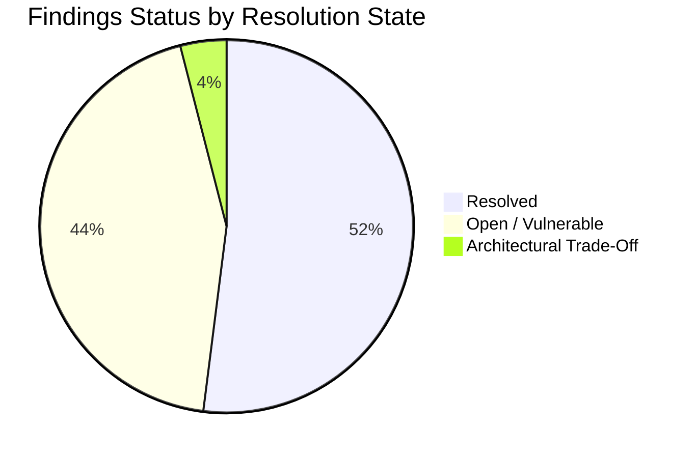
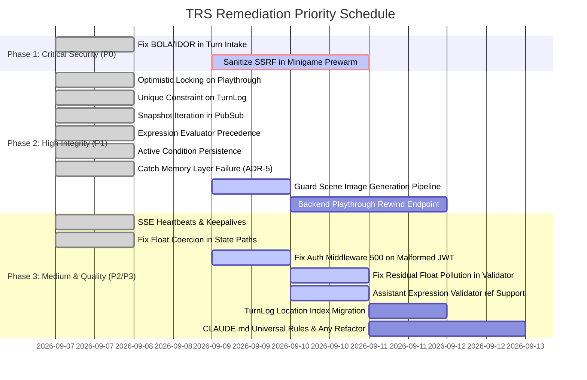

# Turn Resolution Service (TRS) Codebase Audit & Vulnerability Report

**Initial Audit Date:** September 6, 2026  
**Last Updated:** September 8, 2026  
**Audited Service:** Turn Resolution Service (`apps/turn-resolution-service`)  
**Scope:** TRS Internal Architecture, Core API Data Models/Auth Contracts, Frontend SSE Streaming & State Sync, Scene Image Generation, Studio Assistant  
**Methodology:** Full-subsystem static code analysis, transaction trace auditing, vulnerability scanning, cross-service contract verification, and automated test regression suite execution (`272 passed, 1 skipped`).

---

## Executive Summary

A comprehensive codebase audit and vulnerability re-assessment of the **Turn Resolution Service (TRS)** ([`apps/turn-resolution-service/`](file:///home/aryan-sherigar/projects/AI-DND/apps/turn-resolution-service)) and its integration boundaries with **Core API** and **Frontend** was conducted.

### Current Status Overview (As of September 8, 2026)
- **Total Tracked Findings:** 25 (19 original findings + 6 new findings identified in recent features)
- **Resolved Findings:** 13 (52%)
- **Open Findings:** 12 (48%)
- **Test Suite Status:** 272 passed, 1 skipped in `apps/turn-resolution-service/tests/`

### Key Highlights
1. **Critical Vulnerabilities Addressed:** BOLA/IDOR in turn submission ([P0-SEC-1](#p0-sec-1-broken-object-level-authorization-bola--idor-in-turn-submission-endpoint)) has been fully resolved with user-to-participant ownership validation.
2. **SSRF Reclassification:** [P0-SEC-2](#p0-sec-2-server-side-request-forgery-ssrf-via-unvalidated-minigame-replit-url-pre-warm) was previously tagged as solved, but code inspection reveals that [`_prewarm_replit_url`](file:///home/aryan-sherigar/projects/AI-DND/apps/turn-resolution-service/app/turn/pipeline.py#L364-L380) still executes unconstrained HTTP GET requests without scheme enforcement, domain whitelisting, or private/cloud metadata IP blocking. It is reclassified as **OPEN / VULNERABLE**.
3. **Concurrency & Data Integrity Hardened:** Turn overwrite race conditions ([P1-CONC-1](#p1-conc-1-state-overwrite-race-condition-on-concurrent-turn-submissions-missing-optimisticpessimistic-locking)), duplicate turn logs ([P1-CONC-2](#p1-conc-2-non-unique-turnlog-turn-numbers-permitting-duplicate-narrative-rows)), PubSub queue mutation crashes ([P1-CONC-3](#p1-conc-3-async-pubsub-queue-iteration-mutation-bug-runtimerror-crash)), and memory layer crash cascades ([P1-RES-1](#p1-res-1-unhandled-memory-query-failure-halting-turn-pipeline-adr-5-violation)) have been completely resolved.
4. **New Findings Discovered:** 6 new issues were discovered in recent feature expansions:
   - Best-effort scene image generation crashes the entire turn pipeline on Vertex AI 400/403 `ClientError` ([P1-STREAM-1](#p1-stream-1-best-effort-scene-image-generation-crashes-pipeline-on-vertex-ai-clienterror)).
   - Unhandled `TypeError`/`ValueError`/`ValidationError` in JWT authentication middleware causing HTTP 500 instead of 401 ([P2-AUTH-1](#p2-auth-1-unhandled-typeerrorvalueerrorvalidationerror-in-auth-middleware-leading-to-500)).
   - Cross-field `"ref"` expressions falsely rejected by Studio Assistant validator ([P2-LOGIC-1](#p2-logic-1-cross-field-ref-unsupported-in-studio-assistant-expression_validatorpy)).
   - Residual float type pollution in [`state_validator._compute_new_value`](file:///home/aryan-sherigar/projects/AI-DND/apps/turn-resolution-service/app/turn/steps/state_validator.py#L105-L116) for AI function calls ([P2-STATE-3](#p2-state-3-residual-float-type-pollution-in-state_validator_compute_new_value)).
   - Unhandled Gemini `ClientError` abruptly crashing Studio Assistant streaming ([P3-STREAM-1](#p3-stream-1-unhandled-gemini-clienterror-in-studio-assistant-streaming)).
   - Missing database index on [`turn_logs`](file:///home/aryan-sherigar/projects/AI-DND/apps/turn-resolution-service/app/db/models/turn_log.py#L11-L50) for location grounding queries ([P3-PERF-1](#p3-perf-1-missing-index-on-turnlog-for-location-scene-image-consistency)).

---

## Findings Matrix

| Severity | Security & Auth | Concurrency & Race | State & Data Invariants | Logic & Rules | Streaming & Resilience | Architecture & Standards | Total | Resolved | Open |
|---|:---:|:---:|:---:|:---:|:---:|:---:|:---:|:---:|:---:|
| **P0 (Critical)** | 2 | 0 | 0 | 0 | 0 | 0 | **2** | 1 | 1 |
| **P1 (High)** | 0 | 3 | 1 | 3 | 2 | 0 | **9** | 7 | 2 |
| **P2 (Medium)** | 2 | 0 | 3 | 1 | 2 | 0 | **8** | 5 | 3 |
| **P3 (Low)** | 0 | 0 | 0 | 0 | 1 | 5 | **6** | 0 | 6 |
| **Total** | **4** | **3** | **4** | **4** | **5** | **5** | **25** | **13** | **12** |



---

## P0 — Critical Severity Findings

### [P0-SEC-1] Broken Object Level Authorization (BOLA / IDOR) in Turn Submission Endpoint
- **Category:** Security & Authorization
- **Location:** [`app/routers/turn.py:L18-25`](file:///home/aryan-sherigar/projects/AI-DND/apps/turn-resolution-service/app/routers/turn.py#L18-L25), [`app/turn/pipeline.py:L78-95`](file:///home/aryan-sherigar/projects/AI-DND/apps/turn-resolution-service/app/turn/pipeline.py#L78-L95), [`app/turn/steps/request_receiver.py:L78-97`](file:///home/aryan-sherigar/projects/AI-DND/apps/turn-resolution-service/app/turn/steps/request_receiver.py#L78-L97)
- **Status:** `[RESOLVED]`
- **Root Cause:** In the initial implementation, `_user: Annotated[CurrentUser, Depends(get_current_user)]` was injected in [`turn.py`](file:///home/aryan-sherigar/projects/AI-DND/apps/turn-resolution-service/app/routers/turn.py) but was not forwarded to the pipeline or validated against `acting_participant.user_id`.
- **Resolution Details:**
  1. [`app/routers/turn.py:L21-24`](file:///home/aryan-sherigar/projects/AI-DND/apps/turn-resolution-service/app/routers/turn.py#L21-L24): Forwarded `current_user` into `run_turn(turn_input, session, current_user)`.
  2. [`app/turn/steps/request_receiver.py:L78-97`](file:///home/aryan-sherigar/projects/AI-DND/apps/turn-resolution-service/app/turn/steps/request_receiver.py#L78-L97): Added `_validate_acting_participant` which explicitly asserts `acting_participant.user_id == current_user.user_id`, raising `ParticipantAccessDeniedError()` on mismatch.
  3. **Verification:** Verified via [`tests/turn/steps/test_request_receiver.py`](file:///home/aryan-sherigar/projects/AI-DND/apps/turn-resolution-service/tests/turn/steps/test_request_receiver.py) and [`tests/routers/test_turn.py`](file:///home/aryan-sherigar/projects/AI-DND/apps/turn-resolution-service/tests/routers/test_turn.py).

---

### [P0-SEC-2] Server-Side Request Forgery (SSRF) via Unvalidated Minigame Replit URL Pre-warm
- **Category:** Security & Authorization
- **Location:** [`app/turn/pipeline.py:L364-380`](file:///home/aryan-sherigar/projects/AI-DND/apps/turn-resolution-service/app/turn/pipeline.py#L364-L380), [`app/turn/steps/minigame_trigger_evaluator.py:L75`](file:///home/aryan-sherigar/projects/AI-DND/apps/turn-resolution-service/app/turn/steps/minigame_trigger_evaluator.py#L75)
- **Status:** `[OPEN / VULNERABLE]` *(Reclassified from Solved)*
- **Root Cause:** When a master-mode turn matches a minigame trigger of type `replit_embed`, `_stamp_pending_minigame` calls `_prewarm_replit_url(str(replit_embed_url))`. In [`pipeline.py:L364-380`](file:///home/aryan-sherigar/projects/AI-DND/apps/turn-resolution-service/app/turn/pipeline.py#L364-L380), `httpx.AsyncClient` executes an unvalidated HTTP GET request directly to the scenario-supplied URL:
  ```python
  async def _prewarm_replit_url(url: str) -> None:
      try:
          async with httpx.AsyncClient(timeout=_PREWARM_TIMEOUT_SECONDS) as client:
              async for attempt in AsyncRetrying(...):
                  with attempt:
                      await client.get(url)
      except Exception:
          logger.warning(EVENT_MINIGAME_PREWARM_FAILED, url=url, exc_info=True)
  ```
  Although previously tagged as solved in the report header, static code inspection confirms that **no URL scheme validation, domain whitelisting, or private IP blocking exists**.
- **Impact & Exploit Scenario:** A scenario author can specify `replit_embed_url = "http://metadata.google.internal/computeMetadata/v1/instance/service-accounts/default/token"` or `http://169.254.169.254/computeMetadata/v1/`. When a player hits the trigger, TRS dispatches an unconstrained HTTP request from the Cloud Run container, enabling cloud metadata token theft and internal network reconnaissance.
- **Remediation Recommendation:**
  1. Enforce `url.startswith("https://")`.
  2. Restrict hostnames against an allowed domain regex: `^https://[a-zA-Z0-9-]+\.(replit\.app|repl\.co|replit\.dev)(/.*)?$`.
  3. Resolve DNS hostname and reject private/link-local/loopback IP ranges (`127.0.0.0/8`, `10.0.0.0/8`, `172.16.0.0/12`, `192.168.0.0/16`, `169.254.0.0/16`).

---

## P1 — High Severity Findings

### [P1-CONC-1] State Overwrite Race Condition on Concurrent Turn Submissions (Missing Optimistic/Pessimistic Locking)
- **Category:** Concurrency & Race Conditions
- **Location:** [`app/repositories/playthrough_repo.py:L23-42`](file:///home/aryan-sherigar/projects/AI-DND/apps/turn-resolution-service/app/repositories/playthrough_repo.py#L23-L42), [`app/turn/steps/state_writer.py:L140-150`](file:///home/aryan-sherigar/projects/AI-DND/apps/turn-resolution-service/app/turn/steps/state_writer.py#L140-L150)
- **Status:** `[RESOLVED]`
- **Root Cause:** Playthrough state updates were vulnerable to lost updates when concurrent turns loaded the same base turn count.
- **Resolution Details:**
  1. [`app/repositories/playthrough_repo.py:L31-41`](file:///home/aryan-sherigar/projects/AI-DND/apps/turn-resolution-service/app/repositories/playthrough_repo.py#L31-L41): Added conditional update checking `Playthrough.turn_count == expected_turn_count`. If `result.rowcount == 0`, raises `OptimisticLockError()`.
  2. [`app/turn/steps/state_writer.py:L142-144`](file:///home/aryan-sherigar/projects/AI-DND/apps/turn-resolution-service/app/turn/steps/state_writer.py#L142-L144): Catches `OptimisticLockError` without retry.
  3. [`app/turn/pipeline.py:L235-243`](file:///home/aryan-sherigar/projects/AI-DND/apps/turn-resolution-service/app/turn/pipeline.py#L235-L243): Catches `OptimisticLockError` and emits a graceful `degraded` SSE event.
  4. **Verification:** Verified via [`tests/repositories/test_playthrough_repo.py`](file:///home/aryan-sherigar/projects/AI-DND/apps/turn-resolution-service/tests/repositories/test_playthrough_repo.py) and [`tests/turn/test_pipeline.py`](file:///home/aryan-sherigar/projects/AI-DND/apps/turn-resolution-service/tests/turn/test_pipeline.py).

---

### [P1-CONC-2] Non-Unique `TurnLog` Turn Numbers Permitting Duplicate Narrative Rows
- **Category:** Concurrency & Race Conditions
- **Location:** [`app/db/models/turn_log.py:L16-20`](file:///home/aryan-sherigar/projects/AI-DND/apps/turn-resolution-service/app/db/models/turn_log.py#L16-L20)
- **Status:** `[RESOLVED]`
- **Root Cause:** `TurnLog` lacked a unique constraint on `(playthrough_id, turn_number)`.
- **Resolution Details:**
  1. Added `UniqueConstraint("playthrough_id", "turn_number", name="uq_turn_logs_playthrough_turn")` in [`app/db/models/turn_log.py:L17-19`](file:///home/aryan-sherigar/projects/AI-DND/apps/turn-resolution-service/app/db/models/turn_log.py#L17-L19).
  2. **Verification:** Verified via [`tests/repositories/test_turn_log_repo.py`](file:///home/aryan-sherigar/projects/AI-DND/apps/turn-resolution-service/tests/repositories/test_turn_log_repo.py).

---

### [P1-CONC-3] Async PubSub Queue Iteration Mutation Bug (`RuntimeError` Crash)
- **Category:** Concurrency & Race Conditions
- **Location:** [`app/session/notification_manager.py:L61-66`](file:///home/aryan-sherigar/projects/AI-DND/apps/turn-resolution-service/app/session/notification_manager.py#L61-L66), [`app/session/spectator_manager.py:L37-40`](file:///home/aryan-sherigar/projects/AI-DND/apps/turn-resolution-service/app/session/spectator_manager.py#L37-L40)
- **Status:** `[RESOLVED]`
- **Root Cause:** Mutating subscriber dictionaries during async iteration caused `RuntimeError: dictionary changed size during iteration`.
- **Resolution Details:**
  1. Implemented snapshot iteration (`list(_subscribers.items())` and `list(_subscribers.get(playthrough_id, []))`).
  2. Replaced `await queue.put()` with non-blocking `queue.put_nowait()` guarded by `asyncio.QueueFull` exception handling.
  3. **Verification:** Verified via [`tests/session/test_notification_manager.py`](file:///home/aryan-sherigar/projects/AI-DND/apps/turn-resolution-service/tests/session/test_notification_manager.py) and [`tests/session/test_spectator_manager.py`](file:///home/aryan-sherigar/projects/AI-DND/apps/turn-resolution-service/tests/session/test_spectator_manager.py).

---

### [P1-STATE-1] Client-Side State Desynchronization via Uncoordinated `editLastAction`
- **Category:** State Management & Invariants
- **Location:** [`apps/frontend/src/features/play/stores/play.store.ts:L272-292`](file:///home/aryan-sherigar/projects/AI-DND/apps/frontend/src/features/play/stores/play.store.ts#L272-L292)
- **Status:** `[OPEN]`
- **Root Cause:** The frontend `editLastAction` action pops the last turn from the client's local Zustand state array without notifying TRS or Core API, leaving the database state intact at `turn_count = N`. Resubmissions append as `turn_count = N + 1`, corrupting the storyline.
- **Impact & Exploit Scenario:** Storyline desynchronization between player view and persistent Postgres state.
- **Remediation Recommendation:** Implement `POST /v1/playthroughs/{id}/rewind` or remove `editLastAction` if playthroughs are strictly append-only.

---

### [P1-RES-1] Unhandled Memory Query Failure Halting Turn Pipeline (ADR-5 Violation)
- **Category:** Streaming & Resilience
- **Location:** [`app/turn/steps/context_retrieval.py:L59-86`](file:///home/aryan-sherigar/projects/AI-DND/apps/turn-resolution-service/app/turn/steps/context_retrieval.py#L59-L86)
- **Status:** `[RESOLVED]`
- **Root Cause:** Memory service connection failures or timeouts raised `MemoryLayerUnavailableError`, aborting the turn with an HTTP 500 error and violating ADR-5.
- **Resolution Details:**
  1. Implemented `_query_memory_safe` in [`context_retrieval.py`](file:///home/aryan-sherigar/projects/AI-DND/apps/turn-resolution-service/app/turn/steps/context_retrieval.py), catching both `MemoryLayerUnavailableError` and unexpected exceptions.
  2. Degrades gracefully to `MemoryQueryResponse(facts=[], abstained=True)`.
  3. **Verification:** Verified via [`tests/turn/steps/test_context_retrieval.py`](file:///home/aryan-sherigar/projects/AI-DND/apps/turn-resolution-service/tests/turn/steps/test_context_retrieval.py) and [`test_run_turn_succeeds_when_memory_query_fails` in `tests/turn/test_pipeline.py`](file:///home/aryan-sherigar/projects/AI-DND/apps/turn-resolution-service/tests/turn/test_pipeline.py#L612).

---

### [P1-LOGIC-1] Boolean Precedence Logic Inversion in `expression_evaluator.py`
- **Category:** Logic Bugs & Edge Cases
- **Location:** [`app/turn/expression_evaluator.py:L45-52`](file:///home/aryan-sherigar/projects/AI-DND/apps/turn-resolution-service/app/turn/expression_evaluator.py#L45-L52)
- **Status:** `[RESOLVED]`
- **Root Cause:** Compound connectives (`AND`, `OR`, `NOT`) evaluated in procedural order rather than standard boolean precedence.
- **Resolution Details:**
  1. Enforced grammar invariant: each expression node may specify at most one connective (`AND`, `OR`, or `NOT`), raising `ValueError` if multiple connectives are found.
  2. **Verification:** Verified via [`test_evaluate_multiple_connectives_raises_value_error` in `tests/turn/test_expression_evaluator.py`](file:///home/aryan-sherigar/projects/AI-DND/apps/turn-resolution-service/tests/turn/test_expression_evaluator.py).

---

### [P1-LOGIC-2] Dotted String False-Positive Reference Bug in `_resolve_operand`
- **Category:** Logic Bugs & Edge Cases
- **Location:** [`app/turn/expression_evaluator.py:L95-107`](file:///home/aryan-sherigar/projects/AI-DND/apps/turn-resolution-service/app/turn/expression_evaluator.py#L95-L107)
- **Status:** `[RESOLVED]`
- **Root Cause:** Dotted string literals (e.g. `"scroll.txt"`) were automatically misinterpreted as state field path references.
- **Resolution Details:**
  1. Replaced heuristic dot-matching with explicit `"ref"` key in expression AST nodes. Literal strings under `"value"` are never interpreted as field references.
  2. **Verification:** Verified via [`test_evaluate_literal_string_with_dot_not_treated_as_reference` in `tests/turn/test_expression_evaluator.py`](file:///home/aryan-sherigar/projects/AI-DND/apps/turn-resolution-service/tests/turn/test_expression_evaluator.py).

---

### [P1-LOGIC-3] Active Condition Disappearance Bug in `_should_skip`
- **Category:** Logic Bugs & Edge Cases
- **Location:** [`app/turn/steps/condition_evaluator.py:L51-75`](file:///home/aryan-sherigar/projects/AI-DND/apps/turn-resolution-service/app/turn/steps/condition_evaluator.py#L51-L75)
- **Status:** `[RESOLVED]`
- **Root Cause:** Active conditions were skipped if their referenced fields were not modified in the immediately preceding turn.
- **Resolution Details:**
  1. Persisted active condition IDs in `state["_active_conditions"]`.
  2. Passed `cond_id in prev_active` to `_should_skip` so active conditions continue evaluating until they naturally turn False.
  3. **Verification:** Verified via [`tests/turn/steps/test_condition_evaluator.py`](file:///home/aryan-sherigar/projects/AI-DND/apps/turn-resolution-service/tests/turn/steps/test_condition_evaluator.py).

---

### [P1-STREAM-1] Best-Effort Scene Image Generation Crashes Pipeline on Vertex AI ClientError
- **Category:** Streaming & Resilience
- **Location:** [`app/turn/steps/scene_image_generator.py:L82-84`](file:///home/aryan-sherigar/projects/AI-DND/apps/turn-resolution-service/app/turn/steps/scene_image_generator.py#L82-L84), [`app/integrations/image_gen_client.py:L68-72`](file:///home/aryan-sherigar/projects/AI-DND/apps/turn-resolution-service/app/integrations/image_gen_client.py#L68-L72), [`app/turn/pipeline.py:L212-220`](file:///home/aryan-sherigar/projects/AI-DND/apps/turn-resolution-service/app/turn/pipeline.py#L212-L220)
- **Status:** `[OPEN / NEW]`
- **Root Cause:** In [`scene_image_generator.py`](file:///home/aryan-sherigar/projects/AI-DND/apps/turn-resolution-service/app/turn/steps/scene_image_generator.py), the module docstring states: *"A missing scene image must never fail or degrade a turn — this module never raises into the pipeline."* However, [`generate_scene_image`](file:///home/aryan-sherigar/projects/AI-DND/apps/turn-resolution-service/app/turn/steps/scene_image_generator.py#L64-L85) only catches `SceneImageGenerationError`:
  ```python
  try:
      image_bytes = await image_gen_client.generate_image(prompt, timeout_seconds)
      ...
  except SceneImageGenerationError:
      logger.warning(EVENT_SCENE_IMAGE_GENERATION_FAILED, exc_info=True)
      return None
  ```
  In [`image_gen_client.py:L68-72`](file:///home/aryan-sherigar/projects/AI-DND/apps/turn-resolution-service/app/integrations/image_gen_client.py#L68-L72), `genai_errors.ClientError` is re-raised for any status other than 429:
  ```python
  except genai_errors.ClientError as exc:
      if exc.code == _RATE_LIMIT_STATUS_CODE:
          raise SceneImageGenerationError() from exc
      raise
  ```
  If Vertex AI returns a 400 ClientError (e.g. content policy / safety filter rejection on the generated prompt) or 403 Forbidden, `ClientError` is raised into [`pipeline.py:L213`](file:///home/aryan-sherigar/projects/AI-DND/apps/turn-resolution-service/app/turn/pipeline.py#L213), where it is uncaught.
- **Impact & Exploit Scenario:** A player using the `"see"` action whose scene prompt triggers safety filtering will experience an immediate 500 stream crash mid-turn, losing narrative progress.
- **Remediation Recommendation:**
  Wrap the body of [`scene_image_generator.generate_scene_image`](file:///home/aryan-sherigar/projects/AI-DND/apps/turn-resolution-service/app/turn/steps/scene_image_generator.py#L64-L85) with `except Exception:` to guarantee that scene image failures never propagate into the turn pipeline, or wrap non-429 `genai_errors.ClientError` inside `SceneImageGenerationError` in `image_gen_client.py`.

---

## P2 — Medium Severity Findings

### [P2-STATE-1] Float Type Pollution on Integer Fields in `state_paths.apply_mutation`
- **Category:** State Management & Invariants
- **Location:** [`app/turn/state_paths.py:L73-91`](file:///home/aryan-sherigar/projects/AI-DND/apps/turn-resolution-service/app/turn/state_paths.py#L73-L91)
- **Status:** `[RESOLVED]`
- **Root Cause:** Numeric operations unconditionally converted values to float (`delta = float(value or 0)`).
- **Resolution Details:**
  1. Added `_is_integer(target_value)` and `_apply_numeric_op(current, value, op)`.
  2. Preserves integer arithmetic whenever both the current value and the delta are integers.
  3. **Verification:** Verified via [`tests/turn/test_state_paths.py`](file:///home/aryan-sherigar/projects/AI-DND/apps/turn-resolution-service/tests/turn/test_state_paths.py).

---

### [P2-STATE-2] In-Place State Mutation Reference Leak Between `pre_state` and `post_state`
- **Category:** State Management & Invariants
- **Location:** [`app/turn/steps/state_loader.py:L39`](file:///home/aryan-sherigar/projects/AI-DND/apps/turn-resolution-service/app/turn/steps/state_loader.py#L39)
- **Status:** `[RESOLVED]`
- **Root Cause:** Direct dictionary referencing caused in-place mutations in working state to leak into `loaded_state.state`.
- **Resolution Details:**
  1. Applied `copy.deepcopy(playthrough.state)` in `state_loader.py`.
  2. **Verification:** Verified via [`tests/turn/steps/test_state_loader.py`](file:///home/aryan-sherigar/projects/AI-DND/apps/turn-resolution-service/tests/turn/steps/test_state_loader.py).

---

### [P2-SEC-1] Unvalidated Enum Constraints in Dynamic State Schema Models
- **Category:** Security & Data Integrity
- **Location:** [`app/models/game_state.py:L104-112`](file:///home/aryan-sherigar/projects/AI-DND/apps/turn-resolution-service/app/models/game_state.py#L104-L112)
- **Status:** `[RESOLVED]`
- **Root Cause:** Enum fields mapped to generic `str | None` without validating configured options.
- **Resolution Details:**
  1. [`app/models/game_state.py:L110`](file:///home/aryan-sherigar/projects/AI-DND/apps/turn-resolution-service/app/models/game_state.py#L110): Dynamically builds a `Literal[tuple(valid_options)]` type for enum validation.
  2. **Verification:** Verified via [`tests/models/test_game_state.py`](file:///home/aryan-sherigar/projects/AI-DND/apps/turn-resolution-service/tests/models/test_game_state.py).

---

### [P2-STREAM-1] Stale Subscriber Memory Leak in Spectator Manager
- **Category:** Streaming & Resilience
- **Location:** [`app/session/spectator_manager.py:L31-33`](file:///home/aryan-sherigar/projects/AI-DND/apps/turn-resolution-service/app/session/spectator_manager.py#L31-L33)
- **Status:** `[RESOLVED]`
- **Root Cause:** Disconnecting the final spectator left an empty list entry in `_subscribers[playthrough_id]`.
- **Resolution Details:**
  1. Added `if not subscribers: _subscribers.pop(playthrough_id, None)` in `unsubscribe`.
  2. **Verification:** Verified via [`tests/session/test_spectator_manager.py`](file:///home/aryan-sherigar/projects/AI-DND/apps/turn-resolution-service/tests/session/test_spectator_manager.py).

---

### [P2-STREAM-2] Missing Keep-Alive / Heartbeat Pings on Long-Lived SSE Connections
- **Category:** Streaming & Resilience
- **Location:** [`app/routers/session.py:L37, L59`](file:///home/aryan-sherigar/projects/AI-DND/apps/turn-resolution-service/app/routers/session.py#L37-L59)
- **Status:** `[RESOLVED]`
- **Root Cause:** SSE streams lacked comment ping heartbeats, causing reverse proxies to drop connections after 60 seconds of inactivity.
- **Resolution Details:**
  1. Configured `ping=settings.sse_ping_interval_seconds` on `EventSourceResponse` in `spectate` and `notifications` endpoints.
  2. **Verification:** Verified via [`tests/routers/test_session_streaming.py`](file:///home/aryan-sherigar/projects/AI-DND/apps/turn-resolution-service/tests/routers/test_session_streaming.py).

---

### [P2-AUTH-1] Unhandled `TypeError`/`ValueError`/`ValidationError` in Auth Middleware Leading to 500
- **Category:** Security & Authorization
- **Location:** [`app/middleware/auth.py:L48-52`](file:///home/aryan-sherigar/projects/AI-DND/apps/turn-resolution-service/app/middleware/auth.py#L48-L52)
- **Status:** `[OPEN / NEW]`
- **Root Cause:** In [`get_current_user`](file:///home/aryan-sherigar/projects/AI-DND/apps/turn-resolution-service/app/middleware/auth.py#L19-L53):
  ```python
  try:
      payload = jwt.decode(token, settings.secret_key, algorithms=[settings.jwt_algorithm])
      ...
      user_id = payload.get("sub")
      token_version = payload.get("token_version")
      user = CurrentUser(user_id=uuid.UUID(user_id), token_version=token_version)
      _bind_user_context(user)
      return user
  except jwt.InvalidTokenError:
      raise InvalidTokenError("Invalid or expired access token")
  ```
  If `user_id` is missing (`None`), malformed, or `token_version` is missing/invalid, `uuid.UUID(user_id)` or `CurrentUser(...)` raises `TypeError`, `ValueError`, or `pydantic.ValidationError`. Because the `except` block exclusively catches `jwt.InvalidTokenError`, these exceptions escape to `unhandled_exception_handler`, producing an HTTP 500 error instead of HTTP 401.
- **Impact & Exploit Scenario:** A client presenting a syntactically valid JWT signed with the secret key but containing a malformed subject or missing version triggers a 500 Internal Server Error instead of being rejected as 401 Unauthorized.
- **Remediation Recommendation:**
  Expand the exception clause to catch `(jwt.InvalidTokenError, ValueError, TypeError, ValidationError)` and map to `InvalidTokenError`.

---

### [P2-LOGIC-1] Cross-Field `"ref"` Unsupported in Studio Assistant `expression_validator.py`
- **Category:** Logic Bugs & Edge Cases
- **Location:** [`app/services/expression_validator.py:L66, L80-81`](file:///home/aryan-sherigar/projects/AI-DND/apps/turn-resolution-service/app/services/expression_validator.py#L66-L81)
- **Status:** `[OPEN / NEW]`
- **Root Cause:** To fix [P1-LOGIC-2](#p1-logic-2-dotted-string-false-positive-reference-bug-in-_resolve_operand), the turn pipeline's [`expression_evaluator.py`](file:///home/aryan-sherigar/projects/AI-DND/apps/turn-resolution-service/app/turn/expression_evaluator.py) was updated to support explicit cross-field comparisons via `"ref"` (e.g. `{"field": "player.health", "op": "<=", "ref": "player.max_health"}`). However, [`expression_validator.py:L66, L80-81`](file:///home/aryan-sherigar/projects/AI-DND/apps/turn-resolution-service/app/services/expression_validator.py#L66-L81) still requires `"value" in expression`:
  ```python
  has_value = "value" in expression
  ...
  if not has_value:
      errors.append("Expression is missing a 'value'.")
  ```
  It unconditionally rejects valid `"ref"` expressions, and never validates whether the target of `"ref"` exists in `available_fields`.
- **Impact & Exploit Scenario:** The Studio AI assistant cannot author valid cross-field rules or conditions using `"ref"`.
- **Remediation Recommendation:**
  Update `expression_validator.py` to allow `"ref"` as an alternative to `"value"`, and validate that `expression["ref"]` exists in `available_fields`.

---

### [P2-STATE-3] Residual Float Type Pollution in `state_validator._compute_new_value`
- **Category:** State Management & Invariants
- **Location:** [`app/turn/steps/state_validator.py:L105-116`](file:///home/aryan-sherigar/projects/AI-DND/apps/turn-resolution-service/app/turn/steps/state_validator.py#L105-L116), [`app/turn/steps/tool_handler.py:L34`](file:///home/aryan-sherigar/projects/AI-DND/apps/turn-resolution-service/app/turn/steps/tool_handler.py#L34)
- **Status:** `[OPEN / NEW]`
- **Root Cause:** Although [P2-STATE-1](#p2-state-1-float-type-pollution-on-integer-fields-in-state_pathsapply_mutation) was fixed in [`state_paths.py`](file:///home/aryan-sherigar/projects/AI-DND/apps/turn-resolution-service/app/turn/state_paths.py) for condition mutations and minigame rewards, [`state_validator.py:L110`](file:///home/aryan-sherigar/projects/AI-DND/apps/turn-resolution-service/app/turn/steps/state_validator.py#L110) still executes:
  ```python
  if mutation.op == "increment":
      current = state_paths.get_field_value(state, mutation.path or "") or 0
      return float(current) + float(mutation.delta or 0)
  ```
  When Gemini invokes the `adjust_numeric_field` tool call, `_compute_new_value` unconditionally casts the result to `float`.
- **Impact & Exploit Scenario:** Any integer stat modified by Gemini (e.g. `gold: 50` -> `55.0`, `hp: 10` -> `8.0`) is permanently transformed into a floating-point value.
- **Remediation Recommendation:**
  Adopt [`state_paths._apply_numeric_op`](file:///home/aryan-sherigar/projects/AI-DND/apps/turn-resolution-service/app/turn/state_paths.py#L77-L91) inside `state_validator._compute_new_value` to preserve integer types.

---

## P3 — Low Severity Findings

### [P3-ARCH-1] Function Length and Nesting Violations in `assistant_service.py`
- **Category:** Architecture & Guidelines Compliance
- **Location:** [`app/services/assistant_service.py:L320-367`](file:///home/aryan-sherigar/projects/AI-DND/apps/turn-resolution-service/app/services/assistant_service.py#L320-L367) (`_find_block_validations`), [`L294-318`](file:///home/aryan-sherigar/projects/AI-DND/apps/turn-resolution-service/app/services/assistant_service.py#L294-L318) (`_validate_fact_refs`)
- **Status:** `[OPEN]`
- **Root Cause:** `_find_block_validations` is 47 lines long (violating [CLAUDE.md](file:///home/aryan-sherigar/projects/AI-DND/CLAUDE.md): "Functions under 30 lines") and reaches 3 levels of indentation (violating [CLAUDE.md](file:///home/aryan-sherigar/projects/AI-DND/CLAUDE.md): "Maximum nesting depth: 2 levels").
- **Remediation:** Extract block dispatch logic into helper functions.

---

### [P3-ARCH-2] Prohibited `typing.Any` Usage in `memory_client.py`
- **Category:** Architecture & Guidelines Compliance
- **Location:** [`app/integrations/memory_client.py:L12, L65, L66`](file:///home/aryan-sherigar/projects/AI-DND/apps/turn-resolution-service/app/integrations/memory_client.py#L12)
- **Status:** `[OPEN]`
- **Root Cause:** Uses `from typing import Any` and `dict[str, Any]` in signatures, violating [CLAUDE.md](file:///home/aryan-sherigar/projects/AI-DND/CLAUDE.md) Universal Rules.
- **Remediation:** Replace `Any` with `object`.

---

### [P3-ARCH-3] Full Response Buffering in Master Mode Narration
- **Category:** Performance & Guidelines Compliance
- **Location:** [`app/turn/steps/ai_orchestrator.py:L379-381`](file:///home/aryan-sherigar/projects/AI-DND/apps/turn-resolution-service/app/turn/steps/ai_orchestrator.py#L379-L381)
- **Status:** `[OPEN / ARCHITECTURAL TRADE-OFF]`
- **Root Cause:** In Master Mode, the function-calling loop buffers the full Gemini response in `final_text` before slicing into chunks via `_chunk_text(final_text)`.
- **Architectural Trade-Off Justification:** Per ADR-4, tool calling requires full roundtrip inspection before narration chunks can be safely emitted. Documented as an approved trade-off.

---

### [P3-DOC-1] Documentation Inconsistency Regarding Firebase Auth
- **Category:** Architecture & Documentation
- **Location:** [`CLAUDE.md:L26`](file:///home/aryan-sherigar/projects/AI-DND/CLAUDE.md#L26) vs [`app/config.py:L18-19`](file:///home/aryan-sherigar/projects/AI-DND/apps/turn-resolution-service/app/config.py#L18-L19)
- **Status:** `[OPEN]`
- **Root Cause:** `CLAUDE.md` claims Firebase Auth issues tokens, whereas Core API and TRS use internal HS256 HMAC JWTs.
- **Remediation:** Update `CLAUDE.md` to reflect internal JWT architecture.

---

### [P3-STREAM-1] Unhandled Gemini ClientError in Studio Assistant Streaming
- **Category:** Streaming & Resilience
- **Location:** [`app/services/assistant_service.py:L395-401`](file:///home/aryan-sherigar/projects/AI-DND/apps/turn-resolution-service/app/services/assistant_service.py#L395-L401)
- **Status:** `[OPEN / NEW]`
- **Root Cause:** In `stream_assistant_chat`, the generator catches `GeminiUnavailableError`, but does not catch non-429 `genai_errors.ClientError` re-raised by [`gemini_client.stream_chat`](file:///home/aryan-sherigar/projects/AI-DND/apps/turn-resolution-service/app/integrations/gemini_client.py#L132-L160).
- **Remediation:** Catch `genai_errors.ClientError` and yield an informative error event.

---

### [P3-PERF-1] Missing Index on `TurnLog` for Location Scene Image Consistency
- **Category:** Performance & Database Integrity
- **Location:** [`app/repositories/turn_log_repo.py:L43-58`](file:///home/aryan-sherigar/projects/AI-DND/apps/turn-resolution-service/app/repositories/turn_log_repo.py#L43-L58), [`app/db/models/turn_log.py:L16-20`](file:///home/aryan-sherigar/projects/AI-DND/apps/turn-resolution-service/app/db/models/turn_log.py#L16-L20)
- **Status:** `[OPEN / NEW]`
- **Root Cause:** `TurnLogRepo.find_latest_by_location` runs a query filtering on `(playthrough_id, location_id, image_url IS NOT NULL)` sorted by `turn_number DESC`. Without a composite index on `(playthrough_id, location_id)`, this scans the entire playthrough history on every `"see"` action.
- **Remediation:** Add an index on `(playthrough_id, location_id)` in `turn_logs` and generate a migration.

---

## Architectural & Cross-Service Consistency Assessment

### 1. Frontend ↔ TRS Contract Alignment
- **Event Model:** The frontend ([`play.store.ts`](file:///home/aryan-sherigar/projects/AI-DND/apps/frontend/src/features/play/stores/play.store.ts)) listens for `mood`, `narration`, `turn_summary`, `minigame`, `playthrough_ended`, `scene_image`, `degraded`, and `done`. TRS emits these faithfully. However, if a turn encounters an unhandled exception (such as `ClientError` during scene image generation), the stream drops without emitting `degraded` or `done`, leaving the frontend UI in an indefinite loading state.
- **State Synchronization:** The frontend store still provides `editLastAction` ([P1-STATE-1](#p1-state-1-client-side-state-desynchronization-via-uncoordinated-editlastaction)), which mutates local client turns without issuing a backend rewind command.

### 2. Core API ↔ TRS Database & Schema Alignment
- **Shared Tables:** Both services share the same PostgreSQL database and schema definitions (`playthroughs`, `participants`, `scenarios`, `turn_logs`, `playthrough_shares`).
- **Authorization Parity:** Core API validates `User.token_version` on every authenticated request. TRS decodes the JWT and validates the signature, but does not query Postgres to check if `token_version` matches the database, allowing revoked users to continue executing turns until token expiration.

---

## Prioritized Remediation Roadmap



1. **Immediate (Days 1–2): Urgent Security & Pipeline Crash Fixes**
   - **Sanitize SSRF in Minigame Prewarm ([P0-SEC-2](#p0-sec-2-server-side-request-forgery-ssrf-via-unvalidated-minigame-replit-url-pre-warm)):** Enforce HTTPS, whitelist `replit.app`/`repl.co`/`replit.dev`, and block private/link-local IP addresses in [`pipeline.py`](file:///home/aryan-sherigar/projects/AI-DND/apps/turn-resolution-service/app/turn/pipeline.py).
   - **Guard Scene Image Generator ([P1-STREAM-1](#p1-stream-1-best-effort-scene-image-generation-crashes-pipeline-on-vertex-ai-clienterror)):** Catch all exceptions in [`scene_image_generator.py`](file:///home/aryan-sherigar/projects/AI-DND/apps/turn-resolution-service/app/turn/steps/scene_image_generator.py) so Imagen rejections never crash turns.
   - **Harden JWT Middleware ([P2-AUTH-1](#p2-auth-1-unhandled-typeerrorvalueerrorvalidationerror-in-auth-middleware-leading-to-500)):** Catch `(ValueError, TypeError, ValidationError)` in [`auth.py`](file:///home/aryan-sherigar/projects/AI-DND/apps/turn-resolution-service/app/middleware/auth.py).
2. **Short-Term (Days 3–5): Data Precision & Schema Alignment**
   - **Fix Tool-Call Float Pollution ([P2-STATE-3](#p2-state-3-residual-float-type-pollution-in-state_validator_compute_new_value)):** Preserve integer arithmetic in [`state_validator._compute_new_value`](file:///home/aryan-sherigar/projects/AI-DND/apps/turn-resolution-service/app/turn/steps/state_validator.py#L105-L116).
   - **Support `"ref"` in Assistant Validator ([P2-LOGIC-1](#p2-logic-1-cross-field-ref-unsupported-in-studio-assistant-expression_validatorpy)):** Allow and validate `"ref"` paths in [`expression_validator.py`](file:///home/aryan-sherigar/projects/AI-DND/apps/turn-resolution-service/app/services/expression_validator.py).
   - **Implement Playthrough Rewind ([P1-STATE-1](#p1-state-1-client-side-state-desynchronization-via-uncoordinated-editlastaction)):** Add backend rollback endpoint to support `editLastAction`.
3. **Medium-Term (Days 6–10): Quality & Performance**
   - Add database index on `turn_logs(playthrough_id, location_id)` ([P3-PERF-1](#p3-perf-1-missing-index-on-turnlog-for-location-scene-image-consistency)).
   - Refactor [`assistant_service.py`](file:///home/aryan-sherigar/projects/AI-DND/apps/turn-resolution-service/app/services/assistant_service.py) to meet 30-line and 2-level nesting rules ([P3-ARCH-1](#p3-arch-1-function-length-and-nesting-violations-in-assistant_servicepy)).
   - Eliminate `typing.Any` from [`memory_client.py`](file:///home/aryan-sherigar/projects/AI-DND/apps/turn-resolution-service/app/integrations/memory_client.py) ([P3-ARCH-2](#p3-arch-2-prohibited-typingany-usage-in-memory_clientpy)).
