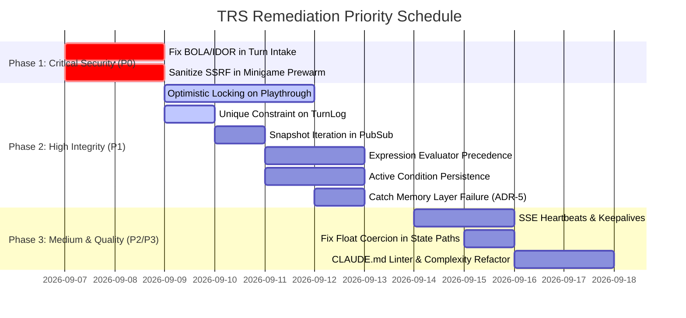

# Turn Resolution Service (TRS) Codebase Audit & Vulnerability Report

**Date:** September 6, 2026  
**Audited Service:** Turn Resolution Service (`apps/turn-resolution-service`)  
**Scope:** TRS Internal Architecture, Core API Data Models/Auth Contracts, Frontend SSE Streaming & State Sync  
**Methodology:** Full-subsystem static code analysis, transaction trace auditing, vulnerability scanning, and cross-service contract verification.

---

## Executive Summary

A comprehensive, read-only codebase review of the **Turn Resolution Service (TRS)** (`apps/turn-resolution-service/`) and its integration boundaries with **Core API** and **Frontend** was conducted.

The audit identified **19 distinct findings** across security, concurrency, state management, logic, streaming resilience, and architectural compliance:
- **2 Critical (P0)** vulnerabilities that enable unauthorized turn execution (BOLA/IDOR) and server-side request forgery (SSRF).
- **8 High (P1)** severity issues including state loss race conditions on concurrent turn execution, uncoordinated frontend state rollbacks, unhandled memory layer failures, and logic bugs in expression evaluation.
- **5 Medium (P2)** flaws involving memory leaks in PubSub subscribers, missing SSE keepalive heartbeats, unvalidated enum constraints, and schema float contamination.
- **4 Low (P3)** findings covering CLAUDE.md Universal Rule violations (function length, nesting limits, prohibited `typing.Any`) and documentation discrepancies.

Overall, the pipeline architecture is cleanly separated into step modules, but lacks essential authorization checks, concurrency controls (row-level or optimistic locking), and robust exception boundaries within the async streaming generator.

---

## Findings Matrix

| Severity | Security & Auth | Concurrency & Race Conditions | State Management & Invariants | Logic & Edge Cases | Streaming & Resilience | Architecture & Rules | Total |
|---|:---:|:---:|:---:|:---:|:---:|:---:|:---:|
| **P0 (Critical)** | 2 | 0 | 0 | 0 | 0 | 0 | **2** |
| **P1 (High)** | 1 | 3 | 1 | 3 | 0 | 0 | **8** |
| **P2 (Medium)** | 0 | 0 | 2 | 1 | 2 | 0 | **5** |
| **P3 (Low)** | 0 | 0 | 0 | 0 | 1 | 3 | **4** |
| **Total** | **3** | **3** | **3** | **4** | **3** | **3** | **19** |

---

## P0 — Critical Severity Findings

### [P0-SEC-1] Broken Object Level Authorization (BOLA / IDOR) in Turn Submission Endpoint(Solved)
- **Category:** Security & Authorization
- **Location:** [`app/routers/turn.py:L18-25`](file:///home/aryan-sherigar/projects/AI-DND/apps/turn-resolution-service/app/routers/turn.py#L18-L25), [`app/turn/pipeline.py:L85-96`](file:///home/aryan-sherigar/projects/AI-DND/apps/turn-resolution-service/app/turn/pipeline.py#L85-L96), [`app/turn/steps/request_receiver.py:L30-70`](file:///home/aryan-sherigar/projects/AI-DND/apps/turn-resolution-service/app/turn/steps/request_receiver.py#L30-L70)
- **Root Cause:** In [`turn.py:L18-23`](file:///home/aryan-sherigar/projects/AI-DND/apps/turn-resolution-service/app/routers/turn.py#L18-L23), `_user: Annotated[CurrentUser, Depends(get_current_user)]` is injected into the endpoint dependency. However, `_user` is never passed into `run_turn(turn_input, session)`. In [`request_receiver.py:L30-70`](file:///home/aryan-sherigar/projects/AI-DND/apps/turn-resolution-service/app/turn/steps/request_receiver.py#L30-L70), the request intake step checks whether `acting_participant = _find_participant(participants, turn_input.participant_id)` exists within `participants`, but **never checks whether `acting_participant.user_id == current_user.user_id`**.
- **Impact & Exploit Scenario:** Any authenticated user can submit moves or inject narrative commands for any active playthrough and any participant in the system by simply specifying their target's `playthrough_id` and `participant_id` in the POST body. In multiplayer games or public playthroughs, malicious players can execute turns out of turn order or impersonate opposing players.
- **Remediation Recommendation:**
  1. Update `run_turn` signature to accept `current_user: CurrentUser`.
  2. Pass `current_user` to `request_receiver.receive_request(...)`.
  3. Validate `if acting_participant.user_id != current_user.user_id: raise UnauthorizedError("Participant does not belong to authenticated user")`.

---

### [P0-SEC-2] Server-Side Request Forgery (SSRF) via Unvalidated Minigame Replit URL Pre-warm(Solved)
- **Category:** Security & Authorization
- **Location:** [`app/turn/pipeline.py:L283-306`](file:///home/aryan-sherigar/projects/AI-DND/apps/turn-resolution-service/app/turn/pipeline.py#L283-L306), [`app/turn/steps/minigame_trigger_evaluator.py:L76`](file:///home/aryan-sherigar/projects/AI-DND/apps/turn-resolution-service/app/turn/steps/minigame_trigger_evaluator.py#L76)
- **Root Cause:** When a master-mode turn matches a minigame trigger of type `replit_embed`, `_stamp_pending_minigame` invokes `_prewarm_replit_url(str(replit_embed_url))`. In [`_prewarm_replit_url:L290-306`](file:///home/aryan-sherigar/projects/AI-DND/apps/turn-resolution-service/app/turn/pipeline.py#L290-L306), `httpx.AsyncClient` executes an unvalidated HTTP GET request directly to the scenario-supplied URL:
  ```python
  async with httpx.AsyncClient(timeout=_PREWARM_TIMEOUT_SECONDS) as client:
      ...
      await client.get(url)
  ```
  There is zero URL scheme enforcement, no domain whitelist, and no prohibition of loopback, RFC 1918, or link-local addresses.
- **Impact & Exploit Scenario:** Scenario authors can craft a scenario containing a minigame with `replit_embed_url = "http://metadata.google.internal/computeMetadata/v1/instance/service-accounts/default/token"` or `http://169.254.169.254/computeMetadata/v1/`. When a player plays the scenario and hits the trigger, TRS executes an internal HTTP request from the Google Cloud Run host, allowing internal reconnaissance or cloud metadata exfiltration.
- **Remediation Recommendation:**
  1. Validate that the URL begins with `https://`.
  2. Restrict domains to an explicit whitelist using regex: `^https://[a-zA-Z0-9-]+\.(replit\.app|repl\.co)(/.*)?$`.
  3. Resolve the DNS hostname before dispatch and reject private/link-local/loopback IP ranges (`127.0.0.0/8`, `10.0.0.0/8`, `172.16.0.0/12`, `192.168.0.0/16`, `169.254.0.0/16`).

---

## P1 — High Severity Findings

### [P1-CONC-1] State Overwrite Race Condition on Concurrent Turn Submissions (Missing Optimistic/Pessimistic Locking)
- **Category:** Concurrency & Race Conditions
- **Location:** [`app/repositories/playthrough_repo.py:L17-34`](file:///home/aryan-sherigar/projects/AI-DND/apps/turn-resolution-service/app/repositories/playthrough_repo.py#L17-L34), [`app/turn/steps/state_writer.py:L145-147`](file:///home/aryan-sherigar/projects/AI-DND/apps/turn-resolution-service/app/turn/steps/state_writer.py#L145-L147)
- **Root Cause:** `playthrough_repo.get_by_id` executes a standard `select(Playthrough)` without row locking (`with_for_update()`). `update_state` issues:
  ```python
  update(Playthrough)
  .where(Playthrough.playthrough_id == playthrough_id)
  .values(state=state, turn_count=turn_count)
  ```
  It lacks an optimistic concurrency check (`.where(Playthrough.turn_count == expected_turn_count)`).
- **Impact & Exploit Scenario:** If two turns are submitted in close succession (e.g. user double-clicking "Submit" or concurrent moves in multiplayer), both workers load the same base `turn_count = N` and `state`. Both execute Gemini calls in parallel. Worker B finishes slightly after Worker A and overwrites `Playthrough.state` and `turn_count = N + 1`. Worker A's state mutations, inventory changes, and narrative progress are permanently obliterated from the game state.
- **Remediation Recommendation:**
  1. In `playthrough_repo.update_state`, update conditionally:
     ```python
     stmt = (
         update(Playthrough)
         .where(
             Playthrough.playthrough_id == playthrough_id,
             Playthrough.turn_count == expected_previous_turn_count,
         )
         .values(state=state, turn_count=new_turn_count)
     )
     ```
  2. If zero rows are updated, raise `OptimisticLockError` and yield a degraded SSE event asking the client to resubmit.

---

### [P1-CONC-2] Non-Unique `TurnLog` Turn Numbers Permitting Duplicate Narrative Rows
- **Category:** Concurrency & Race Conditions
- **Location:** [`app/db/models/turn_log.py:L18-19`](file:///home/aryan-sherigar/projects/AI-DND/apps/turn-resolution-service/app/db/models/turn_log.py#L18-L19), [`app/repositories/turn_log_repo.py:L26-45`](file:///home/aryan-sherigar/projects/AI-DND/apps/turn-resolution-service/app/repositories/turn_log_repo.py#L26-L45)
- **Root Cause:** `TurnLog` defines `Index("idx_turn_logs_playthrough_turn", "playthrough_id", "turn_number")` as a regular non-unique index instead of a `UniqueConstraint`.
- **Impact & Exploit Scenario:** Under the concurrent turn race described in `[P1-CONC-1]`, both workers insert a `TurnLog` record for `turn_number = N + 1`. The database accepts both. When subsequent requests or frontends fetch the narrative history via `/v1/playthroughs/{id}/turns`, duplicate conflicting turns appear in chronological playback, desynchronizing the client UI and memory extraction.
- **Remediation Recommendation:** Replace `Index` with `UniqueConstraint("playthrough_id", "turn_number", name="uq_turn_logs_playthrough_turn")` in `TurnLog` and corresponding migration.

---

### [P1-CONC-3] Async PubSub Queue Iteration Mutation Bug (`RuntimeError` Crash)
- **Category:** Concurrency & Race Conditions
- **Location:** [`app/session/notification_manager.py:L49-51`](file:///home/aryan-sherigar/projects/AI-DND/apps/turn-resolution-service/app/session/notification_manager.py#L49-L51), [`app/session/spectator_manager.py:L31-32`](file:///home/aryan-sherigar/projects/AI-DND/apps/turn-resolution-service/app/session/spectator_manager.py#L31-L32)
- **Root Cause:** In `notification_manager.notify_playthrough_ended`:
  ```python
  for (subscribed_playthrough_id, _), queue in _subscribers.items():
      if subscribed_playthrough_id == playthrough_id:
          await queue.put(("playthrough_ended", outcome_title))
  ```
  `await queue.put()` yields execution back to the asyncio event loop. If another client connects (`subscribe`) or disconnects (`unsubscribe`) while `queue.put()` is yielded, `_subscribers` is modified during iteration.
- **Impact & Exploit Scenario:** Python raises `RuntimeError: dictionary changed size during iteration`. The notification task terminates abruptly, preventing all remaining participants from receiving the playthrough-ended broadcast. Similarly in `spectator_manager.publish`, iterating over `_subscribers.get(playthrough_id, [])` while concurrent disconnections occur raises `RuntimeError: list modified during iteration`.
- **Remediation Recommendation:**
  Iterate over an immutable snapshot of subscribers:
  ```python
  subscribers_snapshot = list(_subscribers.items())
  for (subscribed_playthrough_id, _), queue in subscribers_snapshot:
      ...
  ```
  Or replace `await queue.put(...)` with `queue.put_nowait(...)`.

---

### [P1-STATE-1] Client-Side State Desynchronization via Uncoordinated `editLastAction`
- **Category:** State Management & Invariants
- **Location:** [`apps/frontend/src/features/play/stores/play.store.ts:L252-272`](file:///home/aryan-sherigar/projects/AI-DND/apps/frontend/src/features/play/stores/play.store.ts#L252-L272)
- **Root Cause:** The frontend `editLastAction` action permits players to edit their previous action by popping the last turn from the client's in-memory Zustand array (`playthrough.turns.pop()`). It never notifies TRS or Core API, and never executes a backend rewind or rollback.
- **Impact & Exploit Scenario:** When the player submits their edited action, TRS receives the request, sees `Playthrough.turn_count = N` in the database, and executes the turn as `turn_count = N + 1`. The previously committed turn remains intact in the database and memory layer. The edited action is appended as a subsequent action rather than replacing the previous turn, resulting in severe storyline corruption and desynchronization between what the player sees on screen and what the backend persists.
- **Remediation Recommendation:**
  1. Implement a dedicated backend endpoint `POST /v1/playthroughs/{id}/rewind` that deletes the latest `TurnLog`, resets `Playthrough.state`, and decrements `turn_count`.
  2. Alternatively, remove `editLastAction` from the client if playthroughs are designed to be append-only.

---

### [P1-RES-1] Unhandled Memory Query Failure Halting Turn Pipeline (ADR-5 Violation)
- **Category:** Streaming & Resilience
- **Location:** [`app/turn/steps/context_retrieval.py:L32`](file:///home/aryan-sherigar/projects/AI-DND/apps/turn-resolution-service/app/turn/steps/context_retrieval.py#L32), [`app/turn/pipeline.py:L148`](file:///home/aryan-sherigar/projects/AI-DND/apps/turn-resolution-service/app/turn/pipeline.py#L148)
- **Root Cause:** `context_retrieval.retrieve_context` executes `await memory_client.query_memory(request)`. If the memory service is down, unreachable, or times out, `memory_client` raises `MemoryLayerUnavailableError`. Unlike `memory_writer.py` (which catches all exceptions), `context_retrieval.py` does not catch this exception, and `pipeline.py:L148` has no try/except block around context retrieval.
- **Impact & Exploit Scenario:** A transient cold start, network blip, or deployment restart of `apps/memory-layer` crashes the entire gameplay loop with an unhandled exception (HTTP 500), directly violating RFC ADR-5 ("memory layer failures must never block gameplay").
- **Remediation Recommendation:**
  Wrap `query_memory` in `context_retrieval.py` with:
  ```python
  try:
      response = await memory_client.query_memory(request)
  except MemoryLayerUnavailableError:
      logger.warning("context_retrieval_degraded_memory_unavailable")
      return MemoryQueryResponse(facts=[], abstained=True)
  ```

---

### [P1-LOGIC-1] Boolean Precedence Logic Inversion in `expression_evaluator.py`
- **Category:** Logic Bugs & Edge Cases
- **Location:** [`app/turn/expression_evaluator.py:L41-55`](file:///home/aryan-sherigar/projects/AI-DND/apps/turn-resolution-service/app/turn/expression_evaluator.py#L41-L55)
- **Root Cause:** The expression evaluator chains compound connectives sequentially in top-to-bottom procedural order:
  ```python
  if "AND" in expression:
      sub = evaluate(expression["AND"], state)
      result = sub if result is None else (result and sub)
  if "OR" in expression:
      sub = evaluate(expression["OR"], state)
      result = sub if result is None else (result or sub)
  if "NOT" in expression:
      sub = not evaluate(expression["NOT"], state)
      result = sub if result is None else (result and sub)
  ```
  If an expression node contains both `OR` and `NOT`, or `AND` and `OR`, the logic combines sequentially (`((leaf AND a) OR b) AND (NOT c)`). It does not follow standard boolean operator precedence (`NOT` > `AND` > `OR`). Furthermore, combining `NOT` with `OR` evaluates as `result and (not sub)` rather than respecting negation scope.
- **Impact & Exploit Scenario:** Game rules authored in Studio containing compound logic trigger unexpectedly or fail to trigger when expected, violating game mechanics and win/loss conditions.
- **Remediation Recommendation:**
  Enforce in the grammar validator that each AST node may specify **at most one** connective (`AND`, `OR`, or `NOT`), or build a recursive descent boolean evaluator that honors standard operator precedence.

---

### [P1-LOGIC-2] Dotted String False-Positive Reference Bug in `_resolve_operand`
- **Category:** Logic Bugs & Edge Cases
- **Location:** [`app/turn/expression_evaluator.py:L87-95`](file:///home/aryan-sherigar/projects/AI-DND/apps/turn-resolution-service/app/turn/expression_evaluator.py#L87-L95)
- **Root Cause:** `_resolve_operand` assumes that any string value containing a period (`"." in value`) is a state field path reference:
  ```python
  if isinstance(value, str) and "." in value:
      resolved = state_paths.get_field_value(state, value)
      if resolved is not None:
          return resolved
  return value
  ```
- **Impact & Exploit Scenario:** If an author compares an entity property against a literal string containing a dot (e.g. `filename == "scroll.txt"`, `version == "1.0"`, `chapter == "ch.1"`, or `code == "sec.4"`), and there is an object or key in state matching that path, `_resolve_operand` silently swaps the literal string for the state object. The comparison fails or compares against the wrong type.
- **Remediation Recommendation:**
  Disambiguate field references from literals in the condition expression schema. Use an explicit property like `"ref": "player.max_health"` rather than inferring references from periods in string literals.

---

### [P1-LOGIC-3] Active Condition Disappearance Bug in `_should_skip`
- **Category:** Logic Bugs & Edge Cases
- **Location:** [`app/turn/steps/condition_evaluator.py:L109-115`](file:///home/aryan-sherigar/projects/AI-DND/apps/turn-resolution-service/app/turn/steps/condition_evaluator.py#L109-L115)
- **Root Cause:** In `condition_evaluator.py`, `_should_skip` checks:
  ```python
  def _should_skip(
      condition: dict[str, object], last_changed: set[str], evaluate_all: bool
  ) -> bool:
      if evaluate_all:
          return False
      referenced = extract_field_paths(condition.get("condition_expression"))
      return not (referenced & last_changed)
  ```
- **Impact & Exploit Scenario:** Suppose a condition is active on Turn 1 (e.g. `player.is_poisoned == True`). Its `narrator_instruction` instructs Gemini to narrate the poison effect. On Turn 2, the player attacks, changing only `enemy.health`. `last_changed` is `{"enemy.health"}`. On Turn 3, because `player.is_poisoned` was not modified in Turn 2, `_should_skip` returns `True`. The condition is skipped, and the narrator instruction disappears, even though the player is still poisoned!
- **Remediation Recommendation:**
  Track the active condition IDs across turns in `Playthrough.state["_active_conditions"]`. Always evaluate conditions that were active in the previous turn, in addition to conditions whose fields changed in the current turn.

---

## P2 — Medium Severity Findings

### [P2-STATE-1] Float Type Pollution on Integer Fields in `state_paths.apply_mutation`
- **Category:** State Management & Invariants
- **Location:** [`app/turn/state_paths.py:L84-94`](file:///home/aryan-sherigar/projects/AI-DND/apps/turn-resolution-service/app/turn/state_paths.py#L84-L94)
- **Root Cause:** In `apply_mutation`, numerical increments and decrements unconditionally cast both the current value and the delta to Python `float`:
  ```python
  delta = float(value or 0)
  new_value = float(current) + delta if op == "increment" else float(current) - delta
  ```
- **Impact:** Any game state integer field (e.g. `gold: 100`, `ammo: 5`, `level: 2`) is permanently converted into a float (`101.0`). If the scenario schema or frontend UI enforces integer types, this triggers schema validation failures or causes ugly floating-point formatting in the UI.
- **Remediation:** Check `isinstance(current, int) and isinstance(value, int)` and maintain integer arithmetic.

---

### [P2-STATE-2] In-Place State Mutation Reference Leak Between `pre_state` and `post_state`
- **Category:** State Management & Invariants
- **Location:** [`app/turn/steps/state_loader.py:L39`](file:///home/aryan-sherigar/projects/AI-DND/apps/turn-resolution-service/app/turn/steps/state_loader.py#L39), [`app/turn/pipeline.py:L149-188`](file:///home/aryan-sherigar/projects/AI-DND/apps/turn-resolution-service/app/turn/pipeline.py#L149-L188), [`app/turn/steps/turn_summary_builder.py:L31-50`](file:///home/aryan-sherigar/projects/AI-DND/apps/turn-resolution-service/app/turn/steps/turn_summary_builder.py#L31-L50)
- **Root Cause:** `state_loader.py` loads `playthrough.state` by direct dictionary reference without `copy.deepcopy()`. `ai_orchestrator` and `map_state_sync` mutate nested dictionary keys in-place. Later, `build_turn_summary` compares `pre_state` (`loaded_state.state`) and `post_state` (`updated_state`) to compute stat diffs. Because nested dict references are shared, `before` and `after` values match, causing stat change diffs to be empty or corrupted.
- **Impact:** Chapter summaries and delta indicators in the UI fail to report state changes.
- **Remediation:** Deepcopy `playthrough.state` in `state_loader.py` using `copy.deepcopy(playthrough.state)`.

---

### [P2-SEC-1] Unvalidated Enum Constraints in Dynamic State Schema Models
- **Category:** Security & Data Integrity
- **Location:** [`app/models/game_state.py:L75-76`](file:///home/aryan-sherigar/projects/AI-DND/apps/turn-resolution-service/app/models/game_state.py#L75-L76)
- **Root Cause:** In `_field_to_pydantic_type`:
  ```python
  if field_type in ("enum", "entity_ref"):
      return (str | None, Field(default=field_def.get("initial")))
  ```
  It maps `enum` fields to generic `str | None` without checking `field_def.get("options")`.
- **Impact:** An AI tool call (`set_field`) can set an enum field to any arbitrary string, corrupting state with invalid enum values that break game rules.
- **Remediation:** Dynamically create a `Literal` or `Enum` type from `field_def.get("options", [])`.

---

### [P2-STREAM-1] Stale Subscriber Memory Leak in Spectator Manager
- **Category:** Streaming & Resilience
- **Location:** [`app/session/spectator_manager.py:L22-27`](file:///home/aryan-sherigar/projects/AI-DND/apps/turn-resolution-service/app/session/spectator_manager.py#L22-L27)
- **Root Cause:** In `spectator_manager.unsubscribe`:
  ```python
  subscribers = _subscribers.get(playthrough_id)
  if subscribers and queue in subscribers:
      subscribers.remove(queue)
  ```
  When the last subscriber for a `playthrough_id` disconnects, the empty list remains in `_subscribers`.
- **Impact:** In a long-running instance with thousands of sessions, `_subscribers` retains dead UUID keys indefinitely, leaking memory.
- **Remediation:** Add `if not subscribers: _subscribers.pop(playthrough_id, None)`.

---

### [P2-STREAM-2] Missing Keep-Alive / Heartbeat Pings on Long-Lived SSE Connections
- **Category:** Streaming & Resilience
- **Location:** [`app/routers/session.py:L61-70`](file:///home/aryan-sherigar/projects/AI-DND/apps/turn-resolution-service/app/routers/session.py#L61-L70) (`_relay`), [`app/session/spectator_manager.py`](file:///home/aryan-sherigar/projects/AI-DND/apps/turn-resolution-service/app/session/spectator_manager.py)
- **Root Cause:** `_relay` performs an indefinite `await queue.get()`. If no events occur for >60 seconds (standard timeout for Google Cloud Run and Nginx reverse proxies), the proxy severs the connection.
- **Impact:** Spectator and notification SSE connections drop silently while players read or ponder actions.
- **Remediation:** Use `asyncio.wait_for(queue.get(), timeout=15.0)` and yield an SSE comment heartbeat (`: ping\n\n`) on timeout.

---

## P3 — Low Severity Findings

### [P3-ARCH-1] Function Length and Nesting Violations in `assistant_service.py`
- **Category:** Architecture & Guidelines Compliance
- **Location:** [`app/services/assistant_service.py:L321-368`](file:///home/aryan-sherigar/projects/AI-DND/apps/turn-resolution-service/app/services/assistant_service.py#L321-L368) (`_find_block_validations`), [`L295-319`](file:///home/aryan-sherigar/projects/AI-DND/apps/turn-resolution-service/app/services/assistant_service.py#L295-L319) (`_validate_fact_refs`)
- **Root Cause:** `_find_block_validations` is 48 lines long (violating CLAUDE.md: "Functions under 30 lines") and reaches 3 levels of indentation (violating CLAUDE.md: "Maximum nesting depth: 2 levels").
- **Impact:** Code readability and maintenance friction.
- **Remediation:** Refactor validation logic into smaller single-responsibility functions.

---

### [P3-ARCH-2] Prohibited `typing.Any` Usage in `memory_client.py`
- **Category:** Architecture & Guidelines Compliance
- **Location:** [`app/integrations/memory_client.py:L12, L66, L67`](file:///home/aryan-sherigar/projects/AI-DND/apps/turn-resolution-service/app/integrations/memory_client.py#L12)
- **Root Cause:** Uses `from typing import Any` and `dict[str, Any]` in signatures.
- **Impact:** Violates CLAUDE.md Universal Rule: "Never use `Any` from `typing`. If the shape is truly unknown, use `dict[str, object]` and validate explicitly."
- **Remediation:** Replace `Any` with `object`.

---

### [P3-ARCH-3] Full Response Buffering in Master Mode Narration
- **Category:** Performance & Guidelines Compliance
- **Location:** [`app/turn/steps/ai_orchestrator.py:L231-266`](file:///home/aryan-sherigar/projects/AI-DND/apps/turn-resolution-service/app/turn/steps/ai_orchestrator.py#L231-L266)
- **Root Cause:** In Master Mode, the function-calling loop buffers the full Gemini response in `final_text` before slicing into chunks via `_chunk_text(final_text)`.
- **Impact:** Violates CLAUDE.md: "SSE responses stream immediately. Never buffer the full Gemini response before sending. yield tokens as they arrive. A buffered SSE response is a bug."
- **Remediation:** Document this explicitly as an intentional architectural trade-off of ADR-4 (tool calling requires full roundtrip inspection before narration), or stream the final text turn directly from the model.

---

### [P3-DOC-1] Documentation Inconsistency Regarding Firebase Auth
- **Category:** Architecture & Documentation
- **Location:** [`CLAUDE.md:L26`](file:///home/aryan-sherigar/projects/AI-DND/CLAUDE.md#L26) vs [`app/config.py:L18-19`](file:///home/aryan-sherigar/projects/AI-DND/apps/turn-resolution-service/app/config.py#L18-L19)
- **Root Cause:** `CLAUDE.md` claims "Firebase Auth — Token issuance. Both services validate tokens on every request." In actual implementation, Core API issues custom HS256 JWTs using a shared secret key, and TRS decodes them using HMAC.
- **Impact:** Misleads developers on authentication requirements and key management.
- **Remediation:** Update `CLAUDE.md` to reflect the actual internal JWT Bearer token architecture.

---

## Architectural & Cross-Service Consistency Assessment

### 1. Frontend ↔ TRS Contract Alignment
- **Event Model:** The frontend (`apps/frontend/src/features/play/stores/play.store.ts`) listens for `mood`, `narration`, `turn_summary`, `minigame`, `playthrough_ended`, `degraded`, and `done`. TRS emits these faithfully. However, if a turn encounters `NarrationGenerationError`, TRS exits without emitting `degraded` or `done`, leaving the frontend UI in a perpetual "narrating" loading state.
- **State Synchronization:** The frontend store manages turn history in Zustand, while TRS persists state in Postgres JSONB. As noted in `[P1-STATE-1]`, client-side actions like `editLastAction` desynchronize client and server state because TRS has no turn rewind endpoint.

### 2. Core API ↔ TRS Database & Schema Alignment
- **Shared Tables:** Both services share the same Postgres database and schema definitions (`playthroughs`, `participants`, `scenarios`, `turn_logs`, `playthrough_shares`).
- **Authorization Parity:** Core API validates `User.token_version` on every authenticated request. TRS only verifies the JWT cryptographic signature, allowing revoked or deleted users to continue executing turns on TRS.

---

## Prioritized Remediation Roadmap



1. **Immediate (Days 1–2): Security Hardening**
   - Bind `CurrentUser` to participant verification in [`request_receiver.py`](file:///home/aryan-sherigar/projects/AI-DND/apps/turn-resolution-service/app/turn/steps/request_receiver.py).
   - Enforce domain whitelist and private IP blocking on Replit embed URLs in [`pipeline.py`](file:///home/aryan-sherigar/projects/AI-DND/apps/turn-resolution-service/app/turn/pipeline.py).
2. **Short-Term (Days 3–5): Data & Concurrency Integrity**
   - Add optimistic locking on `Playthrough.turn_count`.
   - Add database unique constraint on `(playthrough_id, turn_number)`.
   - Guard async PubSub iterations against concurrent dictionary mutations.
   - Wrap `memory_client.query_memory` with graceful degradation fallback.
3. **Medium-Term (Days 6–10): Rule Engine & State Precision**
   - Refactor `expression_evaluator.py` to eliminate boolean precedence and dot-operand resolution bugs.
   - Fix `_should_skip` in `condition_evaluator.py` so active conditions persist across turns.
   - Add SSE keepalive heartbeats to prevent proxy connection timeouts.
