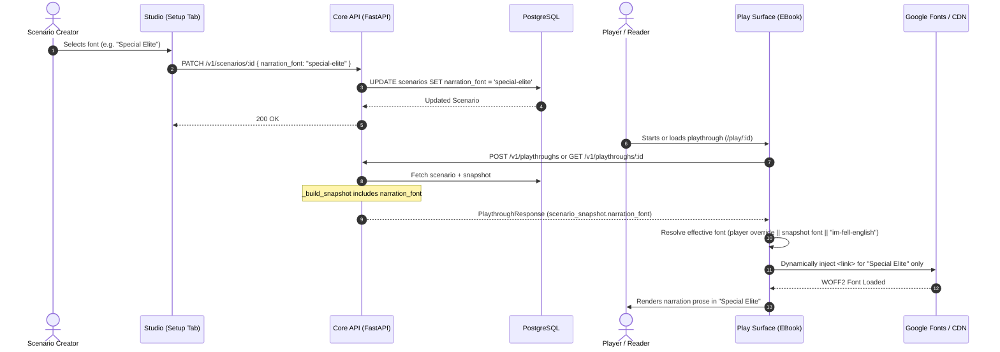

# Spec: Narration Font Customization & Play Surface Integration

## 1. Objective & User Outcome
- **Problem Statement:** In Master Mode scenario creation, a "Narration Font" customization option exists in the Studio "Setup & Narrator" panel and persists to the `scenarios.narration_font` database column. However, it is completely non-functional end-to-end:
  1. When starting a playthrough, `PlaythroughService._build_snapshot` fails to pin `narration_font` into the frozen `scenario_snapshot`.
  2. The frontend Play surface data builders (`buildMasterPlaythroughData` and `buildNewbiePlaythroughData`) do not consume or propagate `narration_font` into `PlaythroughData`.
  3. The Play surface reading components (`EBookCanvas`, `EBookTurnEntry`, `EBookPrologueCard`, and `SpectatorView`) hardcode `font-serif`.
  4. The available fonts list only has 4 generic placeholder strings without web-font definitions, CSS mappings, or on-demand loading, completely missing genre variety.
  5. Players have no accessibility override controls in the reader if a creator selects an ornate or difficult-to-read font.
- **User Story:** 
  - As a **scenario creator** in Master Mode, I want to select a curated genre-fitting narration font (e.g. Medieval, Noir Typewriter, Cyberpunk Mono, Gothic, or Classic Literary) so that my story presents a distinct atmosphere.
  - As a **player/reader**, I want AI narration prose to render in the creator's chosen aesthetic font by default, while having a quick typography control ("Aa") in the reading header to switch or enable OpenDyslexic / standard fonts for visual comfort.
  - As a **spectator**, I want the narration text to honor the scenario's atmospheric typography.
- **Success Criteria:**
  - Selecting any of the 12 curated fonts in Master Mode Studio persists the selection to Core API.
  - Creating a playthrough snapshots `narration_font` accurately in `scenario_snapshot`.
  - The E-Book reader dynamically loads only the required font on-demand with `font-display: swap` (zero upfront performance penalty).
  - Narration prose, prologue quotes, and live streaming text render in the active font, while player action quotes and UI chrome retain their distinct clean typography.
  - Players can toggle fonts or reset to "Scenario Default" via an "Aa" control in `EBookHeader`, persisted in local storage.
  - Unit and integration tests pass across Core API and frontend without regressions.

---

## 2. Technical Architecture & Data Flow
- **Components Involved:**
  - `apps/core-api/app/services/playthrough_service.py`: Snapshots `narration_font` into `scenario_snapshot`.
  - `apps/frontend/src/shared/constants/narration-fonts.ts`: Single source of truth defining the 12 curated fonts, categories, Google Font specs, fallback stacks, and backward compatibility aliases.
  - `apps/frontend/src/shared/lib/font-loader.ts`: Zero-dependency on-demand font stylesheet injector with deduplication and `font-display: swap`.
  - `apps/frontend/src/features/studio/components/NarrationFontPicker/NarrationFontPicker.tsx`: Studio dropdown grouped by genre categories (`<optgroup>`).
  - `apps/frontend/src/features/play/pages/playthroughDataBuilders.ts`: Extracts `narration_font` from `scenario_snapshot`.
  - `apps/frontend/src/features/play/stores/play.store.ts`: Stores player font override and active font resolution.
  - `apps/frontend/src/features/play/components/PlayScreen/EBook/EBookHeader.tsx`: Houses the typography popup menu ("Aa").
  - `apps/frontend/src/features/play/components/PlayScreen/EBook/`: `EBookCanvas`, `EBookTurnEntry`, and `EBookPrologueCard` apply the resolved font style strictly to narration text.
  - `apps/frontend/src/features/play/components/SpectatorView/SpectatorView.tsx`: Spectator narration text renders with the scenario font.



---

## 3. The Six Core Engineering Dimensions

### 3.1. Commands
- Core API Test: `PYTHONPATH=. ./.venv/bin/pytest tests/services/test_playthrough_service.py`
- Frontend Test: `npx vitest run src/features/studio/components/NarrationFontPicker/NarrationFontPicker.test.tsx src/features/play/components/PlayScreen/EBook/`
- Frontend Lint / Format: `pnpm --filter ai-dnd-frontend lint`
- Frontend Typecheck: `pnpm --filter ai-dnd-frontend build`

### 3.2. Testing Strategy & Conformance
- **Core API Integration Test:**
  - Verify `test_create_playthrough_snapshots_narration_font`: Assert `playthrough.scenario_snapshot["narration_font"] == scenario.narration_font`.
  - Verify null handling: When `scenario.narration_font` is None, `scenario_snapshot["narration_font"]` is None or falls back cleanly.
- **Frontend Unit & Component Tests:**
  - `NarrationFontPicker.test.tsx`: Tests rendering categorized options and updating scenario with the selected key.
  - `playthroughDataBuilders.test.ts`: Asserts `buildMasterPlaythroughData` and `buildNewbiePlaythroughData` extract `narration_font` from `scenario_snapshot`.
  - `font-loader.test.ts`: Verifies dynamic DOM link injection, deduplication (does not inject duplicate tags for the same font), and HTTPS URL generation.
  - `EBookTurnEntry.test.tsx`: Verifies that narration paragraphs apply the configured font class or style, and that action quotes do not inherit the narration font.

### 3.3. Project Structure & File Layout
**Files to create:**
- `apps/frontend/src/shared/lib/font-loader.ts` — Dynamic font injector helper.
- `apps/frontend/src/features/play/components/PlayScreen/EBook/ReaderTypographyMenu.tsx` — Reader header "Aa" popover for player overrides.

**Files to modify:**
- `apps/core-api/app/services/playthrough_service.py` — Include `narration_font` in `_build_snapshot`.
- `apps/core-api/tests/services/test_playthrough_service.py` — Add snapshot assertion test case.
- `apps/frontend/src/shared/constants/narration-fonts.ts` — Expanded 12-font catalog with categories and metadata.
- `apps/frontend/src/features/studio/components/NarrationFontPicker/NarrationFontPicker.tsx` — Categorized `<optgroup>` rendering.
- `apps/frontend/src/features/play/types/play.types.ts` — Add `narration_font` to `PlaythroughData`.
- `apps/frontend/src/features/play/pages/playthroughDataBuilders.ts` — Propagate `narration_font` into `PlaythroughData`.
- `apps/frontend/src/features/play/stores/play.store.ts` — Player font override state & actions.
- `apps/frontend/src/features/play/components/PlayScreen/EBook/EBookHeader.tsx` — Mount `ReaderTypographyMenu`.
- `apps/frontend/src/features/play/components/PlayScreen/EBook/EBookCanvas.tsx` — Apply dynamic narration font.
- `apps/frontend/src/features/play/components/PlayScreen/EBook/EBookTurnEntry.tsx` — Apply narration font to paragraphs.
- `apps/frontend/src/features/play/components/PlayScreen/EBook/EBookPrologueCard.tsx` — Apply narration font to prologue.
- `apps/frontend/src/features/play/components/SpectatorView/SpectatorView.tsx` — Apply scenario font to spectator narration.

---

### 3.4. Code Style & Interfaces

#### Font Catalog Definition (`apps/frontend/src/shared/constants/narration-fonts.ts`):
```typescript
export type FontGenreCategory =
  | "Fantasy & Medieval"
  | "Literary & Classic"
  | "Sci-Fi & Terminal"
  | "Noir & Detective"
  | "Horror & Gothic"
  | "Modern Clean"
  | "Accessibility";

export interface NarrationFontDefinition {
  id: string;
  label: string;
  category: FontGenreCategory;
  fontFamily: string;
  googleFontFamily?: string;
  cdnUrl?: string;
}

export const NARRATION_FONTS_CATALOG: NarrationFontDefinition[] = [
  // Fantasy & Medieval
  {
    id: "im-fell-english",
    label: "IM Fell English (Default)",
    category: "Fantasy & Medieval",
    fontFamily: '"IM Fell English", Georgia, serif',
    googleFontFamily: "IM+Fell+English:ital@0;1",
  },
  {
    id: "cinzel",
    label: "Cinzel",
    category: "Fantasy & Medieval",
    fontFamily: '"Cinzel", serif',
    googleFontFamily: "Cinzel:wght@400;600;700",
  },
  {
    id: "medieval-sharp",
    label: "MedievalSharp",
    category: "Fantasy & Medieval",
    fontFamily: '"MedievalSharp", cursive, serif',
    googleFontFamily: "MedievalSharp",
  },
  // Literary & Classic
  {
    id: "eb-garamond",
    label: "EB Garamond",
    category: "Literary & Classic",
    fontFamily: '"EB Garamond", Garamond, Georgia, serif',
    googleFontFamily: "EB+Garamond:ital,wght@0,400;0,600;1,400",
  },
  {
    id: "merriweather",
    label: "Merriweather",
    category: "Literary & Classic",
    fontFamily: '"Merriweather", Georgia, serif',
    googleFontFamily: "Merriweather:ital,wght@0,300;0,400;1,300",
  },
  // Sci-Fi & Terminal
  {
    id: "ibm-plex-mono",
    label: "IBM Plex Mono",
    category: "Sci-Fi & Terminal",
    fontFamily: '"IBM Plex Mono", monospace',
    googleFontFamily: "IBM+Plex+Mono:ital,wght@0,400;0,500;1,400",
  },
  {
    id: "orbitron",
    label: "Orbitron",
    category: "Sci-Fi & Terminal",
    fontFamily: '"Orbitron", sans-serif',
    googleFontFamily: "Orbitron:wght@400;600",
  },
  {
    id: "share-tech-mono",
    label: "Share Tech Mono",
    category: "Sci-Fi & Terminal",
    fontFamily: '"Share Tech Mono", monospace',
    googleFontFamily: "Share+Tech+Mono",
  },
  // Noir & Detective
  {
    id: "special-elite",
    label: "Special Elite",
    category: "Noir & Detective",
    fontFamily: '"Special Elite", "Courier New", monospace',
    googleFontFamily: "Special+Elite",
  },
  {
    id: "courier-prime",
    label: "Courier Prime",
    category: "Noir & Detective",
    fontFamily: '"Courier Prime", Courier, monospace',
    googleFontFamily: "Courier+Prime:ital,wght@0,400;1,400",
  },
  // Horror & Gothic
  {
    id: "almendra",
    label: "Almendra",
    category: "Horror & Gothic",
    fontFamily: '"Almendra", serif',
    googleFontFamily: "Almendra:ital,wght@0,400;1,400",
  },
  // Modern Clean
  {
    id: "inter",
    label: "Inter",
    category: "Modern Clean",
    fontFamily: '"Inter", -apple-system, BlinkMacSystemFont, sans-serif',
    googleFontFamily: "Inter:wght@400;500",
  },
  // Accessibility
  {
    id: "open-dyslexic",
    label: "OpenDyslexic",
    category: "Accessibility",
    fontFamily: '"OpenDyslexic", sans-serif',
    cdnUrl: "https://cdn.jsdelivr.net/npm/opendyslexic@1.0.3/open-dyslexic.min.css",
  },
];
```

#### Backward Compatibility Aliases:
- `"serif"` → `"im-fell-english"`
- `"sans-serif"` → `"inter"`
- `"monospace"` → `"ibm-plex-mono"`
- `"dyslexic-friendly"` → `"open-dyslexic"`

---

### 3.5. Git & Review Workflow
- Suggested branch name: `feat/narration-font-customization`
- Commit scope guidelines:
  - `feat(core-api): snapshot narration_font in playthrough_service`
  - `feat(frontend): add on-demand font loader and expanded catalog`
  - `feat(frontend): wire narration_font to play surface and reader typography menu`

### 3.6. Boundaries (Three-Tier Model)
- ✅ **Always:** 
  - Max function length under 30 lines.
  - Max nesting depth 2 levels.
  - `font-display: swap` on all dynamically loaded stylesheets.
  - Preserve player action quotes and UI chrome formatting separate from narration prose.
- ⚠️ **Ask First:** 
  - Adding heavy local WOFF2 files into repo bundle (avoided via dynamic CDN loading).
  - Altering database schema (unnecessary, `narration_font` column already exists in DB).
- 🚫 **Never:**
  - Load all fonts upfront on initial bundle load.
  - Mutate server state when a player overrides their personal reading font.

---

## 4. Edge Cases, Rate Limits & Graceful Degradation
- **Network failure when downloading font:** Fallback font stacks (e.g. `Georgia, serif` or `"Courier New", monospace`) guarantee text remains 100% legible even if offline or CDN is blocked.
- **Unrecognized / Legacy Font Key:** The resolver defaults to `"im-fell-english"` if an unknown key is encountered in `scenario_snapshot`.
- **Player Font Override Persistence:** Stored in `localStorage` under `ai_dnd_reader_font_override`. If corrupted or unavailable, defaults to "Scenario Default".
- **Spectator Mode:** Spectators do not have local turn submissions; spectator views directly consume `scenario_snapshot.narration_font` or default serif.

---

## 5. Phased Implementation Tasks

- [x] **Task 1 (Core API Snapshot):**
  - Add `"narration_font": scenario.narration_font` to `PlaythroughService._build_snapshot` in `apps/core-api/app/services/playthrough_service.py`.
  - Add test in `apps/core-api/tests/services/test_playthrough_service.py` and run `pytest`.
- [x] **Task 2 (Shared Font Catalog & Dynamic Loader):**
  - Update `apps/frontend/src/shared/constants/narration-fonts.ts` with the 12-font catalog, helper lookup functions, and backward compatibility aliases.
  - Create `apps/frontend/src/shared/lib/font-loader.ts` to dynamically inject `<link>` stylesheets with deduplication.
- [x] **Task 3 (Master Mode Studio Selector):**
  - Update `apps/frontend/src/features/studio/components/NarrationFontPicker/NarrationFontPicker.tsx` to render categorized `<optgroup>` items.
  - Update `NarrationFontPicker.test.tsx` to verify new catalog compatibility.
- [x] **Task 4 (Play Surface State & Builder Integration):**
  - Add `narration_font` to `PlaythroughData` in `apps/frontend/src/features/play/types/play.types.ts`.
  - Extract and forward `narration_font` in `buildMasterPlaythroughData` and `buildNewbiePlaythroughData` in `apps/frontend/src/features/play/pages/playthroughDataBuilders.ts`.
  - Add player font override state to `usePlayStore` in `apps/frontend/src/features/play/stores/play.store.ts`.
- [x] **Task 5 (E-Book Reader & Spectator Visual Application):**
  - Create `ReaderTypographyMenu.tsx` and integrate it into `EBookHeader.tsx`.
  - Update `EBookCanvas.tsx`, `EBookTurnEntry.tsx`, and `EBookPrologueCard.tsx` to dynamically apply the resolved font style to story text and streaming narration.
  - Update `SpectatorView.tsx` to apply the scenario's font to spectator narration.
- [x] **Task 6 (Verification & Regression Testing):**
  - Run full frontend tests (`vitest run`).
  - Run frontend linter and TypeScript build check (`tsc --noEmit`).
  - Run Core API pytest suite.
