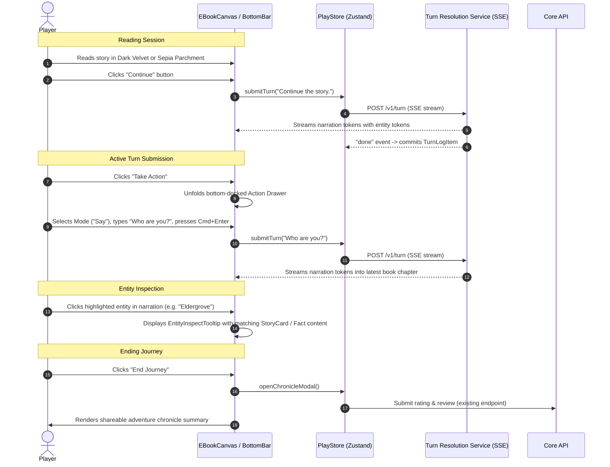

# Spec: Newbie Mode Play Screen & Flow Redesign

## 1. Objective & User Outcome
- **Problem Statement:** The current Newbie Mode playscreen suffers from awkward layout ergonomics: action inputs are crammed into a 320px right-hand sidebar alongside story cards, the 3-column view feels like an authoring tool rather than an immersive reading experience, and there is no intuitive way to read the adventure like a book, inspect mentioned lore entities in-context, or smoothly continue narration.
- **User Story:** As a player playing a Newbie Mode scenario, I want a single-column, distraction-free "e-book" reading experience with toggleable Dark Velvet and Antique Sepia themes, an ambient slide-over codex, clickable in-text entity tooltips, and a sleek bottom-docked action drawer with a silent "Continue" option, so that I can enjoy a fluid, literary roleplaying chronicle without UI friction.
- **Success Criteria:**
  1. Single-column reading canvas (`max-w-3xl`) centered on screen, styled with book typography, drop caps, and page margins.
  2. Dual reading modes: **Dark Velvet** (deep charcoal/amber) and **Antique Sepia Parchment** (warm aged paper/ink), persisted in client state.
  3. Docked bottom reading bar with `Take Action`, `Continue` (advances narration silently), `Retry`, `Edit Action`, and theme/codex controls.
  4. Smooth bottom-docked expanding parchment panel for `Take Action` with `Do`, `Say`, `See`, `Story` mode pills, helper tooltips, and auto-expanding textarea.
  5. In-text entity highlights: Known story cards, lore entities, and key facts mentioned in AI narration are highlighted and clickable to show a lightweight tooltip/popover.
  6. Ambient slide-over drawer for World Codex (Lore, Facts, Story Cards) that slides in without displacing the reading canvas.
  7. Turn 0 Prologue card presenting creator premise with a welcoming guided prompt.
  8. "The Chronicle" recap upon ending a playthrough, featuring an illustrated adventure summary, key decisions, and a shareable card alongside ratings and reviews.
  9. Zero backend modifications — 100% compatible with existing Core API and TRS contracts.

---

## 2. Technical Architecture & Data Flow

### 2.1 Component Hierarchy
```
PlayPage (Route /play/:id)
 └── NewbiePlayScreen (when mode === 'newbie')
      ├── NewbieHeader (Back, Title, Turn Count, Theme Toggle, Codex Trigger, End Journey)
      ├── EBookCanvas (Centered max-w-3xl scrollable book column)
      │    ├── EBookPrologueCard (Creator premise, character intro badge, guided hook)
      │    ├── EBookTurnFeed (Chronicle entries with chapter dividers, drop-caps, entity highlights)
      │    │    ├── EBookTurnEntry (Player action line + AI narration paragraphs with entity tooltips)
      │    │    └── EBookStreamingEntry (Active token stream + Stop generation button)
      │    └── EntityInspectTooltip (Popover for clicked in-text entity)
      ├── EBookBottomBar (Minimal resting reader toolbar)
      │    ├── ActionTriggerButton ("Take Action" -> unfolds Action Drawer)
      │    ├── ContinueButton ("Continue" -> triggers silent continuation)
      │    ├── TurnControls (Retry, Edit Action for latest turn)
      │    └── CodexQuickTrigger
      ├── EBookActionDrawer (Bottom-docked slide-up parchment card)
      │    ├── ActionModePills (Do, Say, See, Story with descriptive tooltips)
      │    ├── EBookActionTextarea (Auto-expanding, Cmd+Enter shortcut)
      │    └── EBookActionSubmitControls (Submit, Cancel/Collapse)
      ├── WorldCodexDrawer (Slide-over drawer for Lore, Facts, and Story Cards)
      └── ChronicleRecapModal (Illustrated journey summary, share card, 5-star rating & review)
```

### 2.2 Sequence Flow



---

## 3. The Six Core Engineering Dimensions

### 3.1 Commands
- **Build:** `npm run build --prefix apps/frontend`
- **Test:** `npm run test --prefix apps/frontend`
- **Lint / Type-Check:** `npx tsc --noEmit --project apps/frontend/tsconfig.json` && `npx eslint apps/frontend/src/features/play --ext .ts,.tsx`
- **Format:** `npx prettier --write apps/frontend/src/features/play`

### 3.2 Testing Strategy & Conformance
- React Testing Library unit & integration tests under `apps/frontend/src/features/play/components/PlayScreen/__tests__/`:
  - `EBookCanvas.test.tsx`: Verifies single-column rendering, theme class application (`dark-velvet` vs `antique-sepia`), and turn list display.
  - `EBookBottomBar.test.tsx`: Verifies "Continue" button triggers turn submission with continuation text, "Take Action" expands action drawer, and turn controls (retry/edit) display on latest turn.
  - `EBookActionDrawer.test.tsx`: Verifies mode pill selection, prefix assistance, auto-expanding textarea, and keyboard submission (`Cmd+Enter`).
  - `EntityHighlight.test.tsx`: Verifies matching story card titles in narration text render as interactive highlights and show tooltip on click.
  - `ChronicleRecapModal.test.tsx`: Verifies rating submission, review field, and summary card generation.

### 3.3 Project Structure & File Layout

#### Files to Create:
- `apps/frontend/src/features/play/components/PlayScreen/NewbiePlayScreen.tsx`: Root Newbie Mode view with e-book layout shell.
- `apps/frontend/src/features/play/components/PlayScreen/EBook/EBookCanvas.tsx`: Main book scroll container with margins and chapter layout.
- `apps/frontend/src/features/play/components/PlayScreen/EBook/EBookHeader.tsx`: Elegant reader top bar with theme toggle, turn count, codex button.
- `apps/frontend/src/features/play/components/PlayScreen/EBook/EBookPrologueCard.tsx`: Turn 0 frontispiece presentation of opening premise.
- `apps/frontend/src/features/play/components/PlayScreen/EBook/EBookTurnEntry.tsx`: Book chapter/turn entry with drop-caps and entity highlights.
- `apps/frontend/src/features/play/components/PlayScreen/EBook/EBookBottomBar.tsx`: Minimal reader action dock (`Take Action`, `Continue`, `Retry`, `Edit`).
- `apps/frontend/src/features/play/components/PlayScreen/EBook/EBookActionDrawer.tsx`: Slide-up parchment action drawer.
- `apps/frontend/src/features/play/components/PlayScreen/EBook/EntityInspectTooltip.tsx`: Interactive tooltip for entity mentions in narration.
- `apps/frontend/src/features/play/components/PlayScreen/EBook/ChronicleRecapModal.tsx`: Post-game recap, rating, and share card.
- `apps/frontend/src/features/play/components/PlayScreen/EBook/useEntityHighlighter.ts`: Hook to scan narration text for story cards and facts.

#### Files to Modify:
- `apps/frontend/src/features/play/components/PlayScreen/PlayScreen.tsx`: Route to `NewbiePlayScreen` when `mode === 'newbie'`, preserving master mode.
- `apps/frontend/src/features/play/stores/play.store.ts`: Add `ebook_theme` (`'dark-velvet' | 'antique-sepia'`), `is_action_drawer_open`, `toggleActionDrawer`, `setEBookTheme`, `continueTurn`.
- `apps/frontend/src/features/play/types/play.types.ts`: Add `EBookTheme` type and UI state definitions.

### 3.4 Code Style & Interfaces

#### TypeScript Contracts (`apps/frontend/src/features/play/types/play.types.ts`)
```typescript
export type EBookTheme = "dark-velvet" | "antique-sepia";

export interface EntityHighlightItem {
  id: string;
  name: string;
  category: "character" | "location" | "item" | "lore" | "fact";
  summary: string;
}

export interface EBookActionDrawerProps {
  isOpen: boolean;
  onClose: () => void;
  onSubmit: (actionText: string) => void;
  isSubmitting: boolean;
}

export interface EBookTurnEntryProps {
  turn: TurnLogItem;
  turnIndex: number;
  isLatest: boolean;
  knownEntities: EntityHighlightItem[];
}
```

### 3.5 Git & Review Workflow
- Branch name: `feat/newbie-mode-ebook-playscreen`
- Commit message format: `feat(play): redesign newbie playscreen into ebook experience`
- PR checklist:
  - Strict TypeScript check passes with zero errors.
  - ESLint and Prettier pass.
  - All existing Play tests and new EBook component tests pass.
  - Responsive verification on desktop, tablet, and mobile.

### 3.6 Boundaries (Three-Tier Model)
- ✅ **Always:** Adhere to universal guidelines (functions under 30 lines, max nesting depth 2, React Query for server state, flat Zustand stores for UI state). Colocate prop interfaces in `.types.ts`.
- ⚠️ **Ask First:** Modifying master mode components or shared play stores that impact master mode.
- 🚫 **Never:** Modify Core API or TRS backend endpoints, alter database models, or break existing SSE contracts.

---

## 4. Edge Cases, Rate Limits & Graceful Degradation
- **Long Turn Count Performance:** The single-column e-book canvas utilizes lightweight DOM rendering and smooth auto-scroll to avoid layout jank even past 50+ turns.
- **Connection Drops during Streaming:** If SSE drops or fails, `_degradeCurrentTurn` retains the stream up to the last valid token, displays a graceful e-book styled notification banner, and enables the `Retry` button on the bottom bar.
- **Silent Continue Loop:** Rate-limit or debounce the `Continue` button to prevent rapid double-clicks while the AI narrator is generating.
- **Mobile Drawer Overlays:** Action drawer and World Codex slide-overs cover full mobile viewports cleanly with backdrop dismissals and escape key support.

---

## 5. Phased Implementation Tasks

- [ ] **Task 1: Store & Types Update**
  - Add `ebook_theme` (`dark-velvet` | `antique-sepia`), `is_action_drawer_open`, and `continueTurn` action in `play.store.ts` and `play.types.ts`.
  - Verify with type-check: `npx tsc --noEmit`.

- [ ] **Task 2: E-Book Typography & Theme Styles**
  - Configure Tailwind classes / utility classes for `dark-velvet` (stone-950, amber-500, warm text) and `antique-sepia` (sepia parchment paper, rich ink text, brass accents).
  - Verify contrast and readability.

- [ ] **Task 3: E-Book Header & Canvas Shell**
  - Implement `EBookHeader.tsx` (Back, scenario title, turn counter, theme toggle, codex button, end journey button).
  - Implement `EBookCanvas.tsx` (Centered max-w-3xl book page layout with ambient shadow and borders).
  - Implement `EBookPrologueCard.tsx` (Turn 0 frontispiece with opening premise and invitation).

- [ ] **Task 4: Turn Feed & Entity Highlighter**
  - Implement `useEntityHighlighter.ts` to detect story cards and key facts within narration paragraphs.
  - Implement `EntityInspectTooltip.tsx` for on-click entity popovers.
  - Implement `EBookTurnEntry.tsx` with literary chapter breaks, drop caps, and interactive entity highlights.

- [ ] **Task 5: Bottom Docked Action Bar & Drawer**
  - Implement `EBookBottomBar.tsx` with resting buttons (`Take Action`, `Continue`, `Retry`, `Edit Action`).
  - Implement `EBookActionDrawer.tsx` with slide-up parchment animation, mode pills (`Do`, `Say`, `See`, `Story`), prefix hints, auto-expanding textarea, and `Cmd+Enter` submit.

- [ ] **Task 6: Slide-Over Codex & Chronicle Recap Modal**
  - Adapt `WorldCodexSidebar.tsx` into a responsive slide-over drawer that does not compress the book canvas.
  - Implement `ChronicleRecapModal.tsx` for journey recap, statistics, 5-star rating, and review.

- [ ] **Task 7: Integration into NewbiePlayScreen & PlayScreen**
  - Create `NewbiePlayScreen.tsx` assembling the e-book components.
  - Update `PlayScreen.tsx` to conditionally render `NewbiePlayScreen` for `mode === 'newbie'` while preserving existing master mode.

- [ ] **Task 8: Unit Tests & Verification**
  - Add unit tests for `EBookBottomBar`, `EBookActionDrawer`, `EBookCanvas`, and `useEntityHighlighter`.
  - Run lint, formatting, and build verification (`npx tsc`, `eslint`, `prettier`, `vitest`).
