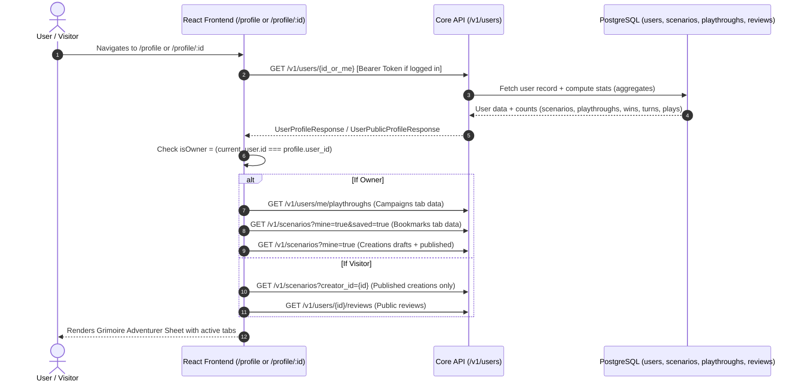

# Spec: User Profile Page & Player Chronicle

## 1. Objective & User Outcome
- **Problem Statement:** Players and scenario authors currently lack a centralized profile page to view their account details, customize their identity (avatar, banner, bio), track their RPG journey (campaign history, victories, turn statistics), view bookmarked scenarios, inspect public reviews, and manage authored drafts and published creations. Furthermore, when discovering scenarios, players cannot click on creator names to view other scenarios authored by the same creator.
- **User Story:**
  - *As a Player*, I want a personalized adventurer grimoire at `/profile` to track my ongoing and completed campaigns, resume active games in one click, view bookmarked adventures, inspect my reviews, and customize my avatar, banner, and bio.
  - *As a Creator*, I want to manage my published creations and unpublished drafts from my profile, see total plays across all my scenarios, and direct other players to my public creator profile at `/profile/:userId`.
  - *As a Visitor / Community Member*, I want to click any creator's name on a scenario card to inspect their public creations, community reputation (aggregate plays, scenarios authored, reviews written), and lore bio.
- **Success Criteria:**
  - `/profile` navigates to current authenticated user's profile with full owner permissions.
  - `/profile/:userId` renders public profile view for any user; if `userId === current_user.user_id`, seamlessly shows owner mode with edit controls and private tabs.
  - 4-tab hub functioning cleanly: Creations (published vs drafts for owner), Campaigns (active with resume/abandon, completed with win/lose badges; strictly private), Bookmarks (owner-only), Reviews (publicly visible).
  - Profile customization works smoothly with instant avatar and banner selection from curated fantasy presets plus custom image upload.
  - Response time under 150ms for profile aggregate query.

---

## 2. Technical Architecture & Data Flow
- **Components Involved:**
  - **Core API (`apps/core-api/`):**
    - `app/db/models/user.py`: Extended with `bio`, `avatar_url`, `banner_url`.
    - `app/db/migrations/versions/005_user_profile_fields.py`: Alembic migration adding nullable columns.
    - `app/models/user.py`: Pydantic v2 schemas (`UserProfileResponse`, `UserPublicProfileResponse`, `UserProfileUpdate`, `UserPlaythroughSummary`, `UserStatsResponse`).
    - `app/repositories/user_repo.py`: Queries for user profile and aggregate player/creator stats.
    - `app/services/user_service.py`: Business logic for profile retrieval, stats aggregation, profile updates, and playthrough management.
    - `app/routers/users.py`: APIRouter mounted at `/v1/users`.
    - `app/routers/uploads.py`: Extended to handle avatar and banner image uploads (`/v1/uploads/avatar`, `/v1/uploads/banner`).
    - `app/routers/playthroughs.py`: Added endpoint `PATCH /v1/playthroughs/{id}/abandon` (or status update to `'abandoned'`).
  - **TRS (`apps/turn-resolution-service/`):**
    - `app/db/models/user.py`: Mirrored columns (`bio`, `avatar_url`, `banner_url`) for ORM schema parity.
  - **Frontend (`apps/frontend/`):**
    - `features/profile/`: New feature module following project architecture.
      - `pages/ProfilePage.tsx`: Top-level page handling both `/profile` (self) and `/profile/:userId` (public/self).
      - `components/ProfileHeader.tsx`: Grimoire header banner, avatar with gold frame, name, bio, and stats ribbon.
      - `components/ProfileStatsRibbon.tsx`: RPG attribute block counters (Campaigns, Wins, Turns, Authored, Plays).
      - `components/EditProfileModal.tsx`: Modal for editing display name, bio, picking preset avatars/banners, or uploading custom files.
      - `components/tabs/CreationsTab.tsx`: Scenario grid with Published/Drafts filter and Studio links.
      - `components/tabs/CampaignsTab.tsx`: Active runs (resume, abandon) and Completed runs (outcome badge, review scenario).
      - `components/tabs/BookmarksTab.tsx`: Saved scenarios with quick-play and remove.
      - `components/tabs/ReviewsTab.tsx`: User reviews with ratings, scenario titles, and timestamps.
      - `constants/profilePresets.ts`: Preset dark fantasy avatar and banner image URLs and labels.
      - `hooks/useProfile.ts`: React Query hooks for fetching profile, stats, campaigns, and reviews.
      - `types/profile.types.ts`: TypeScript interfaces mirroring backend contracts.
    - `shared/components/layout/Header.tsx`: Updated to link avatar/display name to `/profile`.
    - `features/play/components/ScenarioFocus/ScenarioBannerHero.tsx` & `WideScenarioCard.tsx`: Updated creator link to `/profile/:creatorId`.

### Sequence Flow: Profile Loading & Tab Navigation


---

## 3. The Six Core Engineering Dimensions

### 3.1. Commands
- **Core API Lint & Type-Check:**
  ```bash
  cd apps/core-api && ruff format . && ruff check . --fix
  ```
- **Core API Integration Tests:**
  ```bash
  cd apps/core-api && pytest tests/routers/test_users.py tests/services/test_user_service.py -v
  ```
- **Core API DB Migration:**
  ```bash
  cd apps/core-api && alembic upgrade head
  ```
- **Frontend Lint & Format:**
  ```bash
  cd apps/frontend && npx prettier --write . && npx eslint . --fix
  ```
- **Frontend Test Runner:**
  ```bash
  cd apps/frontend && npm test -- src/features/profile
  ```
- **Frontend Typecheck & Build:**
  ```bash
  cd apps/frontend && npm run build
  ```

### 3.2. Testing Strategy & Conformance
- **Integration Tests (`apps/core-api/tests/routers/test_users.py`):**
  - Test `GET /v1/users/me` returns full profile and stats for authenticated user.
  - Test `GET /v1/users/me` returns 401 Unauthorized for unauthenticated requests.
  - Test `GET /v1/users/{user_id}` returns public profile without private fields.
  - Test `GET /v1/users/{user_id}` returns 404 for non-existent UUID.
  - Test `PATCH /v1/users/me` updates `display_name`, `bio`, `avatar_url`, and `banner_url`.
  - Test `PATCH /v1/users/me` validates bio length (max 500 characters) and display name non-empty.
  - Test `GET /v1/users/me/playthroughs` lists owner's active, completed, and abandoned playthroughs with scenario titles and turn counts.
  - Test `POST /v1/playthroughs/{id}/abandon` marks playthrough status as `'abandoned'` and verifies participant ownership check.
  - Test `GET /v1/users/{user_id}/reviews` returns paginated list of reviews written by user with scenario metadata.
- **Frontend Unit & Component Tests (`apps/frontend/src/features/profile/__tests__/`):**
  - Test `ProfileHeader` renders avatar, banner, bio, and conditionally displays "Edit Profile" button only when `isOwner === true`.
  - Test `ProfileTabs` hides "Campaigns" and "Bookmarks" tabs when viewing another user's public profile.
  - Test `CreationsTab` toggles between "Published" and "Drafts" for owner, and renders direct links to Studio editor.
  - Test `CampaignsTab` renders "Resume" button routing to `/play/:id` for active runs and outcome badges for completed runs.
  - Test `EditProfileModal` allows selecting a preset portrait or uploading a custom avatar, validating dirty form state on submission.

### 3.3. Project Structure & File Layout
```
apps/core-api/
├── app/
│   ├── db/
│   │   ├── migrations/versions/005_user_profile_fields.py   # [NEW] Alembic migration
│   │   └── models/user.py                                  # [MODIFY] Add bio, avatar_url, banner_url
│   ├── models/
│   │   └── user.py                                         # [NEW] Pydantic models for user profile & stats
│   ├── repositories/
│   │   └── user_repo.py                                    # [MODIFY] Add profile fetch, stats, update methods
│   ├── services/
│   │   └── user_service.py                                 # [NEW] Domain service for user profiles & campaigns
│   ├── routers/
│   │   ├── users.py                                        # [NEW] /v1/users router
│   │   ├── uploads.py                                      # [MODIFY] Add avatar/banner upload routes
│   │   └── playthroughs.py                                 # [MODIFY] Add /abandon endpoint
│   └── main.py                                             # [MODIFY] Register users router
└── tests/
    ├── repositories/test_user_repo.py                      # [MODIFY] Test new user repo methods
    ├── services/test_user_service.py                       # [NEW] Test user service logic
    └── routers/test_users.py                               # [NEW] Test users API endpoints

apps/turn-resolution-service/
└── app/db/models/user.py                                   # [MODIFY] Mirror user profile columns

apps/frontend/src/
├── app/
│   └── router.tsx                                          # [MODIFY] Register /profile and /profile/:id
├── shared/components/layout/
│   └── Header.tsx                                          # [MODIFY] Link user to /profile
├── features/
│   ├── play/components/
│   │   ├── ScenarioFocus/ScenarioBannerHero.tsx            # [MODIFY] Link creator name to /profile/:creatorId
│   │   └── DiscoveryFeed/WideScenarioCard.tsx              # [MODIFY] Link creator name to /profile/:creatorId
│   └── profile/                                            # [NEW] Profile feature module
│       ├── api/profileApi.ts
│       ├── hooks/useProfile.ts
│       ├── hooks/useUserPlaythroughs.ts
│       ├── types/profile.types.ts
│       ├── constants/profilePresets.ts
│       ├── components/
│       │   ├── ProfileHeader.tsx
│       │   ├── ProfileStatsRibbon.tsx
│       │   ├── EditProfileModal.tsx
│       │   ├── tabs/
│       │   │   ├── CreationsTab.tsx
│       │   │   ├── CampaignsTab.tsx
│       │   │   ├── BookmarksTab.tsx
│       │   │   └── ReviewsTab.tsx
│       │   └── cards/
│       │       ├── CampaignCard.tsx
│       │       ├── UserReviewCard.tsx
│       │       └── BookmarkCard.tsx
│       └── pages/
│           └── ProfilePage.tsx
```

### 3.4. Code Style & Interfaces

#### Backend Pydantic Contracts (`apps/core-api/app/models/user.py`)
```python
import uuid
from datetime import datetime
from pydantic import BaseModel, ConfigDict, Field


class UserStatsResponse(BaseModel):
    campaigns_played_count: int
    victories_count: int
    total_turns_taken: int
    scenarios_authored_count: int
    total_plays_received: int


class UserPublicProfileResponse(BaseModel):
    user_id: uuid.UUID
    display_name: str
    bio: str | None = None
    avatar_url: str | None = None
    banner_url: str | None = None
    created_at: datetime
    stats: UserStatsResponse

    model_config = ConfigDict(from_attributes=True)


class UserProfileResponse(UserPublicProfileResponse):
    auth_provider_id: str


class UserProfileUpdate(BaseModel):
    display_name: str | None = Field(default=None, min_length=1, max_length=255)
    bio: str | None = Field(default=None, max_length=500)
    avatar_url: str | None = Field(default=None, max_length=1024)
    banner_url: str | None = Field(default=None, max_length=1024)


class UserPlaythroughSummary(BaseModel):
    playthrough_id: uuid.UUID
    scenario_id: uuid.UUID
    scenario_title: str
    scenario_mode: str
    cover_image_url: str | None = None
    turn_count: int
    status: str  # 'active', 'completed', 'abandoned'
    ended_outcome_tag: str | None = None
    ended_outcome_title: str | None = None
    ended_outcome_text: str | None = None
    character_name: str | None = None
    character_archetype: str | None = None
    created_at: datetime
    updated_at: datetime


class UserReviewSummary(BaseModel):
    review_id: uuid.UUID
    scenario_id: uuid.UUID
    scenario_title: str
    rating: int
    review_text: str | None = None
    created_at: datetime
```

#### Frontend TypeScript Interfaces (`apps/frontend/src/features/profile/types/profile.types.ts`)
```typescript
export interface UserStats {
  campaigns_played_count: number;
  victories_count: number;
  total_turns_taken: number;
  scenarios_authored_count: number;
  total_plays_received: number;
}

export interface UserProfile {
  user_id: string;
  display_name: string;
  bio: string | null;
  avatar_url: string | null;
  banner_url: string | null;
  created_at: string;
  stats: UserStats;
}

export interface UserProfileUpdatePayload {
  display_name?: string;
  bio?: string | null;
  avatar_url?: string | null;
  banner_url?: string | null;
}

export interface UserPlaythroughSummary {
  playthrough_id: string;
  scenario_id: string;
  scenario_title: string;
  scenario_mode: "newbie" | "master";
  cover_image_url: string | null;
  turn_count: number;
  status: "active" | "completed" | "abandoned";
  ended_outcome_tag: "win" | "lose" | null;
  ended_outcome_title: string | null;
  ended_outcome_text: string | null;
  character_name: string | null;
  character_archetype: string | null;
  created_at: string;
  updated_at: string;
}

export interface UserReviewSummary {
  review_id: string;
  scenario_id: string;
  scenario_title: string;
  rating: number;
  review_text: string | null;
  created_at: string;
}
```

### 3.5. Git & Review Workflow
- **Branch:** `feat/user-profile-page`
- **Commit Scopes:**
  - `db(migrations): add 005_user_profile_fields migration`
  - `api(users): add user profile, stats, playthroughs, and reviews endpoints`
  - `api(uploads): add avatar and banner upload handlers`
  - `ui(profile): implement adventurer grimoire profile page with 4-tab hub`
  - `ui(nav): connect header avatar and scenario creator links to profile`
- **PR Validation Checklist:**
  - `alembic upgrade head` applies cleanly.
  - Python tests pass with zero warnings (`pytest tests/routers/test_users.py`).
  - Strict linting passes (`ruff check`, `eslint`).
  - No functions over 30 lines, nesting depth <= 2.
  - Mobile responsive rendering on 375px viewport.

### 3.6. Boundaries (Three-Tier Model)
- ✅ **Always:**
  - Enforce authentication on private endpoints (`/v1/users/me`, `/v1/users/me/playthroughs`).
  - Keep foreign key integrity using soft-abandon (`status = 'abandoned'`).
  - Restrict draft scenarios and bookmarks exclusively to the profile owner.
- ⚠️ **Ask First:**
  - Modifying table columns outside the `users` table.
  - Changing authentication token structure or expiration.
- 🚫 **Never:**
  - Expose `auth_provider_id` or other users' private active playthroughs on public `/profile/:userId`.
  - Allow a user to modify another user's profile or abandon another user's playthrough.
  - Skip the Repository layer in routers or write raw SQL in services.

---

## 4. Edge Cases, Rate Limits & Graceful Degradation
- **Non-existent or Invalid UUID:** `GET /v1/users/{user_id}` returns 404 with standard error envelope; frontend displays a thematic "Adventurer not found in the realm's archives" empty state with a return to discovery button.
- **Unauthenticated visitor to `/profile`:** Redirects smoothly to `/login?redirect=/profile`.
- **First-time User (Zero Stats):** Profile displays tasteful default state ("A fresh wanderer has stepped into the tavern", 0 campaigns, default portrait).
- **Preset Avatar / Banner Fallback:** If `avatar_url` or `banner_url` is null, frontend automatically uses default preset SVG/WebP assets without broken image links.
- **Long Bio Truncation / Sanitization:** Bio is capped at 500 characters on backend and frontend; whitespace trimmed; safe text rendering prevents script injection.
- **Upload File Restrictions:** Avatar/banner uploads enforced max 5MB, strictly allowed MIME types (`image/jpeg`, `image/png`, `image/webp`).

---

## 5. Phased Implementation Tasks (Task Checklist)
- [ ] **Task 1 (Database Migration & ORM Models):**
  - Create Alembic migration `005_user_profile_fields.py` adding `bio`, `avatar_url`, `banner_url` to `users`.
  - Update `User` ORM model in `apps/core-api/app/db/models/user.py` and `apps/turn-resolution-service/app/db/models/user.py`.
  - Verify migration with `alembic upgrade head`.
- [ ] **Task 2 (Core API Models, Repository & Service Layer):**
  - Implement Pydantic models in `apps/core-api/app/models/user.py`.
  - Add profile querying, update, and stat aggregation queries in `apps/core-api/app/repositories/user_repo.py`.
  - Implement `UserService` in `apps/core-api/app/services/user_service.py` and unit tests in `apps/core-api/tests/services/test_user_service.py`.
- [ ] **Task 3 (Core API Endpoints & Image Uploads):**
  - Create `apps/core-api/app/routers/users.py` with `/v1/users/me`, `/v1/users/{user_id}`, `/v1/users/me/playthroughs`, `/v1/users/{user_id}/reviews`.
  - Register router in `apps/core-api/app/main.py`.
  - Add avatar/banner endpoints in `apps/core-api/app/routers/uploads.py`.
  - Add abandon playthrough route in `apps/core-api/app/routers/playthroughs.py`.
  - Verify with integration tests in `apps/core-api/tests/routers/test_users.py`.
- [ ] **Task 4 (Frontend Types, API Client & Preset Library):**
  - Create `apps/frontend/src/features/profile/types/profile.types.ts`.
  - Implement `apps/frontend/src/features/profile/constants/profilePresets.ts` with curated dark fantasy portraits and landscape banners.
  - Implement API methods in `apps/frontend/src/features/profile/api/profileApi.ts` and React Query hooks in `apps/frontend/src/features/profile/hooks/useProfile.ts`.
- [ ] **Task 5 (Grimoire Header, Stats Ribbon & Edit Modal):**
  - Build `ProfileHeader.tsx`, `ProfileStatsRibbon.tsx`, and `EditProfileModal.tsx` matching the skeuomorphic parchment & obsidian aesthetic.
  - Wire custom upload + preset selection tabs in the edit modal.
- [ ] **Task 6 (4-Tab Content Hub Components):**
  - Build `CreationsTab.tsx` (published vs drafts with Studio edit links).
  - Build `CampaignsTab.tsx` (active runs with resume/abandon, completed runs with outcome badges).
  - Build `BookmarksTab.tsx` (saved scenarios with quick-play).
  - Build `ReviewsTab.tsx` (user reviews with star rating and scenario link).
- [ ] **Task 7 (Page Integration, Routing & Global Navigation Wiring):**
  - Assemble `ProfilePage.tsx` with owner vs visitor state handling.
  - Register `/profile` and `/profile/:id` in `apps/frontend/src/app/router.tsx`.
  - Update `Header.tsx` to link logged-in user to `/profile`.
  - Update `ScenarioBannerHero.tsx` and `WideScenarioCard.tsx` to link creator name to `/profile/:creatorId`.
  - Run frontend test suite and verify build passes.
